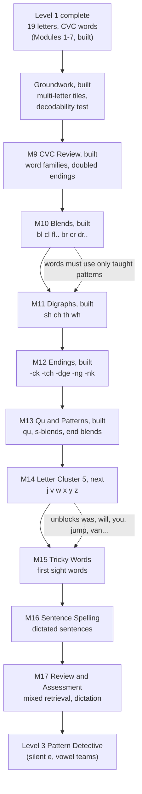
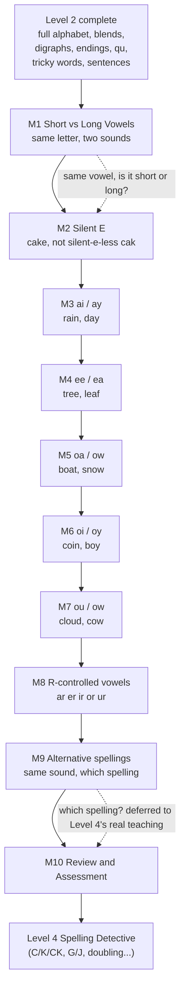

# The Spelling Code — Master Document

> **Generated file — do not edit by hand.** Edit `docs/project-notes.md` for the written sections and the content JSON under `content/` for the curriculum, then run `npm run docs`. Everything from “Curriculum” down is built directly from the live content files, so it always matches the app.

## Contents
1. Project notes (purpose, roadmap, scope, architecture, decisions, workflow)
2. Plan: Level 2 plan — Word Builder (draft for owner review)
3. Plan: Level 3 plan — Pattern Detective (draft for owner review)
4. Curriculum at a glance
5. Curriculum in full (every module, lesson and question)
6. Content library (pictures, audio, badges)
7. Code map

---

## 1. Project notes

### What this is
**The Spelling Code** is a web app that teaches young children (launch target: about ages 4–7) to listen, read and spell using synthetic phonics: letters are taught in small clusters, and children immediately use them to build, read and spell real words. It is playful on purpose — a Detective Fox mascot, missions, badges — not test-like.

- **Live app:** https://the-spelling-code.netlify.app (public, no login)
- **Owner:** the product and curriculum owner decides what is taught; the developer (Claude) builds it and documents every substitution or gap here and in `content/word-library.md`.
- **Progress storage:** the child's browser (`localStorage`), one child profile, no accounts, no backend.
- **Feedback loop:** the Parent Dashboard has “Share my progress” and “Send feedback” buttons that open WhatsApp to the owner with a pre-filled message. No server involved.

### The six-level roadmap (from the Master Curriculum Blueprint v0.1)
| Level | Name | Approx. age | Blueprint modules | State |
|---|---|---|---|---|
| 1 | Sound Explorer | 4–5 | 10 | **Modules 1–7 built** (structure redesigned into letter clusters) |
| 2 | Word Builder | 5–6 | 8 (built as 9) | **Complete** — Modules 9–17 built and deployed |
| 3 | Pattern Detective | 6–7 | 10 (planned as 10) | **In progress** — Modules 18–21 (Short vs Long Vowels, Silent E, ai/ay, ee/ea) built |
| 4 | Spelling Detective | 7–9 | 13 | Not started |
| 5 | Word Builder Pro | 9–11 | 10 | Not started |
| 6 | Word Master | 11–15 | 10 | Not started |

The blueprint's Level 1 has 10 one-skill modules; the app's Level 1 was redesigned (with the owner's approval) into letter-cluster modules, so its module list no longer matches the blueprint's.

### Where the build stands
| Piece | State |
|---|---|
| Level 1 “Sound Explorer”, Modules 1–7 | **Built and deployed** (the agreed launch set) |
| Level 1 Module 8 (Master Assessment) | **Built** — one cumulative 16-item test across every Level 1 skill; earns the “Level 1 Sound Explorer” badge |
| Level 2 “Word Builder”, all 9 modules (CVC Review, Consonant Blends, Digraphs, Common Endings, Qu & Patterns, Letter Cluster 5, Tricky Words, Sentence Spelling, Review & Assessment) | **Complete — built and deployed.** Level 2 is finished. |
| Level 3 “Pattern Detective”, Modules 18–21 (Short vs Long Vowels, Silent E, ai/ay, ee/ea) | **Built** — see the Level 3 curriculum design note below. Owner decided (2026-09-30) to keep building level after level without pausing; Modules 22–27 (oa/ow onward) are planned in `docs/plans/level-3.md` but not yet built. |
| Payments, accounts, teacher/school features, AI tutor, analytics, CMS, placement test | Out of scope until the owner asks |

**Launch plan:** 7 modules for ages roughly 4–6; add Module 8 (My First Sentences) if many 7-year-olds are in the audience. Modules 1–2 may be easy for confident 7-year-olds; “unlock all” in the Parent Dashboard lets a parent skip ahead.

### Curriculum design
- **Modules 1–2 — Listening Detective, Rhyme Detective:** general sound awareness, no letters. Built first and kept as designed.
- **Modules 3–6 — Letter Clusters** (Jolly Phonics / Letters and Sounds style): s a t p i n → m d g o c → k b h r e → l f u. That is all 19 Level 1 letters.
- **Every cluster has the same five lessons:** Meet the Letters (hear a word, pick its first letter) → Blend & Build (build a heard word from a tray of exactly the right letters) → Read the Words (read a written word, pick its picture) → Spell the Words (build a heard word from a tray with one extra decoy letter) → Cluster Challenge (scored, mixed).
- **Module 7 — Level 1 Review:** the same five lessons but mixing words from all clusters; the final Level 1 Challenge has 11 items.
- **Word rules:** simple CVC words only. No digraphs, blends, silent e, vowel teams or r-controlled vowels (“her”, “car” are excluded). Curriculum boundary: no c/k/ck choices, no ff/ll/ss doubling.
- **The c/k decision:** “c” is taught as a second letter for the /k/ sound (needed for cat, cap, can, cup). No question ever makes a child choose between c and k: they are never offered together as letter options, and a decoy tray never pairs one with a word using the other.
- **Letter sounds, not names:** text-to-speech reads a bare letter by its name (“em”), which teaches the wrong thing. So the app never speaks an isolated letter; “tap a word to sound it out” uses phoneme approximations (n → “nnn”, a → “ah”, p → “puh”) and then the whole word.
- **Mastery:** each lesson has a mastery threshold (80%). A module is complete when all its lessons are mastered.

### Level 2 curriculum design (all 9 modules built — Level 2 complete)
- **Module 9, CVC Review & Automaticity:** no new letters — pure review of Level 1's 19 letters, plus one lesson teaching common doubled-letter-ending words (off, bell, hill, doll...) receptively only. A child builds/reads these correctly without ever being asked to *choose* a spelling — that choice stays a Level 4 topic, matching the c/k precedent from Level 1.
- **Module 10, Consonant Blends** (bl/cl/fl/gl/pl/sl, br/cr/dr/fr/gr/pr/tr): a blend is two already-known letters said quickly together, so it needs no new letter and no new tile — each blend letter is tapped separately, exactly like any other CVC word.
- **Module 11, Digraphs** (sh, ch, th, wh) and **Module 12, Common Endings** (-ck, -tch, -dge, -ng, -nk): unlike a blend, these are two-or-three letters making **one** sound, so the tray must offer them as a single tile (see “Multi-letter tiles” below). Digraphs can sit at the start or end of a word (ship vs. fish); endings only ever sit at the end.
- **Module 13, Qu & Common Patterns:** “qu” is tiled as one inseparable unit like a digraph (English never spells /kw/ with a bare q), plus s-blends and end-blends, which — like Module 10's blends — are just pairs of already-known letters needing no new tile.
- **Narration must name the right concept.** A blend is not a digraph is not an ending is not qu — conflating them (e.g. calling “ck” a “blend” because it's more than one character) is a real bug that shipped once and was caught by a live browser check, not by the test suite. `graphemeKindFor()` in `src/services/questionTypes.js` is the single source of truth for which is which; extend its `DIGRAPHS`/`ENDINGS` sets when a later module adds more, rather than guessing from a grapheme's length.
- **Multi-letter tiles.** A `word_build` item can set `answer_tiles` (e.g. `["sh", "i", "p"]` for “ship”) so a tray tile can hold a whole grapheme instead of always one letter. Every place that used to do `correct_answer.split("")` — the tile count, the decoy calculation, the Watch-stage demo, the narration — now goes through `answerTilesFor()` instead. Level 1 content never sets `answer_tiles`, so it's unaffected; this is purely additive.
- **Known letters gap — resolved.** Level 1's 19 letters never included j, v, w, x, y, z. Flagged while building Module 13, and fixed with a new **Module 14, Letter Cluster 5** (same 5-lesson shape as Level 1's clusters) — the alphabet is complete from here on (q is still never taught alone, only as "qu").
- **Module 15, Tricky Words:** a new activity type, `sight_word_match` — deliberately audio-first (hear the whole word, then pick it from similar-looking real-word decoys like was/saw/has), never the written-word tap-to-sound-out pattern, because sounding out an irregular word like "said" letter by letter teaches the wrong pronunciation. The Watch-stage demo highlights the word's irregular part in a different colour (`tricky_part` field, e.g. "ai" in "said") — the standard sight-word teaching technique.
- **Module 16, Sentence Spelling — three more new activity types**, all reusing `MultipleChoice`'s existing plain-text-option fallback rather than needing new picker UI:
  - `sentence_build`: the sentence-level sibling of `word_build`. A new `WordTile` component (auto-width, not a fixed square like `LetterTile`) and a new `SentenceBuilder` component — the one real behavioural difference from word-building is that words join with a **space**, not nothing, so this couldn't just reuse `WordBuilder` with different tiles. Content always sets `answer_tiles` explicitly (e.g. `["The", "cat", "sat."]`); `answerTilesFor()`/`decoyLettersFor()` needed no changes since they already treat a tray as a generic list of tiles, letters or words alike.
  - `sentence_read`: written_sentence field (deliberately separate from `written_word` — see next point) plus picture options, reusing `read_word`'s picture-matching idea at sentence scale.
  - `fix_sentence`: two plain-text options, one correctly capitalised/punctuated, one not — simpler than building an interactive text editor, while still testing the same recognition.
  - **Two bugs found live, not by the test suite, while verifying this module:** (1) `labelToIcon`'s substring matching, fine for isolated CVC words, false-positives on real running text — "then" contains "hen", so a sight/sentence option could silently show an unrelated picture; `sight_word_match` and `fix_sentence` options now never get a picture, matched or not. (2) `spellOutWord` strips punctuation and spaces then sounds out whatever's left as ONE word, so wiring a sentence into the existing `written_word` field would try to sound out "The cat sat." as "thecatsat" — hence the separate `written_sentence` field, rendered as plain non-interactive text instead.
  - Two of the app's own generic content-integrity tests didn't know about sentence-shaped content and needed updates: the "correct_answer is among options" test now recognises `sentence_build` as tile-based (like `word_build`) rather than expecting an `options` array it doesn't have, and the decodability test now splits a `correct_answer`/`written_sentence` on whitespace and checks each word separately, since a bare space or period was never a "taught letter" and was never meant to be one.

### Level 3 curriculum design (Module 18 built; Modules 19–27 planned, not yet built)
- **Full plan:** `docs/plans/level-3.md` — big goal, module-by-module table, and the two owner-confirmed decisions (2026-09-30): vowel-team spellings (ai/ay, ee/ea, etc.) are taught **receptively only** — a child never picks between two valid spellings of the same word until Level 4 — and building continues level after level without pausing for review.
- **Module 18, Short vs Long Vowels:** purely auditory, no spelling shown — the child hears a real word (via the browser's speech voice, same `say:word`-prefixed `audio_asset` mechanism Module 2's rhyming already used) and judges whether its vowel sound is short or long. A new activity type, `vowel_length`, reuses `Sort.jsx` (itself a thin wrapper over `MultipleChoice`) with plain `["Short", "Long"]` text options — no new component needed. Added to `COMPARE_TYPES` in `questionTypes.js` so it gets the same "no option picture" treatment as `same_different`/`loud_soft`. Word pairs were deliberately chosen as CVC/CVCe near-minimal pairs (cap/cake, hop/hope) to set up Module 19 (Silent E) without teaching spelling yet.
- **Module 19, Silent E (CVCe):** the standard five-lesson template (Meet the Pattern → Blend & Build → Read the Words → Spell the Words → Challenge) applies cleanly — unlike a digraph or vowel team, a CVCe word (cake, bike...) is spelled entirely from already-known single letters, so no new tile shape was needed anywhere. "Meet the Pattern" reuses Module 18's own `vowel_length` type, this time with `written_word` also set (not just audio) so the child sees the silent-e spelling while judging short/long — the exact same component, no new code. Added 5 new word pictures (cake, bike, kite, rose, wave) from Noto Emoji, since no existing CVC/digraph word in the picture library has a silent-e shape.
- **Module 20, ai/ay — the first module to actually apply the receptive-only decision.** `graphemeKindFor()` gained a `"vowel team"` kind (`VOWEL_TEAMS` set in `questionTypes.js`) so narration never calls it a digraph. A vowel team can sit at the start, middle or end of a word (the "ai" in "rain" is neither) — reusing the existing start/end `graphemePosition()` guess would have wrongly claimed "rain starts with ai"; both `modelCaptionFor` and `modelHeadingFor` in `LessonPlayer.jsx` got a dedicated branch that never claims a position for a vowel team, caught and fixed by live-verifying the Watch stage before shipping. **"Meet the Sounds" (recognition) never offers ai and ay as two options for the same item** — that would be exactly the graded ai-vs-ay choice the owner's decision rules out — so its decoy options are always a bare single vowel (`[correct, "a", "o"]`) instead, testing "is this a vowel team or just a short vowel" rather than "which spelling is it." Vowel-team tiles reuse `word_build`'s existing `answer_tiles` mechanism exactly like a Level 2 digraph tile (e.g. "rain" → `["r", "ai", "n"]`) — no new component. Added 5 new word pictures (train, rain, mail, sail, paint); no clean picture was found for any -ay word, so Read the Words covers -ai words only, matching the ch/wh precedent from Module 11. One picture-ordering gotcha: `WORD_KEYS`' substring match required listing "train" before "rain" (`"train".includes("rain")` is true), or every "train" picture would have silently shown rain's icon instead.
- **Module 21, ee/ea — same shape as Module 20**, `VOWEL_TEAMS` extended to `{ai, ay, ee, ea}`, same non-competing-decoy design for "Meet the Sounds". First module where a word combines a Level 2 digraph tile AND a Level 3 vowel-team tile in the same build (wheel → `["wh", "ee", "l"]`) — verified live that the two tile kinds compose cleanly with no code changes needed. Added 6 new word pictures (tree, bee, sheep, wheel, leaf, seal); unlike Module 20, both spellings had enough clean pictures to include in Read the Words together.
- **Home screen decluttering.** Built ahead of Level 3's content: `ChildHome.jsx` got a horizontally-scrollable level-pill switcher (one row per level, defaulting to whichever level contains the child's current unlock frontier) so the module accordion only ever shows one level's modules at a time — the owner's explicit requirement when asking to build every remaining level ("make sure the first screen does not clutter").
- **Old score-gated unlock mechanic removed.** The per-module "free unlock at 85%" celebration screen (superseded by the flat Level 1 free / Level 2+ paid decision — see "Access rules" below) was fully deleted from `ResultScreen.jsx` and `ChildHome.jsx`, not just disabled, since it no longer has any code path that can trigger it.

### Access rules (free vs paid) — business decision made 2026-09-30, not yet built
- **All of Level 1 (Modules 1–8) is free**, no exceptions. **Level 2 onward is paid.** This replaces an earlier score-gated shortcut (Module 1 → 2 unlocked free at an 85% score) that only applied to one boundary — removed as redundant once the owner decided all of Level 1 would be free outright.
- Every module still unlocks only after the previous one is fully mastered (`moduleUnlocked` in `ChildHome.jsx`) — that gating is unchanged; what's new is a *payment* gate still to be added at the Level 1 → Level 2 boundary specifically.
- **Not yet implemented:** there is no paywall in the app yet. Level 2 (Modules 9–14, all built) is currently reachable the same way Level 1 is, gated only by mastery — building the actual Level 2 payment gate is on hold until the payment gateway and pricing are decided (see “Monetisation” below).
- Parent Dashboard has an “unlock all” switch for reviewing and testing (unaffected by any of this).

### Monetisation (in progress, 2026-09-30 — not yet built)
- **Decision made:** free/paid boundary is Level 1 (free) / Level 2+ (paid), confirmed by the owner.
- **Decision deferred:** which payment gateway (Razorpay, Instamojo, Gumroad, or a manual UPI flow) — owner wants to build the app-side pieces (sign-up, payment screen UI) first and pick a gateway later. See the pricing research the assistant did on 2026-09-30 for Indian-market comparables and a recommended price point.
- **Reality check for whoever builds this next:** the app has zero backend today (`localStorage` only, no accounts). A real paywall needs *some* way to verify payment that a technical user can't trivially bypass by editing `localStorage` (the existing `settings.unlockAll` toggle is proof this is easy to flip today) — plan for at least a minimal serverless check (e.g. a Netlify Function verifying a payment/license token), not a client-only "if paid flag is true" gate, once real money is involved.

### Architecture (how the code is organised)
- **Stack:** Vite + React (plain JS/JSX, no TypeScript). Tests use Node's built-in runner. No backend.
- **Content is data.** The whole curriculum lives in `content/*.json`. Only `src/services/contentService.js` imports it, so the loading method can change later without touching the app. Adding a lesson or question means adding JSON, not code (shapes are in `src/data/schemas.md`).
- **Activity registry.** `src/activities/registry.js` maps a lesson's `activity_type` to a React component. A new question type is one component plus one registry line.
- **Lesson flow.** `LessonPlayer.jsx` runs each lesson as a fixed sequence of stages: welcome → teach → watch (worked examples) → warm-up → solo → challenge → result → (practice-more if not mastered) → done.
- **Audio.** `audioService.js` plays real recordings when one exists (`REAL_AUDIO_FILES`, files in `public/audio/`), otherwise synthesizes a placeholder with Web Audio, and speaks words with the browser's speech voice. Real recordings deliberately bypass the synthesizer's shared compressor, which had been squashing loud/soft contrast.
- **Pictures.** Hand-drawn inline SVG in `Illustration.jsx`, plus image files in `public/img/words/` (Google Noto Emoji). A new picture-only word = drop an SVG in that folder, add the word to `WORD_KEYS` in `Icon.jsx` and `IMAGE_BG` in `Illustration.jsx`.
- **Progress and scoring.** `progressService.js` (attempts, best score, mastery that never reverts), `assessmentService.js` (scoring), `remediationService.js` (error tags → “practice more” advice).

### Decisions worth remembering
- **Loud and Soft uses recognisable real-world sounds from the owner's reference chart** — thunder and a clap (loud); wind, bell, birds, dripping water (soft). Drums and violins were tried and rejected: the owner did not want children learning “that's a drum”; the lesson is loudness only.
- **Audio sources:** thunder, wind and car were supplied by the owner. Birds and dripping water come from Mixkit (free commercial use, no credit needed). Pixabay's sounds were rejected as low quality. The birds clip was trimmed and volume-boosted because the original was very quiet.
- **The old score-gated free unlock (85% at Module 1 → 2) was removed 2026-09-30** once the owner decided all of Level 1 would be free outright, making a partial shortcut redundant. See “Monetisation” above.
- **The mascot** appears on the welcome header and result screen only — not the top bar, the Parent Dashboard or per-question feedback.
- **Playfulness:** the owner wants a game-like feel, and practice questions are randomised.
- **Design inspiration** was taken from other children's apps for look and feel only, never for curriculum content.

### Working agreements
1. **Pictures and other assets:** when the library runs thin, take freely licensed material from the internet on judgment; store the license and credits beside the files and note the source here.
2. **This document stays in sync.** After any content or code change: run `npm run docs`, run `npm test` (a test fails if this document is stale), commit, push to GitHub, and deploy.
3. **Everything is committed to GitHub**, code and curriculum together.

### How to run, test, publish
```bash
npm install
npm run dev        # local app at http://localhost:5173
npm test           # content integrity, scoring/progress logic, and this document being up to date
npm run docs       # regenerate this document
npm run build && npx netlify-cli deploy --prod --dir=dist    # publish
```
Netlify hosting is on the paid Personal plan. If a Netlify project ever shows a login wall, change that project's own Visitor access setting; the team-wide default only applies to new projects.

### Known gaps and ideas
- Only about 49 word pictures exist, so pictures repeat as wrong-answer options. The “fog” picture (a cloud) is the least clear. More pictures are welcome.
- Only two reliable loud sounds (thunder, clap) exist, so loud assessment items repeat practice items; these are marked with review flags in the tables below. A friendly real recording of another loud sound from the chart (for example a bang) would widen it.
- Sound-out audio depends on each device's speech voice and should be tried on a real phone.
- Clap, bell, clock, rain, phone and siren are still synthesized placeholders; real recordings would improve them.
- Level 2 Modules 14–16 (Tricky Words, Sentence Spelling, Review & Assessment) are not built.
- j, v, w, x, y, z are never taught anywhere in Level 1 or Level 2 so far — see the Level 2 curriculum design note above.
- A handful of common digraph/ending words have no clean picture (ch, wh, -tch, -nk) — those lessons' Read the Words pool is thinner than other lessons', with real gaps marked by `review_flag` in the content.

### Build log
- Level 1 first built as 15 planned modules (one skill each), then **redesigned into letter-cluster modules** after playing through showed thin, repetitive word pools.
- Added the Detective Fox mascot, an accordion module list, the score-gated free unlock, the “unlock all” switch, WhatsApp sharing and feedback.
- Fixed per-example headers, missing pictures, decoy-letter demonstration, and the loud/soft audio (several rounds, ending with chart-based sounds).
- Added tap-to-sound-out for written words.
- Built Letter Clusters 1–4 and the Level 1 Review; added 11 word pictures from Noto Emoji; set up this master document and GitHub.
- Fixed a bug where a lesson's score was only saved after tapping all the way through to "Back to path" — a failed attempt, or leaving early, silently lost the score. Scores now save the instant a challenge is scored. Also fixed a double-tap on an answer counting as two answers.
- Moved GitHub ownership to a dedicated account/email for the project, separate from the owner's personal one; Netlify stays on the owner's personal account for now by their choice.
- Built Level 1 Module 8 (Master Assessment) and Level 2 Modules 9–13, plus the groundwork they needed (multi-letter tiles, blend/digraph/ending-aware narration). See the Level 2 curriculum design note above for what each module teaches and the known-letters gap it surfaced.
- Built Level 2 Module 14 (Letter Cluster 5: j v w x y z) once the known-letters gap started blocking real words; fixed a narration bug it surfaced (a single letter like "x" assumed to always be word-initial, wrong for "fox").
- Owner decided the monetisation boundary: all of Level 1 free, Level 2 onward paid. Removed the old score-gated 85% shortcut at Module 1 → 2 as redundant. No paywall is built yet — see “Monetisation” above.
- Owner changed plans: build out Level 2 fully before going live/monetising, rather than launching with only 2 levels. Built Level 2 Module 15 (Tricky Words, new sight_word_match type) and Module 16 (Sentence Spelling, three new activity types plus a WordTile component) — see the Level 2 curriculum design note above.
- Built Level 2 Module 17 (Review & Assessment) — cumulative mixed practice across every Level 2 skill, plus a 10-item Level 2 Challenge; earns a new "Level 2 Word Builder" badge. **Level 2 is now fully built and deployed**, alongside Level 1 — the entire planned launch curriculum (8 free Level 1 modules, 9 paid Level 2 modules) exists. Next real decisions are the ones in "Monetisation" above (payment gateway, sign-up, payment screens) and whether to keep building Level 3+ or pause to launch.
- Owner researched Indian-market pricing/payment gateways (Razorpay recommended over Instamojo, whose aggregator license was rejected) and, after reconsidering an annual-subscription price as over-generous with only 2 levels live, decided to build out every remaining level before going live at all rather than launch early. Drafted `docs/plans/level-3.md` (Pattern Detective) and got the owner's sign-off on its one open design question (vowel-team spellings taught receptively only) plus pacing (keep building without pausing).
- Redesigned `ChildHome.jsx` with a level-pill switcher so the module list only shows one level at a time, per the owner's explicit "don't let the first screen clutter" requirement — and removed the now-fully-superseded score-gated free-unlock mechanic (`ResultScreen.jsx`'s old celebration branch, `moduleScore`/threshold logic) rather than leaving dead code behind.
- Built Level 3 Module 18 (Short vs Long Vowels) — a new `vowel_length` activity type (audio-only, no spelling shown) that reuses the existing `Sort`/`MultipleChoice`/`say:`-prefixed-TTS machinery with no new components. **Level 3 is now in progress**; see the Level 3 curriculum design note above for what's built and `docs/plans/level-3.md` for what's next (Module 19, Silent E).
- Built Level 3 Module 19 (Silent E/CVCe) — reused every existing mechanic (word_build, read_word, and Module 18's own vowel_length type now with the spelling shown) with zero new components. Added 5 new word pictures (cake, bike, kite, rose, wave) from Noto Emoji. Generalized the Level 2 decodability safeguard (`test/level2-decodability.test.mjs`) to track every module from Level 2 on, Level 3 included, rather than being hard-scoped to Level 2 only — ready for Module 20 (ai/ay), the first module that actually introduces a new taught grapheme this safeguard needs to enforce.
- Built Level 3 Module 20 (ai/ay) — the first module to put the owner's receptive-only vowel-team decision into practice (see the curriculum design note above for how "Meet the Sounds" avoids ever pairing ai against ay as options). Added `"vowel team"` as a new `graphemeKindFor()` kind and fixed a position-narration bug it surfaced live (a vowel team isn't always word-initial or word-final, unlike every earlier grapheme kind). Added 5 new word pictures (train, rain, mail, sail, paint).
- Built Level 3 Module 21 (ee/ea) — same shape as Module 20, confirmed live that a digraph tile and a vowel-team tile compose cleanly in the same word (wheel → wh + ee + l). Added 6 new word pictures (tree, bee, sheep, wheel, leaf, seal).

---

## 2. Level 2 plan — Word Builder (draft for owner review)

*Status (2026-09-29): Modules 1–5 of this plan are built and deployed as Level 2 Modules 9–13. A 6th module was added after Module 5 (Letter Cluster 5: j v w x y z, Level 2 Module 14) once building surfaced a real gap — Level 1's 19 letters never included these six, which was starting to block ordinary sight words and sentences. Modules 6–8 of this plan (now Level 2 Modules 15–17: Tricky Words, Sentence Spelling, Review & Assessment) are not yet built. Source: the Master Curriculum Blueprint v0.1 (Level 2: ages about 5–6, eight modules) plus the Curriculum Revision Proposal (sight-word strand and syllable chunking).*

### Big goal
“I can combine sounds and common spelling patterns to read and build more words.” Level 1 taught single letters and plain three-letter words. Level 2 takes a child from plain CVC words to real, everyday words: blends (frog), digraphs (ship), common endings (duck, ring), the first tricky words, and short sentences.

### The learning path



### Rules that keep it decodable
1. **A word may appear in a module only if every pattern in it has already been taught.** For example, “duck” cannot appear before Module 4 teaches -ck, and “ship” cannot appear before Module 3 teaches sh. Wrong-answer picture options are exempt, as in Level 1.
2. **Still no silent e, vowel teams or r-controlled vowels** — those are Level 3. This means the Revision Proposal's idea of putting long vowels in Level 2 is not followed; the Blueprint puts them in Level 3.
3. **No choice between spellings.** Every item has one correct spelling that the module has just taught (the C/K/CK choice and its relatives belong to Level 4).
4. **A “taught patterns” list, checked by a test.** Before building, add a machine-readable list of what each module teaches, and a test that fails if any word in a module uses something not yet taught. This is the main safeguard for scaling from 7 modules to over 40.

### Module by module

| Level 2 # | Module | What is taught | Sample words | Lessons | Status |
|---|---|---|---|---|---|
| 9 | CVC Review and Automaticity | Short vowels a e i o u; word families (-at, -an, -ig, -op, -ug, -et); doubled-letter endings (off, bell) taught receptively | cat, pig, mop, bug, net, bell | 5 | **Built** |
| 10 | Consonant Blends | L-blends bl cl fl gl pl sl; R-blends br cr dr fr gr pr tr | flag, crab, frog, drum, plug | 5 | **Built** |
| 11 | Digraphs | sh, ch, th, wh; at the start and end of words | ship, fish, thumb, chin, whip | 5 | **Built** |
| 12 | Common Endings | -ck, -tch, -dge, -ng, -nk | duck, catch, bridge, ring, pink | 5 | **Built** |
| 13 | Qu and Common Patterns | qu; s-blends (st sp sn sm sk); end blends (nd nt mp ft lt lk) | quit, quick, stop, snap, hand, tent, milk | 5 | **Built** |
| 14 | Letter Cluster 5: j v w x y z | The six letters Level 1 and Modules 9–13 never taught, added once the gap started blocking ordinary words | jam, van, wet, fox, yes, zip, was, will | 5 | **Building next** |
| 15 | Tricky Words | About 30 common words that cannot be fully sounded out, in small groups; which part is tricky; memory cues | the, said, was, you, they, are, have, one | 5 | Not built |
| 16 | Sentence Spelling | Dictated phrases and short sentences; capital letter, full stop, question mark | The frog can jump. | 5 | Not built |
| 17 | Review and Assessment | Mixed retrieval, unfamiliar decodable words, dictation; optional “clap the parts” syllable lesson | compound words such as sunset, catnap | 5 | Not built |

**Revised total: about 45 lessons** (the extra letter-cluster module added 5 to the original ~43-lesson estimate), roughly 5 practice and 5 assessment items per lesson, the same density as Level 1.

Once Module 14 is built, “was” and “will” move from Module 15's tricky-word list to being ordinary *decodable* words (every letter in them is now taught) — they can still appear in Module 15 as words worth extra practice, but they no longer need to be memorized as irregular.

### Lesson shape
Each module follows the Level 1 pattern so the app needs little new code: Meet the new pattern (hear it, see it) → Blend and Build → Read the Words → Spell the Words → Challenge. Module-specific variations:
- **M1:** adds a fast-reading round. It should feel like beating your own best, not a countdown clock.
- **M3:** adds a sorting lesson (sh or ch? th or wh?).
- **M6:** each lesson shows a word with the tricky letters highlighted and a memory cue, then read it and spell it.
- **M7:** builds sentences from word tiles, then dictation, then “fix the sentence” (add the capital letter and the full stop).

### Words and pictures
- Level 2 needs roughly **70 new picture words** (for example flag, plug, sled, crab, drum, frog, ship, fish, chip, chin, duck, sock, king, ring, bank). The current library has about 49.
- Picture sourcing follows the standing rule: take freely licensed pictures from the internet when short. First choice Google Noto Emoji (already used), then Twemoji (credit required); keep licenses and credits beside the files. Some words have no good emoji (for example “blob”, “glum”) and will be drawn as inline SVG or left as write/build-only words.
- Words used in Read the Words need a picture; Build and Spell words do not.

### Audio
- Words and sentences use the browser's speech voice, as in Level 1.
- New sounds to teach: bl, cl, fl and so on as blended sounds; sh, ch, th, wh and ng as single sounds. The browser voice pronounces these poorly in isolation. Approximations (for example “shh”, “ch”) will be added to the sound-out feature, but **recorded voice for every phoneme is the biggest quality upgrade available** and is worth considering before launching Level 2.

### What has to be built in the app
| Needed | Why | Size |
|---|---|---|
| Level switcher and Level 2 unlock | The app has a single level today; lessons and progress need a level dimension | Medium |
| Digraph and blend tiles (two or three letters on one tile) | Word building must treat “sh” as one tile | Medium |
| Sentence builder (tap word tiles in order) and “fix the sentence” | Module 7 | Medium |
| Tricky-letter highlighting | Module 6 | Small |
| Fast-reading round | Module 1 | Small |
| Taught-patterns list and decodability test | Guard rail for content quality | Small |
| Everything else (build, read, sort, letter-sound) | Already exists | None |

### Build order
1. **Groundwork:** level switcher, Level 2 unlock rule, tiles, taught-patterns list and test. Deploy.
2. **M1, M2, M3, M4, M5** in order, each: content → tests → walk it live → regenerate this document → commit → deploy.
3. **M6 and M7** (need the new components).
4. **M8** and a full Level 2 walkthrough.

Each module ends with your review before the next begins, as with Level 1.

### Overlap with Level 1 to resolve
The app currently lists Level 1 Modules 8–11 as future work: **My First Sentences**, **Tricky Words**, Spelling Detective Review and Level 1 Master Assessment. The Blueprint places tricky words and sentence spelling in **Level 2 (Modules 6 and 7)** and ends Level 1 with a single review. Recommendation: retire Level 1 Modules 8–10, keep only the Level 1 Master Assessment, and build sentences and tricky words once, in Level 2.

### Decisions (owner deferred to the developer's recommendation, 2026-09-28)
1. **Scope:** the Blueprint's eight modules, not the Revision Proposal's — no long vowels in Level 2.
2. **“ph”:** left to Level 4, not taught in Level 2.
3. **Doubled endings (off, bell, miss, buzz):** taught receptively (reading only, no spelling choice) inside Module 1, the same way Level 1 handled “c” for /k/ — a child reads these common words correctly without ever being asked to choose ff/ll/ss/zz vs a single letter. The choice itself stays a Level 4 topic.
4. **More blends:** s-blends and end blends are included in Module 5, as proposed.
5. **Tricky-word list:** Dolch pre-primer and primer lists, trimmed to words that fit our sentences.
6. **Level 1 Modules 8–10 are retired.** Only the Level 1 Master Assessment (renumbered Module 8) remains as future work; sentences and tricky words are taught once, here in Level 2.
7. **Syllable chunking:** included as Module 8's optional “clap the parts” lesson.
8. **Skipping ahead:** no new placement test for now — the existing “unlock all” toggle in the Parent Dashboard covers it. A real placement check can be designed later if needed.
9. **Access rule:** Level 2 unlocks only once every active Level 1 module is fully mastered. No score-based free shortcut is added here — that mechanic stays specific to the Level 1 Module 1 → 2 boundary, per the owner's original instruction not to generalise it.
10. **Voice:** stays with the browser's speech voice for now. A recorded voice for letters, blends and digraphs is flagged as a future upgrade, not a blocker.
11. **Missing letters (owner decision, 2026-09-29):** Level 1's 19 letters never included j, v, w, x, y, z — a gap only noticed while scoping Module 13. The owner chose to add a short module teaching them (Module 14, Letter Cluster 5) rather than continue avoiding them, since avoidance was already restricting Module 13's word choice and would have restricted Tricky Words and Sentence Spelling much more.

### Risks
- **Word supply:** many blend and ending words have no clear picture. Mitigation: Build and Spell lessons do not need pictures; Read lessons use only pictureable words.
- **Speech quality** for blends and digraphs (see Audio).
- **Scale:** over 400 items by hand invites mistakes. Mitigation: the taught-patterns test and the generated master document.
- **Age fit:** Level 2 is designed for about 5–6-year-olds; older children may find it easy, which is what the placement question is about.

---

## 3. Level 3 plan — Pattern Detective (draft for owner review)

*Status (2026-09-30): planning only, nothing built. Source: the Master Curriculum Blueprint v0.1 (Level 3: ages about 6–7, ten modules).*

### Big goal
“I can recognise common vowel and spelling patterns and use them to read and spell.” Level 1 taught single letters and plain CVC words; Level 2 added blends, digraphs, common endings, qu, the rest of the alphabet, tricky words and sentences. Level 3 is where **long vowels** finally enter — silent e, vowel teams (ai/ay, ee/ea, oa/ow, oi/oy, ou/ow) and r-controlled vowels (ar, er, ir, or, ur) — the biggest single jump in complexity since Level 1's letter clusters.

### The learning path



### The one real design problem this level raises
Every earlier level could enforce "no choosing between two valid spellings" (the Level 1–2 boundary explicitly reserves C/K/CK, G/J and similar choices for Level 4). Level 3 **cannot** keep that promise for vowel teams — "rain" is spelled with ai and "day" is spelled with ay, both saying long A, and a child reading or spelling either one is, in effect, already choosing. Two ways to handle this:
- **Read receptively, build/spell only exact matches (recommended):** every read/build/spell item gives one already-correct spelling; the child never picks between ai and ay for the *same* word. A **separate short module (M9, Alternative Spellings)** is where the two patterns are explicitly placed side by side and the child is told which is more common — recognition of the pattern, not a graded spelling choice. The real skill of choosing the right one for an unfamiliar word stays Level 4's job (it already owns "spelling choices" as a named topic).
- **Full choice-based practice now:** teach “ai is usually mid-word, ay is usually at the end” as a hard rule and grade the child on applying it. More authentic, but duplicates Level 4's whole reason for existing and risks conflicting rules if Level 4 later teaches it differently. Not recommended without a reason to.

### Rules that keep it decodable
Same discipline as Level 2, extended:
1. A word may appear in a module only if every pattern in it — including which specific vowel-team spelling — has already been taught by that exact module. The existing `test/level2-decodability.test.mjs`-style safeguard extends the same way it did for Level 2's graphemes: a `GRAPHEMES_BY_MODULE`/`LETTERS_BY_MODULE` entry per module, nothing else about the test needs to change.
2. No r-controlled vowels or vowel teams appear before their own module teaches them — obviously, but worth stating since Level 3 is where the Level 1/2 boundary's biggest exclusions finally lift.
3. Still no C/K/CK, G/J or other consonant spelling *choices* — those stay Level 4's.
4. No silent letters beyond the silent e already being taught in M2 (no "knee", "write", "lamb" yet).

### Module by module

| # | Module | What is taught | Sample words | Lessons |
|---|---|---|---|---|
| 1 | Short vs Long Vowels | The same 5 vowel letters can say a short OR long sound; this module is purely the listening/discrimination skill, no new spelling yet | cap/cape (said aloud, not yet spelled with e) | 5 |
| 2 | Silent E (CVCe) | A final silent e makes the vowel before it say its long sound | cake, bike, rope, cute, name | 5 |
| 3 | ai / ay | Long A as a vowel team — ai mid-word, ay at the end | rain, wait, day, play, tray | 5 |
| 4 | ee / ea | Long E as a vowel team | tree, feet, leaf, seat, read | 5 |
| 5 | oa / ow | Long O as a vowel team | boat, road, snow, grow, slow | 5 |
| 6 | oi / oy | The /oi/ sound — oi mid-word, oy at the end | coin, soil, boy, toy, joy | 5 |
| 7 | ou / ow | The /ow/ (as in "cow") sound — both spellings appear anywhere, genuinely no simple position rule | cloud, mouth, cow, brown, down | 5 |
| 8 | R-controlled vowels | ar, er, ir, or, ur — the vowel's own sound is swallowed by the r | car, star, her, bird, corn, hurt | 6 |
| 9 | Alternative Spellings | Same sound, more than one spelling, placed side by side — recognition only (see design problem above) | rain/train vs day/play; boat vs snow | 5 |
| 10 | Review and Assessment | Cumulative mixed practice and a big final Level 3 Challenge | — | 5 |

**Estimated: about 51 lessons.** Level 3 is the first level where "one word family per lesson" genuinely runs out of room fast — ee/ea alone could support a much longer module — so lesson density stays at the same 5-per-module rhythm as Levels 1–2 rather than growing, keeping build time predictable.

### Lesson shape
Same five-lesson pattern already proven across 13 Level 1/2 modules: Meet the Pattern (recognition) → Build & Read → Read the Words (picture-matching) → Spell the Words (dictation, one decoy) → Module Challenge. Module 1 (Short vs Long Vowels) is the one exception — it's audio-discrimination only, closer in spirit to Level 1's `same_different`/`sound_memory` types than to a letter-teaching module, so it may reuse THOSE existing activity types instead of `letter_sound_match`.

### What has to be built in the app
Unlike Level 2, which needed real new mechanics (multi-letter tiles, sentence building, sight words), Level 3's content fits entirely inside what already exists:
- **Vowel-team tiles** are just another case of `answer_tiles` — "rain" tiles as `["r", "ai", "n"]`, exactly like "ship" tiles as `["sh", "i", "p"]` already do. No new component.
- **`graphemeKindFor()`** needs a new kind, `"vowel_team"` (or reuse `"digraph"` — a vowel team genuinely IS two letters making one sound, the same definition already used for sh/ch/th/wh). Recommend a distinct `"vowel team"` label so narration says the accurate word, not "digraph" for a vowel pattern — matches the standing rule (a blend is not a digraph is not an ending) established during Level 2.
- **R-controlled vowels** (ar/er/ir/or/ur) are the same "letter + r, one sound" shape as a vowel team, tiled the same way.
- **No new picture sourcing strategy needed** — same Noto Emoji approach as every earlier level, though Level 3's vocabulary (rain, snow, coin, bird, star...) should have an easier time finding clean pictures than Level 2's tricky/sentence content did.
- **The one real gap:** Module 1 (Short vs Long Vowels) is audio-only discrimination with no letters/pictures at all — closest existing precedent is Level 1 Module 1's `same_different`/`sound_memory` types. Worth confirming that's the right shape before building it, since it's the one lesson in this whole level that doesn't fit the established five-lesson template cleanly.

### Build order
Same rhythm as every level so far: one module at a time — content → validate → `npm test` → live browser check → regenerate `docs/THE-SPELLING-CODE.md` → commit → push → deploy. Recommend starting with **Module 2 (Silent E)** rather than Module 1, since M2 is the one with the clearest existing template to follow (matches every "Meet a new pattern" module already built) and would validate the `answer_tiles`-for-vowel-teams approach immediately; Module 1's audio-discrimination shape is worth a short design conversation first rather than guessing.

### Decisions (owner confirmed, 2026-09-30)
1. **Vowel-team choice:** receptive only — never ask the child to pick between ai/ay (or any vowel-team pair) for the same word. Module 9 (Alternative Spellings) is recognition-only; the graded "which spelling" skill stays Level 4's.
2. **Pacing:** keep building level after level without stopping, same rhythm as Level 2 — module by module, verify live, ship, keep moving.
3. **Module 1's shape and exact build order** — still open; will be resolved in practice as each module is built (Module 1's audio-discrimination shape gets a fresh look when its turn comes, following the same live-verification discipline as every module so far).

---

## Curriculum at a glance

- **Level 1** — Sound Explorer — Listening → phonemic awareness → letter sounds → CVC reading → CVC spelling.
- **Level 2** — Word Builder — Consonant blends, digraphs, common endings, first tricky words, and short dictated sentences.
- **Level 3** — Pattern Detective — Long vowels: silent e, vowel teams (ai/ay, ee/ea, oa/ow, oi/oy, ou/ow) and r-controlled vowels.

| Module | Name | Status | Lessons | Practice items | Assessment items |
|---|---|---|---|---|---|
| 1 | Listening Detective | **Live** | 6 | 28 | 34 |
| 2 | Rhyme Detective | **Live** | 6 | 35 | 47 |
| 3 | Letter Cluster 1: s a t p i n | **Live** | 5 | 19 | 27 |
| 4 | Letter Cluster 2: m d g o c | **Live** | 5 | 20 | 28 |
| 5 | Letter Cluster 3: k b h r e | **Live** | 5 | 20 | 28 |
| 6 | Letter Cluster 4: l f u | **Live** | 5 | 20 | 28 |
| 7 | Level 1 Review | **Live** | 5 | 20 | 31 |
| 8 | Level 1 Master Assessment | **Live** | 1 | 0 | 16 |
| 9 | CVC Review & Automaticity | **Live** | 5 | 22 | 27 |
| 10 | Consonant Blends | **Live** | 5 | 23 | 23 |
| 11 | Digraphs | **Live** | 5 | 22 | 22 |
| 12 | Common Endings | **Live** | 5 | 21 | 22 |
| 13 | Qu & Common Patterns | **Live** | 5 | 19 | 20 |
| 14 | Letter Cluster 5: j v w x y z | **Live** | 5 | 23 | 22 |
| 15 | Tricky Words | **Live** | 5 | 16 | 24 |
| 16 | Sentence Spelling | **Live** | 5 | 16 | 22 |
| 17 | Review & Assessment | **Live** | 5 | 20 | 26 |
| 18 | Short vs Long Vowels | **Live** | 5 | 28 | 30 |
| 19 | Silent E (CVCe) | **Live** | 5 | 20 | 20 |
| 20 | ai / ay | **Live** | 5 | 21 | 20 |
| 21 | ee / ea | **Live** | 5 | 22 | 20 |

## Curriculum in full

Read it as: what the child hears or sees → what they choose or build → the correct answer. “Practice” items appear in the warm-up and solo rounds; “Assessment” items are the scored challenge.

### Module 1 — Listening Detective

*Goal:* Build careful listening and auditory discrimination.

#### Lesson 1: What Is a Sound? (`L1-M01-01`)

- **Objective:** Identify and match familiar environmental sounds.
- **Skill:** auditory_discrimination · **Activity:** listen_choose · **Time:** 4–6 min · **Mastery threshold:** 80%
- **Narration (welcome):** Welcome, Sound Detective! Put on your listening ears.
- **Narration (teach):** A sound is something we can hear. We hear sounds all around us.
- **Narration (model):** Listen. What do you hear?
- **Narration (transition):** Now you try! Listen first, then choose.
- **Narration (close):** Fantastic listening! You are becoming a Sound Detective.

**Practice**

| ID | Item |
|---|---|
| Q-M01-01 | sound: bell \| options Bell, Phone, Wind \| answer **Bell** |
| Q-M01-02 | sound: clock \| options Clock, Wind, Bell \| answer **Clock** |
| Q-M01-03 | sound: car \| options Car, Phone, Clock \| answer **Car** |
| Q-M01-04 | sound: rain \| options Rain, Wind, Car \| answer **Rain** |
| Q-M01-05 | sound: bell \| options Bell, Phone, Rain \| answer **Bell** |
| Q-M01-26 | sound: phone \| options Phone, Bell, Wind \| answer **Phone** |
| Q-M01-27 | sound: wind \| options Wind, Rain, Phone \| answer **Wind** |
| Q-M01-28 | sound: siren \| options Siren, Bell, Thunder \| answer **Siren** |
| Q-M01-29 | sound: thunder \| options Thunder, Car, Siren \| answer **Thunder** |

**Assessment**

| ID | Item | Review flag |
|---|---|---|
| AS-M01-01-1 | sound: car \| options Car, Siren, Wind \| answer **Car** | Vocabulary widened to 6 sounds (bell/clock/car/rain/phone/wind — see content/word-library.md §4), which fixes distractor variety, but a 'name this sound' item still can't test a truly novel (sound, answer) pair once practice has already established every sound's own correct identity - that's inherent to an identity-matching format, not a vocabulary-size problem. An 'odd one out' style item (compare 3 sounds, pick the different one, as used in Module 2 Lesson 3) would give genuine transfer here. |
| AS-M01-01-2 | sound: rain \| options Rain, Wind, Phone \| answer **Rain** | Vocabulary widened to 6 sounds (bell/clock/car/rain/phone/wind — see content/word-library.md §4), which fixes distractor variety, but a 'name this sound' item still can't test a truly novel (sound, answer) pair once practice has already established every sound's own correct identity - that's inherent to an identity-matching format, not a vocabulary-size problem. An 'odd one out' style item (compare 3 sounds, pick the different one, as used in Module 2 Lesson 3) would give genuine transfer here. |
| AS-M01-01-3 | sound: bell \| options Bell, Thunder, Phone \| answer **Bell** | Vocabulary widened to 6 sounds (bell/clock/car/rain/phone/wind — see content/word-library.md §4), which fixes distractor variety, but a 'name this sound' item still can't test a truly novel (sound, answer) pair once practice has already established every sound's own correct identity - that's inherent to an identity-matching format, not a vocabulary-size problem. An 'odd one out' style item (compare 3 sounds, pick the different one, as used in Module 2 Lesson 3) would give genuine transfer here. |
| AS-M01-01-4 | sound: clock \| options Clock, Phone, Wind \| answer **Clock** | Vocabulary widened to 6 sounds (bell/clock/car/rain/phone/wind — see content/word-library.md §4), which fixes distractor variety, but a 'name this sound' item still can't test a truly novel (sound, answer) pair once practice has already established every sound's own correct identity - that's inherent to an identity-matching format, not a vocabulary-size problem. An 'odd one out' style item (compare 3 sounds, pick the different one, as used in Module 2 Lesson 3) would give genuine transfer here. |
| AS-M01-01-5 | sound: car \| options Car, Bell, Thunder \| answer **Car** | Vocabulary widened to 6 sounds (bell/clock/car/rain/phone/wind — see content/word-library.md §4), which fixes distractor variety, but a 'name this sound' item still can't test a truly novel (sound, answer) pair once practice has already established every sound's own correct identity - that's inherent to an identity-matching format, not a vocabulary-size problem. An 'odd one out' style item (compare 3 sounds, pick the different one, as used in Module 2 Lesson 3) would give genuine transfer here. |

#### Lesson 2: Same or Different? (`L1-M01-02`)

- **Objective:** Determine whether two sounds are the same or different.
- **Skill:** auditory_discrimination · **Activity:** same_different · **Time:** 4–5 min · **Mastery threshold:** 80%
- **Narration (welcome):** Today we are going to compare sounds.
- **Narration (teach):** If two sounds match, they are the same. If they do not match, they are different.
- **Narration (model):** Listen to these two sounds. Same or different?
- **Narration (close):** Great comparing! Your ears noticed the difference.

**Practice**

| ID | Item |
|---|---|
| Q-M01-06 | sound: clap_clap \| options Same, Different \| answer **Same** |
| Q-M01-07 | sound: clap_tap \| options Same, Different \| answer **Different** |
| Q-M01-08 | sound: bell_bell \| options Same, Different \| answer **Same** |
| Q-M01-09 | sound: clock_bell \| options Same, Different \| answer **Different** |
| Q-M01-10 | sound: tap_clap \| options Same, Different \| answer **Different** |

**Assessment**

| ID | Item | Review flag |
|---|---|---|
| AS-M01-02-1 | sound: finger_finger \| options Same, Different \| answer **Same** |  |
| AS-M01-02-2 | sound: clap_finger \| options Same, Different \| answer **Different** |  |
| AS-M01-02-3 | sound: tap_tap \| options Same, Different \| answer **Same** |  |
| AS-M01-02-4 | sound: clock_tap \| options Same, Different \| answer **Different** |  |
| AS-M01-02-5 | sound: bell_finger \| options Same, Different \| answer **Different** |  |

#### Lesson 3: Loud and Soft (`L1-M01-03`)

- **Objective:** Distinguish loud and soft sounds.
- **Skill:** auditory_discrimination · **Activity:** sort · **Time:** 4–5 min · **Mastery threshold:** 80%
- **Narration (welcome):** Today we are listening for loud and soft sounds.
- **Narration (teach):** A loud sound is strong and easy to hear. A soft sound is gentle and quiet.
- **Narration (model):** Listen to this sound. Was it loud or soft?
- **Narration (close):** Excellent! You listened for volume.

**Practice**

| ID | Item |
|---|---|
| Q-M01-11 | sound: thunder \| options Loud, Soft \| answer **Loud** |
| Q-M01-12 | sound: wind \| options Loud, Soft \| answer **Soft** |
| Q-M01-13 | sound: clap \| options Loud, Soft \| answer **Loud** |
| Q-M01-14 | sound: birds \| options Loud, Soft \| answer **Soft** |

**Assessment**

| ID | Item | Review flag |
|---|---|---|
| AS-M01-03-1 | sound: drip \| options Loud, Soft \| answer **Soft** |  |
| AS-M01-03-2 | sound: thunder \| options Loud, Soft \| answer **Loud** | Identical audio+answer pair to practice item Q-M01-11. Only 2 reliable loud anchor sounds exist (thunder, clap), so the loud assessment items necessarily reuse them. Recommend a kid-appropriate real recording of another chart loud sound (e.g. a bang) to widen the pool. |
| AS-M01-03-3 | sound: bell \| options Loud, Soft \| answer **Soft** |  |
| AS-M01-03-4 | sound: clap \| options Loud, Soft \| answer **Loud** | Identical audio+answer pair to practice item Q-M01-13. Same thin loud-anchor pool as AS-M01-03-2. |

#### Lesson 4: Fast and Slow (`L1-M01-04`)

- **Objective:** Distinguish fast and slow sound patterns.
- **Skill:** auditory_discrimination · **Activity:** sort · **Time:** 4–5 min · **Mastery threshold:** 80%
- **Narration (welcome):** Today we are listening for speed.
- **Narration (teach):** A fast pattern happens quickly. A slow pattern takes more time.
- **Narration (model):** Listen to the pattern. Fast or slow?
- **Narration (close):** You caught the speed!

**Practice**

| ID | Item |
|---|---|
| Q-M01-16 | sound: clap_fast \| options Fast, Slow \| answer **Fast** |
| Q-M01-17 | sound: clap_slow \| options Fast, Slow \| answer **Slow** |
| Q-M01-18 | sound: tap_fast \| options Fast, Slow \| answer **Fast** |
| Q-M01-19 | sound: tap_slow \| options Fast, Slow \| answer **Slow** |
| Q-M01-20 | sound: slow_compare \| options Pattern A, Pattern B \| answer **Pattern B** |

**Assessment**

| ID | Item | Review flag |
|---|---|---|
| AS-M01-04-1 | sound: finger_fast \| options Fast, Slow \| answer **Fast** |  |
| AS-M01-04-2 | sound: finger_slow \| options Fast, Slow \| answer **Slow** |  |
| AS-M01-04-3 | sound: drum_fast \| options Fast, Slow \| answer **Fast** |  |
| AS-M01-04-4 | sound: drum_slow \| options Fast, Slow \| answer **Slow** |  |
| AS-M01-04-5 | sound: fast_compare \| options Pattern A, Pattern B \| answer **Pattern A** |  |

#### Lesson 5: Sound Memory (`L1-M01-05`)

- **Objective:** Remember and identify short sound sequences.
- **Skill:** auditory_memory · **Activity:** sound_memory · **Time:** 4–6 min · **Mastery threshold:** 80%
- **Narration (welcome):** Today we are going to use our sound memory.
- **Narration (teach):** Listen to the whole pattern. Keep it in your mind. Then choose what you heard.
- **Narration (close):** Amazing memory!

**Practice**

| ID | Item |
|---|---|
| Q-M01-21 | sound: clap_tap \| options Clap-Tap, Tap-Clap \| answer **Clap-Tap** |
| Q-M01-22 | sound: tap_clap \| options Tap-Clap, Clap-Tap \| answer **Tap-Clap** |
| Q-M01-23 | sound: clap_tap_clap \| options Clap-Tap-Clap, Tap-Clap-Tap \| answer **Clap-Tap-Clap** |
| Q-M01-24 | sound: tap_tap_clap \| options Tap-Tap-Clap, Clap-Tap-Tap \| answer **Tap-Tap-Clap** |
| Q-M01-25 | sound: clap_tap_clap \| options Clap-Clap-Tap, Clap-Tap-Clap \| answer **Clap-Tap-Clap** |

**Assessment**

| ID | Item | Review flag |
|---|---|---|
| AS-M01-05-1 | sound: finger_tap_seq \| options Finger-Tap, Tap-Finger \| answer **Finger-Tap** |  |
| AS-M01-05-2 | sound: tap_finger_seq \| options Tap-Finger, Finger-Tap \| answer **Tap-Finger** |  |
| AS-M01-05-3 | sound: clap_finger_clap \| options Clap-Finger-Clap, Finger-Clap-Finger \| answer **Clap-Finger-Clap** |  |
| AS-M01-05-4 | sound: finger_clap_tap \| options Finger-Clap-Tap, Tap-Clap-Finger \| answer **Finger-Clap-Tap** |  |
| AS-M01-05-5 | sound: tap_clap_tap \| options Tap-Clap-Tap, Clap-Tap-Clap \| answer **Tap-Clap-Tap** |  |

#### Lesson 6: Listening Detective Assessment (`L1-M01-06`)

- **Objective:** Demonstrate independent mastery of Module 1 listening skills.
- **Skill:** auditory_discrimination · **Activity:** assessment · **Time:** 6–8 min · **Mastery threshold:** 80%
- **Narration (welcome):** You are ready for the Listening Detective Challenge.
- **Narration (instruction):** Listen carefully. Take your time. Choose your answer when you are ready.
- **Narration (close):** Challenge complete! Your results are ready.

**Assessment**

| ID | Item | Review flag |
|---|---|---|
| A-M01-06-1 | sound: rain_rain \| options Same, Different \| answer **Same** |  |
| A-M01-06-2 | sound: drum_whisper \| options Same, Different \| answer **Different** |  |
| A-M01-06-3 | sound: phone_phone \| options Same, Different \| answer **Same** |  |
| A-M01-06-4 | sound: bell \| options Loud, Soft \| answer **Soft** |  |
| A-M01-06-5 | sound: clap \| options Loud, Soft \| answer **Loud** |  |
| A-M01-06-6 | sound: drum_compare \| options Whisper, Drum \| answer **Drum** |  |
| A-M01-06-7 | sound: finger_fast \| options Fast, Slow \| answer **Fast** |  |
| A-M01-06-8 | sound: drum_slow \| options Fast, Slow \| answer **Slow** |  |
| A-M01-06-9 | sound: finger_tap_seq \| options Finger-Tap, Tap-Finger \| answer **Finger-Tap** |  |
| A-M01-06-10 | sound: tap_clap_tap \| options Tap-Clap-Tap, Clap-Tap-Clap \| answer **Tap-Clap-Tap** |  |

### Module 2 — Rhyme Detective

*Goal:* Recognise and produce simple rhymes.

#### Lesson 1: Meet Rhyme (`L1-M02-01`)

- **Objective:** Recognise that rhyming words end with the same sound.
- **Skill:** rhyming · **Activity:** rhyme_match · **Time:** 3–4 min · **Mastery threshold:** 80%
- **Narration (welcome):** Hello, Rhyme Detective! Today we listen for words that sound alike at the end.
- **Narration (teach):** A rhyme is when two words end with the same sound, like cat and hat.
- **Narration (model):** Listen. Cat... hat. Do you hear how they end the same way?
- **Narration (transition):** Now you try! Listen, then choose the word that rhymes.
- **Narration (close):** Great listening! You found your first rhymes.

**Practice**

| ID | Item |
|---|---|
| Q-M02-01 | sound: cat \| options hat, dog, pen \| answer **hat** |
| Q-M02-02 | sound: hat \| options cat, log, fan \| answer **cat** |
| Q-M02-03 | sound: mat \| options bat, hen, can \| answer **bat** |
| Q-M02-04 | sound: bat \| options mat, pen, man \| answer **mat** |
| Q-M02-05 | sound: cat \| options mat, dog, cap \| answer **mat** |

**Assessment**

| ID | Item | Review flag |
|---|---|---|
| AS-M02-01-1 | sound: hat \| options bat, dog, pen \| answer **bat** |  |
| AS-M02-01-2 | sound: mat \| options cat, hen, fan \| answer **cat** |  |
| AS-M02-01-3 | sound: bat \| options hat, log, can \| answer **hat** |  |
| AS-M02-01-4 | sound: cat \| options bat, pen, man \| answer **bat** |  |
| AS-M02-01-5 | sound: mat \| options hat, dog, cap \| answer **hat** |  |

#### Lesson 2: Find the Rhyme (`L1-M02-02`)

- **Objective:** Find the rhyme among a wider set of choices than before.
- **Skill:** rhyming · **Activity:** rhyme_match · **Time:** 5–6 min · **Mastery threshold:** 80%
- **Narration (welcome):** Let's find more rhymes today!
- **Narration (teach):** Listen carefully to the ending sound, then find its rhyming partner.
- **Narration (model):** Listen. Can... man. They rhyme!
- **Narration (transition):** Now you try! Find the rhyme.
- **Narration (close):** Wonderful! You found the rhymes.

**Practice**

| ID | Item |
|---|---|
| Q-M02-06 | sound: can \| options man, dog, hen, fig \| answer **man** |
| Q-M02-07 | sound: man \| options fan, log, pen, wig \| answer **fan** |
| Q-M02-08 | sound: fan \| options pan, cat, bat, net \| answer **pan** |
| Q-M02-09 | sound: pan \| options can, hat, mat, vet \| answer **can** |
| Q-M02-10 | sound: man \| options pan, cap, dog, jet \| answer **pan** |
| Q-M02-26 | sound: bag \| options tag, dog, pen, mop \| answer **tag** |
| Q-M02-27 | sound: tag \| options rag, hen, cap, top \| answer **rag** |

**Assessment**

| ID | Item | Review flag |
|---|---|---|
| AS-M02-02-1 | sound: can \| options fan, dog, hen, vet \| answer **fan** |  |
| AS-M02-02-2 | sound: fan \| options can, log, pen, fig \| answer **can** |  |
| AS-M02-02-3 | sound: pan \| options fan, cat, bat, wig \| answer **fan** |  |
| AS-M02-02-4 | sound: man \| options can, hat, mat, net \| answer **can** |  |
| AS-M02-02-5 | sound: pan \| options man, cap, dog, jet \| answer **man** |  |
| AS-M02-02-6 | sound: rag \| options bag, dog, hen, mop \| answer **bag** |  |
| AS-M02-02-7 | sound: bag \| options rag, cat, pan, top \| answer **rag** |  |

#### Lesson 3: Odd One Out (`L1-M02-03`)

- **Objective:** Identify the word that does not rhyme with the others.
- **Skill:** rhyming · **Activity:** rhyme_match · **Time:** 5–6 min · **Mastery threshold:** 80%
- **Narration (welcome):** Today one word will be a trickster — it won't rhyme!
- **Narration (teach):** Listen to three words. Two of them rhyme. One does not belong.
- **Narration (model):** Listen. Cat... hat... dog. Which one does not rhyme?
- **Narration (transition):** Now you try! Find the word that does not rhyme.
- **Narration (close):** You caught the odd one out every time!

**Practice**

| ID | Item |
|---|---|
| Q-M02-11 | sound: cat, hat, dog \| options cat, hat, dog \| answer **dog** |
| Q-M02-12 | sound: can, fan, mat \| options can, fan, mat \| answer **mat** |
| Q-M02-13 | sound: bat, pen, mat \| options bat, pen, mat \| answer **pen** |
| Q-M02-14 | sound: man, pan, cat \| options man, pan, cat \| answer **cat** |
| Q-M02-15 | sound: hen, hat, pen \| options hen, hat, pen \| answer **hat** |
| Q-M02-28 | sound: bag, tag, dog \| options bag, tag, dog \| answer **dog** |
| Q-M02-29 | sound: net, jet, cat \| options net, jet, cat \| answer **cat** |
| Q-M02-30 | sound: fig, wig, sun \| options fig, wig, sun \| answer **sun** |

**Assessment**

| ID | Item | Review flag |
|---|---|---|
| AS-M02-03-1 | sound: dog, log, cat \| options dog, log, cat \| answer **cat** |  |
| AS-M02-03-2 | sound: fan, pan, dog \| options fan, pan, dog \| answer **dog** |  |
| AS-M02-03-3 | sound: cap, map, hen \| options cap, map, hen \| answer **hen** |  |
| AS-M02-03-4 | sound: bat, cat, pen \| options bat, cat, pen \| answer **pen** |  |
| AS-M02-03-5 | sound: nap, cap, log \| options nap, cap, log \| answer **log** |  |
| AS-M02-03-6 | sound: mop, pop, dog \| options mop, pop, dog \| answer **dog** |  |
| AS-M02-03-7 | sound: bag, rag, pen \| options bag, rag, pen \| answer **pen** |  |
| AS-M02-03-8 | sound: vet, jet, cat \| options vet, jet, cat \| answer **cat** |  |

#### Lesson 4: Finish My Rhyme (`L1-M02-04`)

- **Objective:** Complete a rhyming pair with the matching word.
- **Skill:** rhyming · **Activity:** rhyme_match · **Time:** 5–6 min · **Mastery threshold:** 80%
- **Narration (welcome):** Let's finish some rhymes together!
- **Narration (teach):** I'll say a word. You find the word that finishes the rhyme.
- **Narration (model):** Dog... and? Listen for the matching sound: log!
- **Narration (transition):** Now you try! Finish the rhyme.
- **Narration (close):** You finished every rhyme!

**Practice**

| ID | Item |
|---|---|
| Q-M02-16 | sound: dog \| options log, cat, pen \| answer **log** |
| Q-M02-17 | sound: log \| options dog, hat, fan \| answer **dog** |
| Q-M02-18 | sound: hen \| options pen, mat, can \| answer **pen** |
| Q-M02-19 | sound: pen \| options hen, bat, man \| answer **hen** |
| Q-M02-20 | sound: dog \| options log, hen, cap \| answer **log** |
| Q-M02-31 | sound: net \| options jet, cat, hen \| answer **jet** |
| Q-M02-32 | sound: jet \| options vet, dog, fan \| answer **vet** |
| Q-M02-33 | sound: fig \| options wig, cat, pen \| answer **wig** |

**Assessment**

| ID | Item | Review flag |
|---|---|---|
| AS-M02-04-1 | sound: hat \| options bat, dog, pen \| answer **bat** |  |
| AS-M02-04-2 | sound: man \| options pan, log, cap \| answer **pan** |  |
| AS-M02-04-3 | sound: fan \| options can, hen, mat \| answer **can** |  |
| AS-M02-04-4 | sound: bat \| options cat, pen, dog \| answer **cat** |  |
| AS-M02-04-5 | sound: dog \| options log, hat, fan \| answer **log** | Only 2 words exist in this rhyme family (dog/log) within the current vocabulary, so this item necessarily reuses the same anchor-to-answer pair as practice item Q-M02-16 (a true novel pair isn't possible without a 3rd -og word). Distractors differ from practice. Recommend the curriculum team consider a 3rd -og word (e.g. "fog" or "jog") for genuine transfer here. |
| AS-M02-04-6 | sound: vet \| options net, cat, hen \| answer **net** |  |
| AS-M02-04-7 | sound: jet \| options net, dog, pan \| answer **net** |  |
| AS-M02-04-8 | sound: wig \| options fig, cat, pen \| answer **fig** |  |

#### Lesson 5: Make a Rhyme (`L1-M02-05`)

- **Objective:** Select every word that rhymes with a given word, not just one.
- **Skill:** rhyming · **Activity:** rhyme_select · **Time:** 5–6 min · **Mastery threshold:** 80%
- **Narration (welcome):** Today you get to make your own rhymes!
- **Narration (teach):** Think of a word that ends the same way, then choose it.
- **Narration (model):** Cap... what could rhyme with cap? Listen for map!
- **Narration (transition):** Now you try! Make a rhyme.
- **Narration (close):** You are a rhyming champion!

**Practice**

| ID | Item |
|---|---|
| Q-M02-21 | sound: cap \| options map, nap, dog, hen \| answer **undefined** |
| Q-M02-22 | sound: map \| options cap, nap, fan, pen \| answer **undefined** |
| Q-M02-23 | sound: nap \| options cap, map, log, vet \| answer **undefined** |
| Q-M02-24 | sound: cap \| options map, nap, bag, net \| answer **undefined** |
| Q-M02-25 | sound: map \| options cap, nap, fig, mop \| answer **undefined** |
| Q-M02-34 | sound: mop \| options pop, cat, hen \| answer **pop** |
| Q-M02-35 | sound: pop \| options top, dog, fan \| answer **top** |

**Assessment**

| ID | Item | Review flag |
|---|---|---|
| AS-M02-05-1 | sound: cap \| options map, nap, jet, wig \| answer **undefined** | The -ap family only has 3 usable words (cap/map/nap), so every possible anchor has exactly one correct pair - this item's pair (map+nap for anchor cap) necessarily repeats practice item Q-M02-21/24's pair, just with different distractors. A 4th -ap word from the curriculum team would resolve it; the other 4 assessment items here use cumulative review from other families instead, which are genuinely novel. |
| AS-M02-05-2 | sound: cat \| options hat, bat, dog, pen \| answer **undefined** |  |
| AS-M02-05-3 | sound: can \| options man, fan, log, vet \| answer **undefined** |  |
| AS-M02-05-4 | sound: dog \| options log, hen, pen, fig \| answer **undefined** |  |
| AS-M02-05-5 | sound: hen \| options pen, dog, cat, map \| answer **undefined** |  |

#### Lesson 6: Rhyme Challenge (`L1-M02-06`)

- **Objective:** Demonstrate independent mastery of Module 2 rhyming skills.
- **Skill:** rhyming · **Activity:** assessment · **Time:** 8–10 min · **Mastery threshold:** 80%
- **Narration (welcome):** You are ready for the Rhyme Challenge.
- **Narration (instruction):** Listen carefully. Take your time. Choose your answer when you are ready.
- **Narration (close):** Challenge complete! Your results are ready.

**Assessment**

| ID | Item | Review flag |
|---|---|---|
| AS-M02-06-1 | sound: cat \| options hat, dog, pen \| answer **hat** |  |
| AS-M02-06-2 | sound: can \| options fan, log, cap \| answer **fan** |  |
| AS-M02-06-3 | sound: dog \| options log, cat, man \| answer **log** |  |
| AS-M02-06-4 | sound: hen \| options pen, bat, map \| answer **pen** |  |
| AS-M02-06-5 | sound: cap \| options map, hen, fan \| answer **map** |  |
| AS-M02-06-6 | sound: bat \| options mat, can, nap \| answer **mat** |  |
| AS-M02-06-7 | sound: pan \| options man, dog, hat \| answer **man** |  |
| AS-M02-06-8 | sound: nap \| options cap, pen, cat \| answer **cap** |  |
| AS-M02-06-9 | sound: hen, pen, dog \| options hen, pen, dog \| answer **dog** |  |
| AS-M02-06-10 | sound: cat, hat, fan \| options cat, hat, fan \| answer **fan** |  |
| AS-M02-06-11 | sound: bag \| options tag, dog, pen \| answer **tag** |  |
| AS-M02-06-12 | sound: net \| options jet, cat, fan \| answer **jet** |  |
| AS-M02-06-13 | sound: fig \| options wig, dog, pan \| answer **wig** |  |
| AS-M02-06-14 | sound: mop, pop, cat \| options mop, pop, cat \| answer **cat** |  |

### Module 3 — Letter Cluster 1: s a t p i n

*Goal:* Learn s, a, t, p, i, n and use them together to build, read, and spell real words.

#### Lesson 1: Meet the Letters (`L1-M03-01`)

- **Objective:** Learn the letters s, a, t, p, i, n and their sounds.
- **Skill:** grapheme_phoneme_correspondence · **Activity:** letter_sound_match · **Time:** 5–6 min · **Mastery threshold:** 80%
- **Narration (welcome):** Hello, Letter Detective! Six new letters are waiting for you.
- **Narration (teach):** Listen to a word, then find the letter it starts with.
- **Narration (model):** Listen. Sun starts with the letter s.
- **Narration (transition):** Now you try! Listen to the word, then choose its letter.
- **Narration (close):** Great matching! You met every letter — s, a, t, p, i, n.

**Practice**

| ID | Item |
|---|---|
| Q-M03-01 | hear “sun” → letter \| options s n t \| answer **s** |
| Q-M03-02 | hear “at” → letter \| options a i n \| answer **a** |
| Q-M03-03 | hear “top” → letter \| options t p s \| answer **t** |
| Q-M03-04 | hear “pan” → letter \| options p t s \| answer **p** |
| Q-M03-05 | hear “in” → letter \| options i a n \| answer **i** |
| Q-M03-06 | hear “nap” → letter \| options n t p \| answer **n** |

**Assessment**

| ID | Item | Review flag |
|---|---|---|
| AS-M03-01-1 | hear “sip” → letter \| options s t p \| answer **s** |  |
| AS-M03-01-2 | hear “ant” → letter \| options a n i \| answer **a** |  |
| AS-M03-01-3 | hear “tin” → letter \| options t s n \| answer **t** |  |
| AS-M03-01-4 | hear “pit” → letter \| options p s t \| answer **p** |  |
| AS-M03-01-5 | hear “it” → letter \| options i n a \| answer **i** |  |
| AS-M03-01-6 | hear “nip” → letter \| options n p t \| answer **n** |  |

#### Lesson 2: Blend & Build (`L1-M03-02`)

- **Objective:** Build real words using s, a, t, p, i, n.
- **Skill:** word_building · **Activity:** word_build · **Time:** 5–6 min · **Mastery threshold:** 80%
- **Narration (welcome):** Now let's put your letters to work!
- **Narration (teach):** Listen to the word, then tap each letter tile in order to build it.
- **Narration (model):** Listen. Sat. Tap s, then a, then t to build it!
- **Narration (transition):** Now you try! Listen, then build the word.
- **Narration (close):** Great building! You made real words with your new letters.

**Practice**

| ID | Item |
|---|---|
| Q-M03-07 | hear “sat” → build \| tray t s a \| answer **sat** |
| Q-M03-08 | hear “tap” → build \| tray p t a \| answer **tap** |
| Q-M03-09 | hear “sit” → build \| tray i t s \| answer **sit** |
| Q-M03-10 | hear “pin” → build \| tray n i p \| answer **pin** |
| Q-M03-11 | hear “nap” → build \| tray p a n \| answer **nap** |

**Assessment**

| ID | Item | Review flag |
|---|---|---|
| AS-M03-02-1 | hear “pat” → build \| tray a p t \| answer **pat** |  |
| AS-M03-02-2 | hear “sap” → build \| tray p s a \| answer **sap** |  |
| AS-M03-02-3 | hear “tin” → build \| tray n t i \| answer **tin** |  |
| AS-M03-02-4 | hear “tan” → build \| tray a n t \| answer **tan** |  |
| AS-M03-02-5 | hear “pit” → build \| tray t i p \| answer **pit** |  |

#### Lesson 3: Read the Words (`L1-M03-03`)

- **Objective:** Read words built from s, a, t, p, i, n and match them to pictures.
- **Skill:** decoding · **Activity:** read_word · **Time:** 4–5 min · **Mastery threshold:** 80%
- **Narration (welcome):** Let's read the words you can already build!
- **Narration (teach):** Look at the written word, then find the matching picture.
- **Narration (model):** Read. Sit. Find the picture that matches!
- **Narration (transition):** Now you try! Read the word, then choose its picture.
- **Narration (close):** You read every word!

**Practice**

| ID | Item |
|---|---|
| Q-M03-12 | read “sit” → picture \| options sit, cat, dog \| answer **sit** |
| Q-M03-13 | read “tap” → picture \| options tap, hen, log \| answer **tap** |
| Q-M03-14 | read “nap” → picture \| options nap, bus, fig \| answer **nap** |

**Assessment**

| ID | Item | Review flag |
|---|---|---|
| AS-M03-03-1 | read “pan” → picture \| options pan, hen, mop \| answer **pan** |  |
| AS-M03-03-2 | read “sip” → picture \| options sip, cap, rag \| answer **sip** |  |
| AS-M03-03-3 | read “pin” → picture \| options pin, dog, top \| answer **pin** |  |

#### Lesson 4: Spell the Words (`L1-M03-04`)

- **Objective:** Spell dictated words using s, a, t, p, i, n, choosing the right letters from a mixed tray.
- **Skill:** spelling · **Activity:** word_build · **Time:** 5–6 min · **Mastery threshold:** 80%
- **Narration (welcome):** Now let's spell some words — you pick the letters yourself!
- **Narration (teach):** Listen to the word. The tray has an extra letter that doesn't belong — leave it out!
- **Narration (model):** Listen. Tan. Pick t, a, n — and leave the extra letter behind!
- **Narration (transition):** Now you try! Listen, then spell the word.
- **Narration (close):** Great spelling! You picked every right letter.

**Practice**

| ID | Item |
|---|---|
| Q-M03-15 | hear “tan” → spell (1 extra tile) \| tray t a n p \| answer **tan** |
| Q-M03-16 | hear “nip” → spell (1 extra tile) \| tray n i p t \| answer **nip** |
| Q-M03-17 | hear “pit” → spell (1 extra tile) \| tray p i t s \| answer **pit** |
| Q-M03-18 | hear “tin” → spell (1 extra tile) \| tray t i n a \| answer **tin** |
| Q-M03-19 | hear “sap” → spell (1 extra tile) \| tray s a p n \| answer **sap** |

**Assessment**

| ID | Item | Review flag |
|---|---|---|
| AS-M03-04-1 | hear “sit” → spell (1 extra tile) \| tray s i t n \| answer **sit** |  |
| AS-M03-04-2 | hear “sat” → spell (1 extra tile) \| tray s a t p \| answer **sat** |  |
| AS-M03-04-3 | hear “tap” → spell (1 extra tile) \| tray t a p i \| answer **tap** |  |
| AS-M03-04-4 | hear “nap” → spell (1 extra tile) \| tray n a p t s \| answer **nap** |  |
| AS-M03-04-5 | hear “pin” → spell (1 extra tile) \| tray p i n t a \| answer **pin** |  |

#### Lesson 5: Cluster Challenge (`L1-M03-05`)

- **Objective:** Demonstrate independent mastery of Letter Cluster 1: letter sounds, building, reading, and spelling.
- **Skill:** grapheme_phoneme_correspondence · **Activity:** assessment · **Time:** 8–10 min · **Mastery threshold:** 80%
- **Narration (welcome):** You are ready for the Cluster Challenge.
- **Narration (instruction):** Letters, building, reading, spelling — any of it could show up. Take your time.
- **Narration (close):** Challenge complete! You know s, a, t, p, i, n.

**Assessment**

| ID | Item | Review flag |
|---|---|---|
| AS-M03-05-1 | hear “sap” → letter \| options s n p \| answer **s** |  |
| AS-M03-05-2 | hear “tin” → letter \| options t p n \| answer **t** |  |
| AS-M03-05-3 | hear “tan” → build \| tray t a n \| answer **tan** |  |
| AS-M03-05-4 | hear “pit” → build \| tray p i t \| answer **pit** |  |
| AS-M03-05-5 | read “sip” → picture \| options sip, cat, dog \| answer **sip** |  |
| AS-M03-05-6 | read “pan” → picture \| options pan, hat, mat \| answer **pan** |  |
| AS-M03-05-7 | hear “nip” → spell (1 extra tile) \| tray n i p t \| answer **nip** |  |
| AS-M03-05-8 | hear “sat” → spell (1 extra tile) \| tray s a t n \| answer **sat** |  |

**Words used in this module:** ant, at, in, it, nap, nip, pan, pat, pin, pit, sap, sat, sip, sit, sun, tan, tap, tin, top

### Module 4 — Letter Cluster 2: m d g o c

*Goal:* Learn m, d, g, o, c and use every letter known so far to build, read, and spell more words.

#### Lesson 1: Meet the Letters (`L1-M04-01`)

- **Objective:** Learn the letters m, d, g, o, c and their sounds.
- **Skill:** grapheme_phoneme_correspondence · **Activity:** letter_sound_match · **Time:** 5–6 min · **Mastery threshold:** 80%
- **Narration (welcome):** Hello again, Letter Detective! Five more letters are waiting for you.
- **Narration (teach):** Listen to a word, then find the letter it starts with.
- **Narration (model):** Listen. Man starts with the letter m.
- **Narration (transition):** Now you try! Listen to the word, then choose its letter.
- **Narration (close):** Great matching! You met every letter — m, d, g, o, c.

**Practice**

| ID | Item |
|---|---|
| Q-M04-01 | hear “man” → letter \| options m d c \| answer **m** |
| Q-M04-02 | hear “dad” → letter \| options d g m \| answer **d** |
| Q-M04-03 | hear “gap” → letter \| options g c d \| answer **g** |
| Q-M04-04 | hear “on” → letter \| options o a i \| answer **o** |
| Q-M04-05 | hear “cat” → letter \| options c m g \| answer **c** |

**Assessment**

| ID | Item | Review flag |
|---|---|---|
| AS-M04-01-1 | hear “mat” → letter \| options m d g \| answer **m** |  |
| AS-M04-01-2 | hear “dog” → letter \| options d g c \| answer **d** |  |
| AS-M04-01-3 | hear “gas” → letter \| options g c m \| answer **g** |  |
| AS-M04-01-4 | hear “ox” → letter \| options o a i \| answer **o** |  |
| AS-M04-01-5 | hear “cap” → letter \| options c g m \| answer **c** |  |

#### Lesson 2: Blend & Build (`L1-M04-02`)

- **Objective:** Build real words using every letter learned so far.
- **Skill:** word_building · **Activity:** word_build · **Time:** 5–6 min · **Mastery threshold:** 80%
- **Narration (welcome):** Let's put all your letters to work!
- **Narration (teach):** Listen to the word, then tap each letter tile in order to build it.
- **Narration (model):** Listen. Dog. Tap d, then o, then g to build it!
- **Narration (transition):** Now you try! Listen, then build the word.
- **Narration (close):** Great building! Look how many words you can make now.

**Practice**

| ID | Item |
|---|---|
| Q-M04-06 | hear “dog” → build \| tray o d g \| answer **dog** |
| Q-M04-07 | hear “cat” → build \| tray t c a \| answer **cat** |
| Q-M04-08 | hear “man” → build \| tray n m a \| answer **man** |
| Q-M04-09 | hear “pig” → build \| tray g i p \| answer **pig** |
| Q-M04-10 | hear “mop” → build \| tray p m o \| answer **mop** |

**Assessment**

| ID | Item | Review flag |
|---|---|---|
| AS-M04-02-1 | hear “can” → build \| tray n a c \| answer **can** |  |
| AS-M04-02-2 | hear “tag” → build \| tray g a t \| answer **tag** |  |
| AS-M04-02-3 | hear “cog” → build \| tray g o c \| answer **cog** |  |
| AS-M04-02-4 | hear “dim” → build \| tray m i d \| answer **dim** |  |
| AS-M04-02-5 | hear “gap” → build \| tray p a g \| answer **gap** |  |

#### Lesson 3: Read the Words (`L1-M04-03`)

- **Objective:** Read words built from every letter learned so far and match them to pictures.
- **Skill:** decoding · **Activity:** read_word · **Time:** 4–5 min · **Mastery threshold:** 80%
- **Narration (welcome):** Let's read even more words!
- **Narration (teach):** Look at the written word, then find the matching picture.
- **Narration (model):** Read. Dog. Find the picture that matches!
- **Narration (transition):** Now you try! Read the word, then choose its picture.
- **Narration (close):** You read every word!

**Practice**

| ID | Item |
|---|---|
| Q-M04-11 | read “cat” → picture \| options cat, hen, log \| answer **cat** |
| Q-M04-12 | read “mat” → picture \| options mat, bus, fig \| answer **mat** |
| Q-M04-13 | read “can” → picture \| options can, wig, pop \| answer **can** |
| Q-M04-14 | read “man” → picture \| options man, net, jet \| answer **man** |
| Q-M04-15 | read “dog” → picture \| options dog, vet, rag \| answer **dog** |

**Assessment**

| ID | Item | Review flag |
|---|---|---|
| AS-M04-03-1 | read “cap” → picture \| options cap, hen, log \| answer **cap** |  |
| AS-M04-03-2 | read “map” → picture \| options map, bus, fig \| answer **map** |  |
| AS-M04-03-3 | read “mop” → picture \| options mop, wig, pop \| answer **mop** |  |
| AS-M04-03-4 | read “top” → picture \| options top, net, jet \| answer **top** |  |
| AS-M04-03-5 | read “pig” → picture \| options pig, vet, rag \| answer **pig** |  |

#### Lesson 4: Spell the Words (`L1-M04-04`)

- **Objective:** Spell dictated words using every letter learned so far, choosing the right letters from a mixed tray.
- **Skill:** spelling · **Activity:** word_build · **Time:** 5–6 min · **Mastery threshold:** 80%
- **Narration (welcome):** Time to spell some trickier words!
- **Narration (teach):** Listen to the word. The tray has an extra letter that doesn't belong — leave it out!
- **Narration (model):** Listen. Cap. Pick c, a, p — and leave the extra letter behind!
- **Narration (transition):** Now you try! Listen, then spell the word.
- **Narration (close):** Great spelling! You picked every right letter.

**Practice**

| ID | Item |
|---|---|
| Q-M04-16 | hear “cap” → spell (1 extra tile) \| tray c a p d \| answer **cap** |
| Q-M04-17 | hear “tan” → spell (1 extra tile) \| tray t a n g \| answer **tan** |
| Q-M04-18 | hear “cot” → spell (1 extra tile) \| tray c o t p \| answer **cot** |
| Q-M04-19 | hear “mad” → spell (1 extra tile) \| tray m a d g \| answer **mad** |
| Q-M04-20 | hear “nod” → spell (1 extra tile) \| tray n o d s \| answer **nod** |

**Assessment**

| ID | Item | Review flag |
|---|---|---|
| AS-M04-04-1 | hear “tag” → spell (1 extra tile) \| tray t a g c \| answer **tag** |  |
| AS-M04-04-2 | hear “dip” → spell (1 extra tile) \| tray d i p o \| answer **dip** |  |
| AS-M04-04-3 | hear “cog” → spell (1 extra tile) \| tray c o g t \| answer **cog** |  |
| AS-M04-04-4 | hear “man” → spell (1 extra tile) \| tray m a n d \| answer **man** |  |
| AS-M04-04-5 | hear “din” → spell (1 extra tile) \| tray d i n g \| answer **din** |  |

#### Lesson 5: Cluster Challenge (`L1-M04-05`)

- **Objective:** Demonstrate independent mastery of Letter Cluster 2: letter sounds, building, reading, and spelling.
- **Skill:** grapheme_phoneme_correspondence · **Activity:** assessment · **Time:** 8–10 min · **Mastery threshold:** 80%
- **Narration (welcome):** You are ready for the Cluster Challenge.
- **Narration (instruction):** Letters, building, reading, spelling — any of it could show up. Take your time.
- **Narration (close):** Challenge complete! You know s, a, t, p, i, n, m, d, g, o, c.

**Assessment**

| ID | Item | Review flag |
|---|---|---|
| AS-M04-05-1 | hear “mop” → letter \| options m c d \| answer **m** |  |
| AS-M04-05-2 | hear “on” → letter \| options o a i \| answer **o** |  |
| AS-M04-05-3 | hear “pig” → build \| tray p i g \| answer **pig** |  |
| AS-M04-05-4 | hear “cot” → build \| tray c o t \| answer **cot** |  |
| AS-M04-05-5 | read “map” → picture \| options map, hat, wig \| answer **map** |  |
| AS-M04-05-6 | read “top” → picture \| options top, pen, fig \| answer **top** |  |
| AS-M04-05-7 | hear “tag” → spell (1 extra tile) \| tray t a g p \| answer **tag** |  |
| AS-M04-05-8 | hear “dip” → spell (1 extra tile) \| tray d i p g \| answer **dip** |  |

**Words used in this module:** can, cap, cat, cog, cot, dad, dim, din, dip, dog, gap, gas, mad, man, map, mat, mop, nod, on, ox, pig, tag, tan, top

### Module 5 — Letter Cluster 3: k b h r e

*Goal:* Learn k, b, h, r, e and use every letter known so far to build, read, and spell more words.

#### Lesson 1: Meet the Letters (`L1-M05-01`)

- **Objective:** Learn the letters k, b, h, r, e and their sounds.
- **Skill:** grapheme_phoneme_correspondence · **Activity:** letter_sound_match · **Time:** 5–6 min · **Mastery threshold:** 80%
- **Narration (welcome):** Hello again, Letter Detective! Five brand new letters are waiting for you.
- **Narration (teach):** Listen to a word, then find the letter it starts with.
- **Narration (model):** Listen. Kid starts with the letter k.
- **Narration (transition):** Now you try! Listen to the word, then choose its letter.
- **Narration (close):** Great matching! You met every letter — k, b, h, r, e.

**Practice**

| ID | Item |
|---|---|
| Q-M05-01 | hear “kid” → letter \| options k b h \| answer **k** |
| Q-M05-02 | hear “bat” → letter \| options b h r \| answer **b** |
| Q-M05-03 | hear “hen” → letter \| options h k r \| answer **h** |
| Q-M05-04 | hear “egg” → letter \| options e a i \| answer **e** |
| Q-M05-05 | hear “rag” → letter \| options r b h \| answer **r** |

**Assessment**

| ID | Item | Review flag |
|---|---|---|
| AS-M05-01-1 | hear “keg” → letter \| options k r b \| answer **k** |  |
| AS-M05-01-2 | hear “bag” → letter \| options b r h \| answer **b** |  |
| AS-M05-01-3 | hear “hat” → letter \| options h b k \| answer **h** |  |
| AS-M05-01-4 | hear “end” → letter \| options e o a \| answer **e** |  |
| AS-M05-01-5 | hear “rat” → letter \| options r h k \| answer **r** |  |

#### Lesson 2: Blend & Build (`L1-M05-02`)

- **Objective:** Build real words using every letter learned so far.
- **Skill:** word_building · **Activity:** word_build · **Time:** 5–6 min · **Mastery threshold:** 80%
- **Narration (welcome):** Let's put all your letters to work!
- **Narration (teach):** Listen to the word, then tap each letter tile in order to build it.
- **Narration (model):** Listen. Hen. Tap h, then e, then n to build it!
- **Narration (transition):** Now you try! Listen, then build the word.
- **Narration (close):** Great building! Look how many words you can make now.

**Practice**

| ID | Item |
|---|---|
| Q-M05-06 | hear “hen” → build \| tray n h e \| answer **hen** |
| Q-M05-07 | hear “bat” → build \| tray t b a \| answer **bat** |
| Q-M05-08 | hear “red” → build \| tray d r e \| answer **red** |
| Q-M05-09 | hear “kid” → build \| tray d k i \| answer **kid** |
| Q-M05-10 | hear “bed” → build \| tray d b e \| answer **bed** |

**Assessment**

| ID | Item | Review flag |
|---|---|---|
| AS-M05-02-1 | hear “pen” → build \| tray n e p \| answer **pen** |  |
| AS-M05-02-2 | hear “hat” → build \| tray t h a \| answer **hat** |  |
| AS-M05-02-3 | hear “rib” → build \| tray b r i \| answer **rib** |  |
| AS-M05-02-4 | hear “keg” → build \| tray g k e \| answer **keg** |  |
| AS-M05-02-5 | hear “ram” → build \| tray m a r \| answer **ram** |  |

#### Lesson 3: Read the Words (`L1-M05-03`)

- **Objective:** Read words built from every letter learned so far and match them to pictures.
- **Skill:** decoding · **Activity:** read_word · **Time:** 4–5 min · **Mastery threshold:** 80%
- **Narration (welcome):** Let's read even more words!
- **Narration (teach):** Look at the written word, then find the matching picture.
- **Narration (model):** Read. Hen. Find the picture that matches!
- **Narration (transition):** Now you try! Read the word, then choose its picture.
- **Narration (close):** You read every word!

**Practice**

| ID | Item |
|---|---|
| Q-M05-11 | read “hen” → picture \| options hen, log, bus \| answer **hen** |
| Q-M05-12 | read “bat” → picture \| options bat, wig, cup \| answer **bat** |
| Q-M05-13 | read “kid” → picture \| options kid, fan, jet \| answer **kid** |
| Q-M05-14 | read “bed” → picture \| options bed, log, bus \| answer **bed** |
| Q-M05-15 | read “rat” → picture \| options rat, fig, top \| answer **rat** |

**Assessment**

| ID | Item | Review flag |
|---|---|---|
| AS-M05-03-1 | read “hat” → picture \| options hat, mop, lip \| answer **hat** |  |
| AS-M05-03-2 | read “bag” → picture \| options bag, pop, gum \| answer **bag** |  |
| AS-M05-03-3 | read “bin” → picture \| options bin, run, sad \| answer **bin** |  |
| AS-M05-03-4 | read “cab” → picture \| options cab, dad, tub \| answer **cab** |  |
| AS-M05-03-5 | read “pig” → picture \| options pig, vet, sit \| answer **pig** |  |

#### Lesson 4: Spell the Words (`L1-M05-04`)

- **Objective:** Spell dictated words using every letter learned so far, choosing the right letters from a mixed tray.
- **Skill:** spelling · **Activity:** word_build · **Time:** 5–6 min · **Mastery threshold:** 80%
- **Narration (welcome):** Time to spell some trickier words!
- **Narration (teach):** Listen to the word. The tray has an extra letter that doesn't belong — leave it out!
- **Narration (model):** Listen. Bed. Pick b, e, d — and leave the extra letter behind!
- **Narration (transition):** Now you try! Listen, then spell the word.
- **Narration (close):** Great spelling! You picked every right letter.

**Practice**

| ID | Item |
|---|---|
| Q-M05-16 | hear “bed” → spell (1 extra tile) \| tray b e d s \| answer **bed** |
| Q-M05-17 | hear “hat” → spell (1 extra tile) \| tray h a t p \| answer **hat** |
| Q-M05-18 | hear “pen” → spell (1 extra tile) \| tray p e n k \| answer **pen** |
| Q-M05-19 | hear “rag” → spell (1 extra tile) \| tray r a g m \| answer **rag** |
| Q-M05-20 | hear “keg” → spell (1 extra tile) \| tray k e g o \| answer **keg** |

**Assessment**

| ID | Item | Review flag |
|---|---|---|
| AS-M05-04-1 | hear “net” → spell (1 extra tile) \| tray n e t c \| answer **net** |  |
| AS-M05-04-2 | hear “hip” → spell (1 extra tile) \| tray h i p r \| answer **hip** |  |
| AS-M05-04-3 | hear “rib” → spell (1 extra tile) \| tray r i b e \| answer **rib** |  |
| AS-M05-04-4 | hear “hog” → spell (1 extra tile) \| tray h o g k \| answer **hog** |  |
| AS-M05-04-5 | hear “beg” → spell (1 extra tile) \| tray b e g a \| answer **beg** |  |

#### Lesson 5: Cluster Challenge (`L1-M05-05`)

- **Objective:** Demonstrate independent mastery of Letter Cluster 3: letter sounds, building, reading, and spelling.
- **Skill:** grapheme_phoneme_correspondence · **Activity:** assessment · **Time:** 8–10 min · **Mastery threshold:** 80%
- **Narration (welcome):** You are ready for the Cluster Challenge.
- **Narration (instruction):** Letters, building, reading, spelling — any of it could show up. Take your time.
- **Narration (close):** Challenge complete! You know s, a, t, p, i, n, m, d, g, o, c, k, b, h, r, e.

**Assessment**

| ID | Item | Review flag |
|---|---|---|
| AS-M05-05-1 | hear “kit” → letter \| options k b h \| answer **k** |  |
| AS-M05-05-2 | hear “egg” → letter \| options e i o \| answer **e** |  |
| AS-M05-05-3 | hear “bed” → build \| tray d b e \| answer **bed** |  |
| AS-M05-05-4 | hear “rat” → build \| tray t r a \| answer **rat** |  |
| AS-M05-05-5 | read “kid” → picture \| options kid, mop, sun \| answer **kid** |  |
| AS-M05-05-6 | read “map” → picture \| options map, fig, net \| answer **map** |  |
| AS-M05-05-7 | hear “hen” → spell (1 extra tile) \| tray h e n b \| answer **hen** |  |
| AS-M05-05-8 | hear “rag” → spell (1 extra tile) \| tray r a g h \| answer **rag** |  |

**Words used in this module:** bag, bat, bed, beg, bin, cab, egg, end, hat, hen, hip, hog, keg, kid, kit, map, net, pen, pig, rag, ram, rat, red, rib

### Module 6 — Letter Cluster 4: l f u

*Goal:* Learn l, f, u — the last Level 1 letters — and use the full letter set to build, read, and spell words.

#### Lesson 1: Meet the Letters (`L1-M06-01`)

- **Objective:** Learn the letters l, f, u and their sounds.
- **Skill:** grapheme_phoneme_correspondence · **Activity:** letter_sound_match · **Time:** 4–5 min · **Mastery threshold:** 80%
- **Narration (welcome):** Hello again, Letter Detective! Three last letters are waiting for you.
- **Narration (teach):** Listen to a word, then find the letter it starts with.
- **Narration (model):** Listen. Lip starts with the letter l.
- **Narration (transition):** Now you try! Listen to the word, then choose its letter.
- **Narration (close):** Great matching! You met every letter — l, f, u.

**Practice**

| ID | Item |
|---|---|
| Q-M06-01 | hear “lip” → letter \| options l b r \| answer **l** |
| Q-M06-02 | hear “fan” → letter \| options f h k \| answer **f** |
| Q-M06-03 | hear “up” → letter \| options u o e \| answer **u** |
| Q-M06-04 | hear “log” → letter \| options l k b \| answer **l** |
| Q-M06-05 | hear “fun” → letter \| options f r h \| answer **f** |

**Assessment**

| ID | Item | Review flag |
|---|---|---|
| AS-M06-01-1 | hear “leg” → letter \| options l k r \| answer **l** |  |
| AS-M06-01-2 | hear “fig” → letter \| options f h b \| answer **f** |  |
| AS-M06-01-3 | hear “us” → letter \| options u a i \| answer **u** |  |
| AS-M06-01-4 | hear “lap” → letter \| options l d g \| answer **l** |  |
| AS-M06-01-5 | hear “fin” → letter \| options f t p \| answer **f** |  |

#### Lesson 2: Blend & Build (`L1-M06-02`)

- **Objective:** Build real words using every letter learned so far.
- **Skill:** word_building · **Activity:** word_build · **Time:** 5–6 min · **Mastery threshold:** 80%
- **Narration (welcome):** Let's put all your letters to work!
- **Narration (teach):** Listen to the word, then tap each letter tile in order to build it.
- **Narration (model):** Listen. Fun. Tap f, then u, then n to build it!
- **Narration (transition):** Now you try! Listen, then build the word.
- **Narration (close):** Great building! You now know every Level 1 letter.

**Practice**

| ID | Item |
|---|---|
| Q-M06-06 | hear “fun” → build \| tray n f u \| answer **fun** |
| Q-M06-07 | hear “lip” → build \| tray p l i \| answer **lip** |
| Q-M06-08 | hear “log” → build \| tray g l o \| answer **log** |
| Q-M06-09 | hear “mug” → build \| tray g m u \| answer **mug** |
| Q-M06-10 | hear “cup” → build \| tray p c u \| answer **cup** |

**Assessment**

| ID | Item | Review flag |
|---|---|---|
| AS-M06-02-1 | hear “fan” → build \| tray n a f \| answer **fan** |  |
| AS-M06-02-2 | hear “leg” → build \| tray g l e \| answer **leg** |  |
| AS-M06-02-3 | hear “hug” → build \| tray g h u \| answer **hug** |  |
| AS-M06-02-4 | hear “fit” → build \| tray t f i \| answer **fit** |  |
| AS-M06-02-5 | hear “bug” → build \| tray g b u \| answer **bug** |  |

#### Lesson 3: Read the Words (`L1-M06-03`)

- **Objective:** Read words built from every letter learned so far and match them to pictures.
- **Skill:** decoding · **Activity:** read_word · **Time:** 4–5 min · **Mastery threshold:** 80%
- **Narration (welcome):** Let's read even more words!
- **Narration (teach):** Look at the written word, then find the matching picture.
- **Narration (model):** Read. Cup. Find the picture that matches!
- **Narration (transition):** Now you try! Read the word, then choose its picture.
- **Narration (close):** You read every word!

**Practice**

| ID | Item |
|---|---|
| Q-M06-11 | read “fan” → picture \| options fan, pen, wig \| answer **fan** |
| Q-M06-12 | read “log” → picture \| options log, hat, bus \| answer **log** |
| Q-M06-13 | read “cup” → picture \| options cup, net, rag \| answer **cup** |
| Q-M06-14 | read “nut” → picture \| options nut, kid, pop \| answer **nut** |
| Q-M06-15 | read “lip” → picture \| options lip, bag, cat \| answer **lip** |

**Assessment**

| ID | Item | Review flag |
|---|---|---|
| AS-M06-03-1 | read “fig” → picture \| options fig, hen, hut \| answer **fig** |  |
| AS-M06-03-2 | read “bug” → picture \| options bug, bat, dad \| answer **bug** |  |
| AS-M06-03-3 | read “tub” → picture \| options tub, pan, sit \| answer **tub** |  |
| AS-M06-03-4 | read “fog” → picture \| options fog, map, vet \| answer **fog** |  |
| AS-M06-03-5 | read “hut” → picture \| options hut, cap, jet \| answer **hut** |  |

#### Lesson 4: Spell the Words (`L1-M06-04`)

- **Objective:** Spell dictated words using every letter learned so far, choosing the right letters from a mixed tray.
- **Skill:** spelling · **Activity:** word_build · **Time:** 5–6 min · **Mastery threshold:** 80%
- **Narration (welcome):** Time to spell some trickier words!
- **Narration (teach):** Listen to the word. The tray has an extra letter that doesn't belong — leave it out!
- **Narration (model):** Listen. Lip. Pick l, i, p — and leave the extra letter behind!
- **Narration (transition):** Now you try! Listen, then spell the word.
- **Narration (close):** Great spelling! You picked every right letter.

**Practice**

| ID | Item |
|---|---|
| Q-M06-16 | hear “fun” → spell (1 extra tile) \| tray f u n t \| answer **fun** |
| Q-M06-17 | hear “lip” → spell (1 extra tile) \| tray l i p s \| answer **lip** |
| Q-M06-18 | hear “leg” → spell (1 extra tile) \| tray l e g m \| answer **leg** |
| Q-M06-19 | hear “cup” → spell (1 extra tile) \| tray c u p d \| answer **cup** |
| Q-M06-20 | hear “bud” → spell (1 extra tile) \| tray b u d l \| answer **bud** |

**Assessment**

| ID | Item | Review flag |
|---|---|---|
| AS-M06-04-1 | hear “log” → spell (1 extra tile) \| tray l o g b \| answer **log** |  |
| AS-M06-04-2 | hear “hug” → spell (1 extra tile) \| tray h u g f \| answer **hug** |  |
| AS-M06-04-3 | hear “fan” → spell (1 extra tile) \| tray f a n r \| answer **fan** |  |
| AS-M06-04-4 | hear “cut” → spell (1 extra tile) \| tray c u t l \| answer **cut** |  |
| AS-M06-04-5 | hear “fit” → spell (1 extra tile) \| tray f i t n \| answer **fit** |  |

#### Lesson 5: Cluster Challenge (`L1-M06-05`)

- **Objective:** Demonstrate independent mastery of Letter Cluster 4: letter sounds, building, reading, and spelling.
- **Skill:** grapheme_phoneme_correspondence · **Activity:** assessment · **Time:** 8–10 min · **Mastery threshold:** 80%
- **Narration (welcome):** You are ready for the Cluster Challenge.
- **Narration (instruction):** Letters, building, reading, spelling — any of it could show up. Take your time.
- **Narration (close):** Challenge complete! You now know all 19 Level 1 letters.

**Assessment**

| ID | Item | Review flag |
|---|---|---|
| AS-M06-05-1 | hear “lid” → letter \| options l b d \| answer **l** |  |
| AS-M06-05-2 | hear “up” → letter \| options u o e \| answer **u** |  |
| AS-M06-05-3 | hear “fun” → build \| tray u n f \| answer **fun** |  |
| AS-M06-05-4 | hear “rug” → build \| tray g r u \| answer **rug** |  |
| AS-M06-05-5 | read “log” → picture \| options log, net, fig \| answer **log** |  |
| AS-M06-05-6 | read “cup” → picture \| options cup, hen, bus \| answer **cup** |  |
| AS-M06-05-7 | hear “mud” → spell (1 extra tile) \| tray m u d f \| answer **mud** |  |
| AS-M06-05-8 | hear “leg” → spell (1 extra tile) \| tray l e g u \| answer **leg** |  |

**Words used in this module:** bud, bug, cup, cut, fan, fig, fin, fit, fog, fun, hug, hut, lap, leg, lid, lip, log, mud, mug, nut, rug, tub, up, us

### Module 7 — Level 1 Review

*Goal:* Cumulative mixed practice and challenge across every Level 1 letter and word learned.

#### Lesson 1: Letter Sounds Review (`L1-M07-01`)

- **Objective:** Match words to their first letter across every Level 1 letter.
- **Skill:** grapheme_phoneme_correspondence · **Activity:** letter_sound_match · **Time:** 4–5 min · **Mastery threshold:** 80%
- **Narration (welcome):** Welcome to the Level 1 Review, Letter Detective!
- **Narration (teach):** Listen to a word, then find the letter it starts with.
- **Narration (model):** Listen. Sun starts with the letter s.
- **Narration (transition):** Now you try! Listen to the word, then choose its letter.
- **Narration (close):** Great matching! You know your letters.

**Practice**

| ID | Item |
|---|---|
| Q-M07-01 | hear “sun” → letter \| options s n m \| answer **s** |
| Q-M07-02 | hear “dog” → letter \| options d b g \| answer **d** |
| Q-M07-03 | hear “kid” → letter \| options k h r \| answer **k** |
| Q-M07-04 | hear “fun” → letter \| options f l t \| answer **f** |
| Q-M07-05 | hear “egg” → letter \| options e a i \| answer **e** |

**Assessment**

| ID | Item | Review flag |
|---|---|---|
| AS-M07-01-1 | hear “pan” → letter \| options p b d \| answer **p** |  |
| AS-M07-01-2 | hear “cat” → letter \| options c g s \| answer **c** |  |
| AS-M07-01-3 | hear “bug” → letter \| options b d h \| answer **b** |  |
| AS-M07-01-4 | hear “lip” → letter \| options l h r \| answer **l** |  |
| AS-M07-01-5 | hear “ox” → letter \| options o a u \| answer **o** |  |

#### Lesson 2: Build It (`L1-M07-02`)

- **Objective:** Build words from across every Level 1 cluster.
- **Skill:** word_building · **Activity:** word_build · **Time:** 5–6 min · **Mastery threshold:** 80%
- **Narration (welcome):** Time to build words from every cluster!
- **Narration (teach):** Listen to the word, then tap each letter tile in order to build it.
- **Narration (model):** Listen. Sit. Tap s, then i, then t to build it!
- **Narration (transition):** Now you try! Listen, then build the word.
- **Narration (close):** Great building! You can make words from any letters you know.

**Practice**

| ID | Item |
|---|---|
| Q-M07-06 | hear “sit” → build \| tray t s i \| answer **sit** |
| Q-M07-07 | hear “hen” → build \| tray n h e \| answer **hen** |
| Q-M07-08 | hear “dog” → build \| tray g d o \| answer **dog** |
| Q-M07-09 | hear “cup” → build \| tray p c u \| answer **cup** |
| Q-M07-10 | hear “kid” → build \| tray d k i \| answer **kid** |

**Assessment**

| ID | Item | Review flag |
|---|---|---|
| AS-M07-02-1 | hear “map” → build \| tray p m a \| answer **map** |  |
| AS-M07-02-2 | hear “bed” → build \| tray d b e \| answer **bed** |  |
| AS-M07-02-3 | hear “fun” → build \| tray n f u \| answer **fun** |  |
| AS-M07-02-4 | hear “pig” → build \| tray g p i \| answer **pig** |  |
| AS-M07-02-5 | hear “bus” → build \| tray s b u \| answer **bus** |  |

#### Lesson 3: Read It (`L1-M07-03`)

- **Objective:** Read words from across every Level 1 cluster and match them to pictures.
- **Skill:** decoding · **Activity:** read_word · **Time:** 4–5 min · **Mastery threshold:** 80%
- **Narration (welcome):** Let's read words from everywhere!
- **Narration (teach):** Look at the written word, then find the matching picture.
- **Narration (model):** Read. Sun. Find the picture that matches!
- **Narration (transition):** Now you try! Read the word, then choose its picture.
- **Narration (close):** You read every word!

**Practice**

| ID | Item |
|---|---|
| Q-M07-11 | read “sun” → picture \| options sun, hen, fig \| answer **sun** |
| Q-M07-12 | read “pig” → picture \| options pig, bus, rag \| answer **pig** |
| Q-M07-13 | read “kid” → picture \| options kid, cat, pan \| answer **kid** |
| Q-M07-14 | read “bug” → picture \| options bug, dog, net \| answer **bug** |
| Q-M07-15 | read “nap” → picture \| options nap, bag, lip \| answer **nap** |

**Assessment**

| ID | Item | Review flag |
|---|---|---|
| AS-M07-03-1 | read “pin” → picture \| options pin, cap, gum \| answer **pin** |  |
| AS-M07-03-2 | read “leg” → picture \| options leg, run, hat \| answer **leg** |  |
| AS-M07-03-3 | read “bed” → picture \| options bed, top, sit \| answer **bed** |  |
| AS-M07-03-4 | read “hut” → picture \| options hut, wig, mat \| answer **hut** |  |
| AS-M07-03-5 | read “bin” → picture \| options bin, pen, tag \| answer **bin** |  |

#### Lesson 4: Spell It (`L1-M07-04`)

- **Objective:** Spell dictated words from across every Level 1 cluster.
- **Skill:** spelling · **Activity:** word_build · **Time:** 5–6 min · **Mastery threshold:** 80%
- **Narration (welcome):** Time to spell words from every cluster!
- **Narration (teach):** Listen to the word. The tray has an extra letter that doesn't belong — leave it out!
- **Narration (model):** Listen. Pig. Pick p, i, g — and leave the extra letter behind!
- **Narration (transition):** Now you try! Listen, then spell the word.
- **Narration (close):** Great spelling! You picked every right letter.

**Practice**

| ID | Item |
|---|---|
| Q-M07-16 | hear “pig” → spell (1 extra tile) \| tray p i g d \| answer **pig** |
| Q-M07-17 | hear “rat” → spell (1 extra tile) \| tray r a t n \| answer **rat** |
| Q-M07-18 | hear “mud” → spell (1 extra tile) \| tray m u d l \| answer **mud** |
| Q-M07-19 | hear “bed” → spell (1 extra tile) \| tray b e d h \| answer **bed** |
| Q-M07-20 | hear “cot” → spell (1 extra tile) \| tray c o t m \| answer **cot** |

**Assessment**

| ID | Item | Review flag |
|---|---|---|
| AS-M07-04-1 | hear “hen” → spell (1 extra tile) \| tray h e n f \| answer **hen** |  |
| AS-M07-04-2 | hear “sip” → spell (1 extra tile) \| tray s i p l \| answer **sip** |  |
| AS-M07-04-3 | hear “tag” → spell (1 extra tile) \| tray t a g b \| answer **tag** |  |
| AS-M07-04-4 | hear “hug” → spell (1 extra tile) \| tray h u g r \| answer **hug** |  |
| AS-M07-04-5 | hear “dot” → spell (1 extra tile) \| tray d o t e \| answer **dot** |  |

#### Lesson 5: Level 1 Challenge (`L1-M07-05`)

- **Objective:** Demonstrate independent mastery of Level 1: letter sounds, building, reading, and spelling.
- **Skill:** grapheme_phoneme_correspondence · **Activity:** assessment · **Time:** 10–12 min · **Mastery threshold:** 80%
- **Narration (welcome):** You are ready for the big Level 1 Challenge.
- **Narration (instruction):** Letters, building, reading, spelling — anything you have learned could show up. Take your time.
- **Narration (close):** Level 1 complete! You are a real Sound Explorer.

**Assessment**

| ID | Item | Review flag |
|---|---|---|
| AS-M07-05-1 | hear “leg” → letter \| options l b r \| answer **l** |  |
| AS-M07-05-2 | hear “kit” → letter \| options k h f \| answer **k** |  |
| AS-M07-05-3 | hear “ham” → letter \| options h m n \| answer **h** |  |
| AS-M07-05-4 | hear “hat” → build \| tray t h a \| answer **hat** |  |
| AS-M07-05-5 | hear “mug” → build \| tray g m u \| answer **mug** |  |
| AS-M07-05-6 | read “hen” → picture \| options hen, cup, map \| answer **hen** |  |
| AS-M07-05-7 | read “nut” → picture \| options nut, bag, lip \| answer **nut** |  |
| AS-M07-05-8 | read “pig” → picture \| options pig, dad, cap \| answer **pig** |  |
| AS-M07-05-9 | hear “fog” → spell (1 extra tile) \| tray f o g t \| answer **fog** |  |
| AS-M07-05-10 | hear “rub” → spell (1 extra tile) \| tray r u b n \| answer **rub** |  |
| AS-M07-05-11 | hear “nap” → spell (1 extra tile) \| tray n a p c \| answer **nap** |  |

**Words used in this module:** bed, bin, bug, bus, cat, cot, cup, dog, dot, egg, fog, fun, ham, hat, hen, hug, hut, kid, kit, leg, lip, map, mud, mug, nap, nut, ox, pan, pig, pin, rat, rub, sip, sit, sun, tag

### Module 8 — Level 1 Master Assessment

*Goal:* Demonstrate independent Level 1 mastery across every module.

#### Lesson 1: Level 1 Master Assessment (`L1-M08-01`)

- **Objective:** Demonstrate independent mastery of every Level 1 skill: all 19 letters, building, reading, and spelling.
- **Skill:** grapheme_phoneme_correspondence · **Activity:** assessment · **Time:** 10–12 min · **Mastery threshold:** 80%
- **Narration (welcome):** This is it — the big one. Everything you've learned in Level 1, all in one place.
- **Narration (instruction):** Letters from every cluster, building, reading, spelling — any of it could show up. Take your time and do your best.
- **Narration (close):** You are officially a Sound Explorer! Level 1 complete.

**Assessment**

| ID | Item | Review flag |
|---|---|---|
| AS-M08-01-1 | hear “sun” → letter \| options s t n \| answer **s** |  |
| AS-M08-01-2 | hear “dog” → letter \| options d g c \| answer **d** |  |
| AS-M08-01-3 | hear “keg” → letter \| options k b h \| answer **k** |  |
| AS-M08-01-4 | hear “up” → letter \| options u o a \| answer **u** |  |
| AS-M08-01-5 | hear “tip” → build \| tray p t i \| answer **tip** |  |
| AS-M08-01-6 | hear “cot” → build \| tray t c o \| answer **cot** |  |
| AS-M08-01-7 | hear “rib” → build \| tray b r i \| answer **rib** |  |
| AS-M08-01-8 | hear “fun” → build \| tray n f u \| answer **fun** |  |
| AS-M08-01-9 | hear “pan” → spell (1 extra tile) \| tray p a n g \| answer **pan** |  |
| AS-M08-01-10 | hear “dig” → spell (1 extra tile) \| tray d i g b \| answer **dig** |  |
| AS-M08-01-11 | hear “hen” → spell (1 extra tile) \| tray h e n r \| answer **hen** |  |
| AS-M08-01-12 | hear “lip” → spell (1 extra tile) \| tray l i p f \| answer **lip** |  |
| AS-M08-01-13 | read “sit” → picture \| options sit, cap, gum \| answer **sit** |  |
| AS-M08-01-14 | read “dog” → picture \| options dog, vet, rag \| answer **dog** |  |
| AS-M08-01-15 | read “pig” → picture \| options pig, mop, jet \| answer **pig** |  |
| AS-M08-01-16 | read “hut” → picture \| options hut, pan, wig \| answer **hut** |  |

### Module 9 — CVC Review & Automaticity

*Goal:* Read and build core CVC words quickly and confidently before learning new patterns.

#### Lesson 1: Word Families Warm-Up (`L2-M09-01`)

- **Objective:** Read familiar CVC words quickly across several word families.
- **Skill:** decoding · **Activity:** read_word · **Time:** 4–5 min · **Mastery threshold:** 80%
- **Narration (welcome):** Welcome to Level 2! Let's warm up with words you already know.
- **Narration (teach):** Look at the written word, then find the matching picture.
- **Narration (model):** Read. Cat. Find the picture that matches!
- **Narration (transition):** Now you try! Read the word, then choose its picture.
- **Narration (close):** Great reading! Those words are yours for good now.

**Practice**

| ID | Item |
|---|---|
| Q-M09-01 | read “cat” → picture \| options cat, hen, bus \| answer **cat** |
| Q-M09-02 | read “fan” → picture \| options fan, dog, sip \| answer **fan** |
| Q-M09-03 | read “pig” → picture \| options pig, top, vet \| answer **pig** |
| Q-M09-04 | read “mop” → picture \| options mop, net, rat \| answer **mop** |
| Q-M09-05 | read “bug” → picture \| options bug, cap, hut \| answer **bug** |
| Q-M09-06 | read “net” → picture \| options net, kid, bag \| answer **net** |

**Assessment**

| ID | Item | Review flag |
|---|---|---|
| AS-M09-01-1 | read “hat” → picture \| options hat, mop, lip \| answer **hat** |  |
| AS-M09-01-2 | read “man” → picture \| options man, fig, bus \| answer **man** |  |
| AS-M09-01-3 | read “fig” → picture \| options fig, hut, gum \| answer **fig** |  |
| AS-M09-01-4 | read “top” → picture \| options top, hen, dad \| answer **top** |  |

#### Lesson 2: Build It Fast (`L2-M09-02`)

- **Objective:** Build CVC words quickly by tapping letter tiles in order.
- **Skill:** word_building · **Activity:** word_build · **Time:** 4–5 min · **Mastery threshold:** 80%
- **Narration (welcome):** Let's build words fast!
- **Narration (teach):** Listen to the word, then tap each letter tile in order to build it.
- **Narration (model):** Listen. Rug. Tap r, then u, then g to build it!
- **Narration (transition):** Now you try! Listen, then build the word.
- **Narration (close):** Speedy building! You know these letters really well.

**Practice**

| ID | Item |
|---|---|
| Q-M09-07 | hear “rug” → build \| tray g r u \| answer **rug** |
| Q-M09-08 | hear “mug” → build \| tray g m u \| answer **mug** |
| Q-M09-09 | hear “kit” → build \| tray t k i \| answer **kit** |
| Q-M09-10 | hear “ram” → build \| tray m a r \| answer **ram** |
| Q-M09-11 | hear “tin” → build \| tray n t i \| answer **tin** |
| Q-M09-12 | hear “rub” → build \| tray b r u \| answer **rub** |

**Assessment**

| ID | Item | Review flag |
|---|---|---|
| AS-M09-02-1 | hear “lit” → build \| tray t l i \| answer **lit** |  |
| AS-M09-02-2 | hear “dim” → build \| tray m d i \| answer **dim** |  |
| AS-M09-02-3 | hear “tap” → build \| tray p t a \| answer **tap** |  |
| AS-M09-02-4 | hear “bad” → build \| tray d b a \| answer **bad** |  |
| AS-M09-02-5 | hear “cot” → build \| tray t c o \| answer **cot** |  |
| AS-M09-02-6 | hear “hop” → build \| tray p h o \| answer **hop** |  |

#### Lesson 3: Spell It Fast (`L2-M09-03`)

- **Objective:** Spell dictated CVC words, choosing the right letters from a mixed tray.
- **Skill:** spelling · **Activity:** word_build · **Time:** 4–5 min · **Mastery threshold:** 80%
- **Narration (welcome):** Time to spell some words!
- **Narration (teach):** Listen to the word. The tray has an extra letter that doesn't belong — leave it out!
- **Narration (model):** Listen. Sap. Pick s, a, p — and leave the extra letter behind!
- **Narration (transition):** Now you try! Listen, then spell the word.
- **Narration (close):** Great spelling! You picked every right letter.

**Practice**

| ID | Item |
|---|---|
| Q-M09-13 | hear “sap” → spell (1 extra tile) \| tray s a p n \| answer **sap** |
| Q-M09-14 | hear “hid” → spell (1 extra tile) \| tray h i d t \| answer **hid** |
| Q-M09-15 | hear “rob” → spell (1 extra tile) \| tray r o b g \| answer **rob** |
| Q-M09-16 | hear “gum” → spell (1 extra tile) \| tray g u m e \| answer **gum** |
| Q-M09-17 | hear “fit” → spell (1 extra tile) \| tray f i t l \| answer **fit** |
| Q-M09-18 | hear “cab” → spell (1 extra tile) \| tray c a b o \| answer **cab** |

**Assessment**

| ID | Item | Review flag |
|---|---|---|
| AS-M09-03-1 | hear “hug” → spell (1 extra tile) \| tray h u g r \| answer **hug** |  |
| AS-M09-03-2 | hear “dip” → spell (1 extra tile) \| tray d i p o \| answer **dip** |  |
| AS-M09-03-3 | hear “fog” → spell (1 extra tile) \| tray f o g u \| answer **fog** |  |
| AS-M09-03-4 | hear “nab” → spell (1 extra tile) \| tray n a b s \| answer **nab** |  |
| AS-M09-03-5 | hear “cop” → spell (1 extra tile) \| tray c o p a \| answer **cop** |  |
| AS-M09-03-6 | hear “rat” → spell (1 extra tile) \| tray r a t e \| answer **rat** |  |

#### Lesson 4: Doubled-Letter Endings (`L2-M09-04`)

- **Objective:** Build common words ending in a doubled letter (ff, ll, ss), without choosing between spellings.
- **Skill:** decoding · **Activity:** word_build · **Time:** 3–4 min · **Mastery threshold:** 80%
- **Narration (welcome):** Some words end with a doubled letter — two of the same letter together, still just one sound.
- **Narration (teach):** Listen to the word, then tap each letter tile in order — including the doubled letter.
- **Narration (model):** Listen. Bell. Tap b, then e, then l, then l to build it!
- **Narration (transition):** Now you try! Listen, then build the word.
- **Narration (close):** You built every doubled-letter word!

**Practice**

| ID | Item |
|---|---|
| Q-M09-19 | hear “off” → build \| tray o f f \| answer **off** |
| Q-M09-20 | hear “bell” → build \| tray b e l l \| answer **bell** |
| Q-M09-21 | hear “hill” → build \| tray h i l l \| answer **hill** |
| Q-M09-22 | hear “doll” → build \| tray d o l l \| answer **doll** |

**Assessment**

| ID | Item | Review flag |
|---|---|---|
| AS-M09-04-1 | hear “miss” → build \| tray m i s s \| answer **miss** |  |
| AS-M09-04-2 | hear “fell” → build \| tray f e l l \| answer **fell** |  |
| AS-M09-04-3 | hear “tell” → build \| tray t e l l \| answer **tell** |  |

#### Lesson 5: Automaticity Challenge (`L2-M09-05`)

- **Objective:** Demonstrate fast, confident reading, building and spelling of familiar CVC words and doubled-letter endings.
- **Skill:** decoding · **Activity:** assessment · **Time:** 6–8 min · **Mastery threshold:** 80%
- **Narration (welcome):** You are ready for the Automaticity Challenge.
- **Narration (instruction):** Reading, building, spelling — any of it could show up. Go at your own best pace.
- **Narration (close):** Challenge complete! You are ready for new patterns.

**Assessment**

| ID | Item | Review flag |
|---|---|---|
| AS-M09-05-1 | read “pop” → picture \| options pop, hen, sit \| answer **pop** |  |
| AS-M09-05-2 | read “can” → picture \| options can, wig, bus \| answer **can** |  |
| AS-M09-05-3 | hear “run” → build \| tray n r u \| answer **run** |  |
| AS-M09-05-4 | hear “hut” → build \| tray t h u \| answer **hut** |  |
| AS-M09-05-5 | hear “pit” → spell (1 extra tile) \| tray p i t d \| answer **pit** |  |
| AS-M09-05-6 | hear “mad” → spell (1 extra tile) \| tray m a d n \| answer **mad** |  |
| AS-M09-05-7 | hear “bell” → build \| tray b e l l \| answer **bell** |  |
| AS-M09-05-8 | hear “hill” → build \| tray h i l l \| answer **hill** |  |

### Module 10 — Consonant Blends

*Goal:* Read and spell words starting with two-consonant blends (bl, cl, fl... br, cr, dr...).

#### Lesson 1: Meet the Blends (`L2-M10-01`)

- **Objective:** Recognise two-consonant blends (bl, cl, fl... br, cr, dr...) at the start of a word.
- **Skill:** grapheme_phoneme_correspondence · **Activity:** letter_sound_match · **Time:** 5–6 min · **Mastery threshold:** 80%
- **Narration (welcome):** Some words start with two letters said quickly together — a blend!
- **Narration (teach):** Listen to a word, then find the blend it starts with. Both letters keep their own sound.
- **Narration (model):** Listen. Flag starts with the blend fl.
- **Narration (transition):** Now you try! Listen to the word, then choose its blend.
- **Narration (close):** Great blending! You can hear two consonants working together.

**Practice**

| ID | Item |
|---|---|
| Q-M10-01 | hear “flag” → letter \| options fl cl gl \| answer **fl** |
| Q-M10-02 | hear “crab” → letter \| options cr br dr \| answer **cr** |
| Q-M10-03 | hear “frog” → letter \| options fr tr pr \| answer **fr** |
| Q-M10-04 | hear “plug” → letter \| options pl sl cl \| answer **pl** |
| Q-M10-05 | hear “drum” → letter \| options dr gr br \| answer **dr** |
| Q-M10-06 | hear “slip” → letter \| options sl pl fl \| answer **sl** |

**Assessment**

| ID | Item | Review flag |
|---|---|---|
| AS-M10-01-1 | hear “clip” → letter \| options cl fl gl \| answer **cl** |  |
| AS-M10-01-2 | hear “brag” → letter \| options br dr cr \| answer **br** |  |
| AS-M10-01-3 | hear “trap” → letter \| options tr cr pr \| answer **tr** |  |
| AS-M10-01-4 | hear “glad” → letter \| options gl cl bl \| answer **gl** |  |

#### Lesson 2: Blend & Build (`L2-M10-02`)

- **Objective:** Build words that start with a consonant blend.
- **Skill:** word_building · **Activity:** word_build · **Time:** 5–6 min · **Mastery threshold:** 80%
- **Narration (welcome):** Let's build some blend words!
- **Narration (teach):** Listen to the word, then tap each letter tile in order — including both blend letters.
- **Narration (model):** Listen. Crab. Tap c, then r, then a, then b to build it!
- **Narration (transition):** Now you try! Listen, then build the word.
- **Narration (close):** Great building! Every blend has two letters, two sounds, one quick team.

**Practice**

| ID | Item |
|---|---|
| Q-M10-07 | hear “crab” → build \| tray b c a r \| answer **crab** |
| Q-M10-08 | hear “frog” → build \| tray g f o r \| answer **frog** |
| Q-M10-09 | hear “plug” → build \| tray g p u l \| answer **plug** |
| Q-M10-10 | hear “drum” → build \| tray m d u r \| answer **drum** |
| Q-M10-11 | hear “flag” → build \| tray g f a l \| answer **flag** |
| Q-M10-12 | hear “trip” → build \| tray p t i r \| answer **trip** |

**Assessment**

| ID | Item | Review flag |
|---|---|---|
| AS-M10-02-1 | hear “grab” → build \| tray b g a r \| answer **grab** |  |
| AS-M10-02-2 | hear “clap” → build \| tray p c a l \| answer **clap** |  |
| AS-M10-02-3 | hear “slam” → build \| tray m s a l \| answer **slam** |  |
| AS-M10-02-4 | hear “prop” → build \| tray p p o r \| answer **prop** |  |

#### Lesson 3: Read the Words (`L2-M10-03`)

- **Objective:** Read blend words and match them to pictures.
- **Skill:** decoding · **Activity:** read_word · **Time:** 4–5 min · **Mastery threshold:** 80%
- **Narration (welcome):** Let's read some blend words!
- **Narration (teach):** Look at the written word, then find the matching picture.
- **Narration (model):** Read. Crab. Find the picture that matches!
- **Narration (transition):** Now you try! Read the word, then choose its picture.
- **Narration (close):** You read every blend word!

**Practice**

| ID | Item |
|---|---|
| Q-M10-13 | read “crab” → picture \| options crab, hen, bus \| answer **crab** |
| Q-M10-14 | read “frog” → picture \| options frog, cap, gum \| answer **frog** |
| Q-M10-15 | read “plug” → picture \| options plug, net, rat \| answer **plug** |
| Q-M10-16 | read “drum” → picture \| options drum, kid, bag \| answer **drum** |
| Q-M10-17 | read “flag” → picture \| options flag, vet, hut \| answer **flag** |

**Assessment**

| ID | Item | Review flag |
|---|---|---|
| AS-M10-03-1 | read “crab” → picture \| options crab, mop, lip \| answer **crab** | Identical written_word+answer to practice item in this lesson. Only 5 illustrated blend words exist right now (crab, frog, plug, drum, flag), so this lesson's small assessment bank necessarily reuses one. Recommend real illustrations for more blend words (e.g. slip, trap, glass) to widen this pool. |
| AS-M10-03-2 | read “plug” → picture \| options plug, fig, cab \| answer **plug** | Identical written_word+answer to practice item in this lesson. Same thin illustrated-blend-word pool as AS-M10-03-1. |
| AS-M10-03-3 | read “frog” → picture \| options frog, hut, dad \| answer **frog** | Identical written_word+answer to practice item in this lesson. Same thin illustrated-blend-word pool as AS-M10-03-1. |

#### Lesson 4: Spell the Words (`L2-M10-04`)

- **Objective:** Spell dictated blend words, choosing the right letters from a mixed tray.
- **Skill:** spelling · **Activity:** word_build · **Time:** 5–6 min · **Mastery threshold:** 80%
- **Narration (welcome):** Time to spell some blend words!
- **Narration (teach):** Listen to the word. The tray has an extra letter that doesn't belong — leave it out!
- **Narration (model):** Listen. Trip. Pick t, r, i, p — and leave the extra letter behind!
- **Narration (transition):** Now you try! Listen, then spell the word.
- **Narration (close):** Great spelling! You picked every right letter, blend and all.

**Practice**

| ID | Item |
|---|---|
| Q-M10-18 | hear “clip” → spell (1 extra tile) \| tray c l i p d \| answer **clip** |
| Q-M10-19 | hear “grab” → spell (1 extra tile) \| tray g r a b l \| answer **grab** |
| Q-M10-20 | hear “trap” → spell (1 extra tile) \| tray t r a p d \| answer **trap** |
| Q-M10-21 | hear “slam” → spell (1 extra tile) \| tray s l a m b \| answer **slam** |
| Q-M10-22 | hear “brag” → spell (1 extra tile) \| tray b r a g t \| answer **brag** |
| Q-M10-23 | hear “plum” → spell (1 extra tile) \| tray p l u m r \| answer **plum** |

**Assessment**

| ID | Item | Review flag |
|---|---|---|
| AS-M10-04-1 | hear “glad” → spell (1 extra tile) \| tray g l a d r \| answer **glad** |  |
| AS-M10-04-2 | hear “trip” → spell (1 extra tile) \| tray t r i p l \| answer **trip** |  |
| AS-M10-04-3 | hear “crib” → spell (1 extra tile) \| tray c r i b s \| answer **crib** |  |
| AS-M10-04-4 | hear “slip” → spell (1 extra tile) \| tray s l i p t \| answer **slip** |  |

#### Lesson 5: Blend Challenge (`L2-M10-05`)

- **Objective:** Demonstrate independent mastery of consonant blends: recognising, building, reading, and spelling.
- **Skill:** grapheme_phoneme_correspondence · **Activity:** assessment · **Time:** 8–10 min · **Mastery threshold:** 80%
- **Narration (welcome):** You are ready for the Blend Challenge.
- **Narration (instruction):** Blends, building, reading, spelling — any of it could show up. Take your time.
- **Narration (close):** Challenge complete! You know your consonant blends.

**Assessment**

| ID | Item | Review flag |
|---|---|---|
| AS-M10-05-1 | hear “frog” → letter \| options fr fl cr \| answer **fr** |  |
| AS-M10-05-2 | hear “drum” → letter \| options dr gr br \| answer **dr** |  |
| AS-M10-05-3 | hear “flag” → build \| tray a f l g \| answer **flag** |  |
| AS-M10-05-4 | hear “plug” → build \| tray u p l g \| answer **plug** |  |
| AS-M10-05-5 | read “crab” → picture \| options crab, sit, top \| answer **crab** |  |
| AS-M10-05-6 | read “frog” → picture \| options frog, bin, nut \| answer **frog** |  |
| AS-M10-05-7 | hear “clap” → spell (1 extra tile) \| tray c l a p g \| answer **clap** |  |
| AS-M10-05-8 | hear “drip” → spell (1 extra tile) \| tray d r i p m \| answer **drip** |  |

### Module 11 — Digraphs

*Goal:* Recognise sh, ch, th and wh as single sounds and read/spell words that use them.

#### Lesson 1: Meet the Sounds (`L2-M11-01`)

- **Objective:** Recognise sh, ch, th and wh as single sounds, at the start or end of a word.
- **Skill:** grapheme_phoneme_correspondence · **Activity:** letter_sound_match · **Time:** 5–6 min · **Mastery threshold:** 80%
- **Narration (welcome):** Two letters, ONE sound — that's a digraph!
- **Narration (teach):** Listen to a word, then find the two letters that make one sound together.
- **Narration (model):** Listen. Ship has the digraph sh at the start.
- **Narration (transition):** Now you try! Listen to the word, then choose its digraph.
- **Narration (close):** Great listening! Two letters, one sound — you've got it.

**Practice**

| ID | Item |
|---|---|
| Q-M11-01 | hear “ship” → letter \| options sh ch th \| answer **sh** |
| Q-M11-02 | hear “chin” → letter \| options ch sh wh \| answer **ch** |
| Q-M11-03 | hear “thumb” → letter \| options th wh sh \| answer **th** |
| Q-M11-04 | hear “whip” → letter \| options wh th ch \| answer **wh** |
| Q-M11-05 | hear “fish” → letter \| options sh ch th \| answer **sh** |
| Q-M11-06 | hear “moth” → letter \| options th ch sh \| answer **th** |

**Assessment**

| ID | Item | Review flag |
|---|---|---|
| AS-M11-01-1 | hear “shop” → letter \| options sh ch wh \| answer **sh** |  |
| AS-M11-01-2 | hear “chat” → letter \| options ch sh th \| answer **ch** |  |
| AS-M11-01-3 | hear “math” → letter \| options th wh ch \| answer **th** |  |
| AS-M11-01-4 | hear “when” → letter \| options wh sh th \| answer **wh** |  |

#### Lesson 2: Sound & Build (`L2-M11-02`)

- **Objective:** Build words containing sh, ch, th or wh, treating the digraph as a single tile.
- **Skill:** word_building · **Activity:** word_build · **Time:** 5–6 min · **Mastery threshold:** 80%
- **Narration (welcome):** Let's build some digraph words!
- **Narration (teach):** Listen to the word, then tap each tile in order — the digraph is ONE tile.
- **Narration (model):** Listen. Ship. Tap sh, then i, then p to build it!
- **Narration (transition):** Now you try! Listen, then build the word.
- **Narration (close):** Great building! You treated every digraph as one team.

**Practice**

| ID | Item |
|---|---|
| Q-M11-07 | hear “ship” → build \| tray sh i p \| answer **ship** |
| Q-M11-08 | hear “chin” → build \| tray ch i n \| answer **chin** |
| Q-M11-09 | hear “thumb” → build \| tray th u m b \| answer **thumb** |
| Q-M11-10 | hear “whip” → build \| tray wh i p \| answer **whip** |
| Q-M11-11 | hear “fish” → build \| tray f i sh \| answer **fish** |
| Q-M11-12 | hear “moth” → build \| tray m o th \| answer **moth** |

**Assessment**

| ID | Item | Review flag |
|---|---|---|
| AS-M11-02-1 | hear “shed” → build \| tray sh e d \| answer **shed** |  |
| AS-M11-02-2 | hear “chop” → build \| tray ch o p \| answer **chop** |  |
| AS-M11-02-3 | hear “path” → build \| tray p a th \| answer **path** |  |
| AS-M11-02-4 | hear “when” → build \| tray wh e n \| answer **when** |  |

#### Lesson 3: Read the Words (`L2-M11-03`)

- **Objective:** Read digraph words and match them to pictures.
- **Skill:** decoding · **Activity:** read_word · **Time:** 4–5 min · **Mastery threshold:** 80%
- **Narration (welcome):** Let's read some digraph words!
- **Narration (teach):** Look at the written word, then find the matching picture.
- **Narration (model):** Read. Ship. Find the picture that matches!
- **Narration (transition):** Now you try! Read the word, then choose its picture.
- **Narration (close):** You read every digraph word!

**Practice**

| ID | Item |
|---|---|
| Q-M11-13 | read “ship” → picture \| options ship, hen, bus \| answer **ship** |
| Q-M11-14 | read “shell” → picture \| options shell, cap, gum \| answer **shell** |
| Q-M11-15 | read “fish” → picture \| options fish, net, rat \| answer **fish** |
| Q-M11-16 | read “thumb” → picture \| options thumb, kid, bag \| answer **thumb** |

**Assessment**

| ID | Item | Review flag |
|---|---|---|
| AS-M11-03-1 | read “ship” → picture \| options ship, mop, lip \| answer **ship** | Identical written_word+answer to practice item in this lesson. Only 4 illustrated digraph words exist right now (ship, shell, fish, thumb) — ch and wh have no clean picture available yet. Recommend real illustrations for a ch/wh word (e.g. chin, whip) to widen this pool. |
| AS-M11-03-2 | read “fish” → picture \| options fish, hut, dad \| answer **fish** | Identical written_word+answer to practice item in this lesson. Same thin illustrated-digraph-word pool as AS-M11-03-1. |

#### Lesson 4: Spell the Words (`L2-M11-04`)

- **Objective:** Spell dictated digraph words, choosing the right tiles — including telling one digraph apart from another.
- **Skill:** spelling · **Activity:** word_build · **Time:** 5–6 min · **Mastery threshold:** 80%
- **Narration (welcome):** Time to spell some digraph words!
- **Narration (teach):** Listen to the word. The tray has an extra tile that doesn't belong — leave it out!
- **Narration (model):** Listen. Dish. Pick d, i, sh — and leave the extra tile behind!
- **Narration (transition):** Now you try! Listen, then spell the word.
- **Narration (close):** Great spelling! You picked the right digraph every time.

**Practice**

| ID | Item |
|---|---|
| Q-M11-17 | hear “dish” → spell (1 extra tile) \| tray d i sh ch \| answer **dish** |
| Q-M11-18 | hear “chat” → spell (1 extra tile) \| tray ch a t sh \| answer **chat** |
| Q-M11-19 | hear “math” → spell (1 extra tile) \| tray m a th wh \| answer **math** |
| Q-M11-20 | hear “when” → spell (1 extra tile) \| tray wh e n th \| answer **when** |
| Q-M11-21 | hear “shed” → spell (1 extra tile) \| tray sh e d p \| answer **shed** |
| Q-M11-22 | hear “rich” → spell (1 extra tile) \| tray r i ch sh \| answer **rich** |

**Assessment**

| ID | Item | Review flag |
|---|---|---|
| AS-M11-04-1 | hear “gush” → spell (1 extra tile) \| tray g u sh ch \| answer **gush** |  |
| AS-M11-04-2 | hear “chop” → spell (1 extra tile) \| tray ch o p th \| answer **chop** |  |
| AS-M11-04-3 | hear “bath” → spell (1 extra tile) \| tray b a th ch \| answer **bath** |  |
| AS-M11-04-4 | hear “this” → spell (1 extra tile) \| tray th i s sh \| answer **this** |  |

#### Lesson 5: Sound Challenge (`L2-M11-05`)

- **Objective:** Demonstrate independent mastery of digraphs: recognising, building, reading, and spelling.
- **Skill:** grapheme_phoneme_correspondence · **Activity:** assessment · **Time:** 8–10 min · **Mastery threshold:** 80%
- **Narration (welcome):** You are ready for the Sound Challenge.
- **Narration (instruction):** Digraphs, building, reading, spelling — any of it could show up. Take your time.
- **Narration (close):** Challenge complete! You know your digraphs — start or end, it's still one sound.

**Assessment**

| ID | Item | Review flag |
|---|---|---|
| AS-M11-05-1 | hear “dish” → letter \| options sh ch th \| answer **sh** |  |
| AS-M11-05-2 | hear “chip” → letter \| options ch sh wh \| answer **ch** |  |
| AS-M11-05-3 | hear “fish” → build \| tray f i sh \| answer **fish** |  |
| AS-M11-05-4 | hear “whip” → build \| tray wh i p \| answer **whip** |  |
| AS-M11-05-5 | read “shell” → picture \| options shell, run, sad \| answer **shell** |  |
| AS-M11-05-6 | read “thumb” → picture \| options thumb, pan, wig \| answer **thumb** |  |
| AS-M11-05-7 | hear “chin” → spell (1 extra tile) \| tray ch i n sh \| answer **chin** |  |
| AS-M11-05-8 | hear “moth” → spell (1 extra tile) \| tray m o th wh \| answer **moth** |  |

### Module 12 — Common Endings

*Goal:* Read and spell words ending in -ck, -tch, -dge, -ng and -nk.

#### Lesson 1: Meet the Endings (`L2-M12-01`)

- **Objective:** Recognise -ck, -tch, -dge, -ng and -nk as single sounds at the end of a word.
- **Skill:** grapheme_phoneme_correspondence · **Activity:** letter_sound_match · **Time:** 5–6 min · **Mastery threshold:** 80%
- **Narration (welcome):** Some word endings are two or three letters making one sound!
- **Narration (teach):** Listen to a word, then find the ending it has.
- **Narration (model):** Listen. Duck ends with ck.
- **Narration (transition):** Now you try! Listen to the word, then choose its ending.
- **Narration (close):** Great listening! You know five common word endings now.

**Practice**

| ID | Item |
|---|---|
| Q-M12-01 | hear “duck” → letter \| options ck tch dge \| answer **ck** |
| Q-M12-02 | hear “catch” → letter \| options tch ck dge \| answer **tch** |
| Q-M12-03 | hear “bridge” → letter \| options dge ck tch \| answer **dge** |
| Q-M12-04 | hear “ring” → letter \| options ng nk dge \| answer **ng** |
| Q-M12-05 | hear “pink” → letter \| options nk ng tch \| answer **nk** |
| Q-M12-06 | hear “sock” → letter \| options ck ng nk \| answer **ck** |

**Assessment**

| ID | Item | Review flag |
|---|---|---|
| AS-M12-01-1 | hear “rock” → letter \| options ck dge ng \| answer **ck** |  |
| AS-M12-01-2 | hear “match” → letter \| options tch dge nk \| answer **tch** |  |
| AS-M12-01-3 | hear “song” → letter \| options ng nk ck \| answer **ng** |  |
| AS-M12-01-4 | hear “bank” → letter \| options nk tch ng \| answer **nk** |  |

#### Lesson 2: Sound & Build (`L2-M12-02`)

- **Objective:** Build words ending in -ck, -tch, -dge, -ng or -nk, treating the ending as a single tile.
- **Skill:** word_building · **Activity:** word_build · **Time:** 5–6 min · **Mastery threshold:** 80%
- **Narration (welcome):** Let's build some words with these endings!
- **Narration (teach):** Listen to the word, then tap each tile in order — the ending is ONE tile.
- **Narration (model):** Listen. Duck. Tap d, then u, then ck to build it!
- **Narration (transition):** Now you try! Listen, then build the word.
- **Narration (close):** Great building! Every ending is one team of letters.

**Practice**

| ID | Item |
|---|---|
| Q-M12-07 | hear “duck” → build \| tray d u ck \| answer **duck** |
| Q-M12-08 | hear “catch” → build \| tray c a tch \| answer **catch** |
| Q-M12-09 | hear “bridge” → build \| tray b r i dge \| answer **bridge** |
| Q-M12-10 | hear “ring” → build \| tray r i ng \| answer **ring** |
| Q-M12-11 | hear “pink” → build \| tray p i nk \| answer **pink** |
| Q-M12-12 | hear “sock” → build \| tray s o ck \| answer **sock** |

**Assessment**

| ID | Item | Review flag |
|---|---|---|
| AS-M12-02-1 | hear “rock” → build \| tray r o ck \| answer **rock** |  |
| AS-M12-02-2 | hear “hatch” → build \| tray h a tch \| answer **hatch** |  |
| AS-M12-02-3 | hear “lodge” → build \| tray l o dge \| answer **lodge** |  |
| AS-M12-02-4 | hear “sink” → build \| tray s i nk \| answer **sink** |  |

#### Lesson 3: Read the Words (`L2-M12-03`)

- **Objective:** Read words ending in -ck, -dge or -ng and match them to pictures.
- **Skill:** decoding · **Activity:** read_word · **Time:** 4–5 min · **Mastery threshold:** 80%
- **Narration (welcome):** Let's read some words with these endings!
- **Narration (teach):** Look at the written word, then find the matching picture.
- **Narration (model):** Read. Duck. Find the picture that matches!
- **Narration (transition):** Now you try! Read the word, then choose its picture.
- **Narration (close):** You read every word!

**Practice**

| ID | Item |
|---|---|
| Q-M12-13 | read “duck” → picture \| options duck, hen, bus \| answer **duck** |
| Q-M12-14 | read “bridge” → picture \| options bridge, cap, gum \| answer **bridge** |
| Q-M12-15 | read “ring” → picture \| options ring, net, rat \| answer **ring** |

**Assessment**

| ID | Item | Review flag |
|---|---|---|
| AS-M12-03-1 | read “duck” → picture \| options duck, mop, lip \| answer **duck** | Identical written_word+answer to practice item in this lesson. Only 3 illustrated common-endings words exist right now (duck, bridge, ring) — -tch and -nk have no clean picture available yet, and "clock" was deliberately kept out of the picture set (see Icon.jsx) to avoid replacing its existing Level 1 sound-icon. Recommend real illustrations for a -tch or -nk word to widen this pool. |
| AS-M12-03-2 | read “ring” → picture \| options ring, hut, dad \| answer **ring** | Identical written_word+answer to practice item in this lesson. Same thin illustrated-word pool as AS-M12-03-1. |

#### Lesson 4: Spell the Words (`L2-M12-04`)

- **Objective:** Spell dictated words, choosing the right tiles — including telling one ending apart from another.
- **Skill:** spelling · **Activity:** word_build · **Time:** 5–6 min · **Mastery threshold:** 80%
- **Narration (welcome):** Time to spell some words with tricky endings!
- **Narration (teach):** Listen to the word. The tray has an extra tile that doesn't belong — leave it out!
- **Narration (model):** Listen. Pack. Pick p, a, ck — and leave the extra tile behind!
- **Narration (transition):** Now you try! Listen, then spell the word.
- **Narration (close):** Great spelling! You picked the right ending every time.

**Practice**

| ID | Item |
|---|---|
| Q-M12-16 | hear “pack” → spell (1 extra tile) \| tray p a ck tch \| answer **pack** |
| Q-M12-17 | hear “patch” → spell (1 extra tile) \| tray p a tch ck \| answer **patch** |
| Q-M12-18 | hear “edge” → spell (1 extra tile) \| tray e dge ng \| answer **edge** |
| Q-M12-19 | hear “king” → spell (1 extra tile) \| tray k i ng nk \| answer **king** |
| Q-M12-20 | hear “honk” → spell (1 extra tile) \| tray h o nk ng \| answer **honk** |
| Q-M12-21 | hear “badge” → spell (1 extra tile) \| tray b a dge ck \| answer **badge** |

**Assessment**

| ID | Item | Review flag |
|---|---|---|
| AS-M12-04-1 | hear “neck” → spell (1 extra tile) \| tray n e ck dge \| answer **neck** |  |
| AS-M12-04-2 | hear “fetch” → spell (1 extra tile) \| tray f e tch dge \| answer **fetch** |  |
| AS-M12-04-3 | hear “long” → spell (1 extra tile) \| tray l o ng nk \| answer **long** |  |
| AS-M12-04-4 | hear “tank” → spell (1 extra tile) \| tray t a nk ng \| answer **tank** |  |

#### Lesson 5: Endings Challenge (`L2-M12-05`)

- **Objective:** Demonstrate independent mastery of common endings: recognising, building, reading, and spelling.
- **Skill:** grapheme_phoneme_correspondence · **Activity:** assessment · **Time:** 8–10 min · **Mastery threshold:** 80%
- **Narration (welcome):** You are ready for the Endings Challenge.
- **Narration (instruction):** Endings, building, reading, spelling — any of it could show up. Take your time.
- **Narration (close):** Challenge complete! You know five common word endings.

**Assessment**

| ID | Item | Review flag |
|---|---|---|
| AS-M12-05-1 | hear “kick” → letter \| options ck tch dge \| answer **ck** |  |
| AS-M12-05-2 | hear “hang” → letter \| options ng nk dge \| answer **ng** |  |
| AS-M12-05-3 | hear “clock” → build \| tray c l o ck \| answer **clock** |  |
| AS-M12-05-4 | hear “fudge” → build \| tray f u dge \| answer **fudge** |  |
| AS-M12-05-5 | read “duck” → picture \| options duck, run, sad \| answer **duck** |  |
| AS-M12-05-6 | read “bridge” → picture \| options bridge, pan, wig \| answer **bridge** |  |
| AS-M12-05-7 | hear “rack” → spell (1 extra tile) \| tray r a ck tch \| answer **rack** |  |
| AS-M12-05-8 | hear “dunk” → spell (1 extra tile) \| tray d u nk ng \| answer **dunk** |  |

### Module 13 — Qu & Common Patterns

*Goal:* Read and spell words with qu and common s-blends/end-blends.

#### Lesson 1: Meet Qu (`L2-M13-01`)

- **Objective:** Recognise qu as an inseparable pair at the start of a word.
- **Skill:** grapheme_phoneme_correspondence · **Activity:** letter_sound_match · **Time:** 4–5 min · **Mastery threshold:** 80%
- **Narration (welcome):** Q always brings a friend — u! Together they say kw.
- **Narration (teach):** Listen to a word, then find what it starts with.
- **Narration (model):** Listen. Quit starts with qu.
- **Narration (transition):** Now you try! Listen to the word, then choose what it starts with.
- **Narration (close):** Great listening! Q and u are always a team.

**Practice**

| ID | Item |
|---|---|
| Q-M13-01 | hear “quit” → letter \| options qu st sp \| answer **qu** |
| Q-M13-02 | hear “quick” → letter \| options qu sk sn \| answer **qu** |
| Q-M13-03 | hear “quack” → letter \| options qu sn sk \| answer **qu** |
| Q-M13-04 | hear “quilt” → letter \| options qu sp st \| answer **qu** |

**Assessment**

| ID | Item | Review flag |
|---|---|---|
| AS-M13-01-1 | hear “quit” → letter \| options qu sm sp \| answer **qu** | Identical audio+answer to a practice item in this lesson. Only 4 valid qu-words exist in the known 19-letter set (quit, quick, quack, quilt — quiz and queen need untaught letters/patterns), so this lesson's small assessment bank necessarily reuses them. |
| AS-M13-01-2 | hear “quick” → letter \| options qu st sk \| answer **qu** | Identical audio+answer to a practice item in this lesson. Only 4 valid qu-words exist in the known 19-letter set (quit, quick, quack, quilt — quiz and queen need untaught letters/patterns), so this lesson's small assessment bank necessarily reuses them. |

#### Lesson 2: Blend & Build (`L2-M13-02`)

- **Objective:** Build words starting with qu, or with an s-blend or end-blend, using already-known letters.
- **Skill:** word_building · **Activity:** word_build · **Time:** 5–6 min · **Mastery threshold:** 80%
- **Narration (welcome):** Let's build more pattern words!
- **Narration (teach):** Listen to the word, then tap each tile in order — qu is ONE tile, every other letter is its own.
- **Narration (model):** Listen. Quit. Tap qu, then i, then t to build it!
- **Narration (transition):** Now you try! Listen, then build the word.
- **Narration (close):** Great building! You handled qu, s-blends, and end-blends.

**Practice**

| ID | Item |
|---|---|
| Q-M13-05 | hear “quit” → build \| tray qu i t \| answer **quit** |
| Q-M13-06 | hear “stop” → build \| tray s t o p \| answer **stop** |
| Q-M13-07 | hear “spot” → build \| tray s p o t \| answer **spot** |
| Q-M13-08 | hear “snap” → build \| tray s n a p \| answer **snap** |
| Q-M13-09 | hear “skip” → build \| tray s k i p \| answer **skip** |
| Q-M13-10 | hear “hand” → build \| tray h a n d \| answer **hand** |

**Assessment**

| ID | Item | Review flag |
|---|---|---|
| AS-M13-02-1 | hear “quack” → build \| tray qu a c k \| answer **quack** |  |
| AS-M13-02-2 | hear “step” → build \| tray s t e p \| answer **step** |  |
| AS-M13-02-3 | hear “band” → build \| tray b a n d \| answer **band** |  |
| AS-M13-02-4 | hear “gift” → build \| tray g i f t \| answer **gift** |  |

#### Lesson 3: Read the Words (`L2-M13-03`)

- **Objective:** Read pattern words and match them to pictures.
- **Skill:** decoding · **Activity:** read_word · **Time:** 4–5 min · **Mastery threshold:** 80%
- **Narration (welcome):** Let's read some more pattern words!
- **Narration (teach):** Look at the written word, then find the matching picture.
- **Narration (model):** Read. Tent. Find the picture that matches!
- **Narration (transition):** Now you try! Read the word, then choose its picture.
- **Narration (close):** You read every word!

**Practice**

| ID | Item |
|---|---|
| Q-M13-11 | read “tent” → picture \| options tent, hen, bus \| answer **tent** |
| Q-M13-12 | read “lamp” → picture \| options lamp, cap, gum \| answer **lamp** |
| Q-M13-13 | read “milk” → picture \| options milk, net, rat \| answer **milk** |

**Assessment**

| ID | Item | Review flag |
|---|---|---|
| AS-M13-03-1 | read “tent” → picture \| options tent, hut, lip \| answer **tent** | Identical written_word+answer to practice item in this lesson. Only 3 illustrated qu/pattern words exist right now (tent, lamp, milk) — most qu/blend words (quit, stop, hand...) have no clean single-object picture. Recommend real illustrations for more pattern words to widen this pool. |
| AS-M13-03-2 | read “milk” → picture \| options milk, dad, vet \| answer **milk** | Identical written_word+answer to practice item in this lesson. Same thin illustrated-word pool as AS-M13-03-1. |

#### Lesson 4: Spell the Words (`L2-M13-04`)

- **Objective:** Spell dictated pattern words, choosing the right tiles from a mixed tray.
- **Skill:** spelling · **Activity:** word_build · **Time:** 5–6 min · **Mastery threshold:** 80%
- **Narration (welcome):** Time to spell some pattern words!
- **Narration (teach):** Listen to the word. The tray has an extra tile that doesn't belong — leave it out!
- **Narration (model):** Listen. Spot. Pick s, p, o, t — and leave the extra tile behind!
- **Narration (transition):** Now you try! Listen, then spell the word.
- **Narration (close):** Great spelling! You picked every right tile.

**Practice**

| ID | Item |
|---|---|
| Q-M13-14 | hear “spin” → spell (1 extra tile) \| tray s p i n st \| answer **spin** |
| Q-M13-15 | hear “snip” → spell (1 extra tile) \| tray s n i p sp \| answer **snip** |
| Q-M13-16 | hear “smell” → spell (1 extra tile) \| tray s m e l l sn \| answer **smell** |
| Q-M13-17 | hear “sand” → spell (1 extra tile) \| tray s a n d m \| answer **sand** |
| Q-M13-18 | hear “belt” → spell (1 extra tile) \| tray b e l t n \| answer **belt** |
| Q-M13-19 | hear “milk” → spell (1 extra tile) \| tray m i l k t \| answer **milk** |

**Assessment**

| ID | Item | Review flag |
|---|---|---|
| AS-M13-04-1 | hear “stick” → spell (1 extra tile) \| tray s t i c k sp \| answer **stick** |  |
| AS-M13-04-2 | hear “melt” → spell (1 extra tile) \| tray m e l t nd \| answer **melt** |  |
| AS-M13-04-3 | hear “hunt” → spell (1 extra tile) \| tray h u n t nd \| answer **hunt** |  |
| AS-M13-04-4 | hear “lamp” → spell (1 extra tile) \| tray l a m p b \| answer **lamp** |  |

#### Lesson 5: Patterns Challenge (`L2-M13-05`)

- **Objective:** Demonstrate independent mastery of qu, s-blends and end-blends: recognising, building, reading, and spelling.
- **Skill:** grapheme_phoneme_correspondence · **Activity:** assessment · **Time:** 8–10 min · **Mastery threshold:** 80%
- **Narration (welcome):** You are ready for the Patterns Challenge.
- **Narration (instruction):** Qu, blends, building, reading, spelling — any of it could show up. Take your time.
- **Narration (close):** Challenge complete! Level 2 is almost yours.

**Assessment**

| ID | Item | Review flag |
|---|---|---|
| AS-M13-05-1 | hear “quack” → letter \| options qu sn sk \| answer **qu** |  |
| AS-M13-05-2 | hear “quilt” → letter \| options qu st sp \| answer **qu** |  |
| AS-M13-05-3 | hear “stop” → build \| tray s t o p \| answer **stop** |  |
| AS-M13-05-4 | hear “skip” → build \| tray s k i p \| answer **skip** |  |
| AS-M13-05-5 | read “tent” → picture \| options tent, run, sad \| answer **tent** |  |
| AS-M13-05-6 | read “lamp” → picture \| options lamp, pan, wig \| answer **lamp** |  |
| AS-M13-05-7 | hear “spot” → spell (1 extra tile) \| tray s p o t st \| answer **spot** |  |
| AS-M13-05-8 | hear “hand” → spell (1 extra tile) \| tray h a n d nt \| answer **hand** |  |

### Module 14 — Letter Cluster 5: j v w x y z

*Goal:* Learn the six letters Level 1 never taught, and use them to build, read, and spell more words — including many common sight words.

#### Lesson 1: Meet the Letters (`L2-M14-01`)

- **Objective:** Learn the letters j, v, w, x, y and z and their sounds.
- **Skill:** grapheme_phoneme_correspondence · **Activity:** letter_sound_match · **Time:** 5–6 min · **Mastery threshold:** 80%
- **Narration (welcome):** Six brand new letters — the last ones! j, v, w, x, y, z.
- **Narration (teach):** Listen to a word, then find the letter it has. Most of these start a word — x almost always ends one.
- **Narration (model):** Listen. Jam starts with the letter j.
- **Narration (transition):** Now you try! Listen to the word, then choose its letter.
- **Narration (close):** Great matching! You know every letter in the alphabet now.

**Practice**

| ID | Item |
|---|---|
| Q-M14-01 | hear “jam” → letter \| options j y z \| answer **j** |
| Q-M14-02 | hear “van” → letter \| options v w j \| answer **v** |
| Q-M14-03 | hear “wet” → letter \| options w v y \| answer **w** |
| Q-M14-04 | hear “fox” → letter \| options x z j \| answer **x** |
| Q-M14-05 | hear “yes” → letter \| options y w v \| answer **y** |
| Q-M14-06 | hear “zip” → letter \| options z x j \| answer **z** |

**Assessment**

| ID | Item | Review flag |
|---|---|---|
| AS-M14-01-1 | hear “jog” → letter \| options j z y \| answer **j** |  |
| AS-M14-01-2 | hear “vet” → letter \| options v j w \| answer **v** |  |
| AS-M14-01-3 | hear “win” → letter \| options w y v \| answer **w** |  |
| AS-M14-01-4 | hear “box” → letter \| options x j z \| answer **x** |  |

#### Lesson 2: Blend & Build (`L2-M14-02`)

- **Objective:** Build words using j, v, w, x, y, z and every letter learned so far.
- **Skill:** word_building · **Activity:** word_build · **Time:** 5–6 min · **Mastery threshold:** 80%
- **Narration (welcome):** Let's build words with your new letters!
- **Narration (teach):** Listen to the word, then tap each letter tile in order.
- **Narration (model):** Listen. Van. Tap v, then a, then n to build it!
- **Narration (transition):** Now you try! Listen, then build the word.
- **Narration (close):** Great building! Look how many more words you can make now.

**Practice**

| ID | Item |
|---|---|
| Q-M14-07 | hear “van” → build \| tray n v a \| answer **van** |
| Q-M14-08 | hear “wet” → build \| tray t w e \| answer **wet** |
| Q-M14-09 | hear “box” → build \| tray x b o \| answer **box** |
| Q-M14-10 | hear “yes” → build \| tray s y e \| answer **yes** |
| Q-M14-11 | hear “zap” → build \| tray p z a \| answer **zap** |
| Q-M14-12 | hear “jog” → build \| tray g j o \| answer **jog** |

**Assessment**

| ID | Item | Review flag |
|---|---|---|
| AS-M14-02-1 | hear “jam” → build \| tray m j a \| answer **jam** |  |
| AS-M14-02-2 | hear “win” → build \| tray n w i \| answer **win** |  |
| AS-M14-02-3 | hear “six” → build \| tray x s i \| answer **six** |  |
| AS-M14-02-4 | hear “yam” → build \| tray m y a \| answer **yam** |  |

#### Lesson 3: Read the Words (`L2-M14-03`)

- **Objective:** Read words using every letter learned so far and match them to pictures.
- **Skill:** decoding · **Activity:** read_word · **Time:** 4–5 min · **Mastery threshold:** 80%
- **Narration (welcome):** Let's read some more words!
- **Narration (teach):** Look at the written word, then find the matching picture.
- **Narration (model):** Read. Fox. Find the picture that matches!
- **Narration (transition):** Now you try! Read the word, then choose its picture.
- **Narration (close):** You read every word!

**Practice**

| ID | Item |
|---|---|
| Q-M14-13 | read “jet” → picture \| options jet, hen, bus \| answer **jet** |
| Q-M14-14 | read “vet” → picture \| options vet, cap, gum \| answer **vet** |
| Q-M14-15 | read “wig” → picture \| options wig, net, rat \| answer **wig** |
| Q-M14-16 | read “fox” → picture \| options fox, kid, bag \| answer **fox** |
| Q-M14-17 | read “jug” → picture \| options jug, sun, top \| answer **jug** |

**Assessment**

| ID | Item | Review flag |
|---|---|---|
| AS-M14-03-1 | read “fox” → picture \| options fox, hut, lip \| answer **fox** | Identical written_word+answer to practice item in this lesson. Only 5 illustrated words are valid targets this module (jet, vet, wig, fox, jug) — y and z have no clean picture available. Recommend real illustrations for a y or z word to widen this pool. |
| AS-M14-03-2 | read “jet” → picture \| options jet, dad, vet \| answer **jet** | Identical written_word+answer to practice item in this lesson. Same thin illustrated-word pool as AS-M14-03-1. |

#### Lesson 4: Spell the Words (`L2-M14-04`)

- **Objective:** Spell dictated words using j, v, w, x, y, z and every letter learned so far.
- **Skill:** spelling · **Activity:** word_build · **Time:** 5–6 min · **Mastery threshold:** 80%
- **Narration (welcome):** Time to spell some trickier words!
- **Narration (teach):** Listen to the word. The tray has an extra letter that doesn't belong — leave it out!
- **Narration (model):** Listen. Web. Pick w, e, b — and leave the extra letter behind!
- **Narration (transition):** Now you try! Listen, then spell the word.
- **Narration (close):** Great spelling! You picked every right letter.

**Practice**

| ID | Item |
|---|---|
| Q-M14-18 | hear “web” → spell (1 extra tile) \| tray w e b n \| answer **web** |
| Q-M14-19 | hear “jog” → spell (1 extra tile) \| tray j o g d \| answer **jog** |
| Q-M14-20 | hear “vat” → spell (1 extra tile) \| tray v a t b \| answer **vat** |
| Q-M14-21 | hear “yet” → spell (1 extra tile) \| tray y e t w \| answer **yet** |
| Q-M14-22 | hear “zag” → spell (1 extra tile) \| tray z a g j \| answer **zag** |
| Q-M14-23 | hear “mix” → spell (1 extra tile) \| tray m i x n \| answer **mix** |

**Assessment**

| ID | Item | Review flag |
|---|---|---|
| AS-M14-04-1 | hear “jab” → spell (1 extra tile) \| tray j a b g \| answer **jab** |  |
| AS-M14-04-2 | hear “vest” → spell (1 extra tile) \| tray v e s t w \| answer **vest** |  |
| AS-M14-04-3 | hear “wig” → spell (1 extra tile) \| tray w i g y \| answer **wig** |  |
| AS-M14-04-4 | hear “fix” → spell (1 extra tile) \| tray f i x v \| answer **fix** |  |

#### Lesson 5: Cluster Challenge (`L2-M14-05`)

- **Objective:** Demonstrate independent mastery of every letter in the alphabet: letter sounds, building, reading, and spelling.
- **Skill:** grapheme_phoneme_correspondence · **Activity:** assessment · **Time:** 8–10 min · **Mastery threshold:** 80%
- **Narration (welcome):** You are ready for the Cluster Challenge.
- **Narration (instruction):** Letters, building, reading, spelling — any of it could show up. Take your time.
- **Narration (close):** Challenge complete! You know every letter of the alphabet.

**Assessment**

| ID | Item | Review flag |
|---|---|---|
| AS-M14-05-1 | hear “van” → letter \| options v w j \| answer **v** |  |
| AS-M14-05-2 | hear “six” → letter \| options x z y \| answer **x** |  |
| AS-M14-05-3 | hear “zip” → build \| tray p z i \| answer **zip** |  |
| AS-M14-05-4 | hear “yes” → build \| tray s y e \| answer **yes** |  |
| AS-M14-05-5 | read “vet” → picture \| options vet, mop, sit \| answer **vet** |  |
| AS-M14-05-6 | read “wig” → picture \| options wig, bin, nut \| answer **wig** |  |
| AS-M14-05-7 | hear “jog” → spell (1 extra tile) \| tray j o g d \| answer **jog** |  |
| AS-M14-05-8 | hear “web” → spell (1 extra tile) \| tray w e b s \| answer **web** |  |

**Words used in this module:** box, fix, fox, jab, jam, jet, jog, jug, mix, six, van, vat, vest, vet, web, wet, wig, win, yam, yes, yet, zag, zap, zip

### Module 15 — Tricky Words

*Goal:* Read a first set of common words that can't be fully sounded out.

#### Lesson 1: Meet the Tricky Words (`L2-M15-01`)

- **Objective:** Recognise a first set of common words that can't be fully sounded out.
- **Skill:** decoding · **Activity:** sight_word_match · **Time:** 5–6 min · **Mastery threshold:** 80%
- **Narration (welcome):** Some words break the rules! You just have to know them by sight.
- **Narration (teach):** Listen to the word, then find it — look closely, some of these look almost the same.
- **Narration (model):** Listen. Said. You can't sound out every letter — you just have to know it!
- **Narration (transition):** Now you try! Listen to the word, then find it.
- **Narration (close):** Great work! You know these tricky words by sight now.

**Practice**

| ID | Item |
|---|---|
| Q-M15-01 | sound: said \| options said, sad, slid \| answer **said** |
| Q-M15-02 | sound: was \| options was, saw, has \| answer **was** |
| Q-M15-03 | sound: you \| options you, your, out \| answer **you** |
| Q-M15-04 | sound: they \| options they, the, then \| answer **they** |

**Assessment**

| ID | Item | Review flag |
|---|---|---|
| AS-M15-01-1 | sound: one \| options one, on, own \| answer **one** |  |
| AS-M15-01-2 | sound: two \| options two, to, too \| answer **two** |  |
| AS-M15-01-3 | sound: have \| options have, gave, hive \| answer **have** |  |
| AS-M15-01-4 | sound: my \| options my, by, may \| answer **my** |  |

#### Lesson 2: Build the Words (`L2-M15-02`)

- **Objective:** Build tricky words letter by letter, memorising the spelling even where the sound is irregular.
- **Skill:** word_building · **Activity:** word_build · **Time:** 5–6 min · **Mastery threshold:** 80%
- **Narration (welcome):** Let's build these tricky words!
- **Narration (teach):** Listen to the word, then tap each tile in order — even the tricky part.
- **Narration (model):** Listen. The. Tap th, then e, to build it!
- **Narration (transition):** Now you try! Listen, then build the word.
- **Narration (close):** Great building! You know exactly how these words are spelled.

**Practice**

| ID | Item |
|---|---|
| Q-M15-05 | hear “the” → build \| tray e th \| answer **the** |
| Q-M15-06 | hear “go” → build \| tray o g \| answer **go** |
| Q-M15-07 | hear “so” → build \| tray o s \| answer **so** |
| Q-M15-08 | hear “no” → build \| tray o n \| answer **no** |

**Assessment**

| ID | Item | Review flag |
|---|---|---|
| AS-M15-02-1 | hear “do” → build \| tray o d \| answer **do** |  |
| AS-M15-02-2 | hear “to” → build \| tray o t \| answer **to** |  |
| AS-M15-02-3 | hear “who” → build \| tray o wh \| answer **who** |  |
| AS-M15-02-4 | hear “what” → build \| tray t wh a \| answer **what** |  |

#### Lesson 3: Read Them Again (`L2-M15-03`)

- **Objective:** Read more tricky words by sight, building speed and confidence.
- **Skill:** decoding · **Activity:** sight_word_match · **Time:** 4–5 min · **Mastery threshold:** 80%
- **Narration (welcome):** More tricky words — let's get fast at spotting these!
- **Narration (teach):** Listen to the word, then find it.
- **Narration (model):** Listen. Here. Look closely — where and here look alike!
- **Narration (transition):** Now you try! Listen to the word, then find it.
- **Narration (close):** You are getting fast at these tricky words!

**Practice**

| ID | Item |
|---|---|
| Q-M15-09 | sound: here \| options here, hero, hear \| answer **here** |
| Q-M15-10 | sound: where \| options where, were, wear \| answer **where** |
| Q-M15-11 | sound: come \| options come, some, home \| answer **come** |
| Q-M15-12 | sound: some \| options some, same, come \| answer **some** |

**Assessment**

| ID | Item | Review flag |
|---|---|---|
| AS-M15-03-1 | sound: little \| options little, litter, kitten \| answer **little** |  |
| AS-M15-03-2 | sound: I \| options I, a, is \| answer **I** |  |
| AS-M15-03-3 | sound: was \| options was, saw, has \| answer **was** |  |
| AS-M15-03-4 | sound: they \| options they, the, then \| answer **they** |  |

#### Lesson 4: Spell the Words (`L2-M15-04`)

- **Objective:** Spell dictated tricky words, choosing the right tiles from a mixed tray.
- **Skill:** spelling · **Activity:** word_build · **Time:** 5–6 min · **Mastery threshold:** 80%
- **Narration (welcome):** Time to spell some tricky words!
- **Narration (teach):** Listen to the word. The tray has an extra tile that doesn't belong — leave it out!
- **Narration (model):** Listen. Was. Pick w, a, s — and leave the extra tile behind!
- **Narration (transition):** Now you try! Listen, then spell the word.
- **Narration (close):** Great spelling! Tricky words and all.

**Practice**

| ID | Item |
|---|---|
| Q-M15-13 | hear “said” → spell (1 extra tile) \| tray s a i d e \| answer **said** |
| Q-M15-14 | hear “was” → spell (1 extra tile) \| tray w a s o \| answer **was** |
| Q-M15-15 | hear “the” → spell (1 extra tile) \| tray th e a \| answer **the** |
| Q-M15-16 | hear “you” → spell (1 extra tile) \| tray y o u e \| answer **you** |

**Assessment**

| ID | Item | Review flag |
|---|---|---|
| AS-M15-04-1 | hear “have” → spell (1 extra tile) \| tray h a v e o \| answer **have** |  |
| AS-M15-04-2 | hear “they” → spell (1 extra tile) \| tray th e y a \| answer **they** |  |
| AS-M15-04-3 | hear “one” → spell (1 extra tile) \| tray o n e u \| answer **one** |  |
| AS-M15-04-4 | hear “two” → spell (1 extra tile) \| tray t w o e \| answer **two** |  |

#### Lesson 5: Tricky Words Challenge (`L2-M15-05`)

- **Objective:** Demonstrate independent mastery of tricky words: recognising, building, and spelling.
- **Skill:** decoding · **Activity:** assessment · **Time:** 8–10 min · **Mastery threshold:** 80%
- **Narration (welcome):** You are ready for the Tricky Words Challenge.
- **Narration (instruction):** Finding, building, spelling — any of it could show up. Take your time.
- **Narration (close):** Challenge complete! You can spot tricky words anywhere.

**Assessment**

| ID | Item | Review flag |
|---|---|---|
| AS-M15-05-1 | sound: said \| options said, sad, slid \| answer **said** |  |
| AS-M15-05-2 | sound: was \| options was, saw, has \| answer **was** |  |
| AS-M15-05-3 | hear “you” → build \| tray y o u \| answer **you** |  |
| AS-M15-05-4 | hear “the” → build \| tray e th \| answer **the** |  |
| AS-M15-05-5 | sound: they \| options they, the, then \| answer **they** |  |
| AS-M15-05-6 | sound: one \| options one, on, own \| answer **one** |  |
| AS-M15-05-7 | hear “have” → spell (1 extra tile) \| tray h a v e o \| answer **have** |  |
| AS-M15-05-8 | hear “two” → spell (1 extra tile) \| tray t w o e \| answer **two** |  |

### Module 16 — Sentence Spelling

*Goal:* Read and write short dictated sentences using everything learned so far.

#### Lesson 1: Meet Sentences (`L2-M16-01`)

- **Objective:** Recognise that a sentence starts with a capital letter and ends with a full stop.
- **Skill:** decoding · **Activity:** fix_sentence · **Time:** 4–5 min · **Mastery threshold:** 80%
- **Narration (welcome):** Words join up to make sentences — and sentences follow two rules!
- **Narration (teach):** A sentence starts with a CAPITAL letter and ends with a full stop. Which one is written correctly?
- **Narration (model):** A capital letter at the start, a full stop at the end.
- **Narration (transition):** Now you try! Pick the sentence that's written correctly.
- **Narration (close):** Great work! You can spot a correctly written sentence.

**Practice**

| ID | Item |
|---|---|
| Q-M16-01 | options the cat sat., The cat sat. \| answer **The cat sat.** |
| Q-M16-02 | options The dog ran, The dog ran. \| answer **The dog ran.** |
| Q-M16-03 | options you can jump, You can jump. \| answer **You can jump.** |
| Q-M16-04 | options she has a pet, She has a pet. \| answer **She has a pet.** |

**Assessment**

| ID | Item | Review flag |
|---|---|---|
| AS-M16-01-1 | options we had fun, We had fun. \| answer **We had fun.** |  |
| AS-M16-01-2 | options they have a dog, They have a dog. \| answer **They have a dog.** |  |
| AS-M16-01-3 | options the fox ran fast, The fox ran fast. \| answer **The fox ran fast.** |  |
| AS-M16-01-4 | options was it fun, Was it fun? \| answer **Was it fun?** |  |

#### Lesson 2: Build the Sentence (`L2-M16-02`)

- **Objective:** Build short sentences by tapping word tiles in order.
- **Skill:** word_building · **Activity:** sentence_build · **Time:** 5–6 min · **Mastery threshold:** 80%
- **Narration (welcome):** Let's build whole sentences!
- **Narration (teach):** Listen to the sentence, then tap each word tile in order.
- **Narration (model):** Listen. "I can run." Tap the words in order to build it!
- **Narration (transition):** Now you try! Listen, then build the sentence.
- **Narration (close):** Great building! You can put words together into sentences.

**Practice**

| ID | Item |
|---|---|
| Q-M16-05 | sound: The cat sat \| answer **The cat sat.** |
| Q-M16-06 | sound: I can run \| answer **I can run.** |
| Q-M16-07 | sound: The dog ran \| answer **The dog ran.** |
| Q-M16-08 | sound: You can jump \| answer **You can jump.** |

**Assessment**

| ID | Item | Review flag |
|---|---|---|
| AS-M16-02-1 | sound: She has a pet \| answer **She has a pet.** |  |
| AS-M16-02-2 | sound: We had fun \| answer **We had fun.** |  |
| AS-M16-02-3 | sound: They have a dog \| answer **They have a dog.** |  |
| AS-M16-02-4 | sound: The fox ran fast \| answer **The fox ran fast.** |  |

#### Lesson 3: Read the Sentence (`L2-M16-03`)

- **Objective:** Read short sentences and match them to pictures.
- **Skill:** decoding · **Activity:** sentence_read · **Time:** 4–5 min · **Mastery threshold:** 80%
- **Narration (welcome):** Let's read whole sentences!
- **Narration (teach):** Read the sentence, then find the picture it's about.
- **Narration (model):** Read. "The cat sat." Find the picture that matches!
- **Narration (transition):** Now you try! Read the sentence, then choose its picture.
- **Narration (close):** You read every sentence!

**Practice**

| ID | Item |
|---|---|
| Q-M16-09 | options cat, dog, pig \| answer **cat** |
| Q-M16-10 | options dog, cat, fox \| answer **dog** |
| Q-M16-11 | options fox, cat, dog \| answer **fox** |
| Q-M16-12 | options pig, dog, frog \| answer **pig** |

**Assessment**

| ID | Item | Review flag |
|---|---|---|
| AS-M16-03-1 | options frog, pig, cat \| answer **frog** |  |
| AS-M16-03-2 | options dog, fox, pig \| answer **dog** | Identical correct_answer ("dog", the matched picture) to practice item "The dog ran." in this lesson — only 5 illustrated animal words exist (cat, dog, fox, pig, frog), so this lesson's small assessment bank reuses one picture target with a different sentence. Recommend one more illustrated animal to widen this pool. |

#### Lesson 4: Spell the Sentence (`L2-M16-04`)

- **Objective:** Build dictated sentences, choosing the right words from a mixed tray.
- **Skill:** spelling · **Activity:** sentence_build · **Time:** 5–6 min · **Mastery threshold:** 80%
- **Narration (welcome):** Time to spell whole sentences!
- **Narration (teach):** Listen to the sentence. The tray has an extra word that doesn't belong — leave it out!
- **Narration (model):** Listen. "We had fun." Pick we, had, fun — and leave the extra word behind!
- **Narration (transition):** Now you try! Listen, then build the sentence.
- **Narration (close):** Great spelling! Whole sentences and all.

**Practice**

| ID | Item |
|---|---|
| Q-M16-13 | sound: I can run \| answer **I can run.** |
| Q-M16-14 | sound: You can jump \| answer **You can jump.** |
| Q-M16-15 | sound: She has a pet \| answer **She has a pet.** |
| Q-M16-16 | sound: We had fun \| answer **We had fun.** |

**Assessment**

| ID | Item | Review flag |
|---|---|---|
| AS-M16-04-1 | sound: They have a dog \| answer **They have a dog.** |  |
| AS-M16-04-2 | sound: Was it fun \| answer **Was it fun?** |  |
| AS-M16-04-3 | sound: I can spell \| answer **I can spell.** |  |
| AS-M16-04-4 | sound: The kids can hop \| answer **The kids can hop.** |  |

#### Lesson 5: Sentence Challenge (`L2-M16-05`)

- **Objective:** Demonstrate independent mastery of sentences: correct format, building, reading, and spelling.
- **Skill:** decoding · **Activity:** assessment · **Time:** 8–10 min · **Mastery threshold:** 80%
- **Narration (welcome):** You are ready for the Sentence Challenge.
- **Narration (instruction):** Fixing, building, reading, spelling — any of it could show up. Take your time.
- **Narration (close):** Challenge complete! You can read and write whole sentences.

**Assessment**

| ID | Item | Review flag |
|---|---|---|
| AS-M16-05-1 | options the cat sat., The cat sat. \| answer **The cat sat.** |  |
| AS-M16-05-2 | options The dog ran, The dog ran. \| answer **The dog ran.** |  |
| AS-M16-05-3 | sound: You can jump \| answer **You can jump.** |  |
| AS-M16-05-4 | sound: The fox ran fast \| answer **The fox ran fast.** |  |
| AS-M16-05-5 | options pig, dog, cat \| answer **pig** |  |
| AS-M16-05-6 | options frog, pig, fox \| answer **frog** |  |
| AS-M16-05-7 | sound: We had fun \| answer **We had fun.** |  |
| AS-M16-05-8 | sound: They have a dog \| answer **They have a dog.** |  |

### Module 17 — Review & Assessment

*Goal:* Demonstrate independent Level 2 mastery across every pattern learned.

#### Lesson 1: Mixed Retrieval (`L2-M17-01`)

- **Objective:** Recognise blends, digraphs, endings, qu, and every letter from across Level 2.
- **Skill:** grapheme_phoneme_correspondence · **Activity:** letter_sound_match · **Time:** 5–6 min · **Mastery threshold:** 80%
- **Narration (welcome):** Time to review everything from Level 2!
- **Narration (teach):** Listen to a word, then find what it starts or ends with.
- **Narration (model):** Listen. Flag starts with the blend fl.
- **Narration (transition):** Now you try! Listen to the word, then choose the right answer.
- **Narration (close):** Great review! You know your patterns.

**Practice**

| ID | Item |
|---|---|
| Q-M17-01 | hear “flag” → letter \| options fl cl gl \| answer **fl** |
| Q-M17-02 | hear “ship” → letter \| options sh ch th \| answer **sh** |
| Q-M17-03 | hear “duck” → letter \| options ck tch dge \| answer **ck** |
| Q-M17-04 | hear “quit” → letter \| options qu st sp \| answer **qu** |
| Q-M17-05 | hear “van” → letter \| options v w j \| answer **v** |
| Q-M17-06 | hear “fox” → letter \| options x z j \| answer **x** |

**Assessment**

| ID | Item | Review flag |
|---|---|---|
| AS-M17-01-1 | hear “crab” → letter \| options cr br dr \| answer **cr** |  |
| AS-M17-01-2 | hear “thumb” → letter \| options th wh sh \| answer **th** |  |
| AS-M17-01-3 | hear “bridge” → letter \| options dge ck ng \| answer **dge** |  |
| AS-M17-01-4 | hear “jam” → letter \| options j y z \| answer **j** |  |

#### Lesson 2: Read & Build (`L2-M17-02`)

- **Objective:** Read and build words using every pattern learned across Level 2.
- **Skill:** decoding · **Activity:** word_build · **Time:** 5–6 min · **Mastery threshold:** 80%
- **Narration (welcome):** Let's read and build words from every part of Level 2!
- **Narration (teach):** Read a word, or listen and build one — either way, use everything you know.
- **Narration (model):** Listen. Crab. Tap c, then r, then a, then b to build it!
- **Narration (transition):** Now you try!
- **Narration (close):** Great work! You can read and build all kinds of words now.

**Practice**

| ID | Item |
|---|---|
| Q-M17-07 | read “ship” → picture \| options ship, hen, bus \| answer **ship** |
| Q-M17-08 | read “fish” → picture \| options fish, cap, gum \| answer **fish** |
| Q-M17-09 | hear “crab” → build \| tray c r a b \| answer **crab** |
| Q-M17-10 | hear “quit” → build \| tray qu i t \| answer **quit** |
| Q-M17-11 | hear “tent” → build \| tray t e n t \| answer **tent** |
| Q-M17-12 | read “duck” → picture \| options duck, net, rat \| answer **duck** |

**Assessment**

| ID | Item | Review flag |
|---|---|---|
| AS-M17-02-1 | read “bridge” → picture \| options bridge, kid, bag \| answer **bridge** |  |
| AS-M17-02-2 | read “fox” → picture \| options fox, sun, top \| answer **fox** |  |
| AS-M17-02-3 | hear “flag” → build \| tray f l a g \| answer **flag** |  |
| AS-M17-02-4 | hear “van” → build \| tray v a n \| answer **van** |  |

#### Lesson 3: Tricky Words & Sentences (`L2-M17-03`)

- **Objective:** Review tricky words and read whole sentences.
- **Skill:** decoding · **Activity:** sight_word_match · **Time:** 5–6 min · **Mastery threshold:** 80%
- **Narration (welcome):** Let's review tricky words and sentences!
- **Narration (teach):** Listen to the tricky word and find it, or read a sentence and find its picture.
- **Narration (model):** Listen. Said. You can't sound out every letter — you just have to know it!
- **Narration (transition):** Now you try!
- **Narration (close):** You know your tricky words and sentences!

**Practice**

| ID | Item |
|---|---|
| Q-M17-13 | sound: said \| options said, sad, slid \| answer **said** |
| Q-M17-14 | sound: was \| options was, saw, has \| answer **was** |
| Q-M17-15 | sound: the \| options the, then, they \| answer **the** |
| Q-M17-16 | sound: they \| options they, the, then \| answer **they** |

**Assessment**

| ID | Item | Review flag |
|---|---|---|
| AS-M17-03-1 | options cat, dog, pig \| answer **cat** |  |
| AS-M17-03-2 | options pig, fox, dog \| answer **pig** |  |
| AS-M17-03-3 | sound: have \| options have, gave, hive \| answer **have** |  |
| AS-M17-03-4 | sound: my \| options my, by, may \| answer **my** |  |

#### Lesson 4: Dictation (`L2-M17-04`)

- **Objective:** Spell dictated words and sentences from across Level 2, choosing the right tiles from a mixed tray.
- **Skill:** spelling · **Activity:** word_build · **Time:** 5–6 min · **Mastery threshold:** 80%
- **Narration (welcome):** Time for dictation — words and sentences!
- **Narration (teach):** Listen carefully. The tray has an extra tile that doesn't belong — leave it out!
- **Narration (model):** Listen. Crab. Pick c, r, a, b — and leave the extra tile behind!
- **Narration (transition):** Now you try!
- **Narration (close):** Great spelling! Words and sentences, all correct.

**Practice**

| ID | Item |
|---|---|
| Q-M17-17 | hear “crab” → spell (1 extra tile) \| tray c r a b l \| answer **crab** |
| Q-M17-18 | hear “ship” → spell (1 extra tile) \| tray sh i p ch \| answer **ship** |
| Q-M17-19 | sound: You can jump \| answer **You can jump.** |
| Q-M17-20 | sound: We had fun \| answer **We had fun.** |

**Assessment**

| ID | Item | Review flag |
|---|---|---|
| AS-M17-04-1 | hear “duck” → spell (1 extra tile) \| tray d u ck tch \| answer **duck** |  |
| AS-M17-04-2 | hear “quit” → spell (1 extra tile) \| tray qu i t st \| answer **quit** |  |
| AS-M17-04-3 | sound: They have a dog \| answer **They have a dog.** |  |
| AS-M17-04-4 | sound: I can spell \| answer **I can spell.** |  |

#### Lesson 5: Level 2 Challenge (`L2-M17-05`)

- **Objective:** Demonstrate independent mastery of everything taught in Level 2.
- **Skill:** decoding · **Activity:** assessment · **Time:** 10–12 min · **Mastery threshold:** 80%
- **Narration (welcome):** This is it — the Level 2 Challenge!
- **Narration (instruction):** Blends, digraphs, endings, qu, tricky words, sentences — any of it could show up. Take your time and do your best.
- **Narration (close):** You are officially a Word Builder! Level 2 complete.

**Assessment**

| ID | Item | Review flag |
|---|---|---|
| AS-M17-05-1 | hear “ship” → letter \| options sh ch th \| answer **sh** |  |
| AS-M17-05-2 | hear “duck” → letter \| options ck tch dge \| answer **ck** |  |
| AS-M17-05-3 | hear “quit” → build \| tray qu i t \| answer **quit** |  |
| AS-M17-05-4 | hear “crab” → build \| tray c r a b \| answer **crab** |  |
| AS-M17-05-5 | read “bridge” → picture \| options bridge, hen, sit \| answer **bridge** |  |
| AS-M17-05-6 | sound: was \| options was, saw, has \| answer **was** |  |
| AS-M17-05-7 | sound: The fox ran fast \| answer **The fox ran fast.** |  |
| AS-M17-05-8 | options cat, pig, dog \| answer **cat** |  |
| AS-M17-05-9 | hear “flag” → spell (1 extra tile) \| tray f l a g sh \| answer **flag** |  |
| AS-M17-05-10 | sound: We had fun \| answer **We had fun.** |  |

### Module 18 — Short vs Long Vowels

*Goal:* Hear whether a word's vowel sound is short (a quick sound) or long (says its own name) — the listening skill every later Level 3 spelling pattern builds on.

#### Lesson 1: What Is a Vowel Sound? (`L3-M18-01`)

- **Objective:** Understand that a vowel sound can be short (a quick sound) or long (says its own name), starting with A and E.
- **Skill:** vowel_discrimination · **Activity:** vowel_length · **Time:** 5–7 min · **Mastery threshold:** 80%
- **Narration (welcome):** Welcome, Pattern Detective! Get your listening ears ready for a brand new skill.
- **Narration (teach):** Every word has a vowel sound in it. Sometimes it's short and quick, like the a in cap. Sometimes it's long — it says its own name, like the a in cake!
- **Narration (model):** Listen carefully. Is the vowel short, or long?
- **Narration (transition):** Now you try! Listen first, then decide: short or long?
- **Narration (close):** Great listening! You can hear the difference between short and long vowels.

**Practice**

| ID | Item |
|---|---|
| Q-M18-01 | sound: cap \| options Short, Long \| answer **Short** |
| Q-M18-02 | sound: cake \| options Short, Long \| answer **Long** |
| Q-M18-03 | sound: hat \| options Short, Long \| answer **Short** |
| Q-M18-04 | sound: gate \| options Short, Long \| answer **Long** |
| Q-M18-05 | sound: pet \| options Short, Long \| answer **Short** |
| Q-M18-06 | sound: tree \| options Short, Long \| answer **Long** |

**Assessment**

| ID | Item | Review flag |
|---|---|---|
| AS-M18-01-1 | sound: tap \| options Short, Long \| answer **Short** |  |
| AS-M18-01-2 | sound: day \| options Short, Long \| answer **Long** |  |
| AS-M18-01-3 | sound: ten \| options Short, Long \| answer **Short** |  |
| AS-M18-01-4 | sound: bee \| options Short, Long \| answer **Long** |  |

#### Lesson 2: Short or Long: I and O (`L3-M18-02`)

- **Objective:** Distinguish short and long vowel sounds for I and O.
- **Skill:** vowel_discrimination · **Activity:** vowel_length · **Time:** 5–7 min · **Mastery threshold:** 80%
- **Narration (welcome):** Welcome back, Detective! Today's letters: i and o.
- **Narration (teach):** Short i is quick, like in pig. Long i says its own name, like in kite! Short o is quick, like in hot. Long o says its own name, like in boat!
- **Narration (model):** Listen. Is the vowel short, or long?
- **Narration (transition):** Your turn! Listen carefully before you choose.
- **Narration (close):** Wonderful! You're getting sharper at hearing short and long vowels.

**Practice**

| ID | Item |
|---|---|
| Q-M18-07 | sound: pig \| options Short, Long \| answer **Short** |
| Q-M18-08 | sound: kite \| options Short, Long \| answer **Long** |
| Q-M18-09 | sound: sit \| options Short, Long \| answer **Short** |
| Q-M18-10 | sound: pie \| options Short, Long \| answer **Long** |
| Q-M18-11 | sound: hot \| options Short, Long \| answer **Short** |
| Q-M18-12 | sound: boat \| options Short, Long \| answer **Long** |

**Assessment**

| ID | Item | Review flag |
|---|---|---|
| AS-M18-02-1 | sound: fish \| options Short, Long \| answer **Short** |  |
| AS-M18-02-2 | sound: five \| options Short, Long \| answer **Long** |  |
| AS-M18-02-3 | sound: dog \| options Short, Long \| answer **Short** |  |
| AS-M18-02-4 | sound: snow \| options Short, Long \| answer **Long** |  |

#### Lesson 3: Short or Long: U (and Mixed Review) (`L3-M18-03`)

- **Objective:** Distinguish short and long U, and review all five vowels mixed together.
- **Skill:** vowel_discrimination · **Activity:** vowel_length · **Time:** 5–7 min · **Mastery threshold:** 80%
- **Narration (welcome):** One more vowel to meet: u!
- **Narration (teach):** Short u is quick, like in cup. Long u says its own name, like in cube! Now let's mix in every vowel you've learned so far.
- **Narration (model):** Listen. Short, or long?
- **Narration (transition):** Time to practice — some easy, some mixed in from before!
- **Narration (close):** Excellent! You can hear short and long vowels across the whole alphabet now.

**Practice**

| ID | Item |
|---|---|
| Q-M18-13 | sound: cup \| options Short, Long \| answer **Short** |
| Q-M18-14 | sound: cube \| options Short, Long \| answer **Long** |
| Q-M18-15 | sound: sun \| options Short, Long \| answer **Short** |
| Q-M18-16 | sound: blue \| options Short, Long \| answer **Long** |
| Q-M18-17 | sound: mad \| options Short, Long \| answer **Short** |
| Q-M18-18 | sound: rain \| options Short, Long \| answer **Long** |
| Q-M18-19 | sound: bug \| options Short, Long \| answer **Short** |
| Q-M18-20 | sound: tune \| options Short, Long \| answer **Long** |

**Assessment**

| ID | Item | Review flag |
|---|---|---|
| AS-M18-03-1 | sound: cut \| options Short, Long \| answer **Short** |  |
| AS-M18-03-2 | sound: mule \| options Short, Long \| answer **Long** |  |
| AS-M18-03-3 | sound: box \| options Short, Long \| answer **Short** |  |
| AS-M18-03-4 | sound: road \| options Short, Long \| answer **Long** |  |
| AS-M18-03-5 | sound: bed \| options Short, Long \| answer **Short** |  |
| AS-M18-03-6 | sound: feet \| options Short, Long \| answer **Long** |  |

#### Lesson 4: Mixed Vowel Round-Up (`L3-M18-04`)

- **Objective:** Discriminate short vs long vowels across all five vowels in mixed, unpredictable order.
- **Skill:** vowel_discrimination · **Activity:** vowel_length · **Time:** 5–7 min · **Mastery threshold:** 80%
- **Narration (welcome):** Round-up time! Every vowel, all mixed up.
- **Narration (teach):** You know all five vowels now. Some of these pairs sound almost the same except for one thing — short or long. Listen closely!
- **Narration (model):** Listen. Short, or long?
- **Narration (transition):** Ready? These are mixed up on purpose — stay sharp!
- **Narration (close):** Amazing detective work! You're ready for the challenge.

**Practice**

| ID | Item |
|---|---|
| Q-M18-21 | sound: tan \| options Short, Long \| answer **Short** |
| Q-M18-22 | sound: plate \| options Short, Long \| answer **Long** |
| Q-M18-23 | sound: hop \| options Short, Long \| answer **Short** |
| Q-M18-24 | sound: hope \| options Short, Long \| answer **Long** |
| Q-M18-25 | sound: rub \| options Short, Long \| answer **Short** |
| Q-M18-26 | sound: rude \| options Short, Long \| answer **Long** |
| Q-M18-27 | sound: fit \| options Short, Long \| answer **Short** |
| Q-M18-28 | sound: light \| options Short, Long \| answer **Long** |

**Assessment**

| ID | Item | Review flag |
|---|---|---|
| AS-M18-04-1 | sound: pan \| options Short, Long \| answer **Short** |  |
| AS-M18-04-2 | sound: cane \| options Short, Long \| answer **Long** |  |
| AS-M18-04-3 | sound: mop \| options Short, Long \| answer **Short** |  |
| AS-M18-04-4 | sound: mole \| options Short, Long \| answer **Long** |  |
| AS-M18-04-5 | sound: cub \| options Short, Long \| answer **Short** |  |
| AS-M18-04-6 | sound: cute \| options Short, Long \| answer **Long** |  |

#### Lesson 5: Short vs Long Challenge (`L3-M18-05`)

- **Objective:** Demonstrate independent mastery of short vs long vowel discrimination across all five vowels.
- **Skill:** vowel_discrimination · **Activity:** assessment · **Time:** 5–7 min · **Mastery threshold:** 80%
- **Narration (welcome):** Challenge time, Pattern Detective! Show what you've learned.
- **Narration (teach):** 
- **Narration (model):** 
- **Narration (transition):** 
- **Narration (close):** You did it! You can hear short and long vowels like a true Pattern Detective.

**Assessment**

| ID | Item | Review flag |
|---|---|---|
| AS-M18-05-1 | sound: cat \| options Short, Long \| answer **Short** |  |
| AS-M18-05-2 | sound: cape \| options Short, Long \| answer **Long** |  |
| AS-M18-05-3 | sound: web \| options Short, Long \| answer **Short** |  |
| AS-M18-05-4 | sound: leaf \| options Short, Long \| answer **Long** |  |
| AS-M18-05-5 | sound: lip \| options Short, Long \| answer **Short** |  |
| AS-M18-05-6 | sound: bike \| options Short, Long \| answer **Long** |  |
| AS-M18-05-7 | sound: rock \| options Short, Long \| answer **Short** |  |
| AS-M18-05-8 | sound: coat \| options Short, Long \| answer **Long** |  |
| AS-M18-05-9 | sound: mud \| options Short, Long \| answer **Short** |  |
| AS-M18-05-10 | sound: huge \| options Short, Long \| answer **Long** |  |

### Module 19 — Silent E (CVCe)

*Goal:* Read and spell words where a final silent e makes the vowel before it say its long sound.

#### Lesson 1: Meet Silent E (`L3-M19-01`)

- **Objective:** Recognise that a final silent e makes the vowel before it say its long sound.
- **Skill:** vowel_discrimination · **Activity:** vowel_length · **Time:** 5–7 min · **Mastery threshold:** 80%
- **Narration (welcome):** Welcome back, Pattern Detective! Today you'll meet a letter with a secret job.
- **Narration (teach):** When a word ends in e, that e stays silent — you never say it. But it's magic: it reaches back and makes the vowel before it say its own name! cap becomes cake.
- **Narration (model):** Look and listen. Does this word have a short or long vowel sound?
- **Narration (transition):** Now you try! Look at the word, then decide: short or long?
- **Narration (close):** Great detective work! You can spot silent e's magic.

**Practice**

| ID | Item |
|---|---|
| Q-M19-01 | sound: cap \| options Short, Long \| answer **Short** |
| Q-M19-02 | sound: cake \| options Short, Long \| answer **Long** |
| Q-M19-03 | sound: kit \| options Short, Long \| answer **Short** |
| Q-M19-04 | sound: kite \| options Short, Long \| answer **Long** |
| Q-M19-05 | sound: hop \| options Short, Long \| answer **Short** |
| Q-M19-06 | sound: hope \| options Short, Long \| answer **Long** |

**Assessment**

| ID | Item | Review flag |
|---|---|---|
| AS-M19-01-1 | sound: cub \| options Short, Long \| answer **Short** |  |
| AS-M19-01-2 | sound: cube \| options Short, Long \| answer **Long** |  |
| AS-M19-01-3 | sound: pin \| options Short, Long \| answer **Short** |  |
| AS-M19-01-4 | sound: pine \| options Short, Long \| answer **Long** |  |

#### Lesson 2: Blend & Build (`L3-M19-02`)

- **Objective:** Build CVCe words letter by letter from an exact tray.
- **Skill:** word_building · **Activity:** word_build · **Time:** 5–7 min · **Mastery threshold:** 80%
- **Narration (welcome):** Time to build some silent-e words!
- **Narration (teach):** Listen to the whole word, then tap the letters in order — don't forget the silent e at the end!
- **Narration (model):** Listen. Watch how the letters build the word, ending with e.
- **Narration (transition):** Your turn! Listen, then build each word.
- **Narration (close):** Fantastic building! Every word had a silent e at the end.

**Practice**

| ID | Item |
|---|---|
| Q-M19-07 | hear “cake” → build \| tray k a c e \| answer **cake** |
| Q-M19-08 | hear “bike” → build \| tray e b k i \| answer **bike** |
| Q-M19-09 | hear “rope” → build \| tray p e r o \| answer **rope** |
| Q-M19-10 | hear “cute” → build \| tray u t c e \| answer **cute** |
| Q-M19-11 | hear “name” → build \| tray m a n e \| answer **name** |
| Q-M19-12 | hear “five” → build \| tray v f e i \| answer **five** |

**Assessment**

| ID | Item | Review flag |
|---|---|---|
| AS-M19-02-1 | hear “gate” → build \| tray g a t e \| answer **gate** |  |
| AS-M19-02-2 | hear “tune” → build \| tray t u n e \| answer **tune** |  |
| AS-M19-02-3 | hear “pine” → build \| tray p i n e \| answer **pine** |  |

#### Lesson 3: Read the Words (`L3-M19-03`)

- **Objective:** Read a CVCe word and match it to its picture.
- **Skill:** decoding · **Activity:** read_word · **Time:** 5–7 min · **Mastery threshold:** 80%
- **Narration (welcome):** Reading mission! Sound out each silent-e word.
- **Narration (teach):** Read the word, remembering the silent e makes the vowel say its own name. Then find its picture.
- **Narration (model):** Read. Then find the matching picture.
- **Narration (transition):** Your turn! Read carefully, then pick the picture.
- **Narration (close):** Wonderful reading! You matched every silent-e word to its picture.

**Practice**

| ID | Item |
|---|---|
| Q-M19-13 | read “cake” → picture \| options cake, bus, hen \| answer **cake** |
| Q-M19-14 | read “bike” → picture \| options bike, fish, pig \| answer **bike** |
| Q-M19-15 | read “kite” → picture \| options kite, frog, duck \| answer **kite** |
| Q-M19-16 | read “rose” → picture \| options rose, crab, shell \| answer **rose** |

**Assessment**

| ID | Item | Review flag |
|---|---|---|
| AS-M19-03-1 | read “wave” → picture \| options wave, frog, duck \| answer **wave** |  |
| AS-M19-03-2 | read “bike” → picture \| options bike, crab, shell \| answer **bike** | true |

#### Lesson 4: Spell the Words (`L3-M19-04`)

- **Objective:** Spell a dictated CVCe word from a tray that includes one decoy letter.
- **Skill:** spelling · **Activity:** word_build · **Time:** 5–7 min · **Mastery threshold:** 80%
- **Narration (welcome):** Spelling mission — watch out for the extra letter!
- **Narration (teach):** Listen to the word, then build it — but this tray has one extra letter that doesn't belong. Leave it out!
- **Narration (model):** Listen. Pick the right letters — and leave the extra one behind!
- **Narration (transition):** Your turn! Listen carefully and leave out the extra letter.
- **Narration (close):** Excellent spelling! You left every extra letter behind.

**Practice**

| ID | Item |
|---|---|
| Q-M19-17 | hear “name” → build \| tray n a m e t \| answer **name** |
| Q-M19-18 | hear “tune” → build \| tray t u n e s \| answer **tune** |
| Q-M19-19 | hear “mule” → build \| tray m u l e d \| answer **mule** |
| Q-M19-20 | hear “gate” → build \| tray g a t e p \| answer **gate** |

**Assessment**

| ID | Item | Review flag |
|---|---|---|
| AS-M19-04-1 | hear “hope” → build \| tray h o p e b \| answer **hope** |  |
| AS-M19-04-2 | hear “five” → build \| tray f i v e r \| answer **five** |  |
| AS-M19-04-3 | hear “rope” → build \| tray r o p e c \| answer **rope** |  |

#### Lesson 5: Silent E Challenge (`L3-M19-05`)

- **Objective:** Demonstrate independent mastery of the silent-e (CVCe) pattern across listening, building, reading and spelling.
- **Skill:** vowel_discrimination · **Activity:** assessment · **Time:** 6–8 min · **Mastery threshold:** 80%
- **Narration (welcome):** Challenge time! Show everything you know about silent e.
- **Narration (teach):** 
- **Narration (model):** 
- **Narration (transition):** 
- **Narration (close):** Amazing! You've mastered the silent-e pattern.

**Assessment**

| ID | Item | Review flag |
|---|---|---|
| AS-M19-05-1 | sound: mad \| options Short, Long \| answer **Short** |  |
| AS-M19-05-2 | sound: made \| options Short, Long \| answer **Long** |  |
| AS-M19-05-3 | sound: dim \| options Short, Long \| answer **Short** |  |
| AS-M19-05-4 | sound: dime \| options Short, Long \| answer **Long** |  |
| AS-M19-05-5 | hear “cake” → build \| tray c a k e \| answer **cake** |  |
| AS-M19-05-6 | hear “bike” → build \| tray b i k e \| answer **bike** |  |
| AS-M19-05-7 | read “rose” → picture \| options rose, shell, bus \| answer **rose** |  |
| AS-M19-05-8 | read “kite” → picture \| options kite, duck, fish \| answer **kite** |  |

### Module 20 — ai / ay

*Goal:* Read and spell words using the ai and ay vowel teams, which both spell the long A sound.

#### Lesson 1: Meet the Sounds (`L3-M20-01`)

- **Objective:** Recognise ai and ay as spellings of the long A sound, distinguishing them from a plain short vowel.
- **Skill:** grapheme_phoneme_correspondence · **Activity:** letter_sound_match · **Time:** 5–7 min · **Mastery threshold:** 80%
- **Narration (welcome):** Welcome, Pattern Detective! Two letters, one brand-new team.
- **Narration (teach):** ai and ay are vowel teams — two letters working together to make one long A sound. ai usually hides in the middle of a word, like rain. ay usually stands at the end, like day.
- **Narration (model):** Listen. Which pattern makes the long A sound in this word?
- **Narration (transition):** Your turn! Listen for the vowel team.
- **Narration (close):** Sharp listening! You can spot the ai and ay vowel teams.

**Practice**

| ID | Item |
|---|---|
| Q-M20-01 | hear “rain” → letter \| options ai a o \| answer **ai** |
| Q-M20-02 | hear “wait” → letter \| options ai a o \| answer **ai** |
| Q-M20-03 | hear “day” → letter \| options ay a o \| answer **ay** |
| Q-M20-04 | hear “play” → letter \| options ay a o \| answer **ay** |
| Q-M20-05 | hear “sail” → letter \| options ai a o \| answer **ai** |
| Q-M20-06 | hear “stay” → letter \| options ay a o \| answer **ay** |

**Assessment**

| ID | Item | Review flag |
|---|---|---|
| AS-M20-01-1 | hear “train” → letter \| options ai a o \| answer **ai** |  |
| AS-M20-01-2 | hear “mail” → letter \| options ai a o \| answer **ai** |  |
| AS-M20-01-3 | hear “say” → letter \| options ay a o \| answer **ay** |  |
| AS-M20-01-4 | hear “way” → letter \| options ay a o \| answer **ay** |  |

#### Lesson 2: Blend & Build (`L3-M20-02`)

- **Objective:** Build ai/ay words from a tray where the vowel team is a single tile.
- **Skill:** word_building · **Activity:** word_build · **Time:** 5–7 min · **Mastery threshold:** 80%
- **Narration (welcome):** Time to build some vowel-team words!
- **Narration (teach):** Listen to the whole word, then tap the tiles in order — the vowel team (ai or ay) is one tile, not two.
- **Narration (model):** Listen. Watch how the tiles build the word.
- **Narration (transition):** Your turn! Listen, then build each word.
- **Narration (close):** Great building! Every vowel team snapped in as one tile.

**Practice**

| ID | Item |
|---|---|
| Q-M20-07 | hear “rain” → build \| tray r ai n \| answer **rain** |
| Q-M20-08 | hear “day” → build \| tray d ay \| answer **day** |
| Q-M20-09 | hear “mail” → build \| tray m ai l \| answer **mail** |
| Q-M20-10 | hear “play” → build \| tray p l ay \| answer **play** |
| Q-M20-11 | hear “sail” → build \| tray s ai l \| answer **sail** |
| Q-M20-12 | hear “stay” → build \| tray s t ay \| answer **stay** |

**Assessment**

| ID | Item | Review flag |
|---|---|---|
| AS-M20-02-1 | hear “gain” → build \| tray g ai n \| answer **gain** |  |
| AS-M20-02-2 | hear “tray” → build \| tray t r ay \| answer **tray** |  |
| AS-M20-02-3 | hear “pain” → build \| tray p ai n \| answer **pain** |  |

#### Lesson 3: Read the Words (`L3-M20-03`)

- **Objective:** Read an ai word and match it to its picture.
- **Skill:** decoding · **Activity:** read_word · **Time:** 5–7 min · **Mastery threshold:** 80%
- **Narration (welcome):** Reading mission! These words all hide ai in the middle.
- **Narration (teach):** Read the word, remembering ai together makes one long A sound. Then find its picture.
- **Narration (model):** Read. Then find the matching picture.
- **Narration (transition):** Your turn! Read carefully, then pick the picture.
- **Narration (close):** Wonderful reading! You matched every ai word to its picture.

**Practice**

| ID | Item |
|---|---|
| Q-M20-13 | read “rain” → picture \| options rain, bus, hen \| answer **rain** |
| Q-M20-14 | read “train” → picture \| options train, fish, pig \| answer **train** |
| Q-M20-15 | read “mail” → picture \| options mail, frog, duck \| answer **mail** |
| Q-M20-16 | read “sail” → picture \| options sail, crab, shell \| answer **sail** |
| Q-M20-17 | read “paint” → picture \| options paint, bike, rose \| answer **paint** |

**Assessment**

| ID | Item | Review flag |
|---|---|---|
| AS-M20-03-1 | read “rain” → picture \| options rain, shell, bus \| answer **rain** | true |
| AS-M20-03-2 | read “mail” → picture \| options mail, duck, fish \| answer **mail** | true |

#### Lesson 4: Spell the Words (`L3-M20-04`)

- **Objective:** Spell a dictated ai/ay word from a tray that includes one decoy letter.
- **Skill:** spelling · **Activity:** word_build · **Time:** 5–7 min · **Mastery threshold:** 80%
- **Narration (welcome):** Spelling mission — watch out for the extra letter!
- **Narration (teach):** Listen to the word, then build it — but this tray has one extra letter that doesn't belong. Leave it out!
- **Narration (model):** Listen. Pick the right tiles — and leave the extra letter behind!
- **Narration (transition):** Your turn! Listen carefully and leave out the extra letter.
- **Narration (close):** Excellent spelling! You left every extra letter behind.

**Practice**

| ID | Item |
|---|---|
| Q-M20-18 | hear “rain” → build \| tray r ai n s \| answer **rain** |
| Q-M20-19 | hear “day” → build \| tray d ay t \| answer **day** |
| Q-M20-20 | hear “paint” → build \| tray p ai n t s \| answer **paint** |
| Q-M20-21 | hear “stay” → build \| tray s t ay m \| answer **stay** |

**Assessment**

| ID | Item | Review flag |
|---|---|---|
| AS-M20-04-1 | hear “mail” → build \| tray m ai l t \| answer **mail** |  |
| AS-M20-04-2 | hear “say” → build \| tray s ay w \| answer **say** |  |
| AS-M20-04-3 | hear “train” → build \| tray t r ai n p \| answer **train** |  |

#### Lesson 5: ai/ay Challenge (`L3-M20-05`)

- **Objective:** Demonstrate independent mastery of ai/ay across listening, building, reading and spelling.
- **Skill:** grapheme_phoneme_correspondence · **Activity:** assessment · **Time:** 6–8 min · **Mastery threshold:** 80%
- **Narration (welcome):** Challenge time! Show everything you know about ai and ay.
- **Narration (teach):** 
- **Narration (model):** 
- **Narration (transition):** 
- **Narration (close):** Amazing! You've mastered the ai/ay vowel teams.

**Assessment**

| ID | Item | Review flag |
|---|---|---|
| AS-M20-05-1 | hear “wait” → letter \| options ai a o \| answer **ai** |  |
| AS-M20-05-2 | hear “play” → letter \| options ay a o \| answer **ay** |  |
| AS-M20-05-3 | hear “sail” → letter \| options ai a o \| answer **ai** |  |
| AS-M20-05-4 | hear “way” → letter \| options ay a o \| answer **ay** |  |
| AS-M20-05-5 | hear “rain” → build \| tray r ai n \| answer **rain** |  |
| AS-M20-05-6 | hear “day” → build \| tray d ay \| answer **day** |  |
| AS-M20-05-7 | read “train” → picture \| options train, shell, bus \| answer **train** |  |
| AS-M20-05-8 | read “paint” → picture \| options paint, duck, fish \| answer **paint** |  |

### Module 21 — ee / ea

*Goal:* Read and spell words using the ee and ea vowel teams, which both spell the long E sound.

#### Lesson 1: Meet the Sounds (`L3-M21-01`)

- **Objective:** Recognise ee and ea as spellings of the long E sound, distinguishing them from a plain short vowel.
- **Skill:** grapheme_phoneme_correspondence · **Activity:** letter_sound_match · **Time:** 5–7 min · **Mastery threshold:** 80%
- **Narration (welcome):** Welcome back, Pattern Detective! A new vowel team today.
- **Narration (teach):** ee and ea are vowel teams too — two letters working together to make one long E sound, like in tree and leaf.
- **Narration (model):** Listen. Which pattern makes the long E sound in this word?
- **Narration (transition):** Your turn! Listen for the vowel team.
- **Narration (close):** Sharp listening! You can spot the ee and ea vowel teams.

**Practice**

| ID | Item |
|---|---|
| Q-M21-01 | hear “tree” → letter \| options ee e o \| answer **ee** |
| Q-M21-02 | hear “feet” → letter \| options ee e o \| answer **ee** |
| Q-M21-03 | hear “jeep” → letter \| options ee e o \| answer **ee** |
| Q-M21-04 | hear “leaf” → letter \| options ea e o \| answer **ea** |
| Q-M21-05 | hear “seat” → letter \| options ea e o \| answer **ea** |
| Q-M21-06 | hear “read” → letter \| options ea e o \| answer **ea** |

**Assessment**

| ID | Item | Review flag |
|---|---|---|
| AS-M21-01-1 | hear “sheep” → letter \| options ee e o \| answer **ee** |  |
| AS-M21-01-2 | hear “wheel” → letter \| options ee e o \| answer **ee** |  |
| AS-M21-01-3 | hear “seal” → letter \| options ea e o \| answer **ea** |  |
| AS-M21-01-4 | hear “bean” → letter \| options ea e o \| answer **ea** |  |

#### Lesson 2: Blend & Build (`L3-M21-02`)

- **Objective:** Build ee/ea words from a tray where the vowel team is a single tile.
- **Skill:** word_building · **Activity:** word_build · **Time:** 5–7 min · **Mastery threshold:** 80%
- **Narration (welcome):** Time to build some vowel-team words!
- **Narration (teach):** Listen to the whole word, then tap the tiles in order — the vowel team (ee or ea) is one tile, not two.
- **Narration (model):** Listen. Watch how the tiles build the word.
- **Narration (transition):** Your turn! Listen, then build each word.
- **Narration (close):** Great building! Every vowel team snapped in as one tile.

**Practice**

| ID | Item |
|---|---|
| Q-M21-07 | hear “tree” → build \| tray t r ee \| answer **tree** |
| Q-M21-08 | hear “leaf” → build \| tray l ea f \| answer **leaf** |
| Q-M21-09 | hear “seed” → build \| tray s ee d \| answer **seed** |
| Q-M21-10 | hear “seal” → build \| tray s ea l \| answer **seal** |
| Q-M21-11 | hear “wheel” → build \| tray wh ee l \| answer **wheel** |
| Q-M21-12 | hear “bean” → build \| tray b ea n \| answer **bean** |

**Assessment**

| ID | Item | Review flag |
|---|---|---|
| AS-M21-02-1 | hear “jeep” → build \| tray j ee p \| answer **jeep** |  |
| AS-M21-02-2 | hear “peach” → build \| tray p ea ch \| answer **peach** |  |
| AS-M21-02-3 | hear “meat” → build \| tray m ea t \| answer **meat** |  |

#### Lesson 3: Read the Words (`L3-M21-03`)

- **Objective:** Read an ee/ea word and match it to its picture.
- **Skill:** decoding · **Activity:** read_word · **Time:** 5–7 min · **Mastery threshold:** 80%
- **Narration (welcome):** Reading mission! ee and ea both say long E.
- **Narration (teach):** Read the word, remembering the vowel team makes one long E sound. Then find its picture.
- **Narration (model):** Read. Then find the matching picture.
- **Narration (transition):** Your turn! Read carefully, then pick the picture.
- **Narration (close):** Wonderful reading! You matched every ee/ea word to its picture.

**Practice**

| ID | Item |
|---|---|
| Q-M21-13 | read “tree” → picture \| options tree, bus, hen \| answer **tree** |
| Q-M21-14 | read “bee” → picture \| options bee, fish, pig \| answer **bee** |
| Q-M21-15 | read “sheep” → picture \| options sheep, frog, duck \| answer **sheep** |
| Q-M21-16 | read “wheel” → picture \| options wheel, crab, shell \| answer **wheel** |
| Q-M21-17 | read “leaf” → picture \| options leaf, bike, rose \| answer **leaf** |
| Q-M21-18 | read “seal” → picture \| options seal, train, sail \| answer **seal** |

**Assessment**

| ID | Item | Review flag |
|---|---|---|
| AS-M21-03-1 | read “tree” → picture \| options tree, shell, bus \| answer **tree** | true |
| AS-M21-03-2 | read “leaf” → picture \| options leaf, duck, fish \| answer **leaf** | true |

#### Lesson 4: Spell the Words (`L3-M21-04`)

- **Objective:** Spell a dictated ee/ea word from a tray that includes one decoy letter.
- **Skill:** spelling · **Activity:** word_build · **Time:** 5–7 min · **Mastery threshold:** 80%
- **Narration (welcome):** Spelling mission — watch out for the extra letter!
- **Narration (teach):** Listen to the word, then build it — but this tray has one extra letter that doesn't belong. Leave it out!
- **Narration (model):** Listen. Pick the right tiles — and leave the extra letter behind!
- **Narration (transition):** Your turn! Listen carefully and leave out the extra letter.
- **Narration (close):** Excellent spelling! You left every extra letter behind.

**Practice**

| ID | Item |
|---|---|
| Q-M21-19 | hear “tree” → build \| tray t r ee s \| answer **tree** |
| Q-M21-20 | hear “leaf” → build \| tray l ea f p \| answer **leaf** |
| Q-M21-21 | hear “seed” → build \| tray s ee d t \| answer **seed** |
| Q-M21-22 | hear “team” → build \| tray t ea m p \| answer **team** |

**Assessment**

| ID | Item | Review flag |
|---|---|---|
| AS-M21-04-1 | hear “bee” → build \| tray b ee s \| answer **bee** |  |
| AS-M21-04-2 | hear “read” → build \| tray r ea d p \| answer **read** |  |
| AS-M21-04-3 | hear “wheel” → build \| tray wh ee l s \| answer **wheel** |  |

#### Lesson 5: ee/ea Challenge (`L3-M21-05`)

- **Objective:** Demonstrate independent mastery of ee/ea across listening, building, reading and spelling.
- **Skill:** grapheme_phoneme_correspondence · **Activity:** assessment · **Time:** 6–8 min · **Mastery threshold:** 80%
- **Narration (welcome):** Challenge time! Show everything you know about ee and ea.
- **Narration (teach):** 
- **Narration (model):** 
- **Narration (transition):** 
- **Narration (close):** Amazing! You've mastered the ee/ea vowel teams.

**Assessment**

| ID | Item | Review flag |
|---|---|---|
| AS-M21-05-1 | hear “feet” → letter \| options ee e o \| answer **ee** |  |
| AS-M21-05-2 | hear “seat” → letter \| options ea e o \| answer **ea** |  |
| AS-M21-05-3 | hear “jeep” → letter \| options ee e o \| answer **ee** |  |
| AS-M21-05-4 | hear “bean” → letter \| options ea e o \| answer **ea** |  |
| AS-M21-05-5 | hear “tree” → build \| tray t r ee \| answer **tree** |  |
| AS-M21-05-6 | hear “leaf” → build \| tray l ea f \| answer **leaf** |  |
| AS-M21-05-7 | read “sheep” → picture \| options sheep, shell, bus \| answer **sheep** |  |
| AS-M21-05-8 | read “seal” → picture \| options seal, duck, fish \| answer **seal** |  |

## Content library

### Pictures

- **Hand-drawn (inline SVG, 58):** bell, clock, car, rain, clap, tap, drum, whisper, finger, same, different, fast, slow, magnifier, cat, hat, mat, bat, can, man, fan, pan, dog, log, hen, pen, cap, map, nap, phone, wind, siren, thunder, birds, drip, bag, tag, rag, net, jet, vet, fig, wig, mop, pop, top, sun, sit, sad, kid, run, lip, dad, gum, cup, bus, sip, pin
- **Image files (44, `public/img/words/`):** pig, bug, bed, rat, nut, leg, cab, fog, bin, tub, hut, jug, flag, crab, frog, drum, plug, ship, shell, fish, thumb, duck, bridge, ring, tent, lamp, milk, fox, cake, bike, kite, rose, wave, train, rain, mail, sail, paint, tree, bee, sheep, wheel, leaf, seal — Google Noto Emoji; license and credits stored alongside the files.

### Audio

| Sound | Kind | Source / note |
|---|---|---|
| bell | Synthesized in-browser (placeholder) | Clear single bell ring, ~1s, no background noise. |
| clock | Synthesized in-browser (placeholder) | Mechanical clock tick-tock, 2 alternating ticks, ~1.3s. |
| car | Real recording | Real recording supplied by the user, served from public/audio/car.aac. Synthesized version kept as an automatic fallback in audioService.js if playback fails on some browser. |
| rain | Synthesized in-browser (placeholder) | Gentle rain patter, ~1.5s. |
| phone | Synthesized in-browser (placeholder) | Classic two-tone phone ring, ~1s. |
| wind | Real recording | Real recording supplied by the user, served from public/audio/wind.aac. Synthesized version kept as an automatic fallback in audioService.js if playback fails on some browser. Added by the developer to widen Lesson 1's vocabulary — not in the original curriculum Media_Manifest, needs curriculum review (see content/word-library.md §4). |
| siren | Synthesized in-browser (placeholder) | Rising-falling alarm siren, ~1s. |
| thunder | Real recording | Real recording supplied by the user, served from public/audio/thunder.aac. Synthesized version kept as an automatic fallback in audioService.js if playback fails on some browser. Developer-added — see content/word-library.md §4. |
| birds | Real recording | Real recording: Mixkit 'Little birds singing in the trees' (mixkit.co, sfx id 17, Mixkit License — free commercial use, no attribution required). Trimmed to 4s and volume-normalized (the original was very quiet), served from public/audio/birds.wav. |
| drip | Real recording | Real recording: Mixkit 'Bathroom sink water drip' (mixkit.co, sfx id 1879, Mixkit License — free commercial use, no attribution required). Served from public/audio/drip.mp3, playback capped at 4s in audioService.js. |
| clap | Synthesized in-browser (placeholder) | Single hand clap, sharp attack. |
| tap | Synthesized in-browser (placeholder) | Single soft finger tap on a table. |
| drum | Synthesized in-browser (placeholder) | Single low drum hit. |
| whisper | Synthesized in-browser (placeholder) | Soft breathy whisper sound, non-verbal. |
| finger | Synthesized in-browser (placeholder) | Very soft single fingertip tap. |

Spoken words (26 listed in `content/media.json`, plus every `say:word` used in lessons) use the browser's text-to-speech voice. Letter sounds are spoken as sounds (for example “nnn”, “puh”), not letter names.

### Badges

| Badge | Name | Status |
|---|---|---|
| BADGE-01 | Sound Starter | Live |
| BADGE-02 | Rhyme Ranger | Live |
| BADGE-03 | Letter Champion | Not built |
| BADGE-04 | Word Builder | Not built |
| BADGE-05 | Reading Star | Not built |
| BADGE-06 | Level 1 Sound Explorer | Live |
| BADGE-07 | Sentence Star | Live |
| BADGE-08 | Level 2 Word Builder | Live |

## Code map

The full source is in the GitHub repository; this map says what every file is for (taken from each file's own header comment).

### App and pages

| File | Purpose |
|---|---|
| `src/App.jsx` |  |
| `src/main.jsx` |  |
| `src/theme.js` |  |
| `src/pages/ChildHome.jsx` |  |
| `src/pages/Lesson.jsx` |  |
| `src/pages/ParentDashboard.jsx` |  |

### Activities (one per question type)

| File | Purpose |
|---|---|
| `src/activities/Assessment.jsx` | Wraps any question type for the scored assessment stage: no hints, no retry, first response counts. This is what actually enforces "no second chances during scoring" — activity-type components themselves don't know or care whether they're in practice or ass... |
| `src/activities/BeginningSoundMatch.jsx` | Thin wrapper over MultipleChoice for Module 3's "beginning_sound_match" activity type — structurally identical to RhymeMatch (compare a first sound instead of a last sound), same content shape and same preview-then-confirm interaction (see PREVIEW_CONFIRM_T... |
| `src/activities/EndingSoundMatch.jsx` | Thin wrapper over MultipleChoice for Module 4's "ending_sound_match" activity type — compares a word's LAST sound instead of its first (beginning_sound_match, Module 3) or its rhyme (rhyme_match, Module 2). A genuinely distinct skill: cat/hot share an endin... |
| `src/activities/FixSentence.jsx` | Module 16's "fix_sentence" activity type — a capital letter starts a sentence, a full stop ends it. Rather than building an interactive text-editing UI, this tests the same recognition receptively: two plain-text options, one correctly formatted ("The cat s... |
| `src/activities/LetterSoundMatch.jsx` | Thin wrapper over MultipleChoice for Module 8's "letter_sound_match" activity type — MultipleChoice itself renders the LetterTile branches (central prompt when question.letter_prompt is set, option tiles when an option is a single letter). Kept as its own f... |
| `src/activities/ListenChoose.jsx` | Thin wrapper: today this is identical to MultipleChoice, but kept as its own file/type per the activity-type registry so this interaction can diverge (e.g. different layout) later without touching the other activity types or the generic renderer. |
| `src/activities/MultipleChoice.jsx` | The generic answer-option renderer used by every activity type below. Handles: option buttons, per-option pictures/sound (for pre-readers), correct/wrong styling, retry vs scored (no-retry) modes. Nothing here knows about "listen_choose" vs "same_different"... |
| `src/activities/ReadWord.jsx` | Thin wrapper over MultipleChoice for Module 10's "read_word" activity type — the reverse of word_build: instead of hearing a word and building it, the child sees the WRITTEN word (question.written_word, rendered as styled text by MultipleChoice) and picks t... |
| `src/activities/RhymeMatch.jsx` | Thin wrapper over MultipleChoice for Module 2's "rhyme_match" activity type (ACT-04 in the curriculum content engine). Kept as its own file per the activity-type registry, matching every other activity type. |
| `src/activities/RhymeSelect.jsx` | Genuinely different mechanic from MultipleChoice's single-tap-select: the child taps every option that rhymes (multiple can be active at once), then confirms with "Check my answer." Used by Module 2 Lesson 5 ("Make a Rhyme") so it isn't just a reworded copy... |
| `src/activities/SameDifferent.jsx` | Thin wrapper over MultipleChoice for the "same_different" activity type(s). Kept as its own file per the activity-type registry so this interaction can get a bespoke UI later without touching the others. |
| `src/activities/SentenceBuilder.jsx` | Module 16's "sentence_build" activity type — the sentence-level sibling of WordBuilder: hear (or hold in mind) a target sentence, then assemble it by tapping WORD tiles into order from a shuffled bank, exactly the same tap-to-place/tap-to-clear interaction ... |
| `src/activities/SentenceRead.jsx` | Module 16's "sentence_read" activity type — the sentence-level sibling of read_word: show a written sentence (question.written_sentence, rendered as plain static text by MultipleChoice — NOT the tap-to- sound-out written_word treatment, which would mangle a... |
| `src/activities/SightWordMatch.jsx` | Module 15's "sight_word_match" activity type — a tricky word can't be sounded out reliably (the vowel in "said" doesn't say its usual sound), so unlike read_word this is deliberately audio-first: hear the whole word spoken naturally, then pick it out from o... |
| `src/activities/Sort.jsx` | Thin wrapper over MultipleChoice for the "loud_soft/fast_slow" activity type(s). Kept as its own file per the activity-type registry so this interaction can get a bespoke UI later without touching the others. |
| `src/activities/SoundMemory.jsx` | Thin wrapper over MultipleChoice for the "sound_memory" activity type(s). Kept as its own file per the activity-type registry so this interaction can get a bespoke UI later without touching the others. |
| `src/activities/VowelMatch.jsx` | Thin wrapper over MultipleChoice for Module 5's "vowel_match" activity type — compares a word's MIDDLE vowel sound instead of its first (beginning_sound_match) or last (ending_sound_match). Same content shape and preview-then-confirm interaction as the othe... |
| `src/activities/WordBuilder.jsx` | Module 9's "word_build" activity type — hear (or, for dictation-style items, be shown) a target word, then assemble it by tapping letter tiles into order from a shuffled bank. Tap-to-place rather than drag-and-drop: far more reliable to implement and test o... |
| `src/activities/registry.js` | Adding a NEW activity type (e.g. drag-and-drop letter tiles for a later module) means: (1) create the component, (2) add one line here. No other file needs to change — LessonPlayer and QuestionCard both go through this registry, never a type-specific switch... |

### Components

| File | Purpose |
|---|---|
| `src/components/AudioPlayer.jsx` |  |
| `src/components/Badge.jsx` |  |
| `src/components/Btn.jsx` |  |
| `src/components/Celebration.jsx` | Lightweight CSS-keyframe particle burst — no external animation/confetti library. Uses the "scd-confetti-fall" keyframe injected globally by theme.js's useGlobalAnimations(). Purely decorative: renders nothing interactive, sits absolutely positioned over it... |
| `src/components/Feedback.jsx` |  |
| `src/components/Icon.jsx` |  |
| `src/components/Illustration.jsx` | Bigger, full-color "hero" pictures — distinct from Icon.jsx's small single-stroke outlines. Icon.jsx stays monochrome on purpose (its color prop signals correct/wrong state on answer buttons); these illustrations own their own palette and are used wherever ... |
| `src/components/LessonPlayer.jsx` |  |
| `src/components/LetterTile.jsx` | A single letter, big and bold in a rounded tile — the visual unit for Module 8 (Letter-Sound Connections) onward. Deliberately NOT hand-drawn SVG art like Illustration.jsx: a letter doesn't need to be illustrated, just shown clearly and consistently, the wa... |
| `src/components/Mascot.jsx` | A single recurring character (a fox detective, tying into the "Sound Detective" / "Letter Detective" narration voice already used throughout the lesson content) for the app's biggest emotional moment — the end-of-lesson result screen. Deliberately NOT a new... |
| `src/components/NarrationScreen.jsx` |  |
| `src/components/Onboarding.jsx` |  |
| `src/components/ProgressBar.jsx` |  |
| `src/components/QuestionCard.jsx` |  |
| `src/components/ResultScreen.jsx` |  |
| `src/components/TopBar.jsx` |  |
| `src/components/WordSoundRow.jsx` | Individual per-word playback: each word gets its own picture and its own tap-to-hear button, no merged "say:a, b, c" phrase. Used wherever a rhyme comparison needs a child to hear each word separately rather than parse one run-on TTS sentence — the model/ex... |
| `src/components/WordTile.jsx` | A whole WORD in a rounded tile, for Module 16's sentence-building mechanic — the sentence-level equivalent of LetterTile. Deliberately a separate component rather than stretching LetterTile: a letter tile is a fixed square sized for 1-3 characters, but a wo... |

### Services (logic with no UI)

| File | Purpose |
|---|---|
| `src/services/assessmentService.js` | Pure functions — no React, no storage, no side effects. Easy to unit test in isolation (see /test/assessmentService.test.mjs). |
| `src/services/audioService.js` | Mostly a placeholder audio engine — this synthesizes short, distinguishable tones/noise textures in-browser so the app is fully usable before real audio production happens. car, thunder, and wind are the first exceptions: real user-supplied recordings (see ... |
| `src/services/contentService.js` | The only file that imports the raw content JSON. Every other file in the app goes through these functions instead of importing content/*.json directly — that indirection is what lets the loading mechanism change later (e.g. fetch from a CMS instead of a sta... |
| `src/services/progressService.js` | Persistence for this MVP uses the browser's localStorage. There is no backend/server in this environment, and a real relational database is unnecessary complexity for a single-child prototype with no auth. The record shapes below are deliberately relational... |
| `src/services/questionTypes.js` | Comparison-type questions (same/different, loud/soft, fast/slow) aren't about identifying a picturable object — they're a judgment about a quality. Showing one arbitrary sound's picture or offering per-option playback doesn't make sense for them the way it ... |
| `src/services/remediationService.js` |  |
| `src/services/shuffle.js` | Fisher-Yates shuffle, pulled out so both LessonPlayer (question order) and MultipleChoice (option order) can vary presentation without ever touching the underlying content data. |
| `src/services/ttsPreference.js` | Whether narration/prompts read aloud automatically. Plain localStorage (not React state) so every part of the tree that needs the current value — LessonPlayer's header toggle, every screen's useAutoSpeak call — reads/writes the same flag without threading i... |
| `src/hooks/useAutoSpeak.js` | Reads narration/prompt text aloud once when it changes, so pre-readers don't have to read the screen themselves. Gated by the caller's `enabled` flag (see ttsPreference.js) — tap-to-hear sounds (word cards, options) are a separate path entirely and unaffect... |

### Content (the curriculum as data)

| File | Purpose |
|---|---|
| `content/activities.json` |  |
| `content/assessments.json` |  |
| `content/badges.json` |  |
| `content/lessons.json` |  |
| `content/levels.json` |  |
| `content/media.json` |  |
| `content/modules.json` |  |
| `content/parent_practice.json` |  |
| `content/remediation.json` |  |

### Tests

| File | Purpose |
|---|---|
| `test/assessmentService.test.mjs` |  |
| `test/content-integrity.test.mjs` | Validates structural guarantees of the content layer itself — the things that would silently break the app if a content edit introduced a typo'd lesson_id or a dangling error_tag. Run with: npm test |
| `test/docs-up-to-date.test.mjs` |  |
| `test/level2-decodability.test.mjs` | Started as Level 2's own safeguard against the mistake Level 1 avoided by hand, now covers Level 2 AND Level 3 (same mechanism, same file, to avoid duplicating the whole accumulation machinery): a word must never require a pattern the child hasn't been taug... |
| `test/progressService.test.mjs` |  |

### Scripts

| File | Purpose |
|---|---|
| `scripts/build-docs.mjs` | Generates docs/THE-SPELLING-CODE.md — the single master document — from the real content JSON, the source tree, and the hand-written docs/project-notes.md. Run with `npm run docs`. A test (test/docs-up-to-date.test.mjs) fails if the committed document is st... |

