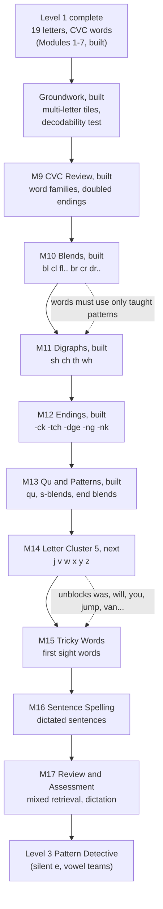
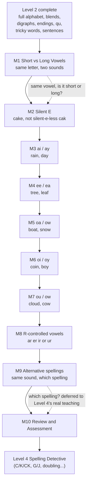
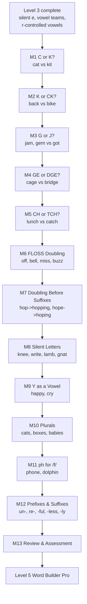
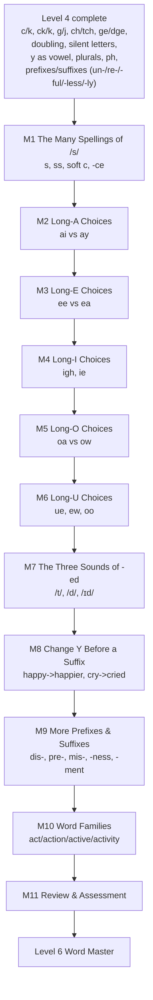

# The Spelling Code — Master Document

> **Generated file — do not edit by hand.** Edit `docs/project-notes.md` for the written sections and the content JSON under `content/` for the curriculum, then run `npm run docs`. Everything from “Curriculum” down is built directly from the live content files, so it always matches the app.

## Contents
1. Project notes (purpose, roadmap, scope, architecture, decisions, workflow)
2. Plan: Level 2 plan — Word Builder (draft for owner review)
3. Plan: Level 3 plan — Pattern Detective (draft for owner review)
4. Plan: Level 4 plan — Spelling Detective (draft for owner review)
5. Plan: Level 5 plan — Word Builder Pro
6. Curriculum at a glance
7. Curriculum in full (every module, lesson and question)
8. Content library (pictures, audio, badges)
9. Code map

---

## 1. Project notes

### What this is
**The Spelling Code** is a web app that teaches young children (launch target: about ages 4–7) to listen, read and spell using synthetic phonics: letters are taught in small clusters, and children immediately use them to build, read and spell real words. It is playful on purpose — a Detective Fox mascot, missions, badges — not test-like.

- **Live app:** https://the-spelling-code.netlify.app (public, no login)
- **Owner:** the product and curriculum owner decides what is taught; the developer (Claude) builds it and documents every substitution or gap here and in `content/word-library.md`.
- **Progress storage:** the child's browser (`localStorage`), one child profile, no accounts, no backend.
- **Feedback loop:** the Parent Dashboard has “Share my progress” and “Send feedback” buttons that open WhatsApp to the owner with a pre-filled message. No server involved.

### The six-level roadmap (from the Master Curriculum Blueprint v0.1)
| Level | Name | Approx. age | Blueprint modules | State |
|---|---|---|---|---|
| 1 | Sound Explorer | 4–5 | 10 | **Modules 1–7 built** (structure redesigned into letter clusters) |
| 2 | Word Builder | 5–6 | 8 (built as 9) | **Complete** — Modules 9–17 built and deployed |
| 3 | Pattern Detective | 6–7 | 10 (planned as 10) | **Complete** — Modules 18–27 built and deployed |
| 4 | Spelling Detective | 7–9 | 13 (planned as 13) | **Complete** — Modules 28–40 built and deployed |
| 5 | Word Builder Pro | 9–11 | 10 (built as 11 — see scope note below) | **Complete** — Modules 41–51 built and deployed |
| 6 | Word Master | 11–15 | 10 | Not started |

The blueprint's Level 1 has 10 one-skill modules; the app's Level 1 was redesigned (with the owner's approval) into letter-cluster modules, so its module list no longer matches the blueprint's.

**Scope note on Levels 4 and 5 (discovered and resolved 2026-10-01):** re-reading the blueprint while planning Level 5 surfaced that app-Level-4 doesn't actually match blueprint-Level-4 — it built blueprint-Level-5/6 content (doubling, silent letters, plurals, prefixes/suffixes) instead of blueprint-Level-4's own flagship long-vowel spelling-choice modules (ai/ay, ee/ea, igh/ie, oa/ow, ue/ew/oo) and soft-C. Flagged to the owner directly; the owner had no preference, so the resolution taken is: app-Level-4 stays as shipped (real, tested, deployed, has its own badge — not worth redoing), and app-Level-5 absorbs the blueprint's missing Level-4 long-vowel/soft-C content plus only the blueprint-Level-5 modules that aren't already duplicates of app-Modules 34/37/39 (Plurals, Adding -ing, Doubling Consonants, Drop the E, and the un-/re-/-ful/-less/-ly half of Prefixes/Suffixes are all skipped as already built). See `docs/plans/level-5.md` for the full reasoning and the resulting 11-module list.

### Where the build stands
| Piece | State |
|---|---|
| Level 1 “Sound Explorer”, Modules 1–7 | **Built and deployed** (the agreed launch set) |
| Level 1 Module 8 (Master Assessment) | **Built** — one cumulative 16-item test across every Level 1 skill; earns the “Level 1 Sound Explorer” badge |
| Level 2 “Word Builder”, all 9 modules (CVC Review, Consonant Blends, Digraphs, Common Endings, Qu & Patterns, Letter Cluster 5, Tricky Words, Sentence Spelling, Review & Assessment) | **Complete — built and deployed.** Level 2 is finished. |
| Level 3 “Pattern Detective”, all 10 modules (Short vs Long Vowels, Silent E, ai/ay, ee/ea, oa/ow, oi/oy, ou/ow, R-Controlled Vowels, Alternative Spellings, Review & Assessment) | **Complete — built and deployed.** Level 3 is finished; earns the new “Level 3 Pattern Detective” badge on the Level 3 Challenge. |
| Level 4 “Spelling Detective”, all 13 modules (C or K?, K or CK?, G or J?, GE or DGE?, CH or TCH?, FLOSS Doubling, Doubling Before Suffixes, Silent Letters, Y as a Vowel, Plurals, ph for /f/, Prefixes & Suffixes, Review & Assessment) | **Complete — built and deployed.** Level 4 is finished; earns the new “Level 4 Spelling Detective” badge on the Level 4 Challenge. See `docs/plans/level-4.md` and the Level 4 curriculum design note below. The first modules to grade a spelling *choice* rather than just recognise or reproduce an already-given spelling. |
| Level 5 “Word Builder Pro”, all 11 modules (The Many Spellings of /s/, Long-A/E/I/O/U Choices, The Three Sounds of -ed, Change Y Before a Suffix, More Prefixes & Suffixes, Word Families, Review & Assessment) | **Complete — built and deployed.** Level 5 is finished; earns the new “Level 5 Word Builder Pro” badge on the Level 5 Challenge. See `docs/plans/level-5.md` and the Level 5 curriculum design note below. Modules 42–46 close out the blueprint's missing Level-4 long-vowel-choice content; Modules 47–50 are genuinely-new blueprint-Level-5 morphology content. |
| Payments, accounts, teacher/school features, AI tutor, analytics, CMS, placement test | Out of scope until the owner asks |

**Launch plan:** 7 modules for ages roughly 4–6; add Module 8 (My First Sentences) if many 7-year-olds are in the audience. Modules 1–2 may be easy for confident 7-year-olds; “unlock all” in the Parent Dashboard lets a parent skip ahead.

### Curriculum design
- **Modules 1–2 — Listening Detective, Rhyme Detective:** general sound awareness, no letters. Built first and kept as designed.
- **Modules 3–6 — Letter Clusters** (Jolly Phonics / Letters and Sounds style): s a t p i n → m d g o c → k b h r e → l f u. That is all 19 Level 1 letters.
- **Every cluster has the same five lessons:** Meet the Letters (hear a word, pick its first letter) → Blend & Build (build a heard word from a tray of exactly the right letters) → Read the Words (read a written word, pick its picture) → Spell the Words (build a heard word from a tray with one extra decoy letter) → Cluster Challenge (scored, mixed).
- **Module 7 — Level 1 Review:** the same five lessons but mixing words from all clusters; the final Level 1 Challenge has 11 items.
- **Word rules:** simple CVC words only. No digraphs, blends, silent e, vowel teams or r-controlled vowels (“her”, “car” are excluded). Curriculum boundary: no c/k/ck choices, no ff/ll/ss doubling.
- **The c/k decision:** “c” is taught as a second letter for the /k/ sound (needed for cat, cap, can, cup). No question ever makes a child choose between c and k: they are never offered together as letter options, and a decoy tray never pairs one with a word using the other.
- **Letter sounds, not names:** text-to-speech reads a bare letter by its name (“em”), which teaches the wrong thing. So the app never speaks an isolated letter; “tap a word to sound it out” uses phoneme approximations (n → “nnn”, a → “ah”, p → “puh”) and then the whole word.
- **Mastery:** each lesson has a mastery threshold (80%). A module is complete when all its lessons are mastered.

### Level 2 curriculum design (all 9 modules built — Level 2 complete)
- **Module 9, CVC Review & Automaticity:** no new letters — pure review of Level 1's 19 letters, plus one lesson teaching common doubled-letter-ending words (off, bell, hill, doll...) receptively only. A child builds/reads these correctly without ever being asked to *choose* a spelling — that choice stays a Level 4 topic, matching the c/k precedent from Level 1.
- **Module 10, Consonant Blends** (bl/cl/fl/gl/pl/sl, br/cr/dr/fr/gr/pr/tr): a blend is two already-known letters said quickly together, so it needs no new letter and no new tile — each blend letter is tapped separately, exactly like any other CVC word.
- **Module 11, Digraphs** (sh, ch, th, wh) and **Module 12, Common Endings** (-ck, -tch, -dge, -ng, -nk): unlike a blend, these are two-or-three letters making **one** sound, so the tray must offer them as a single tile (see “Multi-letter tiles” below). Digraphs can sit at the start or end of a word (ship vs. fish); endings only ever sit at the end.
- **Module 13, Qu & Common Patterns:** “qu” is tiled as one inseparable unit like a digraph (English never spells /kw/ with a bare q), plus s-blends and end-blends, which — like Module 10's blends — are just pairs of already-known letters needing no new tile.
- **Narration must name the right concept.** A blend is not a digraph is not an ending is not qu — conflating them (e.g. calling “ck” a “blend” because it's more than one character) is a real bug that shipped once and was caught by a live browser check, not by the test suite. `graphemeKindFor()` in `src/services/questionTypes.js` is the single source of truth for which is which; extend its `DIGRAPHS`/`ENDINGS` sets when a later module adds more, rather than guessing from a grapheme's length.
- **Multi-letter tiles.** A `word_build` item can set `answer_tiles` (e.g. `["sh", "i", "p"]` for “ship”) so a tray tile can hold a whole grapheme instead of always one letter. Every place that used to do `correct_answer.split("")` — the tile count, the decoy calculation, the Watch-stage demo, the narration — now goes through `answerTilesFor()` instead. Level 1 content never sets `answer_tiles`, so it's unaffected; this is purely additive.
- **Known letters gap — resolved.** Level 1's 19 letters never included j, v, w, x, y, z. Flagged while building Module 13, and fixed with a new **Module 14, Letter Cluster 5** (same 5-lesson shape as Level 1's clusters) — the alphabet is complete from here on (q is still never taught alone, only as "qu").
- **Module 15, Tricky Words:** a new activity type, `sight_word_match` — deliberately audio-first (hear the whole word, then pick it from similar-looking real-word decoys like was/saw/has), never the written-word tap-to-sound-out pattern, because sounding out an irregular word like "said" letter by letter teaches the wrong pronunciation. The Watch-stage demo highlights the word's irregular part in a different colour (`tricky_part` field, e.g. "ai" in "said") — the standard sight-word teaching technique.
- **Module 16, Sentence Spelling — three more new activity types**, all reusing `MultipleChoice`'s existing plain-text-option fallback rather than needing new picker UI:
  - `sentence_build`: the sentence-level sibling of `word_build`. A new `WordTile` component (auto-width, not a fixed square like `LetterTile`) and a new `SentenceBuilder` component — the one real behavioural difference from word-building is that words join with a **space**, not nothing, so this couldn't just reuse `WordBuilder` with different tiles. Content always sets `answer_tiles` explicitly (e.g. `["The", "cat", "sat."]`); `answerTilesFor()`/`decoyLettersFor()` needed no changes since they already treat a tray as a generic list of tiles, letters or words alike.
  - `sentence_read`: written_sentence field (deliberately separate from `written_word` — see next point) plus picture options, reusing `read_word`'s picture-matching idea at sentence scale.
  - `fix_sentence`: two plain-text options, one correctly capitalised/punctuated, one not — simpler than building an interactive text editor, while still testing the same recognition.
  - **Two bugs found live, not by the test suite, while verifying this module:** (1) `labelToIcon`'s substring matching, fine for isolated CVC words, false-positives on real running text — "then" contains "hen", so a sight/sentence option could silently show an unrelated picture; `sight_word_match` and `fix_sentence` options now never get a picture, matched or not. (2) `spellOutWord` strips punctuation and spaces then sounds out whatever's left as ONE word, so wiring a sentence into the existing `written_word` field would try to sound out "The cat sat." as "thecatsat" — hence the separate `written_sentence` field, rendered as plain non-interactive text instead.
  - Two of the app's own generic content-integrity tests didn't know about sentence-shaped content and needed updates: the "correct_answer is among options" test now recognises `sentence_build` as tile-based (like `word_build`) rather than expecting an `options` array it doesn't have, and the decodability test now splits a `correct_answer`/`written_sentence` on whitespace and checks each word separately, since a bare space or period was never a "taught letter" and was never meant to be one.

### Level 3 curriculum design (all 10 modules built — Level 3 complete)
- **Full plan:** `docs/plans/level-3.md` — big goal, module-by-module table, and the two owner-confirmed decisions (2026-09-30): vowel-team spellings (ai/ay, ee/ea, etc.) are taught **receptively only** — a child never picks between two valid spellings of the same word until Level 4 — and building continues level after level without pausing for review.
- **Module 18, Short vs Long Vowels:** purely auditory, no spelling shown — the child hears a real word (via the browser's speech voice, same `say:word`-prefixed `audio_asset` mechanism Module 2's rhyming already used) and judges whether its vowel sound is short or long. A new activity type, `vowel_length`, reuses `Sort.jsx` (itself a thin wrapper over `MultipleChoice`) with plain `["Short", "Long"]` text options — no new component needed. Added to `COMPARE_TYPES` in `questionTypes.js` so it gets the same "no option picture" treatment as `same_different`/`loud_soft`. Word pairs were deliberately chosen as CVC/CVCe near-minimal pairs (cap/cake, hop/hope) to set up Module 19 (Silent E) without teaching spelling yet.
- **Module 19, Silent E (CVCe):** the standard five-lesson template (Meet the Pattern → Blend & Build → Read the Words → Spell the Words → Challenge) applies cleanly — unlike a digraph or vowel team, a CVCe word (cake, bike...) is spelled entirely from already-known single letters, so no new tile shape was needed anywhere. "Meet the Pattern" reuses Module 18's own `vowel_length` type, this time with `written_word` also set (not just audio) so the child sees the silent-e spelling while judging short/long — the exact same component, no new code. Added 5 new word pictures (cake, bike, kite, rose, wave) from Noto Emoji, since no existing CVC/digraph word in the picture library has a silent-e shape.
- **Module 20, ai/ay — the first module to actually apply the receptive-only decision.** `graphemeKindFor()` gained a `"vowel team"` kind (`VOWEL_TEAMS` set in `questionTypes.js`) so narration never calls it a digraph. A vowel team can sit at the start, middle or end of a word (the "ai" in "rain" is neither) — reusing the existing start/end `graphemePosition()` guess would have wrongly claimed "rain starts with ai"; both `modelCaptionFor` and `modelHeadingFor` in `LessonPlayer.jsx` got a dedicated branch that never claims a position for a vowel team, caught and fixed by live-verifying the Watch stage before shipping. **"Meet the Sounds" (recognition) never offers ai and ay as two options for the same item** — that would be exactly the graded ai-vs-ay choice the owner's decision rules out — so its decoy options are always a bare single vowel (`[correct, "a", "o"]`) instead, testing "is this a vowel team or just a short vowel" rather than "which spelling is it." Vowel-team tiles reuse `word_build`'s existing `answer_tiles` mechanism exactly like a Level 2 digraph tile (e.g. "rain" → `["r", "ai", "n"]`) — no new component. Added 5 new word pictures (train, rain, mail, sail, paint); no clean picture was found for any -ay word, so Read the Words covers -ai words only, matching the ch/wh precedent from Module 11. One picture-ordering gotcha: `WORD_KEYS`' substring match required listing "train" before "rain" (`"train".includes("rain")` is true), or every "train" picture would have silently shown rain's icon instead.
- **Module 21, ee/ea — same shape as Module 20**, `VOWEL_TEAMS` extended to `{ai, ay, ee, ea}`, same non-competing-decoy design for "Meet the Sounds". First module where a word combines a Level 2 digraph tile AND a Level 3 vowel-team tile in the same build (wheel → `["wh", "ee", "l"]`) — verified live that the two tile kinds compose cleanly with no code changes needed. Added 6 new word pictures (tree, bee, sheep, wheel, leaf, seal); unlike Module 20, both spellings had enough clean pictures to include in Read the Words together.
- **Module 22, oa/ow — same shape again**, `VOWEL_TEAMS` extended to `{ai, ay, ee, ea, oa, ow}`. Two picture words were deliberately dropped rather than wired in with a workaround: "boat" (its natural emoji is a sailboat, which "sail" from Module 20 already claims — using it for both would show the same picture for two different words) and "window" (`labelToIcon`'s `direct` map already has "wind" as an environmental-sound icon key, and `"window".includes("wind")` would silently show that icon instead). Both still work fine as build/spell-only targets, matching the ch/wh precedent. Added 6 new word pictures (goat, coat, soap, road, snow, bowl).
- **Module 23, oi/oy** — same shape, `VOWEL_TEAMS` extended to `{ai, ay, ee, ea, oa, ow, oi, oy}`. Thinnest picture pool of any Level 3 module so far (4 words: coin, boy, toy, oyster) — Read the Words runs shorter than the standard 5-6 items as a result, matching the established "thinner lesson when the picture pool is thin" precedent (ch/wh, -tch/-nk in Level 2) rather than forcing in a weaker picture match.
- **Module 24, ou/ow — the first Level 3 module the plan itself flagged as having "genuinely no simple position rule".** Unlike ai/ay, ee/ea, oa/ow and oi/oy, `ow` is reused here for a *different* sound than Module 22's (long O in "snow" vs this module's /ow/ in "cow") — `VOWEL_TEAMS` doesn't need a second entry since it only tracks "is this a vowel team," not which sound, but the decodability test's `GRAPHEMES_BY_MODULE[24]` only lists `["ou"]` since `"ow"` the grapheme string is already known from Module 22. Dropped "cloud" as a picture word — `labelToIcon`'s `direct` map has "loud" as a Level 1 icon key, and `"cloud".includes("loud")` would silently show that icon instead — the same class of bug as "window"/"wind" in Module 22, now the third time this exact collision shape has appeared. Added 5 new word pictures (mouth, cow, owl, house, mouse).
- **Module 25, R-Controlled Vowels (ar/er/ir/or/ur) — the first Level 3 module with 6 lessons instead of 5**, per the plan (it teaches five patterns, not one or two). `graphemeKindFor()` gained a genuinely new kind, `"r-controlled vowel"`, rather than folding it into `"vowel team"` — a vowel-plus-r isn't two vowels, it's a vowel whose own sound the r swallows, so calling it a vowel team would be the same "wrong name" mistake the digraph/blend/ending distinction exists to prevent. Same position-narration fix as Module 20's vowel teams was needed again here (car ends with ar, but bird has ir in the middle). er, ir and ur are taught together in one lesson (they're the exact same sound, genuinely no rule for which spelling a word uses — closer to Module 9's Alternative Spellings problem than a normal two-way vowel-team split), while ar and or each get their own lesson since they're distinct sounds. "car" reuses the existing Level 1 hand-drawn car icon (the same real object, not a naming collision) rather than adding a redundant image file — confirmed live that `Illustration()`'s `IMAGE_BG`-then-`PICTURES` fallback picks it up automatically. Added 5 new word pictures (star, corn, bird, shirt, purse).
- **Module 26, Alternative Spellings — the module the whole "one real design problem" section of the plan was written for.** Explicitly recognition-only: every practice/assessment item's `letter_sound_match` options are `[correct_pattern, bare_vowel, bare_vowel]`, exactly like every earlier Level 3 module — the pattern never changes here, it's just now applied across *pairs* of families in the same lesson (ai/ay vs ee/ea, oa/ow vs oi/oy, ou/ow vs er/ir/ur) with `teach` narration that explicitly states the comparison ("rain uses ai... day uses ay... same sound, different spelling"). Confirmed live that no item ever offers two spellings of the same sound as competing options. Introduces no new grapheme (`GRAPHEMES_BY_MODULE[26] = []`, same as Level 2's Module 9 CVC Review) and needed no new word pictures — Read & Build Review reuses the full picture pool built up across every Level 3 module so far.
- **Module 27, Review & Assessment — closes out Level 3, mirroring Level 2's Module 17 exactly** (Mixed Retrieval → Read & Build → a third review lesson → Dictation → Level 3 Challenge). The third lesson deliberately returns to Module 18's own `vowel_length` type (short-vs-long, now including silent-e spellings) rather than adding a new review angle, closing the loop on where Level 3 began. A 14-item final Challenge mixes all four activity types built or reused this level (`letter_sound_match`, `word_build`, `vowel_length`, `read_word`) — live-verified end to end: scored 93%, showed the mastery close narration, and correctly earned a new "Level 3 Pattern Detective" badge (`BADGE-09`) on the child's badge shelf. Introduces no new grapheme and no new pictures.
- **Home screen decluttering.** Built ahead of Level 3's content: `ChildHome.jsx` got a horizontally-scrollable level-pill switcher (one row per level, defaulting to whichever level contains the child's current unlock frontier) so the module accordion only ever shows one level's modules at a time — the owner's explicit requirement when asking to build every remaining level ("make sure the first screen does not clutter").
- **Old score-gated unlock mechanic removed.** The per-module "free unlock at 85%" celebration screen (superseded by the flat Level 1 free / Level 2+ paid decision — see "Access rules" below) was fully deleted from `ResultScreen.jsx` and `ChildHome.jsx`, not just disabled, since it no longer has any code path that can trigger it.

### Level 4 curriculum design (all 13 modules built — Level 4 complete)
- **Full plan:** `docs/plans/level-4.md` — big goal, module-by-module table, and the design shift every earlier level's boundary was protecting against: Level 4 is where the child is finally graded on *choosing* the correct spelling, not just recognising or reproducing one already given. No owner sign-off was sought on the phonics rules themselves (c-before-a/o/u vs k-before-e/i/y, the FLOSS doubling rule, etc.) since they're fixed linguistic facts, not design judgment calls — only Level 3's genuine ambiguity (receptive vs graded vowel teams) needed that.
- **A new activity type, `spelling_choice`** — a thin `MultipleChoice` wrapper exactly like `fix_sentence` (added to `NO_ICON_OPTION_TYPES` for the same reason: a wrong-spelling option like "kat" must never get a picture icon). Given a spoken word, the child picks the correctly spelled option from two plain-text choices; the wrong option is always a genuine misapplication of the real rule being taught (e.g. "kat" for "cat" swaps the letter the rule says is wrong), never an arbitrary typo.
- **`word_build`'s existing decoy-tile mechanic got a new *purpose*, not a new mechanic** — the decoy tile is now deliberately the *other* member of the spelling-choice pair (a tray for "cat" holds both c and k, and the child must pick the one the rule calls for) rather than a random unrelated letter. Confirmed live this needed zero code changes — the same tray/answer_tiles/narration machinery that handled Level 2 and 3's decoys handles this without modification.
- **Module 28, C or K?** — the first module, and the one the design problem above was written for. C before a/o/u, k before e/i/y. Needed no new word pictures at all — cat, cup, kid and cab were all already illustrated from Level 1/2, so Read the Words reuses them directly.
- **Module 29, K or CK?** — same shape, applied to the end of a word instead of the start: ck directly after a short vowel, plain k after anything else (a consonant, a long vowel, or a vowel team). Word choice deliberately stayed away from silent-e words like "bike"/"cake" — this module's generic content-authoring helpers (`wrongOf()`, `wb()`) assume the target word ends literally in "k" or "ck" with nothing after it, and a CVCe word's final letter is the silent "e", not "k"; rather than special-case that shape now, the word list simply used only words ending directly in the sound (milk, pink, book, desk...). Confirmed live that the word_build demo correctly explains *both* directions of the choice (ck-is-right-here vs k-is-right-here), not just one. Added 2 new word pictures (sock, book).
- **Module 30, G or J? — simplified deliberately.** The full g/j ambiguity before e/i/y (gem, giant vs jet, jig — English is genuinely irregular here, both spellings are common) is NOT what this module tests; it teaches the one clean, reliable rule instead — word-initial /j/ is *almost always* j (jam, jog, jump), regardless of the vowel that follows, unlike Modules 28/29's a/o/u-vs-e/i/y split. The wrong option in each `spelling_choice`/`word_build` item is always the g-swapped form (jet → get, jam → gam); a few of these happen to collide with unrelated real words ("get" is a real word, just not what was spoken) — left as-is rather than avoided, since the mechanic still correctly tests "does this spelling match the sound you heard," and precedent throughout this project has been to accept minor imperfections like this rather than over-engineer around them. Thinnest picture pool yet (jug, jet — both already existed from Level 1/2) — Read the Words reuses them for both practice and assessment.
- **Module 31, GE or DGE?** — same shape as Module 29's k/ck, applied to /j/ instead of /k/: dge directly after a short vowel (bridge, badge), plain ge after anything else — a consonant, or the ordinary silent-e long-vowel pattern (cage, orange, sponge). "ge" is treated as a single ending tile for symmetry with "dge" (the same simplification Module 29 made for CVCe k-words), even though a plain "cage" could in principle just use separate g/e letter tiles like Module 19's silent-e words — keeping it as one 2-letter tile is what makes "which ending, ge or dge" a clean, directly comparable choice. Confirmed live that the word_build demo explains both directions correctly (bridge → dge is right, ge is the decoy; cage → ge is right, dge is the decoy). Added 2 new word pictures (orange, sponge); dropped "stage" — its emoji is drama masks, which reads as "masks"/"drama," not clearly "stage."
- **Module 32, CH or TCH?** — same shape again, applied to /ch/: tch directly after a short vowel (catch, pitch, watch), plain ch after anything else (peach, lunch, bench). Deliberately excludes the genuine short-vowel-but-ch exceptions (much, such, which) from graded content — the same simplification Module 30 made for g/j's full irregularity, rather than teaching an exception list alongside the rule. Dropped "torch" as a picture word — its flashlight-shaped emoji reads as "flashlight" to most users, not clearly "torch." Added 2 new word pictures (watch, peach).
- **Module 33, FLOSS Doubling — the first module where the choice isn't between two different letters, just a doubled vs single ending.** f, l, s and sometimes z double after a short vowel in a one-syllable word (bell, off, pass, buzz). Unlike Modules 28-32, every word in this module's content follows the rule (there's no "sometimes you don't double" branch within the word list), so `wrongOf()`/`wb()` simplified to a single generic transform (strip the last letter / tray offers the doubled pair plus one copy) rather than branching on word shape. "bell" and "shell" reuse existing pictures from Level 1/2 (same real objects, not collisions); added 1 new word picture (doll).
- **Module 34, Doubling Before Suffixes — the first module needing a genuinely new word shape: a base word plus a suffix (-ing/-ed), not just an ending choice on an already-whole word.** Three rules, each a full lesson: double the final consonant after a short vowel (hop → hopping), drop a silent e (hope → hoping), or just add the suffix when neither applies (jump → jumping). The `word_build` helper generalizes cleanly across all three — `letters`/`answer_tiles` built from `[...stem, extra, suffix]` with the decoy being either a stray "e" (doubling words) or the stem's own final consonant (drop-e words), confirmed live for all three modes without any new component. The `spelling_choice` recognition lessons lean on genuine minimal pairs wherever English has them (hop/hope, tap/tape, win/wine, plan/plane, grip/gripe, star/stare) — the SAME two words really do exist with different meanings, so the audio itself (short vs long vowel) is the only way to tell which spelling is correct, directly extending Level 3's short/long vowel discrimination skill. No picture-matching lesson — a still image can't clearly distinguish "running" from "run," so this module leans on its six lessons for the skill progression instead of forcing in weak picture content.
- **Module 35, Silent Letters — the first Level 4 module with no spelling choice at all, receptive only.** kn, wr, mb and gn are simply new patterns (no word is plausibly spelled two ways), so this module returns to the standard Level 1/2 five-lesson shape instead of `spelling_choice`/competing-tile decoys. Every silent letter is tiled as its own single-character tile, never fused into a 2-letter chunk like a digraph (knee → `[k, n, ee]`, not a "kn" tile) — there's no pronunciation reason to fuse them, since the "n" tile is identical whether a silent k precedes it or not; this also means no new `graphemeKindFor()` kind was needed. **A real narration bug was caught and fixed live before shipping:** reusing `letter_sound_match` with a bare single-letter `correct_answer` fell through to the generic "word starts with the letter X" narration — true, but missing the entire point (the letter is never actually said). Added a `silent: true` content field and a dedicated branch in both `modelCaptionFor` and `modelHeadingFor` ("knee has a silent k!" / "Which letter is silent in Knee?") rather than leaving the misleading default. Added 3 new word pictures (comb, knee, knife); "thumb" reused an existing Level 2 picture, and "sign" was dropped — its emoji is a construction barrier, not clearly "sign."
- **Module 36, Y as a Vowel — same shape as Module 35 (receptive, standard five-lesson template), with the same narration-field trick applied proactively this time.** y at the end of a longer word says long e (happy, baby); at the end of a short word it says long i (cry, fly, my). `correct_answer` here is "e" or "i" — not a grapheme at all — so `letter_sound_match`'s generic fallback would have been nonsensical ("happy ends with the letter e"), the same shape of bug Module 35 caught live; this time a `yVowel: true` field and dedicated narration branch were added from the start rather than discovered after shipping. Added 3 new word pictures (baby, puppy, fly); dropped "candy" as a picture word — `"candy".includes("can")` would have matched the existing "can" picture first — and dropped "sky" — its sun-behind-cloud emoji reads as "weather," not clearly "sky."
- **Module 37, Plurals — back to a genuine spelling choice, but between three endings instead of two letters.** Add -s for most words (cat → cats), -es after a word ending in a hissing/hushing sound — s, x, ch, sh (box → boxes, bus → buses), or swap final y for -ies after a consonant (baby → babies, puppy → puppies). The content-authoring helper `shape(base, mode)` generalizes the same three-way branch across every lesson, and this time `wb()` was written to separate `tiles` (the correct answer tiles, feeding `answer_tiles`) from `letters` (`[...tiles, wrongEnding]`, feeding the tray) from the very first line, rather than discovering the `answer_tiles`-includes-the-decoy bug live as happened in Modules 29/35/36 — all 22 tests passed on the first run. Unlike Modules 28–34's doubling/minimal-pair rules, plurals don't offer a natural minimal-pair pair for `spelling_choice` recognition (there's no real word that's ambiguously "either -s or -es"), so every `spelling_choice` item instead pairs the correct plural against the *wrong rule applied to the same base word* (boxs vs boxes, babys vs babies) — same "does this spelling match the rule" test as Modules 28–32, just without a genuine-minimal-pair option this time. Verified live that the Watch-stage word_build demo explains all three modes correctly across its 5 examples (cats/s, boxes/es, babies/ies, dogs/s, buses/es) and that Practice correctly advances after a correct build. Added 1 new word picture (box); dropped "dish" as a picture word — its emoji is a single plate, which reads as "plate," not clearly "dish" (and "box" already covers the -es example without it).
- **Module 38, ph for /f/ — back to receptive-only (no spelling choice: ph vs f isn't a live ambiguity at this level), and 4 lessons instead of the usual 5 since the plan's own table calls for it.** `"ph"` was added to `questionTypes.js`'s `DIGRAPHS` set so `graphemeKindFor("ph")` correctly returns `"digraph"` instead of falling through to the generic "blend" narration. **A real narration bug was caught and fixed live before shipping**, this time by live-testing rather than anticipating it in content: `graphemePosition()` only ever returned `"start"` or `"end"` (defaulting to `"start"` for anything else), which was never wrong for Module 11's digraphs (sh/ch/th/wh only ever sat at a word's start or end in this app's word lists) but IS wrong for "dolphin"/"elephant", where ph sits in the middle — the narration said "dolphin has the digraph ph at the start!", which is false. Fixed by having `graphemePosition()` return `null` for a mid-word grapheme instead of guessing, and both narration call sites (`modelCaptionFor`/`modelHeadingFor`) fall back to a position-free "has the digraph ph in it!" phrasing, mirroring the pattern vowel teams already used for the same reason. Verified live after the fix across all 5 Watch-stage examples: phone ("at the start"), dolphin and elephant ("in it"), graph ("at the end"), trophy ("in it"). Added 3 new word pictures (dolphin, elephant, graph — a bar-chart emoji, which reads clearly as "graph"); sourced but rejected "photo" as a picture word — its Noto emoji is an unambiguous camera, which reads as "camera" not "photo", so "photo" stayed build/spell-only, the same treatment Module 12 gave "clock".
- **Module 39, Prefixes & Suffixes — back to build-focused, closer to Level 2's sentence-building shape than a phonics-choice module, per the plan.** un-/re- at the start mean "not"/"again"; -ful/-less at the end mean "full of"/"without" (genuine antonym minimal pairs — careful/careless, hopeful/hopeless, harmful/harmless — the same "real word either way, audio is the only tell" shape Module 34 used for hop/hope); -ly just adds on. No new mechanic: `spelling_choice` reused for all three "Meet" recognition lessons (un-, re-, -ful/-less) with real un-/re- word pairs (unwrap/rewrap, undo/redo, untie/retie, unload/reload, unfold/refold) as the audio-driven choice, and `word_build` reused for Blend & Build/Spell the Words with the prefix or suffix tiled as its own single tile (e.g. quickly → `[qu, i, ck, ly]`, composing the new suffix tile with already-known qu/ck graphemes). Added a new remediation tag, `PREFIX_SUFFIX_CONFUSION` (REM-18) — distinct from `SPELLING_CHOICE_CONFUSION` since the confusion here is about a word PART's meaning, not a sound's spelling. No new word pictures — same reasoning as Module 34 (a still image can't distinguish "unwrap" from "rewrap" or "careful" from "careless"), so no Read the Words lesson. **Two real bugs caught before shipping, neither live-only this time:** every assessment item was first written with the `activity_id` field instead of the required `assessment_id` (functionally needed — `LessonPlayer` uses it as a React key and for `questionId`), caught by re-reading the generated content before testing; and Lessons 1–2's assessment banks first exactly reused their own practice lessons' audio+answer pairs (unwrap/undo/untie/unload/unfold, redo/reload/retie), caught live by `npm test`'s transfer-to-new-example check — fixed by swapping in three fresh un-/re- pairs (unseal/reseal, uncap/recap, unpack/repack) the practice lessons never used. Live-verified the Watch-stage spelling_choice narration, the Practice-stage two-option buttons, and the word_build tiling for both a simple word (unwrap) and the most composed one (quickly).
- **Module 40, Review & Assessment — closes out Level 4, same closing shape as every earlier level (Modules 7/8, 17, 27).** Five lessons cumulatively sampling all 12 earlier modules' rules rather than teaching anything new: Mixed Retrieval (`spelling_choice` — c/k, ck/k, g/j, ge/dge, ch/tch, FLOSS doubling), Read & Build (`word_build`, no decoy, one word per several modules — duck, orange, watch, hopping, knee, boxes), Plurals & Word Parts Review (`spelling_choice` — plurals plus un-/re-/-ful/-less), Dictation (`word_build` with a decoy tile, mixing choice-type rules across modules), and the Level 4 Challenge (`assessment`, 14 items freely mixing `spelling_choice`, `word_build`, `letter_sound_match` and `read_word` — the broadest single-lesson type mix of any module this level). Added `BADGE-10` ("Level 4 Spelling Detective", tied to `module_id: 40`, same pattern as every earlier level's closing badge) — purely data-driven, no code changes needed since badge-earning already derives from `isModuleComplete(state, badge.module_id)`. GRAPHEMES_BY_MODULE[40] stays `[]`, same reasoning as Level 2/3's own closing review modules — pure review teaches no new grapheme. All 22 tests passed on the first run (the assessment_id field-name bug from Module 39 was written correctly here from the start). Live-verified the Mixed Retrieval lesson's all 5 Watch-stage examples (cat, sock, jam, bridge, catch) sampling every Level 4 letter/ending-choice rule in one lesson.

### Level 5 curriculum design (all 11 modules built — Level 5 complete)
- **Scope note:** see the roadmap section above for why Level 5's module list doesn't match the blueprint's Level 5 list — it absorbs the blueprint's missing Level-4 long-vowel/soft-C content and skips the blueprint-Level-5 modules already covered by app-Modules 34/37/39. Full reasoning in `docs/plans/level-5.md`.
- **Module 41, The Many Spellings of /s/ — same shape as Level 4's spelling-choice modules, no new mechanic.** /s/ can be spelled s (sun), ss (miss, already familiar from FLOSS doubling), soft c before e/i/y (city, pencil) or -ce at a word's end (ice, dance). "ce" is treated as a single fused ending tile, the same symmetry call Module 31 made for "ge" alongside "dge"; mid-word soft c needs no new tile at all since "c" is already a known single letter — only its *sound* is new, not its spelling. **A real picture collision was caught and fixed before shipping, not live this time:** "pencil" was the natural third Read-the-Words picture for mid-word soft c, but `"pencil".includes("pen")` would have matched the existing Level 1 "pen" sound-icon key first, silently showing the wrong picture — caught by checking `Icon.jsx`'s `WORD_KEYS` array before wiring in the new SVG (the same check the file's own word-library.md recommends but easy to skip). Dropped "pencil" as a picture word entirely (word_build/spelling_choice content keeps using it fine, since those lesson types never render an icon) and substituted "sun"/"bus" — both already-illustrated, zero collision risk — for the plain-s picture examples instead. Added 2 new word pictures (ice, city). Live-verified the Read the Words lesson renders sun/ice/city correctly.
- **Module 42, Long-A Choices — the first Level 5 module with a genuine, reliable positional rule, same confidence level as Level 4's c/k.** ai sits in the middle of a word (rain, train), ay sits at the end (day, play) — both were already taught receptively in Level 3 Module 20, so this module's real job is turning that recognition into a graded choice, reusing the exact same word list (rain, train, mail, sail, paint, day, play, stay, tray, gain) rather than inventing a new one. No new grapheme tile (ai/ay already existed), no new word pictures — Read the Words reuses Level 3's existing train/rain/mail/sail pictures outright, since ay-ending words (day, play, stay, tray) don't have a clean concrete-noun picture pool; that gap is stated plainly in the content rather than forcing in a weak picture. `word_build`'s decoy-tile mechanic again needed zero code changes — a tray for "rain" offers "ay" as the decoy, a tray for "day" offers "ai", exactly mirroring Level 4's ge/dge and ch/tch "explains both directions" pattern. Live-verified both directions of the Spell the Words decoy live (rain/ay-decoy, day/ai-decoy).
- **Module 43, Long-E Choices — the first Level 5 module with NO reliable position rule, taught honestly as a pattern rather than a false rule.** ee and ea can both appear anywhere in a word (tree/leaf, seed/bean are both word-initial-consonant-plus-vowel-team shapes) — there's no "middle vs end" story like Long-A's. Narration frames it accurately: ee is the more common default spelling, ea is a specific set of common words to learn by heart, matching the blueprint's own "Rules vs Patterns" distinction from its Core Learning Philosophy. Reuses Level 3 Module 21's word list and pictures (tree, leaf, bean, seed, sheep, team, jeep, peach) entirely — no new grapheme, no new assets. **Two words were deliberately dropped from consideration before writing any content:** "meat" (its only ee-counterpart via simple grapheme substitution is "meet", a real, correctly-spelled different word — using it as a wrong-spelling decoy would have taught a false negative) and "read" (same homophone-adjacent risk, plus past-tense pronunciation ambiguity) — both are genuine homophone territory that belongs to a later level's dedicated homophones module (blueprint Level 6), not this one's "wrong spelling" decoy mechanic.
- **Module 44, Long-I Choices — igh and ie, two genuinely NEW graphemes (unlike Modules 42/43, which reused patterns Level 3 already taught receptively).** Both added to `questionTypes.js`'s `VOWEL_TEAMS` set. igh is the more common spelling (often before a final t: night, light, fight; or standalone: high); ie is a smaller set, usually at a word's end (pie, tie) or before an ending (fries) — another pattern/frequency call like Module 43's, not a positional rule. Thinnest picture pool of the level so far: only pie, tie and light have clean, unambiguous Noto emoji (a lightbulb for "light" — accepted as reasonably clear for this age band, same judgment call as Module 38's bar-chart-for-"graph"). Read the Words' assessment bank reuses a practice word with an honest `review_flag` explanation rather than forcing in a weak fourth picture, the same precedent Module 30 set. **A real duplicate-content bug was caught by `npm test`, not live:** Lesson 1's assessment bank first reused "light" as both a fresh item AND one of its own practice words (a copy-paste slip while writing the content script) — fixed by swapping in "right" instead. Also flagged a latent, not-yet-triggered risk in `Icon.jsx`: "tie" as a picture key means a future read_word lesson for "untie"/"retie" would need a different picture or careful key ordering, since `"untie".includes("tie")` is true (today those words only appear in `word_build`/`spelling_choice` content, which never renders an icon, so no actual bug yet).
- **Module 45, Long-O Choices — back to a genuine positional rule (oa middle, ow end), same shape as Module 42's ai/ay.** Deliberately excluded "bowl" from the word list even though it was already illustrated from Level 3 Module 22 — ow is followed by l in "bowl" (owl-shape), not truly word-final, which would have muddied the clean "ow at the end" rule this module teaches; kept the word list to oa/ow words that fit the rule cleanly (boat, road, soap, goat vs snow, grow, slow). Reuses Level 3 Module 22's word list and pictures (boat, road, soap, goat, coat, snow) entirely — no new grapheme, no new assets. 22/22 tests passed on the first run. Live-verified both directions of the Spell the Words decoy (boat/ow-decoy, snow/oa-decoy).
- **Module 46, Long-U Choices — the most complex module in this run of five, three competing spellings (ue, ew, oo) instead of two, closing out the blueprint's missing long-vowel-choice content.** All three new graphemes, added to `VOWEL_TEAMS`. oo is the common default (moon, spoon, food); ue and ew are smaller memorized sets, each usually at a word's end (true, glue; new, few) — same pattern/frequency framing as Modules 43/44, not a positional rule. Got a sixth lesson ("More Spellings," a second `spelling_choice` round) per the plan's own call for extra practice given the added complexity. **Two real-word collisions were checked and avoided before writing any content, not caught live:** "blue" was dropped from the word list because its only ew-substitution decoy is "blew," a real, correctly-spelled different word (same homophone trap Module 43 hit with meat/meet); "due" was dropped because its ew-substitution is "dew," also real. "clew" (an obscure nautical term, used as a decoy for "clue") was accepted as safe per the project's standing precedent for low-frequency real-word decoys (Module 34's "teem," Module 30's "get"). Thinnest picture pool of any module this level — only moon, spoon and broom — with "book" deliberately NOT reused despite already being illustrated, since its oo makes the short oo sound (book/look), a different sound from this module's long-oo focus; the Teach narration names this dual-sound fact honestly rather than glossing over it. 22/22 on the first run. Live-verified the Watch-stage decoy narration ("true" tiles as tr-ue with an "ew" decoy called out) and the moon picture in Read the Words.
- **Module 47, The Three Sounds of -ed — the first genuinely-new Level 5 content (not a Level-4 gap-fill), and a different KIND of skill than any `spelling_choice` module: auditory discrimination, since the spelling is always "-ed" regardless of which sound it makes.** /t/ after an unvoiced consonant (walked), /d/ after a voiced sound (played), /id/ after t/d (wanted) — same "hear the sound" shape as Level 1's phonemic-awareness modules, not a spelling task at all. Reused `letter_sound_match` with a new `edSound: true` content field (`correct_answer` is "t"/"d"/"id", not a grapheme), following the exact precedent Module 35's `silent` and Module 36's `yVowel` fields established — added the matching narration branches in both `modelCaptionFor` and `modelHeadingFor` proactively, before any content was written, rather than discovering the generic-fallback bug live as Module 35 originally did. No new remediation tag reused — added `ED_SOUND_CONFUSION` (REM-19) since this is neither a spelling choice nor a letter-sound-correspondence confusion in the usual sense. No decoy-tile "Spell the Words" lesson — since the spelling never changes, a second `word_build` lesson (Lesson 4) just gives more building reps on fresh words instead of a genuine decoy choice; no Read the Words either, same "can't picture a verb tense" reasoning as Modules 34/39. Live-verified all three Watch-stage narration branches (walked→/t/, wanted→/id/, called→/d/) and the three-button Practice-stage layout (t/d/id).
- **Module 48, Change Y Before a Suffix — back to a genuine spelling rule (like Module 34's doubling/drop-e), with one clean exception.** A word ending in consonant+y swaps y for i before most suffixes (happy→happier, cry→cried) but keeps the y before -ing specifically (crying, never criing) — taught as two separate "Meet the Rule" lessons (Change Y, then the -ing exception) before merging them in a "More Practice" lesson, mirroring Module 34's three-separate-then-combined structure. `word_build`'s decoy mechanic reused exactly as Module 34 did for its stray-e decoy — a stray "y" tile for words that changed to i, a stray "i" tile for words that kept y. No new grapheme tiles (`-er`/`-est`/`-ly`/`-ness` all decompose to already-known single letters, same reasoning as Modules 34/47's suffix tiles). Live-verified both directions of the Spell the Words decoy (happiest/y-decoy, flying/i-decoy).
- **Module 49, More Prefixes & Suffixes — extends Module 39 rather than repeating it: dis-, pre-, mis- at the start, -ness and -ment at the end, no overlap with Module 39's un-/re-/-ful/-less/-ly.** Same shape throughout: `spelling_choice` for recognition (two "Meet" lessons — prefixes, then suffixes — plus a combined "More Practice" round mirroring Module 48's structure), `word_build` with the prefix/suffix as its own tile for building. One word (`"preview"`) was deliberately kept recognition-only and never used in `word_build` — "view" contains an irregular vowel pattern (v-i-e-w) that doesn't decompose cleanly into this app's taught graphemes, so it's fine for a fixed audio+spelling pair but not for tile-level decomposition. Also avoided a real-word decoy collision: "distrust" and "mistrust" are both genuine, nearly-synonymous English words, so "mistrust" could never be used as a *wrong* decoy for "distrust" (unlike the nonsense decoys everywhere else) — used "pretrust" (nonsense) instead. Reused the existing `PREFIX_SUFFIX_CONFUSION` tag from Module 39, no new remediation entry needed. Live-verified both the prefix decoy (distrust/mis-decoy) and a second prefix pair (pretest/mis-decoy) in Spell the Words.
- **Module 50, Word Families — a genuinely different skill from every earlier Level 5 module, and the first one with no spelling transformation at all.** act/action/active/actor, play/player/playful/playing and four more families (teach, help, read, build) are all *already correctly spelled* real words — the task is choosing which family member's grammatical JOB fits a sentence (noun vs verb vs adjective), not spelling anything. Reused `spelling_choice` again, but its existing caption ("Yes! It's spelled X") and heading ("Which spelling of X is correct?") would have been actively wrong here — nothing was misspelled, and there's no single target word, only a sentence. Added a `wordFamily: true` field with its own narration branches in both `modelCaptionFor` ("Yes! 'player' fits best here!") and `modelHeadingFor` (shows the item's own `prompt` — the fill-in-the-blank sentence — directly as the heading), written proactively before any content, same discipline as Module 47's `edSound`. `MultipleChoice.jsx` needed no changes at all — it already renders `question.prompt` as the on-screen text and auto-speaks it via TTS, so a sentence-with-blank prompt "just worked" once the narration branches existed. No `word_build` or `read_word` lessons anywhere in this module — every lesson is a `spelling_choice` round, an honest reflection that this skill has no building or picture-matching component. **One real bug caught by `npm test`, not live:** an assessment item first reused "builder" with the exact same sentence context as its own lesson's practice item (a copy-paste slip), fixed by swapping to "readers" (plural, genuinely untested elsewhere in that lesson). Live-verified the sentence renders as both the Watch-stage heading and the Practice-stage prompt, with both family-member options showing as separate buttons.
- **Module 51, Review & Assessment — closes out Level 5, same closing shape as every earlier level (Modules 7/8, 17, 27, 40), with one new wrinkle: Level 5 has four genuinely different mechanics to review (spelling_choice, word_build, letter_sound_match/edSound, spelling_choice/wordFamily), and a practice lesson can only use ONE `activity_type`.** Five lessons: Mixed Retrieval (`spelling_choice` sampling Modules 41–46's long-vowel/soft-C choices), Read & Build (`word_build`, no decoy, Modules 46/48/49's words), Dictation (`word_build` with a decoy, mixing choice-type rules across Modules 41/44/45/46/48/49), a dedicated "The Sounds of -ed Review" (`letter_sound_match`/`edSound`, since that skill couldn't be folded into the other review lessons without breaking the one-type-per-lesson rule), and the Level 5 Challenge (`assessment`, 14 items — the only lesson freely mixing all four mechanics including two `wordFamily` sentence items, since assessment-stage items have never had the single-type restriction). Added `BADGE-11` ("Level 5 Word Builder Pro", `module_id: 51`), same purely data-driven pattern as every earlier level's closing badge. 22/22 tests passed on the first run. **Level 5 total: 58 lessons, matching `docs/plans/level-5.md`'s own estimate exactly.** Live-verified the Level 5 badge appears (locked) on the home screen immediately after the module shipped, and the -ed sounds review narration renders correctly reused from Module 47.

### Access rules (free vs paid) — business decision made 2026-09-30, not yet built
- **All of Level 1 (Modules 1–8) is free**, no exceptions. **Level 2 onward is paid.** This replaces an earlier score-gated shortcut (Module 1 → 2 unlocked free at an 85% score) that only applied to one boundary — removed as redundant once the owner decided all of Level 1 would be free outright.
- Every module still unlocks only after the previous one is fully mastered (`moduleUnlocked` in `ChildHome.jsx`) — that gating is unchanged; what's new is a *payment* gate still to be added at the Level 1 → Level 2 boundary specifically.
- **Not yet implemented:** there is no paywall in the app yet. Level 2 (Modules 9–14, all built) is currently reachable the same way Level 1 is, gated only by mastery — building the actual Level 2 payment gate is on hold until the payment gateway and pricing are decided (see “Monetisation” below).
- Parent Dashboard has an “unlock all” switch for reviewing and testing (unaffected by any of this).

### Monetisation (in progress, 2026-09-30 — not yet built)
- **Decision made:** free/paid boundary is Level 1 (free) / Level 2+ (paid), confirmed by the owner.
- **Decision deferred:** which payment gateway (Razorpay, Instamojo, Gumroad, or a manual UPI flow) — owner wants to build the app-side pieces (sign-up, payment screen UI) first and pick a gateway later. See the pricing research the assistant did on 2026-09-30 for Indian-market comparables and a recommended price point.
- **Reality check for whoever builds this next:** the app has zero backend today (`localStorage` only, no accounts). A real paywall needs *some* way to verify payment that a technical user can't trivially bypass by editing `localStorage` (the existing `settings.unlockAll` toggle is proof this is easy to flip today) — plan for at least a minimal serverless check (e.g. a Netlify Function verifying a payment/license token), not a client-only "if paid flag is true" gate, once real money is involved.

### Architecture (how the code is organised)
- **Stack:** Vite + React (plain JS/JSX, no TypeScript). Tests use Node's built-in runner. No backend.
- **Content is data.** The whole curriculum lives in `content/*.json`. Only `src/services/contentService.js` imports it, so the loading method can change later without touching the app. Adding a lesson or question means adding JSON, not code (shapes are in `src/data/schemas.md`).
- **Activity registry.** `src/activities/registry.js` maps a lesson's `activity_type` to a React component. A new question type is one component plus one registry line.
- **Lesson flow.** `LessonPlayer.jsx` runs each lesson as a fixed sequence of stages: welcome → teach → watch (worked examples) → warm-up → solo → challenge → result → (practice-more if not mastered) → done.
- **Audio.** `audioService.js` plays real recordings when one exists (`REAL_AUDIO_FILES`, files in `public/audio/`), otherwise synthesizes a placeholder with Web Audio, and speaks words with the browser's speech voice. Real recordings deliberately bypass the synthesizer's shared compressor, which had been squashing loud/soft contrast.
- **Pictures.** Hand-drawn inline SVG in `Illustration.jsx`, plus image files in `public/img/words/` (Google Noto Emoji). A new picture-only word = drop an SVG in that folder, add the word to `WORD_KEYS` in `Icon.jsx` and `IMAGE_BG` in `Illustration.jsx`.
- **Progress and scoring.** `progressService.js` (attempts, best score, mastery that never reverts), `assessmentService.js` (scoring), `remediationService.js` (error tags → “practice more” advice).

### Decisions worth remembering
- **Loud and Soft uses recognisable real-world sounds from the owner's reference chart** — thunder and a clap (loud); wind, bell, birds, dripping water (soft). Drums and violins were tried and rejected: the owner did not want children learning “that's a drum”; the lesson is loudness only.
- **Audio sources:** thunder, wind and car were supplied by the owner. Birds and dripping water come from Mixkit (free commercial use, no credit needed). Pixabay's sounds were rejected as low quality. The birds clip was trimmed and volume-boosted because the original was very quiet.
- **The old score-gated free unlock (85% at Module 1 → 2) was removed 2026-09-30** once the owner decided all of Level 1 would be free outright, making a partial shortcut redundant. See “Monetisation” above.
- **The mascot** appears on the welcome header and result screen only — not the top bar, the Parent Dashboard or per-question feedback.
- **Playfulness:** the owner wants a game-like feel, and practice questions are randomised.
- **Design inspiration** was taken from other children's apps for look and feel only, never for curriculum content.

### Working agreements
1. **Pictures and other assets:** when the library runs thin, take freely licensed material from the internet on judgment; store the license and credits beside the files and note the source here.
2. **This document stays in sync.** After any content or code change: run `npm run docs`, run `npm test` (a test fails if this document is stale), commit, push to GitHub, and deploy.
3. **Everything is committed to GitHub**, code and curriculum together.

### How to run, test, publish
```bash
npm install
npm run dev        # local app at http://localhost:5173
npm test           # content integrity, scoring/progress logic, and this document being up to date
npm run docs       # regenerate this document
npm run build && npx netlify-cli deploy --prod --dir=dist    # publish
```
Netlify hosting is on the paid Personal plan. If a Netlify project ever shows a login wall, change that project's own Visitor access setting; the team-wide default only applies to new projects.

### Known gaps and ideas
- Only about 49 word pictures exist, so pictures repeat as wrong-answer options. The “fog” picture (a cloud) is the least clear. More pictures are welcome.
- Only two reliable loud sounds (thunder, clap) exist, so loud assessment items repeat practice items; these are marked with review flags in the tables below. A friendly real recording of another loud sound from the chart (for example a bang) would widen it.
- Sound-out audio depends on each device's speech voice and should be tried on a real phone.
- Clap, bell, clock, rain, phone and siren are still synthesized placeholders; real recordings would improve them.
- Level 2 Modules 14–16 (Tricky Words, Sentence Spelling, Review & Assessment) are not built.
- j, v, w, x, y, z are never taught anywhere in Level 1 or Level 2 so far — see the Level 2 curriculum design note above.
- A handful of common digraph/ending words have no clean picture (ch, wh, -tch, -nk) — those lessons' Read the Words pool is thinner than other lessons', with real gaps marked by `review_flag` in the content.

### Build log
- Level 1 first built as 15 planned modules (one skill each), then **redesigned into letter-cluster modules** after playing through showed thin, repetitive word pools.
- Added the Detective Fox mascot, an accordion module list, the score-gated free unlock, the “unlock all” switch, WhatsApp sharing and feedback.
- Fixed per-example headers, missing pictures, decoy-letter demonstration, and the loud/soft audio (several rounds, ending with chart-based sounds).
- Added tap-to-sound-out for written words.
- Built Letter Clusters 1–4 and the Level 1 Review; added 11 word pictures from Noto Emoji; set up this master document and GitHub.
- Fixed a bug where a lesson's score was only saved after tapping all the way through to "Back to path" — a failed attempt, or leaving early, silently lost the score. Scores now save the instant a challenge is scored. Also fixed a double-tap on an answer counting as two answers.
- Moved GitHub ownership to a dedicated account/email for the project, separate from the owner's personal one; Netlify stays on the owner's personal account for now by their choice.
- Built Level 1 Module 8 (Master Assessment) and Level 2 Modules 9–13, plus the groundwork they needed (multi-letter tiles, blend/digraph/ending-aware narration). See the Level 2 curriculum design note above for what each module teaches and the known-letters gap it surfaced.
- Built Level 2 Module 14 (Letter Cluster 5: j v w x y z) once the known-letters gap started blocking real words; fixed a narration bug it surfaced (a single letter like "x" assumed to always be word-initial, wrong for "fox").
- Owner decided the monetisation boundary: all of Level 1 free, Level 2 onward paid. Removed the old score-gated 85% shortcut at Module 1 → 2 as redundant. No paywall is built yet — see “Monetisation” above.
- Owner changed plans: build out Level 2 fully before going live/monetising, rather than launching with only 2 levels. Built Level 2 Module 15 (Tricky Words, new sight_word_match type) and Module 16 (Sentence Spelling, three new activity types plus a WordTile component) — see the Level 2 curriculum design note above.
- Built Level 2 Module 17 (Review & Assessment) — cumulative mixed practice across every Level 2 skill, plus a 10-item Level 2 Challenge; earns a new "Level 2 Word Builder" badge. **Level 2 is now fully built and deployed**, alongside Level 1 — the entire planned launch curriculum (8 free Level 1 modules, 9 paid Level 2 modules) exists. Next real decisions are the ones in "Monetisation" above (payment gateway, sign-up, payment screens) and whether to keep building Level 3+ or pause to launch.
- Owner researched Indian-market pricing/payment gateways (Razorpay recommended over Instamojo, whose aggregator license was rejected) and, after reconsidering an annual-subscription price as over-generous with only 2 levels live, decided to build out every remaining level before going live at all rather than launch early. Drafted `docs/plans/level-3.md` (Pattern Detective) and got the owner's sign-off on its one open design question (vowel-team spellings taught receptively only) plus pacing (keep building without pausing).
- Redesigned `ChildHome.jsx` with a level-pill switcher so the module list only shows one level at a time, per the owner's explicit "don't let the first screen clutter" requirement — and removed the now-fully-superseded score-gated free-unlock mechanic (`ResultScreen.jsx`'s old celebration branch, `moduleScore`/threshold logic) rather than leaving dead code behind.
- Built Level 3 Module 18 (Short vs Long Vowels) — a new `vowel_length` activity type (audio-only, no spelling shown) that reuses the existing `Sort`/`MultipleChoice`/`say:`-prefixed-TTS machinery with no new components. **Level 3 is now in progress**; see the Level 3 curriculum design note above for what's built and `docs/plans/level-3.md` for what's next (Module 19, Silent E).
- Built Level 3 Module 19 (Silent E/CVCe) — reused every existing mechanic (word_build, read_word, and Module 18's own vowel_length type now with the spelling shown) with zero new components. Added 5 new word pictures (cake, bike, kite, rose, wave) from Noto Emoji. Generalized the Level 2 decodability safeguard (`test/level2-decodability.test.mjs`) to track every module from Level 2 on, Level 3 included, rather than being hard-scoped to Level 2 only — ready for Module 20 (ai/ay), the first module that actually introduces a new taught grapheme this safeguard needs to enforce.
- Built Level 3 Module 20 (ai/ay) — the first module to put the owner's receptive-only vowel-team decision into practice (see the curriculum design note above for how "Meet the Sounds" avoids ever pairing ai against ay as options). Added `"vowel team"` as a new `graphemeKindFor()` kind and fixed a position-narration bug it surfaced live (a vowel team isn't always word-initial or word-final, unlike every earlier grapheme kind). Added 5 new word pictures (train, rain, mail, sail, paint).
- Built Level 3 Module 21 (ee/ea) — same shape as Module 20, confirmed live that a digraph tile and a vowel-team tile compose cleanly in the same word (wheel → wh + ee + l). Added 6 new word pictures (tree, bee, sheep, wheel, leaf, seal).
- Built Level 3 Module 22 (oa/ow) — same shape again; dropped "boat" and "window" as picture words (an emoji collision with "sail" and a substring false-match with the "wind" sound icon, respectively) rather than working around either, keeping both as build/spell-only. Added 6 new word pictures (goat, coat, soap, road, snow, bowl).
- Built Level 3 Module 23 (oi/oy) — same shape again, thinnest picture pool yet (coin, boy, toy, oyster), Read the Words shortened accordingly rather than diluted with a mismatched picture.
- Built Level 3 Module 24 (ou/ow) — the plan's own flagged "no simple position rule" module; dropped "cloud" as a picture word (a third recurrence of the same substring-collision bug shape as "window"/"wind"). Added 5 new word pictures (mouth, cow, owl, house, mouse).
- Built Level 3 Module 25 (R-Controlled Vowels: ar/er/ir/or/ur) — the first 6-lesson Level 3 module; added a genuinely new `graphemeKindFor()` kind rather than reusing "vowel team," and reused the existing Level 1 car icon instead of adding a duplicate. Added 5 new word pictures (star, corn, bird, shirt, purse).
- Built Level 3 Module 26 (Alternative Spellings) — the module the plan's central design problem was written for; confirmed live that its recognition items never pair two valid spellings of the same sound against each other. No new grapheme, no new pictures — a pure review/consolidation module.
- Built Level 3 Module 27 (Review & Assessment), mirroring Level 2's Module 17 exactly. **Level 3 "Pattern Detective" is now fully built and deployed** — live-verified end to end, including a new "Level 3 Pattern Detective" badge earned on the 14-item final Challenge (93% on the first try). The entire planned curriculum through Level 3 now exists: 8 free Level 1 modules, 9 paid Level 2 modules, 10 paid Level 3 modules. Next real decisions are the ones in "Monetisation" above (payment gateway, sign-up, payment screens) and whether to keep building Level 4+ or pause to launch.
- Owner asked to build Level 4. Drafted `docs/plans/level-4.md` (Spelling Detective, 13 modules) and built Module 28 (C or K?) — the first module in the app to grade a spelling *choice*, via a new `spelling_choice` activity type and `word_build`'s decoy tiles repurposed to hold the competing spelling rather than a random letter. Live-verified both mechanics end to end.
- Built Level 4 Module 29 (K or CK?), the same choice-grading shape applied to the end of a word. Added 2 new word pictures (sock, book).
- Built Level 4 Module 30 (G or J?) — deliberately scoped to the one reliable rule (word-initial /j/ is almost always j) rather than the full, genuinely irregular g/j-before-e/i/y ambiguity. Needed no new word pictures — jug and jet were already illustrated.
- Built Level 4 Module 31 (GE or DGE?) — the same k/ck choice shape applied to /j/. Added 2 new word pictures (orange, sponge).
- Built Level 4 Module 32 (CH or TCH?) — same shape applied to /ch/, deliberately excluding the much/such/which exceptions from graded content. Added 2 new word pictures (watch, peach).
- Built Level 4 Module 33 (FLOSS Doubling) — the first module where the choice is doubled-vs-single rather than two different letters. Added 1 new word picture (doll); bell and shell reused existing Level 1/2 pictures.
- Built Level 4 Module 34 (Doubling Before Suffixes) — the first module needing a base-word-plus-suffix shape rather than an ending choice; live-verified all three rules (double, drop-e, just-add) render and score correctly. No new pictures — action words don't picture cleanly, so this module skipped a Read-the-Words lesson rather than forcing in ambiguous ones.
- Built Level 4 Module 35 (Silent Letters) — receptive only, back to the standard Level 1/2 lesson shape. Caught and fixed a real narration bug live (reusing letter_sound_match's generic "starts with the letter X" phrasing for a silent letter is technically true but misses the point) by adding a `silent` content field and dedicated narration branch. Added 3 new word pictures (comb, knee, knife).
- Built Level 4 Module 36 (Y as a Vowel) — same receptive shape, applied the same `yVowel` narration-field fix proactively from the start this time. Added 3 new word pictures (baby, puppy, fly); dropped "candy" (substring collision with "can") and "sky" (ambiguous emoji) as picture words.
- Built Level 4 Module 37 (Plurals) — -s/-es/-ies, back to a graded spelling choice via the `shape()` content helper; separated `tiles` from `letters` in `wb()` from the start, so the recurring answer_tiles-includes-the-decoy bug didn't recur this time (22/22 on the first run). Live-verified all three plural modes in the Watch-stage word_build demo and a correct Practice-stage build. Added 1 new word picture (box); dropped "dish" (ambiguous plate emoji).
- Built Level 4 Module 38 (ph for /f/) — receptive only, 4 lessons. Added "ph" to the DIGRAPHS set so it narrates correctly. Caught and fixed a real narration bug live: graphemePosition() defaulted to "start" for a mid-word digraph (wrong for dolphin/elephant), now returns null and both narration sites fall back to a position-free "has the digraph ph in it!" phrasing. Added 3 new word pictures (dolphin, elephant, graph); rejected "photo" as a picture (its emoji is unambiguously a camera).
- Built Level 4 Module 39 (Prefixes & Suffixes) — un-/re-/-ful/-less/-ly, build-focused, no new mechanic (spelling_choice for recognition, word_build with the affix as its own tile for building). Added remediation tag PREFIX_SUFFIX_CONFUSION (REM-18). Caught two bugs before shipping: assessment items first used the wrong field name (activity_id instead of assessment_id, a React-key/questionId bug), and Lessons 1-2's assessment banks exactly duplicated their own practice words (caught by npm test), both fixed before deploy.
- Built Level 4 Module 40 (Review & Assessment) — cumulative review across all 12 earlier Level 4 modules, same closing shape as every earlier level. Added BADGE-10 (Level 4 Spelling Detective), purely data-driven. **Level 4 is now complete — 13 modules, 67 lessons, built and deployed.**
- Discovered and resolved a scope gap while planning Level 5: app-Level-4 built blueprint-Level-5/6 content instead of blueprint-Level-4's long-vowel spelling-choice modules. Flagged to the owner (no preference given); resolution is app-Level-4 stays as-is, app-Level-5 absorbs the missing long-vowel/soft-C content plus only the non-duplicate blueprint-Level-5 modules. Wrote `docs/plans/level-5.md`.
- Built Level 5 Module 41 (The Many Spellings of /s/) — s/ss/soft-c/-ce, same spelling_choice/word_build shape as Level 4, no new mechanic. Caught and fixed a picture collision before shipping ("pencil" contains "pen", an existing icon key) by substituting sun/bus. Added 2 new word pictures (ice, city).
- Built Level 5 Module 42 (Long-A Choices) — ai (middle of a word) vs ay (end of a word), a genuine positional rule, same confidence as Level 4's c/k. Reuses Level 3 Module 20's existing word list and pictures entirely — no new grapheme, no new assets. Honestly noted the gap that ay-ending words have no clean concrete picture pool, rather than forcing one in.
- Built Level 5 Module 43 (Long-E Choices) — ee vs ea, no reliable position rule this time, taught as a pattern (ee is the default, ea is memorized) rather than a false rule. Reuses Level 3 Module 21's word list and pictures entirely. Deliberately dropped "meat"/"read" from the word list before writing content — their only wrong-spelling decoy would have been a real, correctly-spelled homophone ("meet"), which belongs to a later homophones module, not this one's decoy mechanic.
- Built Level 5 Module 44 (Long-I Choices) — igh/ie, two genuinely new graphemes (added to VOWEL_TEAMS). Caught a duplicate-content bug via npm test (Lesson 1's assessment reused a practice word, fixed by swapping to "right") and flagged a latent future icon-collision risk ("tie" vs "untie"/"retie") before it could ever bite. Thinnest picture pool so far (pie, tie, light only) — assessment reuses a practice picture with an honest review_flag, same as Module 30's precedent.
- Built Level 5 Module 45 (Long-O Choices) — oa (middle) vs ow (end), a genuine positional rule, same confidence as Module 42's ai/ay. Deliberately excluded "bowl" (ow+l isn't truly word-final) to keep the rule honest. Reuses Level 3 Module 22's word list and pictures entirely — no new grapheme, no new assets. 22/22 on the first run.
- Built Level 5 Module 46 (Long-U Choices) — ue/ew/oo, three new graphemes, the most complex module yet (got a sixth lesson for the added practice). Avoided two real-word decoy collisions before writing content ("blue"→"blew", "due"→"dew", both real words) by dropping those words from the list. Thinnest picture pool so far (moon/spoon/broom); deliberately did not reuse the existing "book" picture since its oo is a different (short) sound. **This closes out all five long-vowel-choice modules (42-46) — the blueprint's missing Level-4 flagship content is now fully built.** 22/22 on the first run.
- Built Level 5 Module 47 (The Three Sounds of -ed) — first genuinely-new Level 5 content, auditory-only (spelling is always -ed, sound varies: /t/, /d/, /id/). Added a new edSound content field with narration branches written proactively (not caught live), following Module 35/36's established field-flag pattern. Added remediation tag ED_SOUND_CONFUSION (REM-19). No Spell/Read lessons — no spelling choice to decoy, and action-verb words don't picture cleanly.
- Built Level 5 Module 48 (Change Y Before a Suffix) — y changes to i before most suffixes (happy->happier) but stays before -ing (crying, not criing). Same shape as Module 34's doubling/drop-e rule: two "Meet the Rule" lessons then a combined practice round. No new graphemes. 22/22 on the first run.
- Built Level 5 Module 49 (More Prefixes & Suffixes) — dis-/pre-/mis-/-ness/-ment, extending Module 39 (no overlap with un-/re-/-ful/-less/-ly). Kept "preview" recognition-only (its "iew" pattern doesn't tile cleanly) and avoided a real-word decoy collision (distrust/mistrust are both genuine words, so "mistrust" could never be a wrong-decoy for "distrust"). Reused Module 39's PREFIX_SUFFIX_CONFUSION tag. 22/22 on the first run.
- Built Level 5 Module 50 (Word Families) — act/action/active/actor and 5 more families, choosing the right grammatical form for a sentence (no spelling transformation at all, a first for this level). Added a new wordFamily narration field (proactively, not live) since spelling_choice's existing "It's spelled X" caption would have been wrong here. Caught a duplicate-content bug via npm test (an assessment item reused "builder" exactly, fixed by swapping to "readers"). Every lesson is spelling_choice — no word_build/read_word, an honest reflection of this module's actual skill.
- Built Level 5 Module 51 (Review & Assessment) — cumulative review across all 10 earlier Level 5 modules, including a dedicated lesson for the -ed sounds skill since it needed its own activity_type. Added BADGE-11 (Level 5 Word Builder Pro), purely data-driven. **Level 5 is now complete — 11 modules, 58 lessons, built and deployed, matching the plan's own lesson estimate exactly.**

---

## 2. Level 2 plan — Word Builder (draft for owner review)

*Status (2026-09-29): Modules 1–5 of this plan are built and deployed as Level 2 Modules 9–13. A 6th module was added after Module 5 (Letter Cluster 5: j v w x y z, Level 2 Module 14) once building surfaced a real gap — Level 1's 19 letters never included these six, which was starting to block ordinary sight words and sentences. Modules 6–8 of this plan (now Level 2 Modules 15–17: Tricky Words, Sentence Spelling, Review & Assessment) are not yet built. Source: the Master Curriculum Blueprint v0.1 (Level 2: ages about 5–6, eight modules) plus the Curriculum Revision Proposal (sight-word strand and syllable chunking).*

### Big goal
“I can combine sounds and common spelling patterns to read and build more words.” Level 1 taught single letters and plain three-letter words. Level 2 takes a child from plain CVC words to real, everyday words: blends (frog), digraphs (ship), common endings (duck, ring), the first tricky words, and short sentences.

### The learning path



### Rules that keep it decodable
1. **A word may appear in a module only if every pattern in it has already been taught.** For example, “duck” cannot appear before Module 4 teaches -ck, and “ship” cannot appear before Module 3 teaches sh. Wrong-answer picture options are exempt, as in Level 1.
2. **Still no silent e, vowel teams or r-controlled vowels** — those are Level 3. This means the Revision Proposal's idea of putting long vowels in Level 2 is not followed; the Blueprint puts them in Level 3.
3. **No choice between spellings.** Every item has one correct spelling that the module has just taught (the C/K/CK choice and its relatives belong to Level 4).
4. **A “taught patterns” list, checked by a test.** Before building, add a machine-readable list of what each module teaches, and a test that fails if any word in a module uses something not yet taught. This is the main safeguard for scaling from 7 modules to over 40.

### Module by module

| Level 2 # | Module | What is taught | Sample words | Lessons | Status |
|---|---|---|---|---|---|
| 9 | CVC Review and Automaticity | Short vowels a e i o u; word families (-at, -an, -ig, -op, -ug, -et); doubled-letter endings (off, bell) taught receptively | cat, pig, mop, bug, net, bell | 5 | **Built** |
| 10 | Consonant Blends | L-blends bl cl fl gl pl sl; R-blends br cr dr fr gr pr tr | flag, crab, frog, drum, plug | 5 | **Built** |
| 11 | Digraphs | sh, ch, th, wh; at the start and end of words | ship, fish, thumb, chin, whip | 5 | **Built** |
| 12 | Common Endings | -ck, -tch, -dge, -ng, -nk | duck, catch, bridge, ring, pink | 5 | **Built** |
| 13 | Qu and Common Patterns | qu; s-blends (st sp sn sm sk); end blends (nd nt mp ft lt lk) | quit, quick, stop, snap, hand, tent, milk | 5 | **Built** |
| 14 | Letter Cluster 5: j v w x y z | The six letters Level 1 and Modules 9–13 never taught, added once the gap started blocking ordinary words | jam, van, wet, fox, yes, zip, was, will | 5 | **Building next** |
| 15 | Tricky Words | About 30 common words that cannot be fully sounded out, in small groups; which part is tricky; memory cues | the, said, was, you, they, are, have, one | 5 | Not built |
| 16 | Sentence Spelling | Dictated phrases and short sentences; capital letter, full stop, question mark | The frog can jump. | 5 | Not built |
| 17 | Review and Assessment | Mixed retrieval, unfamiliar decodable words, dictation; optional “clap the parts” syllable lesson | compound words such as sunset, catnap | 5 | Not built |

**Revised total: about 45 lessons** (the extra letter-cluster module added 5 to the original ~43-lesson estimate), roughly 5 practice and 5 assessment items per lesson, the same density as Level 1.

Once Module 14 is built, “was” and “will” move from Module 15's tricky-word list to being ordinary *decodable* words (every letter in them is now taught) — they can still appear in Module 15 as words worth extra practice, but they no longer need to be memorized as irregular.

### Lesson shape
Each module follows the Level 1 pattern so the app needs little new code: Meet the new pattern (hear it, see it) → Blend and Build → Read the Words → Spell the Words → Challenge. Module-specific variations:
- **M1:** adds a fast-reading round. It should feel like beating your own best, not a countdown clock.
- **M3:** adds a sorting lesson (sh or ch? th or wh?).
- **M6:** each lesson shows a word with the tricky letters highlighted and a memory cue, then read it and spell it.
- **M7:** builds sentences from word tiles, then dictation, then “fix the sentence” (add the capital letter and the full stop).

### Words and pictures
- Level 2 needs roughly **70 new picture words** (for example flag, plug, sled, crab, drum, frog, ship, fish, chip, chin, duck, sock, king, ring, bank). The current library has about 49.
- Picture sourcing follows the standing rule: take freely licensed pictures from the internet when short. First choice Google Noto Emoji (already used), then Twemoji (credit required); keep licenses and credits beside the files. Some words have no good emoji (for example “blob”, “glum”) and will be drawn as inline SVG or left as write/build-only words.
- Words used in Read the Words need a picture; Build and Spell words do not.

### Audio
- Words and sentences use the browser's speech voice, as in Level 1.
- New sounds to teach: bl, cl, fl and so on as blended sounds; sh, ch, th, wh and ng as single sounds. The browser voice pronounces these poorly in isolation. Approximations (for example “shh”, “ch”) will be added to the sound-out feature, but **recorded voice for every phoneme is the biggest quality upgrade available** and is worth considering before launching Level 2.

### What has to be built in the app
| Needed | Why | Size |
|---|---|---|
| Level switcher and Level 2 unlock | The app has a single level today; lessons and progress need a level dimension | Medium |
| Digraph and blend tiles (two or three letters on one tile) | Word building must treat “sh” as one tile | Medium |
| Sentence builder (tap word tiles in order) and “fix the sentence” | Module 7 | Medium |
| Tricky-letter highlighting | Module 6 | Small |
| Fast-reading round | Module 1 | Small |
| Taught-patterns list and decodability test | Guard rail for content quality | Small |
| Everything else (build, read, sort, letter-sound) | Already exists | None |

### Build order
1. **Groundwork:** level switcher, Level 2 unlock rule, tiles, taught-patterns list and test. Deploy.
2. **M1, M2, M3, M4, M5** in order, each: content → tests → walk it live → regenerate this document → commit → deploy.
3. **M6 and M7** (need the new components).
4. **M8** and a full Level 2 walkthrough.

Each module ends with your review before the next begins, as with Level 1.

### Overlap with Level 1 to resolve
The app currently lists Level 1 Modules 8–11 as future work: **My First Sentences**, **Tricky Words**, Spelling Detective Review and Level 1 Master Assessment. The Blueprint places tricky words and sentence spelling in **Level 2 (Modules 6 and 7)** and ends Level 1 with a single review. Recommendation: retire Level 1 Modules 8–10, keep only the Level 1 Master Assessment, and build sentences and tricky words once, in Level 2.

### Decisions (owner deferred to the developer's recommendation, 2026-09-28)
1. **Scope:** the Blueprint's eight modules, not the Revision Proposal's — no long vowels in Level 2.
2. **“ph”:** left to Level 4, not taught in Level 2.
3. **Doubled endings (off, bell, miss, buzz):** taught receptively (reading only, no spelling choice) inside Module 1, the same way Level 1 handled “c” for /k/ — a child reads these common words correctly without ever being asked to choose ff/ll/ss/zz vs a single letter. The choice itself stays a Level 4 topic.
4. **More blends:** s-blends and end blends are included in Module 5, as proposed.
5. **Tricky-word list:** Dolch pre-primer and primer lists, trimmed to words that fit our sentences.
6. **Level 1 Modules 8–10 are retired.** Only the Level 1 Master Assessment (renumbered Module 8) remains as future work; sentences and tricky words are taught once, here in Level 2.
7. **Syllable chunking:** included as Module 8's optional “clap the parts” lesson.
8. **Skipping ahead:** no new placement test for now — the existing “unlock all” toggle in the Parent Dashboard covers it. A real placement check can be designed later if needed.
9. **Access rule:** Level 2 unlocks only once every active Level 1 module is fully mastered. No score-based free shortcut is added here — that mechanic stays specific to the Level 1 Module 1 → 2 boundary, per the owner's original instruction not to generalise it.
10. **Voice:** stays with the browser's speech voice for now. A recorded voice for letters, blends and digraphs is flagged as a future upgrade, not a blocker.
11. **Missing letters (owner decision, 2026-09-29):** Level 1's 19 letters never included j, v, w, x, y, z — a gap only noticed while scoping Module 13. The owner chose to add a short module teaching them (Module 14, Letter Cluster 5) rather than continue avoiding them, since avoidance was already restricting Module 13's word choice and would have restricted Tricky Words and Sentence Spelling much more.

### Risks
- **Word supply:** many blend and ending words have no clear picture. Mitigation: Build and Spell lessons do not need pictures; Read lessons use only pictureable words.
- **Speech quality** for blends and digraphs (see Audio).
- **Scale:** over 400 items by hand invites mistakes. Mitigation: the taught-patterns test and the generated master document.
- **Age fit:** Level 2 is designed for about 5–6-year-olds; older children may find it easy, which is what the placement question is about.

---

## 3. Level 3 plan — Pattern Detective (draft for owner review)

*Status (2026-09-30): planning only, nothing built. Source: the Master Curriculum Blueprint v0.1 (Level 3: ages about 6–7, ten modules).*

### Big goal
“I can recognise common vowel and spelling patterns and use them to read and spell.” Level 1 taught single letters and plain CVC words; Level 2 added blends, digraphs, common endings, qu, the rest of the alphabet, tricky words and sentences. Level 3 is where **long vowels** finally enter — silent e, vowel teams (ai/ay, ee/ea, oa/ow, oi/oy, ou/ow) and r-controlled vowels (ar, er, ir, or, ur) — the biggest single jump in complexity since Level 1's letter clusters.

### The learning path



### The one real design problem this level raises
Every earlier level could enforce "no choosing between two valid spellings" (the Level 1–2 boundary explicitly reserves C/K/CK, G/J and similar choices for Level 4). Level 3 **cannot** keep that promise for vowel teams — "rain" is spelled with ai and "day" is spelled with ay, both saying long A, and a child reading or spelling either one is, in effect, already choosing. Two ways to handle this:
- **Read receptively, build/spell only exact matches (recommended):** every read/build/spell item gives one already-correct spelling; the child never picks between ai and ay for the *same* word. A **separate short module (M9, Alternative Spellings)** is where the two patterns are explicitly placed side by side and the child is told which is more common — recognition of the pattern, not a graded spelling choice. The real skill of choosing the right one for an unfamiliar word stays Level 4's job (it already owns "spelling choices" as a named topic).
- **Full choice-based practice now:** teach “ai is usually mid-word, ay is usually at the end” as a hard rule and grade the child on applying it. More authentic, but duplicates Level 4's whole reason for existing and risks conflicting rules if Level 4 later teaches it differently. Not recommended without a reason to.

### Rules that keep it decodable
Same discipline as Level 2, extended:
1. A word may appear in a module only if every pattern in it — including which specific vowel-team spelling — has already been taught by that exact module. The existing `test/level2-decodability.test.mjs`-style safeguard extends the same way it did for Level 2's graphemes: a `GRAPHEMES_BY_MODULE`/`LETTERS_BY_MODULE` entry per module, nothing else about the test needs to change.
2. No r-controlled vowels or vowel teams appear before their own module teaches them — obviously, but worth stating since Level 3 is where the Level 1/2 boundary's biggest exclusions finally lift.
3. Still no C/K/CK, G/J or other consonant spelling *choices* — those stay Level 4's.
4. No silent letters beyond the silent e already being taught in M2 (no "knee", "write", "lamb" yet).

### Module by module

| # | Module | What is taught | Sample words | Lessons |
|---|---|---|---|---|
| 1 | Short vs Long Vowels | The same 5 vowel letters can say a short OR long sound; this module is purely the listening/discrimination skill, no new spelling yet | cap/cape (said aloud, not yet spelled with e) | 5 |
| 2 | Silent E (CVCe) | A final silent e makes the vowel before it say its long sound | cake, bike, rope, cute, name | 5 |
| 3 | ai / ay | Long A as a vowel team — ai mid-word, ay at the end | rain, wait, day, play, tray | 5 |
| 4 | ee / ea | Long E as a vowel team | tree, feet, leaf, seat, read | 5 |
| 5 | oa / ow | Long O as a vowel team | boat, road, snow, grow, slow | 5 |
| 6 | oi / oy | The /oi/ sound — oi mid-word, oy at the end | coin, soil, boy, toy, joy | 5 |
| 7 | ou / ow | The /ow/ (as in "cow") sound — both spellings appear anywhere, genuinely no simple position rule | cloud, mouth, cow, brown, down | 5 |
| 8 | R-controlled vowels | ar, er, ir, or, ur — the vowel's own sound is swallowed by the r | car, star, her, bird, corn, hurt | 6 |
| 9 | Alternative Spellings | Same sound, more than one spelling, placed side by side — recognition only (see design problem above) | rain/train vs day/play; boat vs snow | 5 |
| 10 | Review and Assessment | Cumulative mixed practice and a big final Level 3 Challenge | — | 5 |

**Estimated: about 51 lessons.** Level 3 is the first level where "one word family per lesson" genuinely runs out of room fast — ee/ea alone could support a much longer module — so lesson density stays at the same 5-per-module rhythm as Levels 1–2 rather than growing, keeping build time predictable.

### Lesson shape
Same five-lesson pattern already proven across 13 Level 1/2 modules: Meet the Pattern (recognition) → Build & Read → Read the Words (picture-matching) → Spell the Words (dictation, one decoy) → Module Challenge. Module 1 (Short vs Long Vowels) is the one exception — it's audio-discrimination only, closer in spirit to Level 1's `same_different`/`sound_memory` types than to a letter-teaching module, so it may reuse THOSE existing activity types instead of `letter_sound_match`.

### What has to be built in the app
Unlike Level 2, which needed real new mechanics (multi-letter tiles, sentence building, sight words), Level 3's content fits entirely inside what already exists:
- **Vowel-team tiles** are just another case of `answer_tiles` — "rain" tiles as `["r", "ai", "n"]`, exactly like "ship" tiles as `["sh", "i", "p"]` already do. No new component.
- **`graphemeKindFor()`** needs a new kind, `"vowel_team"` (or reuse `"digraph"` — a vowel team genuinely IS two letters making one sound, the same definition already used for sh/ch/th/wh). Recommend a distinct `"vowel team"` label so narration says the accurate word, not "digraph" for a vowel pattern — matches the standing rule (a blend is not a digraph is not an ending) established during Level 2.
- **R-controlled vowels** (ar/er/ir/or/ur) are the same "letter + r, one sound" shape as a vowel team, tiled the same way.
- **No new picture sourcing strategy needed** — same Noto Emoji approach as every earlier level, though Level 3's vocabulary (rain, snow, coin, bird, star...) should have an easier time finding clean pictures than Level 2's tricky/sentence content did.
- **The one real gap:** Module 1 (Short vs Long Vowels) is audio-only discrimination with no letters/pictures at all — closest existing precedent is Level 1 Module 1's `same_different`/`sound_memory` types. Worth confirming that's the right shape before building it, since it's the one lesson in this whole level that doesn't fit the established five-lesson template cleanly.

### Build order
Same rhythm as every level so far: one module at a time — content → validate → `npm test` → live browser check → regenerate `docs/THE-SPELLING-CODE.md` → commit → push → deploy. Recommend starting with **Module 2 (Silent E)** rather than Module 1, since M2 is the one with the clearest existing template to follow (matches every "Meet a new pattern" module already built) and would validate the `answer_tiles`-for-vowel-teams approach immediately; Module 1's audio-discrimination shape is worth a short design conversation first rather than guessing.

### Decisions (owner confirmed, 2026-09-30)
1. **Vowel-team choice:** receptive only — never ask the child to pick between ai/ay (or any vowel-team pair) for the same word. Module 9 (Alternative Spellings) is recognition-only; the graded "which spelling" skill stays Level 4's.
2. **Pacing:** keep building level after level without stopping, same rhythm as Level 2 — module by module, verify live, ship, keep moving.
3. **Module 1's shape and exact build order** — still open; will be resolved in practice as each module is built (Module 1's audio-discrimination shape gets a fresh look when its turn comes, following the same live-verification discipline as every module so far).

---

## 4. Level 4 plan — Spelling Detective (draft for owner review)

*Status (2026-10-01): complete — all 13 modules built and deployed. Source: the Master Curriculum Blueprint v0.1 (Level 4: ages about 7–9, thirteen modules), continuing the boundary rules already fixed in Levels 1–3. See `docs/project-notes.md`'s Level 4 curriculum design section for how each module was actually built.*

### Big goal
"I can choose the right spelling when more than one spelling looks plausible." Every earlier level enforced "no choosing between two valid spellings" — Level 1 excluded C/K/CK, Level 2 excluded doubled endings, Level 3 kept vowel teams receptive-only. Level 4 is where that boundary finally lifts: for the first time, the child is graded on picking the *correct* spelling for a word, not just recognising or reproducing one that's already given.

### The learning path



### The one real design problem this level raises
Every earlier level's activity types either show the child an already-correct spelling (word_build, read_word) or test pure recognition (letter_sound_match). None of them test "which of two plausible spellings is actually correct" — that mechanic doesn't exist yet, because it was never allowed to. Two ways to build it:
- **A new `spelling_choice` activity type (recommended):** given a spoken word, show two written options — the correct spelling and a wrong one built by applying the *wrong* rule (e.g. "back"/"bak" for the ck rule, "hoping"/"hopping" for the doubling rule) — the child picks the correct one. Structurally almost identical to Level 2's `fix_sentence` (two plain-text options, one correct), just for a single word's spelling instead of a sentence's punctuation. No new component needed — `MultipleChoice`'s existing plain-text-option path already handles this shape.
- **Reuse `word_build`'s decoy-tile mechanic for the same job:** a `word_build` item can already offer a wrong-but-plausible tile alongside the right one (e.g. tray = `[b, a, ck, k]` for "back", where "k" is the decoy) — the child must pick the *correct* tile for the ending, not just avoid an unrelated extra letter. This needs no new mechanic at all, just content where the decoy tile is deliberately the other member of the spelling-choice pair instead of a random letter.

Recommendation: use both, the same way earlier levels split "recognition" from "building/spelling" across different lessons in a module — `spelling_choice` for a dedicated "Meet the Choice" recognition lesson, decoy-tile `word_build` for "Blend & Build"/"Spell the Words".

### Rules that keep it decodable and fair
Same discipline as every earlier level, extended one more step:
1. A spelling-choice item's wrong option must be a genuine, plausible misapplication of a *real* rule (e.g. "bak" misapplies "no ck after a consonant blend" logic, not a random typo) — never an arbitrary or nonsensical wrong answer, since the point is testing rule application, not spot-the-typo.
2. No word in this level's content may require a pattern not yet taught by that point (same cumulative decodability discipline as Levels 2–3; `test/level2-decodability.test.mjs` — misnamed now but kept, per its own header comment about covering every level from 2 on — gets Level 4 entries the same way).
3. Where English is genuinely inconsistent (hard g in "get"/"give"/"girl" despite being followed by e/i; "much"/"such"/"which" using ch not tch after a short vowel) the rule is taught with its common exceptions named explicitly, not glossed over — a rule that silently fails on frequent words would erode trust in the pattern.

### Module by module

| # | Module | The choice being taught | Sample words | Lessons |
|---|---|---|---|---|
| 1 | C or K? | /k/ at the start of a word: c before a/o/u, k before e/i/y | cat, cot, cup vs kit, keg, kid | 5 |
| 2 | K or CK? | /k/ at the end of a word: ck after a short vowel, k after a long vowel, consonant or vowel team | back, sock, duck vs bike, milk, book | 5 |
| 3 | G or J? | /j/ at the start is almost always j (jam, jet, job); hard vs soft g recognition (get/give/girl are hard-g exceptions) | jam, jet vs gem, giant vs get, give | 5 |
| 4 | GE or DGE? | /j/ at the end/middle of a word: dge after a short vowel, ge after a long vowel or consonant | bridge, edge, badge vs cage, huge, large | 5 |
| 5 | CH or TCH? | /ch/ at the end of a word: tch after a short vowel (with common n-exceptions), ch after a long vowel, consonant or vowel team | catch, pitch vs reach, lunch, such | 5 |
| 6 | FLOSS Doubling | f, l, s (sometimes z) double after a short vowel at the end of a one-syllable word | off, well, miss, buzz vs leaf, wheel | 5 |
| 7 | Doubling Before Suffixes | -ing/-ed: double the final consonant after a short vowel (hop→hopping), drop silent e (hope→hoping), or just add the suffix otherwise (jump→jumping) | hopping, hoping, jumping | 6 |
| 8 | Silent Letters | kn, wr, mb, gn — a silent first or last letter, receptive only (no choice, a new pattern) | knee, write, lamb, gnat | 5 |
| 9 | Y as a Vowel | y says long e at the end of a longer word (happy), long i at the end of a short word (cry, fly) | happy, cry, fly, baby | 5 |
| 10 | Plurals | -s normally, -es after s/x/ch/sh/ss, y→ies after a consonant | cats, boxes, babies | 6 |
| 11 | ph for /f/ | ph spells /f/, receptive only (no real choice — ph vs f isn't a live ambiguity at this level) | phone, dolphin, graph | 4 |
| 12 | Prefixes & Suffixes | un-, re- at the start; -ful, -less, -ly at the end, added to a whole known word without changing its spelling | unhappy, reread, careful, hopeless, quickly | 6 |
| 13 | Review & Assessment | Cumulative mixed practice and challenge across every Level 4 spelling choice | — | 5 |

**Estimated: about 67 lessons** — the biggest level yet, matching the blueprint's own 13-module count exactly (every earlier level either matched or grew slightly past its blueprint count; this one is large by design, since "spelling choices" is inherently a bigger skill than any single earlier pattern).

### Lesson shape
Modules 1–7 (the true spelling-choice modules) use a five-lesson shape adapted from the established template: **Meet the Choice** (`spelling_choice` recognition — hear the word, pick the correct spelling from two options) → **Blend & Build** (`word_build`, decoy tile is the *other* choice) → **Read the Words** (`read_word`, picture-matching) → **Spell the Words** (`word_build`, dictation, same decoy-as-choice pattern) → **Module Challenge**. Module 7 (Doubling Before Suffixes) gets a sixth lesson since it's a compound skill (three sub-rules, not one binary choice). Modules 8–11 (receptive-only patterns, no real choice) reuse the plain Level 1/2 five-lesson shape instead, since `spelling_choice` doesn't apply where there's nothing to choose between. Module 12 (Prefixes & Suffixes) is build-focused, closer to Level 2's sentence-building shape than a phonics-choice module. Module 13 mirrors every earlier level's closing Review & Assessment.

### What has to be built in the app
- **One new activity type, `spelling_choice`** (see the design problem above) — a thin wrapper over `MultipleChoice` exactly like `fix_sentence`, with its own narration ("which spelling is correct?") so it's never confused with sentence-punctuation practice. No new visual component.
- **`word_build` decoy tiles get a new *purpose*, not a new mechanic** — every existing piece (`answer_tiles`, `letters`, the decoy-tile narration) already works; only the *content* changes, choosing the decoy deliberately rather than arbitrarily.
- **Suffix-building (Module 7, Module 12)** reuses `word_build` for the whole inflected word (e.g. "hopping" built as `[h, o, p, p, i, ng]` or similar tiling) — no new tile-composition logic needed beyond what Level 3's digraph+vowel-team composability already proved (Module 21's "wheel" = wh+ee+l).
- **No new picture-sourcing strategy** — same Noto Emoji approach as every earlier level. Words at this level (knee, phone, happy, dolphin...) should have a healthy supply of clean, common pictures.

### Build order
Same rhythm as every level so far: one module at a time — content → validate → `npm test` → live browser check → regenerate `docs/THE-SPELLING-CODE.md` → commit → push → deploy. Recommend starting with **Module 1 (C or K?)**, since it's the module the design problem section above was written for and will validate the new `spelling_choice` type immediately, the same way Module 20 (ai/ay) validated Level 3's vowel-team tiling.

### Decisions
Per the owner's confirmed Level 3 pacing ("keep building level after level without stopping"), this plan proceeds straight to building without a review pause, same as Level 3. The phonics rules above are standard, well-established English spelling patterns (not design judgment calls), so no owner sign-off is sought on the rules themselves — only genuine open questions would warrant a pause, and none were found while drafting this plan.

---

## 5. Level 5 plan — Word Builder Pro

*Status (2026-10-01): complete — all 11 modules built and deployed. Source: the Master Curriculum Blueprint v0.1 (`The_Spelling_Code_Master_Curriculum_Blueprint_v0.1.docx`, found in Downloads — not in this repo, extracted for this plan), continuing the boundary rules fixed in Levels 1–4. See `docs/project-notes.md`'s Level 5 curriculum design section for how each module was actually built.*

### Why this level's module list doesn't match the blueprint's Level 5 list

While drafting this plan, re-reading the blueprint against what's actually built surfaced a real gap: **the app's Level 4 doesn't match the blueprint's Level 4.** The blueprint's Level 4 ("Spelling Detective") is built around five modules choosing between long-vowel spellings (ai vs ay, ee vs ea, oa vs ow, igh/ie, ue/ew/oo) plus soft-C and C/K/CK/G/J/CH/TCH/GE/DGE — that's the level's headline promise ("I can make informed spelling choices when more than one spelling can represent a sound"). What actually got built as app-Level-4 covered C/K/CK, G/J, CH/TCH, GE/DGE (matching the blueprint), but then substituted in content from the blueprint's own **Level 5** (Plurals, Doubling Consonants, Drop the E, Prefixes, Suffixes) and **Level 6** (Silent Letters) instead of building the long-vowel choice modules or soft-C. This was flagged to the owner directly rather than silently resolved either way — the owner had no preference, so the path taken (confirmed 2026-10-01) is:

- **App-Level-4 stays exactly as shipped** — it's real, tested, deployed content with its own badge; redoing it would be wasteful, and "Doubling Before Suffixes," "Silent Letters," "Plurals" and "Prefixes & Suffixes" are all genuinely useful spelling skills regardless of which blueprint level they were filed under.
- **App-Level-5 absorbs the blueprint's missing Level-4 content** (soft-C, S/SS/C/CE, and the five long-vowel-choice modules) **plus only the blueprint-Level-5 content that ISN'T already a duplicate** of app-Level-4's Modules 34/37/39. Concretely, skipped from the blueprint's own Level 5 list: Plurals (= app M37), Adding -ing (= app M34), Doubling Consonants (= app M34), Drop the E (= app M34) — all already built. Un-/re- and -ful/-less/-ly (= app M39) are also already built, so this level's prefix/suffix modules cover only the blueprint's remaining dis-/pre-/mis- and -ness/-ment.

### Big goal
"I can choose between several valid spellings for the same sound, and understand how a word's spelling changes when a word part is added." Continues Level 4's "more than one spelling can be correct — pick the one this word actually uses" skill into the long-vowel sounds Level 4 never covered, then moves into genuinely new morphology (the three sounds of -ed, changing y before a suffix, word families) that Level 4 didn't touch at all.

### The learning path



### Design notes carried over from Level 4 (no new mechanics needed)
- **`spelling_choice`** (audio + two plain-text options) handles every "which spelling is correct for this word" lesson — Modules 1–6 all reuse it exactly as Level 4 did, same narration, same component.
- **`word_build`** with the new grapheme as its own tile handles Blend & Build / Spell the Words / dictation, same as every earlier level.
- **`letter_sound_match`** handles the one genuinely new *mechanic-adjacent* idea this level needs: Module 7 (the three sounds of -ed) is an **auditory discrimination** task, not a spelling choice — the spelling is always "-ed," but the SOUND it makes varies (/t/ after an unvoiced consonant like "walked," /d/ after a voiced sound like "played," /ɪd/ after t/d like "wanted"). This reuses `letter_sound_match` with `correct_answer` set to one of three sound labels (t/d/id) and a new narration field (`edSound: true`), the same pattern Module 35's `silent` and Module 36's `yVowel` fields already established for "the grapheme is fixed, the thing being tested is something else about it."
- **New graphemes to register:** `igh`, `ie`, `ue`, `ew`, `oo` all get added to `questionTypes.js`'s `VOWEL_TEAMS` set (same category as ai/ay/ee/ea/oa/ow — two-or-more letters, one vowel sound, no reliable start/end position claim). `GRAPHEMES_BY_MODULE` in the decodability test gets entries for whichever module first introduces each.
- **Position-based rule where English actually has one, frequency/memorization where it doesn't** — same honesty standard as Level 4:
  - ai (middle of a word) vs ay (end of a word), oa (middle) vs ow (end) are **genuine, reliable positional rules** (rain/train vs day/play; boat/coat vs snow/grow) — taught as a rule, same confidence as Level 4's c/k.
  - ee vs ea has **no reliable rule** (both appear in every position) — taught as a *pattern* (ee is the more common default; ea is used in a specific, memorizable set of common words), matching the blueprint's own "Rules vs Patterns vs Tricky Words" distinction in its Core Learning Philosophy. Content items still have one definitively correct answer per word; the "rule" explained to the child is honestly framed as a tendency, not a guarantee.
  - igh/ie (long i) and ue/ew/oo (long u) are frequency/pattern-based the same way — each gets a short "most common words that use this spelling" anchor set rather than a false positional rule.
- **No new word pictures needed beyond what's natural** — same Noto Emoji sourcing process as every earlier level (find codepoint, verify visually in the Claude Browser pane before wiring in, reject anything ambiguous).

### Module by module

| # | Module | The choice/skill being taught | Sample words | Lessons |
|---|---|---|---|---|
| 1 | The Many Spellings of /s/ | s (sun) vs ss (miss, already familiar from FLOSS doubling) vs soft c before e/i/y (city, pencil) vs -ce at a word's end (ice, dance) | sun, miss, city, ice, dance | 5 |
| 2 | Long-A Choices | ai in the middle of a word, ay at the end — a_e (already known from Silent E) isn't re-taught, just distinguished from these two | rain, train, day, play, tray | 5 |
| 3 | Long-E Choices | ee vs ea — no reliable position rule; ee is the default, ea is a memorized set of common words | tree, green, eat, team, clean | 5 |
| 4 | Long-I Choices | igh (new grapheme, mostly before a silent gh) and ie (new grapheme, small common word-final set) — i_e and y (already known) aren't re-taught | night, light, pie, tie, high | 5 |
| 5 | Long-O Choices | oa in the middle of a word, ow at the end — mirrors Long-A's positional rule exactly | boat, coat, snow, grow, road | 5 |
| 6 | Long-U Choices | ue, ew, oo (three new graphemes) — the messiest Level 5 module since oo also makes a short sound (book/look), flagged honestly rather than glossed over | blue, true, new, grew, moon | 6 |
| 7 | The Three Sounds of -ed | Auditory discrimination only (spelling is always -ed) — /t/ after an unvoiced sound (walked), /d/ after a voiced sound (played), /ɪd/ after t/d (wanted) | walked, played, wanted, jumped, hugged | 5 |
| 8 | Change Y Before a Suffix | A word ending in consonant+y swaps y for i before most suffixes (happy→happier, cry→cried) but keeps y before -ing (crying, not criing) | happier, cried, happiness, crying, tried | 6 |
| 9 | More Prefixes & Suffixes | dis-, pre-, mis- at the start; -ness, -ment at the end — same build-focused shape as app Module 39, extending rather than repeating it | dislike, preview, mistake, happiness, payment | 6 |
| 10 | Word Families | A root word plus different affixes changes its job in a sentence but keeps its core spelling and meaning (act → action → active → activity) | act/action/active, play/player/playful, teach/teacher/teaching | 5 |
| 11 | Review & Assessment | Cumulative mixed practice and challenge across every Level 5 spelling choice and morphology skill | — | 5 |

**Estimated: about 58 lessons.**

### Lesson shape
Modules 1–6 (the long-vowel/consonant spelling-choice modules) use the exact five-lesson shape Level 4 established: **Meet the Choice** (`spelling_choice`) → **Blend & Build** (`word_build`, no decoy) → **Read the Words** (`read_word`, picture-matching, where clean pictures exist) → **Spell the Words** (`word_build` with a decoy tile) → **Module Challenge** (`assessment`). Module 6 (Long-U) gets a sixth lesson since it has three competing spellings instead of two. Module 7 (-ed sounds) is receptive/auditory-only, reusing the plain Level 1/2 five-lesson shape (no spelling choice — the spelling never changes). Module 8 (Change Y) and Module 9 (More Prefixes & Suffixes) are build-focused like app-Module 34/39 — `spelling_choice` for recognition, `word_build` with the suffix/prefix as its own tile for building, no Read the Words lesson (a still image can't distinguish "cried" from "crying"). Module 10 (Word Families) is also build/recognition-focused: given a root word and a sentence context, choose which family member fits. Module 11 mirrors every earlier level's closing Review & Assessment, plus a new "Level 5 Word Builder Pro" badge (`BADGE-11`, same data-driven pattern as `BADGE-10`).

### Build order
Same rhythm as every level so far: one module at a time — content → `npm test` → live browser check → regenerate `docs/THE-SPELLING-CODE.md` → commit → push → deploy. Start with **Module 1 (The Many Spellings of /s/)** since it's the most Level-4-like (pure spelling-choice, no new mechanic), then the long-vowel modules in the blueprint's own order, then the three morphology modules, then Review & Assessment.

### Decisions
Per the owner's confirmed pacing ("keep building level after level without pausing") and the explicit answer to the Level-4/Level-5 scope question above ("no preference," 2026-10-01, so the recommended path was taken), this plan proceeds straight to building without a further review pause. The phonics rules and the module-scope decisions above are either standard English spelling patterns or already-resolved product decisions, so no further owner sign-off is sought before building.

---

## Curriculum at a glance

- **Level 1** — Sound Explorer — Listening → phonemic awareness → letter sounds → CVC reading → CVC spelling.
- **Level 2** — Word Builder — Consonant blends, digraphs, common endings, first tricky words, and short dictated sentences.
- **Level 3** — Pattern Detective — Long vowels: silent e, vowel teams (ai/ay, ee/ea, oa/ow, oi/oy, ou/ow) and r-controlled vowels.
- **Level 4** — Spelling Detective — Choosing the right spelling when more than one is plausible: c/k, g/j, doubling, silent letters, y as a vowel, plurals, prefixes and suffixes.
- **Level 5** — Word Builder Pro — Choosing between long-vowel spellings (ai/ay, ee/ea, igh/ie, oa/ow, ue/ew/oo) and the many spellings of /s/, plus morphology: the three sounds of -ed, changing y before a suffix, more prefixes and suffixes, and word families.

| Module | Name | Status | Lessons | Practice items | Assessment items |
|---|---|---|---|---|---|
| 1 | Listening Detective | **Live** | 6 | 28 | 34 |
| 2 | Rhyme Detective | **Live** | 6 | 35 | 47 |
| 3 | Letter Cluster 1: s a t p i n | **Live** | 5 | 19 | 27 |
| 4 | Letter Cluster 2: m d g o c | **Live** | 5 | 20 | 28 |
| 5 | Letter Cluster 3: k b h r e | **Live** | 5 | 20 | 28 |
| 6 | Letter Cluster 4: l f u | **Live** | 5 | 20 | 28 |
| 7 | Level 1 Review | **Live** | 5 | 20 | 31 |
| 8 | Level 1 Master Assessment | **Live** | 1 | 0 | 16 |
| 9 | CVC Review & Automaticity | **Live** | 5 | 22 | 27 |
| 10 | Consonant Blends | **Live** | 5 | 23 | 23 |
| 11 | Digraphs | **Live** | 5 | 22 | 22 |
| 12 | Common Endings | **Live** | 5 | 21 | 22 |
| 13 | Qu & Common Patterns | **Live** | 5 | 19 | 20 |
| 14 | Letter Cluster 5: j v w x y z | **Live** | 5 | 23 | 22 |
| 15 | Tricky Words | **Live** | 5 | 16 | 24 |
| 16 | Sentence Spelling | **Live** | 5 | 16 | 22 |
| 17 | Review & Assessment | **Live** | 5 | 20 | 26 |
| 18 | Short vs Long Vowels | **Live** | 5 | 28 | 30 |
| 19 | Silent E (CVCe) | **Live** | 5 | 20 | 20 |
| 20 | ai / ay | **Live** | 5 | 21 | 20 |
| 21 | ee / ea | **Live** | 5 | 22 | 20 |
| 22 | oa / ow | **Live** | 5 | 22 | 20 |
| 23 | oi / oy | **Live** | 5 | 20 | 20 |
| 24 | ou / ow | **Live** | 5 | 21 | 20 |
| 25 | R-Controlled Vowels | **Live** | 6 | 28 | 27 |
| 26 | Alternative Spellings | **Live** | 5 | 24 | 24 |
| 27 | Review & Assessment | **Live** | 5 | 22 | 29 |
| 28 | C or K? | **Live** | 5 | 20 | 21 |
| 29 | K or CK? | **Live** | 5 | 21 | 21 |
| 30 | G or J? | **Live** | 5 | 18 | 21 |
| 31 | GE or DGE? | **Live** | 5 | 19 | 21 |
| 32 | CH or TCH? | **Live** | 5 | 18 | 21 |
| 33 | FLOSS Doubling | **Live** | 5 | 19 | 21 |
| 34 | Doubling Before Suffixes | **Live** | 6 | 28 | 26 |
| 35 | Silent Letters | **Live** | 5 | 20 | 20 |
| 36 | Y as a Vowel | **Live** | 5 | 19 | 20 |
| 37 | Plurals | **Live** | 6 | 28 | 28 |
| 38 | ph for /f/ | **Live** | 4 | 13 | 16 |
| 39 | Prefixes & Suffixes | **Live** | 6 | 25 | 21 |
| 40 | Review & Assessment | **Live** | 5 | 24 | 24 |
| 41 | The Many Spellings of /s/ | **Live** | 5 | 18 | 16 |
| 42 | Long-A Choices | **Live** | 5 | 18 | 16 |
| 43 | Long-E Choices | **Live** | 5 | 18 | 16 |
| 44 | Long-I Choices | **Live** | 5 | 18 | 16 |
| 45 | Long-O Choices | **Live** | 5 | 18 | 16 |
| 46 | Long-U Choices | **Live** | 6 | 24 | 18 |
| 47 | The Three Sounds of -ed | **Live** | 5 | 20 | 17 |
| 48 | Change Y Before a Suffix | **Live** | 6 | 25 | 19 |
| 49 | More Prefixes & Suffixes | **Live** | 6 | 25 | 19 |
| 50 | Word Families | **Live** | 5 | 20 | 17 |
| 51 | Review & Assessment | **Live** | 5 | 23 | 23 |

## Curriculum in full

Read it as: what the child hears or sees → what they choose or build → the correct answer. “Practice” items appear in the warm-up and solo rounds; “Assessment” items are the scored challenge.

### Module 1 — Listening Detective

*Goal:* Build careful listening and auditory discrimination.

#### Lesson 1: What Is a Sound? (`L1-M01-01`)

- **Objective:** Identify and match familiar environmental sounds.
- **Skill:** auditory_discrimination · **Activity:** listen_choose · **Time:** 4–6 min · **Mastery threshold:** 80%
- **Narration (welcome):** Welcome, Sound Detective! Put on your listening ears.
- **Narration (teach):** A sound is something we can hear. We hear sounds all around us.
- **Narration (model):** Listen. What do you hear?
- **Narration (transition):** Now you try! Listen first, then choose.
- **Narration (close):** Fantastic listening! You are becoming a Sound Detective.

**Practice**

| ID | Item |
|---|---|
| Q-M01-01 | sound: bell \| options Bell, Phone, Wind \| answer **Bell** |
| Q-M01-02 | sound: clock \| options Clock, Wind, Bell \| answer **Clock** |
| Q-M01-03 | sound: car \| options Car, Phone, Clock \| answer **Car** |
| Q-M01-04 | sound: rain \| options Rain, Wind, Car \| answer **Rain** |
| Q-M01-05 | sound: bell \| options Bell, Phone, Rain \| answer **Bell** |
| Q-M01-26 | sound: phone \| options Phone, Bell, Wind \| answer **Phone** |
| Q-M01-27 | sound: wind \| options Wind, Rain, Phone \| answer **Wind** |
| Q-M01-28 | sound: siren \| options Siren, Bell, Thunder \| answer **Siren** |
| Q-M01-29 | sound: thunder \| options Thunder, Car, Siren \| answer **Thunder** |

**Assessment**

| ID | Item | Review flag |
|---|---|---|
| AS-M01-01-1 | sound: car \| options Car, Siren, Wind \| answer **Car** | Vocabulary widened to 6 sounds (bell/clock/car/rain/phone/wind — see content/word-library.md §4), which fixes distractor variety, but a 'name this sound' item still can't test a truly novel (sound, answer) pair once practice has already established every sound's own correct identity - that's inherent to an identity-matching format, not a vocabulary-size problem. An 'odd one out' style item (compare 3 sounds, pick the different one, as used in Module 2 Lesson 3) would give genuine transfer here. |
| AS-M01-01-2 | sound: rain \| options Rain, Wind, Phone \| answer **Rain** | Vocabulary widened to 6 sounds (bell/clock/car/rain/phone/wind — see content/word-library.md §4), which fixes distractor variety, but a 'name this sound' item still can't test a truly novel (sound, answer) pair once practice has already established every sound's own correct identity - that's inherent to an identity-matching format, not a vocabulary-size problem. An 'odd one out' style item (compare 3 sounds, pick the different one, as used in Module 2 Lesson 3) would give genuine transfer here. |
| AS-M01-01-3 | sound: bell \| options Bell, Thunder, Phone \| answer **Bell** | Vocabulary widened to 6 sounds (bell/clock/car/rain/phone/wind — see content/word-library.md §4), which fixes distractor variety, but a 'name this sound' item still can't test a truly novel (sound, answer) pair once practice has already established every sound's own correct identity - that's inherent to an identity-matching format, not a vocabulary-size problem. An 'odd one out' style item (compare 3 sounds, pick the different one, as used in Module 2 Lesson 3) would give genuine transfer here. |
| AS-M01-01-4 | sound: clock \| options Clock, Phone, Wind \| answer **Clock** | Vocabulary widened to 6 sounds (bell/clock/car/rain/phone/wind — see content/word-library.md §4), which fixes distractor variety, but a 'name this sound' item still can't test a truly novel (sound, answer) pair once practice has already established every sound's own correct identity - that's inherent to an identity-matching format, not a vocabulary-size problem. An 'odd one out' style item (compare 3 sounds, pick the different one, as used in Module 2 Lesson 3) would give genuine transfer here. |
| AS-M01-01-5 | sound: car \| options Car, Bell, Thunder \| answer **Car** | Vocabulary widened to 6 sounds (bell/clock/car/rain/phone/wind — see content/word-library.md §4), which fixes distractor variety, but a 'name this sound' item still can't test a truly novel (sound, answer) pair once practice has already established every sound's own correct identity - that's inherent to an identity-matching format, not a vocabulary-size problem. An 'odd one out' style item (compare 3 sounds, pick the different one, as used in Module 2 Lesson 3) would give genuine transfer here. |

#### Lesson 2: Same or Different? (`L1-M01-02`)

- **Objective:** Determine whether two sounds are the same or different.
- **Skill:** auditory_discrimination · **Activity:** same_different · **Time:** 4–5 min · **Mastery threshold:** 80%
- **Narration (welcome):** Today we are going to compare sounds.
- **Narration (teach):** If two sounds match, they are the same. If they do not match, they are different.
- **Narration (model):** Listen to these two sounds. Same or different?
- **Narration (close):** Great comparing! Your ears noticed the difference.

**Practice**

| ID | Item |
|---|---|
| Q-M01-06 | sound: clap_clap \| options Same, Different \| answer **Same** |
| Q-M01-07 | sound: clap_tap \| options Same, Different \| answer **Different** |
| Q-M01-08 | sound: bell_bell \| options Same, Different \| answer **Same** |
| Q-M01-09 | sound: clock_bell \| options Same, Different \| answer **Different** |
| Q-M01-10 | sound: tap_clap \| options Same, Different \| answer **Different** |

**Assessment**

| ID | Item | Review flag |
|---|---|---|
| AS-M01-02-1 | sound: finger_finger \| options Same, Different \| answer **Same** |  |
| AS-M01-02-2 | sound: clap_finger \| options Same, Different \| answer **Different** |  |
| AS-M01-02-3 | sound: tap_tap \| options Same, Different \| answer **Same** |  |
| AS-M01-02-4 | sound: clock_tap \| options Same, Different \| answer **Different** |  |
| AS-M01-02-5 | sound: bell_finger \| options Same, Different \| answer **Different** |  |

#### Lesson 3: Loud and Soft (`L1-M01-03`)

- **Objective:** Distinguish loud and soft sounds.
- **Skill:** auditory_discrimination · **Activity:** sort · **Time:** 4–5 min · **Mastery threshold:** 80%
- **Narration (welcome):** Today we are listening for loud and soft sounds.
- **Narration (teach):** A loud sound is strong and easy to hear. A soft sound is gentle and quiet.
- **Narration (model):** Listen to this sound. Was it loud or soft?
- **Narration (close):** Excellent! You listened for volume.

**Practice**

| ID | Item |
|---|---|
| Q-M01-11 | sound: thunder \| options Loud, Soft \| answer **Loud** |
| Q-M01-12 | sound: wind \| options Loud, Soft \| answer **Soft** |
| Q-M01-13 | sound: clap \| options Loud, Soft \| answer **Loud** |
| Q-M01-14 | sound: birds \| options Loud, Soft \| answer **Soft** |

**Assessment**

| ID | Item | Review flag |
|---|---|---|
| AS-M01-03-1 | sound: drip \| options Loud, Soft \| answer **Soft** |  |
| AS-M01-03-2 | sound: thunder \| options Loud, Soft \| answer **Loud** | Identical audio+answer pair to practice item Q-M01-11. Only 2 reliable loud anchor sounds exist (thunder, clap), so the loud assessment items necessarily reuse them. Recommend a kid-appropriate real recording of another chart loud sound (e.g. a bang) to widen the pool. |
| AS-M01-03-3 | sound: bell \| options Loud, Soft \| answer **Soft** |  |
| AS-M01-03-4 | sound: clap \| options Loud, Soft \| answer **Loud** | Identical audio+answer pair to practice item Q-M01-13. Same thin loud-anchor pool as AS-M01-03-2. |

#### Lesson 4: Fast and Slow (`L1-M01-04`)

- **Objective:** Distinguish fast and slow sound patterns.
- **Skill:** auditory_discrimination · **Activity:** sort · **Time:** 4–5 min · **Mastery threshold:** 80%
- **Narration (welcome):** Today we are listening for speed.
- **Narration (teach):** A fast pattern happens quickly. A slow pattern takes more time.
- **Narration (model):** Listen to the pattern. Fast or slow?
- **Narration (close):** You caught the speed!

**Practice**

| ID | Item |
|---|---|
| Q-M01-16 | sound: clap_fast \| options Fast, Slow \| answer **Fast** |
| Q-M01-17 | sound: clap_slow \| options Fast, Slow \| answer **Slow** |
| Q-M01-18 | sound: tap_fast \| options Fast, Slow \| answer **Fast** |
| Q-M01-19 | sound: tap_slow \| options Fast, Slow \| answer **Slow** |
| Q-M01-20 | sound: slow_compare \| options Pattern A, Pattern B \| answer **Pattern B** |

**Assessment**

| ID | Item | Review flag |
|---|---|---|
| AS-M01-04-1 | sound: finger_fast \| options Fast, Slow \| answer **Fast** |  |
| AS-M01-04-2 | sound: finger_slow \| options Fast, Slow \| answer **Slow** |  |
| AS-M01-04-3 | sound: drum_fast \| options Fast, Slow \| answer **Fast** |  |
| AS-M01-04-4 | sound: drum_slow \| options Fast, Slow \| answer **Slow** |  |
| AS-M01-04-5 | sound: fast_compare \| options Pattern A, Pattern B \| answer **Pattern A** |  |

#### Lesson 5: Sound Memory (`L1-M01-05`)

- **Objective:** Remember and identify short sound sequences.
- **Skill:** auditory_memory · **Activity:** sound_memory · **Time:** 4–6 min · **Mastery threshold:** 80%
- **Narration (welcome):** Today we are going to use our sound memory.
- **Narration (teach):** Listen to the whole pattern. Keep it in your mind. Then choose what you heard.
- **Narration (close):** Amazing memory!

**Practice**

| ID | Item |
|---|---|
| Q-M01-21 | sound: clap_tap \| options Clap-Tap, Tap-Clap \| answer **Clap-Tap** |
| Q-M01-22 | sound: tap_clap \| options Tap-Clap, Clap-Tap \| answer **Tap-Clap** |
| Q-M01-23 | sound: clap_tap_clap \| options Clap-Tap-Clap, Tap-Clap-Tap \| answer **Clap-Tap-Clap** |
| Q-M01-24 | sound: tap_tap_clap \| options Tap-Tap-Clap, Clap-Tap-Tap \| answer **Tap-Tap-Clap** |
| Q-M01-25 | sound: clap_tap_clap \| options Clap-Clap-Tap, Clap-Tap-Clap \| answer **Clap-Tap-Clap** |

**Assessment**

| ID | Item | Review flag |
|---|---|---|
| AS-M01-05-1 | sound: finger_tap_seq \| options Finger-Tap, Tap-Finger \| answer **Finger-Tap** |  |
| AS-M01-05-2 | sound: tap_finger_seq \| options Tap-Finger, Finger-Tap \| answer **Tap-Finger** |  |
| AS-M01-05-3 | sound: clap_finger_clap \| options Clap-Finger-Clap, Finger-Clap-Finger \| answer **Clap-Finger-Clap** |  |
| AS-M01-05-4 | sound: finger_clap_tap \| options Finger-Clap-Tap, Tap-Clap-Finger \| answer **Finger-Clap-Tap** |  |
| AS-M01-05-5 | sound: tap_clap_tap \| options Tap-Clap-Tap, Clap-Tap-Clap \| answer **Tap-Clap-Tap** |  |

#### Lesson 6: Listening Detective Assessment (`L1-M01-06`)

- **Objective:** Demonstrate independent mastery of Module 1 listening skills.
- **Skill:** auditory_discrimination · **Activity:** assessment · **Time:** 6–8 min · **Mastery threshold:** 80%
- **Narration (welcome):** You are ready for the Listening Detective Challenge.
- **Narration (instruction):** Listen carefully. Take your time. Choose your answer when you are ready.
- **Narration (close):** Challenge complete! Your results are ready.

**Assessment**

| ID | Item | Review flag |
|---|---|---|
| A-M01-06-1 | sound: rain_rain \| options Same, Different \| answer **Same** |  |
| A-M01-06-2 | sound: drum_whisper \| options Same, Different \| answer **Different** |  |
| A-M01-06-3 | sound: phone_phone \| options Same, Different \| answer **Same** |  |
| A-M01-06-4 | sound: bell \| options Loud, Soft \| answer **Soft** |  |
| A-M01-06-5 | sound: clap \| options Loud, Soft \| answer **Loud** |  |
| A-M01-06-6 | sound: drum_compare \| options Whisper, Drum \| answer **Drum** |  |
| A-M01-06-7 | sound: finger_fast \| options Fast, Slow \| answer **Fast** |  |
| A-M01-06-8 | sound: drum_slow \| options Fast, Slow \| answer **Slow** |  |
| A-M01-06-9 | sound: finger_tap_seq \| options Finger-Tap, Tap-Finger \| answer **Finger-Tap** |  |
| A-M01-06-10 | sound: tap_clap_tap \| options Tap-Clap-Tap, Clap-Tap-Clap \| answer **Tap-Clap-Tap** |  |

### Module 2 — Rhyme Detective

*Goal:* Recognise and produce simple rhymes.

#### Lesson 1: Meet Rhyme (`L1-M02-01`)

- **Objective:** Recognise that rhyming words end with the same sound.
- **Skill:** rhyming · **Activity:** rhyme_match · **Time:** 3–4 min · **Mastery threshold:** 80%
- **Narration (welcome):** Hello, Rhyme Detective! Today we listen for words that sound alike at the end.
- **Narration (teach):** A rhyme is when two words end with the same sound, like cat and hat.
- **Narration (model):** Listen. Cat... hat. Do you hear how they end the same way?
- **Narration (transition):** Now you try! Listen, then choose the word that rhymes.
- **Narration (close):** Great listening! You found your first rhymes.

**Practice**

| ID | Item |
|---|---|
| Q-M02-01 | sound: cat \| options hat, dog, pen \| answer **hat** |
| Q-M02-02 | sound: hat \| options cat, log, fan \| answer **cat** |
| Q-M02-03 | sound: mat \| options bat, hen, can \| answer **bat** |
| Q-M02-04 | sound: bat \| options mat, pen, man \| answer **mat** |
| Q-M02-05 | sound: cat \| options mat, dog, cap \| answer **mat** |

**Assessment**

| ID | Item | Review flag |
|---|---|---|
| AS-M02-01-1 | sound: hat \| options bat, dog, pen \| answer **bat** |  |
| AS-M02-01-2 | sound: mat \| options cat, hen, fan \| answer **cat** |  |
| AS-M02-01-3 | sound: bat \| options hat, log, can \| answer **hat** |  |
| AS-M02-01-4 | sound: cat \| options bat, pen, man \| answer **bat** |  |
| AS-M02-01-5 | sound: mat \| options hat, dog, cap \| answer **hat** |  |

#### Lesson 2: Find the Rhyme (`L1-M02-02`)

- **Objective:** Find the rhyme among a wider set of choices than before.
- **Skill:** rhyming · **Activity:** rhyme_match · **Time:** 5–6 min · **Mastery threshold:** 80%
- **Narration (welcome):** Let's find more rhymes today!
- **Narration (teach):** Listen carefully to the ending sound, then find its rhyming partner.
- **Narration (model):** Listen. Can... man. They rhyme!
- **Narration (transition):** Now you try! Find the rhyme.
- **Narration (close):** Wonderful! You found the rhymes.

**Practice**

| ID | Item |
|---|---|
| Q-M02-06 | sound: can \| options man, dog, hen, fig \| answer **man** |
| Q-M02-07 | sound: man \| options fan, log, pen, wig \| answer **fan** |
| Q-M02-08 | sound: fan \| options pan, cat, bat, net \| answer **pan** |
| Q-M02-09 | sound: pan \| options can, hat, mat, vet \| answer **can** |
| Q-M02-10 | sound: man \| options pan, cap, dog, jet \| answer **pan** |
| Q-M02-26 | sound: bag \| options tag, dog, pen, mop \| answer **tag** |
| Q-M02-27 | sound: tag \| options rag, hen, cap, top \| answer **rag** |

**Assessment**

| ID | Item | Review flag |
|---|---|---|
| AS-M02-02-1 | sound: can \| options fan, dog, hen, vet \| answer **fan** |  |
| AS-M02-02-2 | sound: fan \| options can, log, pen, fig \| answer **can** |  |
| AS-M02-02-3 | sound: pan \| options fan, cat, bat, wig \| answer **fan** |  |
| AS-M02-02-4 | sound: man \| options can, hat, mat, net \| answer **can** |  |
| AS-M02-02-5 | sound: pan \| options man, cap, dog, jet \| answer **man** |  |
| AS-M02-02-6 | sound: rag \| options bag, dog, hen, mop \| answer **bag** |  |
| AS-M02-02-7 | sound: bag \| options rag, cat, pan, top \| answer **rag** |  |

#### Lesson 3: Odd One Out (`L1-M02-03`)

- **Objective:** Identify the word that does not rhyme with the others.
- **Skill:** rhyming · **Activity:** rhyme_match · **Time:** 5–6 min · **Mastery threshold:** 80%
- **Narration (welcome):** Today one word will be a trickster — it won't rhyme!
- **Narration (teach):** Listen to three words. Two of them rhyme. One does not belong.
- **Narration (model):** Listen. Cat... hat... dog. Which one does not rhyme?
- **Narration (transition):** Now you try! Find the word that does not rhyme.
- **Narration (close):** You caught the odd one out every time!

**Practice**

| ID | Item |
|---|---|
| Q-M02-11 | sound: cat, hat, dog \| options cat, hat, dog \| answer **dog** |
| Q-M02-12 | sound: can, fan, mat \| options can, fan, mat \| answer **mat** |
| Q-M02-13 | sound: bat, pen, mat \| options bat, pen, mat \| answer **pen** |
| Q-M02-14 | sound: man, pan, cat \| options man, pan, cat \| answer **cat** |
| Q-M02-15 | sound: hen, hat, pen \| options hen, hat, pen \| answer **hat** |
| Q-M02-28 | sound: bag, tag, dog \| options bag, tag, dog \| answer **dog** |
| Q-M02-29 | sound: net, jet, cat \| options net, jet, cat \| answer **cat** |
| Q-M02-30 | sound: fig, wig, sun \| options fig, wig, sun \| answer **sun** |

**Assessment**

| ID | Item | Review flag |
|---|---|---|
| AS-M02-03-1 | sound: dog, log, cat \| options dog, log, cat \| answer **cat** |  |
| AS-M02-03-2 | sound: fan, pan, dog \| options fan, pan, dog \| answer **dog** |  |
| AS-M02-03-3 | sound: cap, map, hen \| options cap, map, hen \| answer **hen** |  |
| AS-M02-03-4 | sound: bat, cat, pen \| options bat, cat, pen \| answer **pen** |  |
| AS-M02-03-5 | sound: nap, cap, log \| options nap, cap, log \| answer **log** |  |
| AS-M02-03-6 | sound: mop, pop, dog \| options mop, pop, dog \| answer **dog** |  |
| AS-M02-03-7 | sound: bag, rag, pen \| options bag, rag, pen \| answer **pen** |  |
| AS-M02-03-8 | sound: vet, jet, cat \| options vet, jet, cat \| answer **cat** |  |

#### Lesson 4: Finish My Rhyme (`L1-M02-04`)

- **Objective:** Complete a rhyming pair with the matching word.
- **Skill:** rhyming · **Activity:** rhyme_match · **Time:** 5–6 min · **Mastery threshold:** 80%
- **Narration (welcome):** Let's finish some rhymes together!
- **Narration (teach):** I'll say a word. You find the word that finishes the rhyme.
- **Narration (model):** Dog... and? Listen for the matching sound: log!
- **Narration (transition):** Now you try! Finish the rhyme.
- **Narration (close):** You finished every rhyme!

**Practice**

| ID | Item |
|---|---|
| Q-M02-16 | sound: dog \| options log, cat, pen \| answer **log** |
| Q-M02-17 | sound: log \| options dog, hat, fan \| answer **dog** |
| Q-M02-18 | sound: hen \| options pen, mat, can \| answer **pen** |
| Q-M02-19 | sound: pen \| options hen, bat, man \| answer **hen** |
| Q-M02-20 | sound: dog \| options log, hen, cap \| answer **log** |
| Q-M02-31 | sound: net \| options jet, cat, hen \| answer **jet** |
| Q-M02-32 | sound: jet \| options vet, dog, fan \| answer **vet** |
| Q-M02-33 | sound: fig \| options wig, cat, pen \| answer **wig** |

**Assessment**

| ID | Item | Review flag |
|---|---|---|
| AS-M02-04-1 | sound: hat \| options bat, dog, pen \| answer **bat** |  |
| AS-M02-04-2 | sound: man \| options pan, log, cap \| answer **pan** |  |
| AS-M02-04-3 | sound: fan \| options can, hen, mat \| answer **can** |  |
| AS-M02-04-4 | sound: bat \| options cat, pen, dog \| answer **cat** |  |
| AS-M02-04-5 | sound: dog \| options log, hat, fan \| answer **log** | Only 2 words exist in this rhyme family (dog/log) within the current vocabulary, so this item necessarily reuses the same anchor-to-answer pair as practice item Q-M02-16 (a true novel pair isn't possible without a 3rd -og word). Distractors differ from practice. Recommend the curriculum team consider a 3rd -og word (e.g. "fog" or "jog") for genuine transfer here. |
| AS-M02-04-6 | sound: vet \| options net, cat, hen \| answer **net** |  |
| AS-M02-04-7 | sound: jet \| options net, dog, pan \| answer **net** |  |
| AS-M02-04-8 | sound: wig \| options fig, cat, pen \| answer **fig** |  |

#### Lesson 5: Make a Rhyme (`L1-M02-05`)

- **Objective:** Select every word that rhymes with a given word, not just one.
- **Skill:** rhyming · **Activity:** rhyme_select · **Time:** 5–6 min · **Mastery threshold:** 80%
- **Narration (welcome):** Today you get to make your own rhymes!
- **Narration (teach):** Think of a word that ends the same way, then choose it.
- **Narration (model):** Cap... what could rhyme with cap? Listen for map!
- **Narration (transition):** Now you try! Make a rhyme.
- **Narration (close):** You are a rhyming champion!

**Practice**

| ID | Item |
|---|---|
| Q-M02-21 | sound: cap \| options map, nap, dog, hen \| answer **undefined** |
| Q-M02-22 | sound: map \| options cap, nap, fan, pen \| answer **undefined** |
| Q-M02-23 | sound: nap \| options cap, map, log, vet \| answer **undefined** |
| Q-M02-24 | sound: cap \| options map, nap, bag, net \| answer **undefined** |
| Q-M02-25 | sound: map \| options cap, nap, fig, mop \| answer **undefined** |
| Q-M02-34 | sound: mop \| options pop, cat, hen \| answer **pop** |
| Q-M02-35 | sound: pop \| options top, dog, fan \| answer **top** |

**Assessment**

| ID | Item | Review flag |
|---|---|---|
| AS-M02-05-1 | sound: cap \| options map, nap, jet, wig \| answer **undefined** | The -ap family only has 3 usable words (cap/map/nap), so every possible anchor has exactly one correct pair - this item's pair (map+nap for anchor cap) necessarily repeats practice item Q-M02-21/24's pair, just with different distractors. A 4th -ap word from the curriculum team would resolve it; the other 4 assessment items here use cumulative review from other families instead, which are genuinely novel. |
| AS-M02-05-2 | sound: cat \| options hat, bat, dog, pen \| answer **undefined** |  |
| AS-M02-05-3 | sound: can \| options man, fan, log, vet \| answer **undefined** |  |
| AS-M02-05-4 | sound: dog \| options log, hen, pen, fig \| answer **undefined** |  |
| AS-M02-05-5 | sound: hen \| options pen, dog, cat, map \| answer **undefined** |  |

#### Lesson 6: Rhyme Challenge (`L1-M02-06`)

- **Objective:** Demonstrate independent mastery of Module 2 rhyming skills.
- **Skill:** rhyming · **Activity:** assessment · **Time:** 8–10 min · **Mastery threshold:** 80%
- **Narration (welcome):** You are ready for the Rhyme Challenge.
- **Narration (instruction):** Listen carefully. Take your time. Choose your answer when you are ready.
- **Narration (close):** Challenge complete! Your results are ready.

**Assessment**

| ID | Item | Review flag |
|---|---|---|
| AS-M02-06-1 | sound: cat \| options hat, dog, pen \| answer **hat** |  |
| AS-M02-06-2 | sound: can \| options fan, log, cap \| answer **fan** |  |
| AS-M02-06-3 | sound: dog \| options log, cat, man \| answer **log** |  |
| AS-M02-06-4 | sound: hen \| options pen, bat, map \| answer **pen** |  |
| AS-M02-06-5 | sound: cap \| options map, hen, fan \| answer **map** |  |
| AS-M02-06-6 | sound: bat \| options mat, can, nap \| answer **mat** |  |
| AS-M02-06-7 | sound: pan \| options man, dog, hat \| answer **man** |  |
| AS-M02-06-8 | sound: nap \| options cap, pen, cat \| answer **cap** |  |
| AS-M02-06-9 | sound: hen, pen, dog \| options hen, pen, dog \| answer **dog** |  |
| AS-M02-06-10 | sound: cat, hat, fan \| options cat, hat, fan \| answer **fan** |  |
| AS-M02-06-11 | sound: bag \| options tag, dog, pen \| answer **tag** |  |
| AS-M02-06-12 | sound: net \| options jet, cat, fan \| answer **jet** |  |
| AS-M02-06-13 | sound: fig \| options wig, dog, pan \| answer **wig** |  |
| AS-M02-06-14 | sound: mop, pop, cat \| options mop, pop, cat \| answer **cat** |  |

### Module 3 — Letter Cluster 1: s a t p i n

*Goal:* Learn s, a, t, p, i, n and use them together to build, read, and spell real words.

#### Lesson 1: Meet the Letters (`L1-M03-01`)

- **Objective:** Learn the letters s, a, t, p, i, n and their sounds.
- **Skill:** grapheme_phoneme_correspondence · **Activity:** letter_sound_match · **Time:** 5–6 min · **Mastery threshold:** 80%
- **Narration (welcome):** Hello, Letter Detective! Six new letters are waiting for you.
- **Narration (teach):** Listen to a word, then find the letter it starts with.
- **Narration (model):** Listen. Sun starts with the letter s.
- **Narration (transition):** Now you try! Listen to the word, then choose its letter.
- **Narration (close):** Great matching! You met every letter — s, a, t, p, i, n.

**Practice**

| ID | Item |
|---|---|
| Q-M03-01 | hear “sun” → letter \| options s n t \| answer **s** |
| Q-M03-02 | hear “at” → letter \| options a i n \| answer **a** |
| Q-M03-03 | hear “top” → letter \| options t p s \| answer **t** |
| Q-M03-04 | hear “pan” → letter \| options p t s \| answer **p** |
| Q-M03-05 | hear “in” → letter \| options i a n \| answer **i** |
| Q-M03-06 | hear “nap” → letter \| options n t p \| answer **n** |

**Assessment**

| ID | Item | Review flag |
|---|---|---|
| AS-M03-01-1 | hear “sip” → letter \| options s t p \| answer **s** |  |
| AS-M03-01-2 | hear “ant” → letter \| options a n i \| answer **a** |  |
| AS-M03-01-3 | hear “tin” → letter \| options t s n \| answer **t** |  |
| AS-M03-01-4 | hear “pit” → letter \| options p s t \| answer **p** |  |
| AS-M03-01-5 | hear “it” → letter \| options i n a \| answer **i** |  |
| AS-M03-01-6 | hear “nip” → letter \| options n p t \| answer **n** |  |

#### Lesson 2: Blend & Build (`L1-M03-02`)

- **Objective:** Build real words using s, a, t, p, i, n.
- **Skill:** word_building · **Activity:** word_build · **Time:** 5–6 min · **Mastery threshold:** 80%
- **Narration (welcome):** Now let's put your letters to work!
- **Narration (teach):** Listen to the word, then tap each letter tile in order to build it.
- **Narration (model):** Listen. Sat. Tap s, then a, then t to build it!
- **Narration (transition):** Now you try! Listen, then build the word.
- **Narration (close):** Great building! You made real words with your new letters.

**Practice**

| ID | Item |
|---|---|
| Q-M03-07 | hear “sat” → build \| tray t s a \| answer **sat** |
| Q-M03-08 | hear “tap” → build \| tray p t a \| answer **tap** |
| Q-M03-09 | hear “sit” → build \| tray i t s \| answer **sit** |
| Q-M03-10 | hear “pin” → build \| tray n i p \| answer **pin** |
| Q-M03-11 | hear “nap” → build \| tray p a n \| answer **nap** |

**Assessment**

| ID | Item | Review flag |
|---|---|---|
| AS-M03-02-1 | hear “pat” → build \| tray a p t \| answer **pat** |  |
| AS-M03-02-2 | hear “sap” → build \| tray p s a \| answer **sap** |  |
| AS-M03-02-3 | hear “tin” → build \| tray n t i \| answer **tin** |  |
| AS-M03-02-4 | hear “tan” → build \| tray a n t \| answer **tan** |  |
| AS-M03-02-5 | hear “pit” → build \| tray t i p \| answer **pit** |  |

#### Lesson 3: Read the Words (`L1-M03-03`)

- **Objective:** Read words built from s, a, t, p, i, n and match them to pictures.
- **Skill:** decoding · **Activity:** read_word · **Time:** 4–5 min · **Mastery threshold:** 80%
- **Narration (welcome):** Let's read the words you can already build!
- **Narration (teach):** Look at the written word, then find the matching picture.
- **Narration (model):** Read. Sit. Find the picture that matches!
- **Narration (transition):** Now you try! Read the word, then choose its picture.
- **Narration (close):** You read every word!

**Practice**

| ID | Item |
|---|---|
| Q-M03-12 | read “sit” → picture \| options sit, cat, dog \| answer **sit** |
| Q-M03-13 | read “tap” → picture \| options tap, hen, log \| answer **tap** |
| Q-M03-14 | read “nap” → picture \| options nap, bus, fig \| answer **nap** |

**Assessment**

| ID | Item | Review flag |
|---|---|---|
| AS-M03-03-1 | read “pan” → picture \| options pan, hen, mop \| answer **pan** |  |
| AS-M03-03-2 | read “sip” → picture \| options sip, cap, rag \| answer **sip** |  |
| AS-M03-03-3 | read “pin” → picture \| options pin, dog, top \| answer **pin** |  |

#### Lesson 4: Spell the Words (`L1-M03-04`)

- **Objective:** Spell dictated words using s, a, t, p, i, n, choosing the right letters from a mixed tray.
- **Skill:** spelling · **Activity:** word_build · **Time:** 5–6 min · **Mastery threshold:** 80%
- **Narration (welcome):** Now let's spell some words — you pick the letters yourself!
- **Narration (teach):** Listen to the word. The tray has an extra letter that doesn't belong — leave it out!
- **Narration (model):** Listen. Tan. Pick t, a, n — and leave the extra letter behind!
- **Narration (transition):** Now you try! Listen, then spell the word.
- **Narration (close):** Great spelling! You picked every right letter.

**Practice**

| ID | Item |
|---|---|
| Q-M03-15 | hear “tan” → spell (1 extra tile) \| tray t a n p \| answer **tan** |
| Q-M03-16 | hear “nip” → spell (1 extra tile) \| tray n i p t \| answer **nip** |
| Q-M03-17 | hear “pit” → spell (1 extra tile) \| tray p i t s \| answer **pit** |
| Q-M03-18 | hear “tin” → spell (1 extra tile) \| tray t i n a \| answer **tin** |
| Q-M03-19 | hear “sap” → spell (1 extra tile) \| tray s a p n \| answer **sap** |

**Assessment**

| ID | Item | Review flag |
|---|---|---|
| AS-M03-04-1 | hear “sit” → spell (1 extra tile) \| tray s i t n \| answer **sit** |  |
| AS-M03-04-2 | hear “sat” → spell (1 extra tile) \| tray s a t p \| answer **sat** |  |
| AS-M03-04-3 | hear “tap” → spell (1 extra tile) \| tray t a p i \| answer **tap** |  |
| AS-M03-04-4 | hear “nap” → spell (1 extra tile) \| tray n a p t s \| answer **nap** |  |
| AS-M03-04-5 | hear “pin” → spell (1 extra tile) \| tray p i n t a \| answer **pin** |  |

#### Lesson 5: Cluster Challenge (`L1-M03-05`)

- **Objective:** Demonstrate independent mastery of Letter Cluster 1: letter sounds, building, reading, and spelling.
- **Skill:** grapheme_phoneme_correspondence · **Activity:** assessment · **Time:** 8–10 min · **Mastery threshold:** 80%
- **Narration (welcome):** You are ready for the Cluster Challenge.
- **Narration (instruction):** Letters, building, reading, spelling — any of it could show up. Take your time.
- **Narration (close):** Challenge complete! You know s, a, t, p, i, n.

**Assessment**

| ID | Item | Review flag |
|---|---|---|
| AS-M03-05-1 | hear “sap” → letter \| options s n p \| answer **s** |  |
| AS-M03-05-2 | hear “tin” → letter \| options t p n \| answer **t** |  |
| AS-M03-05-3 | hear “tan” → build \| tray t a n \| answer **tan** |  |
| AS-M03-05-4 | hear “pit” → build \| tray p i t \| answer **pit** |  |
| AS-M03-05-5 | read “sip” → picture \| options sip, cat, dog \| answer **sip** |  |
| AS-M03-05-6 | read “pan” → picture \| options pan, hat, mat \| answer **pan** |  |
| AS-M03-05-7 | hear “nip” → spell (1 extra tile) \| tray n i p t \| answer **nip** |  |
| AS-M03-05-8 | hear “sat” → spell (1 extra tile) \| tray s a t n \| answer **sat** |  |

**Words used in this module:** ant, at, in, it, nap, nip, pan, pat, pin, pit, sap, sat, sip, sit, sun, tan, tap, tin, top

### Module 4 — Letter Cluster 2: m d g o c

*Goal:* Learn m, d, g, o, c and use every letter known so far to build, read, and spell more words.

#### Lesson 1: Meet the Letters (`L1-M04-01`)

- **Objective:** Learn the letters m, d, g, o, c and their sounds.
- **Skill:** grapheme_phoneme_correspondence · **Activity:** letter_sound_match · **Time:** 5–6 min · **Mastery threshold:** 80%
- **Narration (welcome):** Hello again, Letter Detective! Five more letters are waiting for you.
- **Narration (teach):** Listen to a word, then find the letter it starts with.
- **Narration (model):** Listen. Man starts with the letter m.
- **Narration (transition):** Now you try! Listen to the word, then choose its letter.
- **Narration (close):** Great matching! You met every letter — m, d, g, o, c.

**Practice**

| ID | Item |
|---|---|
| Q-M04-01 | hear “man” → letter \| options m d c \| answer **m** |
| Q-M04-02 | hear “dad” → letter \| options d g m \| answer **d** |
| Q-M04-03 | hear “gap” → letter \| options g c d \| answer **g** |
| Q-M04-04 | hear “on” → letter \| options o a i \| answer **o** |
| Q-M04-05 | hear “cat” → letter \| options c m g \| answer **c** |

**Assessment**

| ID | Item | Review flag |
|---|---|---|
| AS-M04-01-1 | hear “mat” → letter \| options m d g \| answer **m** |  |
| AS-M04-01-2 | hear “dog” → letter \| options d g c \| answer **d** |  |
| AS-M04-01-3 | hear “gas” → letter \| options g c m \| answer **g** |  |
| AS-M04-01-4 | hear “ox” → letter \| options o a i \| answer **o** |  |
| AS-M04-01-5 | hear “cap” → letter \| options c g m \| answer **c** |  |

#### Lesson 2: Blend & Build (`L1-M04-02`)

- **Objective:** Build real words using every letter learned so far.
- **Skill:** word_building · **Activity:** word_build · **Time:** 5–6 min · **Mastery threshold:** 80%
- **Narration (welcome):** Let's put all your letters to work!
- **Narration (teach):** Listen to the word, then tap each letter tile in order to build it.
- **Narration (model):** Listen. Dog. Tap d, then o, then g to build it!
- **Narration (transition):** Now you try! Listen, then build the word.
- **Narration (close):** Great building! Look how many words you can make now.

**Practice**

| ID | Item |
|---|---|
| Q-M04-06 | hear “dog” → build \| tray o d g \| answer **dog** |
| Q-M04-07 | hear “cat” → build \| tray t c a \| answer **cat** |
| Q-M04-08 | hear “man” → build \| tray n m a \| answer **man** |
| Q-M04-09 | hear “pig” → build \| tray g i p \| answer **pig** |
| Q-M04-10 | hear “mop” → build \| tray p m o \| answer **mop** |

**Assessment**

| ID | Item | Review flag |
|---|---|---|
| AS-M04-02-1 | hear “can” → build \| tray n a c \| answer **can** |  |
| AS-M04-02-2 | hear “tag” → build \| tray g a t \| answer **tag** |  |
| AS-M04-02-3 | hear “cog” → build \| tray g o c \| answer **cog** |  |
| AS-M04-02-4 | hear “dim” → build \| tray m i d \| answer **dim** |  |
| AS-M04-02-5 | hear “gap” → build \| tray p a g \| answer **gap** |  |

#### Lesson 3: Read the Words (`L1-M04-03`)

- **Objective:** Read words built from every letter learned so far and match them to pictures.
- **Skill:** decoding · **Activity:** read_word · **Time:** 4–5 min · **Mastery threshold:** 80%
- **Narration (welcome):** Let's read even more words!
- **Narration (teach):** Look at the written word, then find the matching picture.
- **Narration (model):** Read. Dog. Find the picture that matches!
- **Narration (transition):** Now you try! Read the word, then choose its picture.
- **Narration (close):** You read every word!

**Practice**

| ID | Item |
|---|---|
| Q-M04-11 | read “cat” → picture \| options cat, hen, log \| answer **cat** |
| Q-M04-12 | read “mat” → picture \| options mat, bus, fig \| answer **mat** |
| Q-M04-13 | read “can” → picture \| options can, wig, pop \| answer **can** |
| Q-M04-14 | read “man” → picture \| options man, net, jet \| answer **man** |
| Q-M04-15 | read “dog” → picture \| options dog, vet, rag \| answer **dog** |

**Assessment**

| ID | Item | Review flag |
|---|---|---|
| AS-M04-03-1 | read “cap” → picture \| options cap, hen, log \| answer **cap** |  |
| AS-M04-03-2 | read “map” → picture \| options map, bus, fig \| answer **map** |  |
| AS-M04-03-3 | read “mop” → picture \| options mop, wig, pop \| answer **mop** |  |
| AS-M04-03-4 | read “top” → picture \| options top, net, jet \| answer **top** |  |
| AS-M04-03-5 | read “pig” → picture \| options pig, vet, rag \| answer **pig** |  |

#### Lesson 4: Spell the Words (`L1-M04-04`)

- **Objective:** Spell dictated words using every letter learned so far, choosing the right letters from a mixed tray.
- **Skill:** spelling · **Activity:** word_build · **Time:** 5–6 min · **Mastery threshold:** 80%
- **Narration (welcome):** Time to spell some trickier words!
- **Narration (teach):** Listen to the word. The tray has an extra letter that doesn't belong — leave it out!
- **Narration (model):** Listen. Cap. Pick c, a, p — and leave the extra letter behind!
- **Narration (transition):** Now you try! Listen, then spell the word.
- **Narration (close):** Great spelling! You picked every right letter.

**Practice**

| ID | Item |
|---|---|
| Q-M04-16 | hear “cap” → spell (1 extra tile) \| tray c a p d \| answer **cap** |
| Q-M04-17 | hear “tan” → spell (1 extra tile) \| tray t a n g \| answer **tan** |
| Q-M04-18 | hear “cot” → spell (1 extra tile) \| tray c o t p \| answer **cot** |
| Q-M04-19 | hear “mad” → spell (1 extra tile) \| tray m a d g \| answer **mad** |
| Q-M04-20 | hear “nod” → spell (1 extra tile) \| tray n o d s \| answer **nod** |

**Assessment**

| ID | Item | Review flag |
|---|---|---|
| AS-M04-04-1 | hear “tag” → spell (1 extra tile) \| tray t a g c \| answer **tag** |  |
| AS-M04-04-2 | hear “dip” → spell (1 extra tile) \| tray d i p o \| answer **dip** |  |
| AS-M04-04-3 | hear “cog” → spell (1 extra tile) \| tray c o g t \| answer **cog** |  |
| AS-M04-04-4 | hear “man” → spell (1 extra tile) \| tray m a n d \| answer **man** |  |
| AS-M04-04-5 | hear “din” → spell (1 extra tile) \| tray d i n g \| answer **din** |  |

#### Lesson 5: Cluster Challenge (`L1-M04-05`)

- **Objective:** Demonstrate independent mastery of Letter Cluster 2: letter sounds, building, reading, and spelling.
- **Skill:** grapheme_phoneme_correspondence · **Activity:** assessment · **Time:** 8–10 min · **Mastery threshold:** 80%
- **Narration (welcome):** You are ready for the Cluster Challenge.
- **Narration (instruction):** Letters, building, reading, spelling — any of it could show up. Take your time.
- **Narration (close):** Challenge complete! You know s, a, t, p, i, n, m, d, g, o, c.

**Assessment**

| ID | Item | Review flag |
|---|---|---|
| AS-M04-05-1 | hear “mop” → letter \| options m c d \| answer **m** |  |
| AS-M04-05-2 | hear “on” → letter \| options o a i \| answer **o** |  |
| AS-M04-05-3 | hear “pig” → build \| tray p i g \| answer **pig** |  |
| AS-M04-05-4 | hear “cot” → build \| tray c o t \| answer **cot** |  |
| AS-M04-05-5 | read “map” → picture \| options map, hat, wig \| answer **map** |  |
| AS-M04-05-6 | read “top” → picture \| options top, pen, fig \| answer **top** |  |
| AS-M04-05-7 | hear “tag” → spell (1 extra tile) \| tray t a g p \| answer **tag** |  |
| AS-M04-05-8 | hear “dip” → spell (1 extra tile) \| tray d i p g \| answer **dip** |  |

**Words used in this module:** can, cap, cat, cog, cot, dad, dim, din, dip, dog, gap, gas, mad, man, map, mat, mop, nod, on, ox, pig, tag, tan, top

### Module 5 — Letter Cluster 3: k b h r e

*Goal:* Learn k, b, h, r, e and use every letter known so far to build, read, and spell more words.

#### Lesson 1: Meet the Letters (`L1-M05-01`)

- **Objective:** Learn the letters k, b, h, r, e and their sounds.
- **Skill:** grapheme_phoneme_correspondence · **Activity:** letter_sound_match · **Time:** 5–6 min · **Mastery threshold:** 80%
- **Narration (welcome):** Hello again, Letter Detective! Five brand new letters are waiting for you.
- **Narration (teach):** Listen to a word, then find the letter it starts with.
- **Narration (model):** Listen. Kid starts with the letter k.
- **Narration (transition):** Now you try! Listen to the word, then choose its letter.
- **Narration (close):** Great matching! You met every letter — k, b, h, r, e.

**Practice**

| ID | Item |
|---|---|
| Q-M05-01 | hear “kid” → letter \| options k b h \| answer **k** |
| Q-M05-02 | hear “bat” → letter \| options b h r \| answer **b** |
| Q-M05-03 | hear “hen” → letter \| options h k r \| answer **h** |
| Q-M05-04 | hear “egg” → letter \| options e a i \| answer **e** |
| Q-M05-05 | hear “rag” → letter \| options r b h \| answer **r** |

**Assessment**

| ID | Item | Review flag |
|---|---|---|
| AS-M05-01-1 | hear “keg” → letter \| options k r b \| answer **k** |  |
| AS-M05-01-2 | hear “bag” → letter \| options b r h \| answer **b** |  |
| AS-M05-01-3 | hear “hat” → letter \| options h b k \| answer **h** |  |
| AS-M05-01-4 | hear “end” → letter \| options e o a \| answer **e** |  |
| AS-M05-01-5 | hear “rat” → letter \| options r h k \| answer **r** |  |

#### Lesson 2: Blend & Build (`L1-M05-02`)

- **Objective:** Build real words using every letter learned so far.
- **Skill:** word_building · **Activity:** word_build · **Time:** 5–6 min · **Mastery threshold:** 80%
- **Narration (welcome):** Let's put all your letters to work!
- **Narration (teach):** Listen to the word, then tap each letter tile in order to build it.
- **Narration (model):** Listen. Hen. Tap h, then e, then n to build it!
- **Narration (transition):** Now you try! Listen, then build the word.
- **Narration (close):** Great building! Look how many words you can make now.

**Practice**

| ID | Item |
|---|---|
| Q-M05-06 | hear “hen” → build \| tray n h e \| answer **hen** |
| Q-M05-07 | hear “bat” → build \| tray t b a \| answer **bat** |
| Q-M05-08 | hear “red” → build \| tray d r e \| answer **red** |
| Q-M05-09 | hear “kid” → build \| tray d k i \| answer **kid** |
| Q-M05-10 | hear “bed” → build \| tray d b e \| answer **bed** |

**Assessment**

| ID | Item | Review flag |
|---|---|---|
| AS-M05-02-1 | hear “pen” → build \| tray n e p \| answer **pen** |  |
| AS-M05-02-2 | hear “hat” → build \| tray t h a \| answer **hat** |  |
| AS-M05-02-3 | hear “rib” → build \| tray b r i \| answer **rib** |  |
| AS-M05-02-4 | hear “keg” → build \| tray g k e \| answer **keg** |  |
| AS-M05-02-5 | hear “ram” → build \| tray m a r \| answer **ram** |  |

#### Lesson 3: Read the Words (`L1-M05-03`)

- **Objective:** Read words built from every letter learned so far and match them to pictures.
- **Skill:** decoding · **Activity:** read_word · **Time:** 4–5 min · **Mastery threshold:** 80%
- **Narration (welcome):** Let's read even more words!
- **Narration (teach):** Look at the written word, then find the matching picture.
- **Narration (model):** Read. Hen. Find the picture that matches!
- **Narration (transition):** Now you try! Read the word, then choose its picture.
- **Narration (close):** You read every word!

**Practice**

| ID | Item |
|---|---|
| Q-M05-11 | read “hen” → picture \| options hen, log, bus \| answer **hen** |
| Q-M05-12 | read “bat” → picture \| options bat, wig, cup \| answer **bat** |
| Q-M05-13 | read “kid” → picture \| options kid, fan, jet \| answer **kid** |
| Q-M05-14 | read “bed” → picture \| options bed, log, bus \| answer **bed** |
| Q-M05-15 | read “rat” → picture \| options rat, fig, top \| answer **rat** |

**Assessment**

| ID | Item | Review flag |
|---|---|---|
| AS-M05-03-1 | read “hat” → picture \| options hat, mop, lip \| answer **hat** |  |
| AS-M05-03-2 | read “bag” → picture \| options bag, pop, gum \| answer **bag** |  |
| AS-M05-03-3 | read “bin” → picture \| options bin, run, sad \| answer **bin** |  |
| AS-M05-03-4 | read “cab” → picture \| options cab, dad, tub \| answer **cab** |  |
| AS-M05-03-5 | read “pig” → picture \| options pig, vet, sit \| answer **pig** |  |

#### Lesson 4: Spell the Words (`L1-M05-04`)

- **Objective:** Spell dictated words using every letter learned so far, choosing the right letters from a mixed tray.
- **Skill:** spelling · **Activity:** word_build · **Time:** 5–6 min · **Mastery threshold:** 80%
- **Narration (welcome):** Time to spell some trickier words!
- **Narration (teach):** Listen to the word. The tray has an extra letter that doesn't belong — leave it out!
- **Narration (model):** Listen. Bed. Pick b, e, d — and leave the extra letter behind!
- **Narration (transition):** Now you try! Listen, then spell the word.
- **Narration (close):** Great spelling! You picked every right letter.

**Practice**

| ID | Item |
|---|---|
| Q-M05-16 | hear “bed” → spell (1 extra tile) \| tray b e d s \| answer **bed** |
| Q-M05-17 | hear “hat” → spell (1 extra tile) \| tray h a t p \| answer **hat** |
| Q-M05-18 | hear “pen” → spell (1 extra tile) \| tray p e n k \| answer **pen** |
| Q-M05-19 | hear “rag” → spell (1 extra tile) \| tray r a g m \| answer **rag** |
| Q-M05-20 | hear “keg” → spell (1 extra tile) \| tray k e g o \| answer **keg** |

**Assessment**

| ID | Item | Review flag |
|---|---|---|
| AS-M05-04-1 | hear “net” → spell (1 extra tile) \| tray n e t c \| answer **net** |  |
| AS-M05-04-2 | hear “hip” → spell (1 extra tile) \| tray h i p r \| answer **hip** |  |
| AS-M05-04-3 | hear “rib” → spell (1 extra tile) \| tray r i b e \| answer **rib** |  |
| AS-M05-04-4 | hear “hog” → spell (1 extra tile) \| tray h o g k \| answer **hog** |  |
| AS-M05-04-5 | hear “beg” → spell (1 extra tile) \| tray b e g a \| answer **beg** |  |

#### Lesson 5: Cluster Challenge (`L1-M05-05`)

- **Objective:** Demonstrate independent mastery of Letter Cluster 3: letter sounds, building, reading, and spelling.
- **Skill:** grapheme_phoneme_correspondence · **Activity:** assessment · **Time:** 8–10 min · **Mastery threshold:** 80%
- **Narration (welcome):** You are ready for the Cluster Challenge.
- **Narration (instruction):** Letters, building, reading, spelling — any of it could show up. Take your time.
- **Narration (close):** Challenge complete! You know s, a, t, p, i, n, m, d, g, o, c, k, b, h, r, e.

**Assessment**

| ID | Item | Review flag |
|---|---|---|
| AS-M05-05-1 | hear “kit” → letter \| options k b h \| answer **k** |  |
| AS-M05-05-2 | hear “egg” → letter \| options e i o \| answer **e** |  |
| AS-M05-05-3 | hear “bed” → build \| tray d b e \| answer **bed** |  |
| AS-M05-05-4 | hear “rat” → build \| tray t r a \| answer **rat** |  |
| AS-M05-05-5 | read “kid” → picture \| options kid, mop, sun \| answer **kid** |  |
| AS-M05-05-6 | read “map” → picture \| options map, fig, net \| answer **map** |  |
| AS-M05-05-7 | hear “hen” → spell (1 extra tile) \| tray h e n b \| answer **hen** |  |
| AS-M05-05-8 | hear “rag” → spell (1 extra tile) \| tray r a g h \| answer **rag** |  |

**Words used in this module:** bag, bat, bed, beg, bin, cab, egg, end, hat, hen, hip, hog, keg, kid, kit, map, net, pen, pig, rag, ram, rat, red, rib

### Module 6 — Letter Cluster 4: l f u

*Goal:* Learn l, f, u — the last Level 1 letters — and use the full letter set to build, read, and spell words.

#### Lesson 1: Meet the Letters (`L1-M06-01`)

- **Objective:** Learn the letters l, f, u and their sounds.
- **Skill:** grapheme_phoneme_correspondence · **Activity:** letter_sound_match · **Time:** 4–5 min · **Mastery threshold:** 80%
- **Narration (welcome):** Hello again, Letter Detective! Three last letters are waiting for you.
- **Narration (teach):** Listen to a word, then find the letter it starts with.
- **Narration (model):** Listen. Lip starts with the letter l.
- **Narration (transition):** Now you try! Listen to the word, then choose its letter.
- **Narration (close):** Great matching! You met every letter — l, f, u.

**Practice**

| ID | Item |
|---|---|
| Q-M06-01 | hear “lip” → letter \| options l b r \| answer **l** |
| Q-M06-02 | hear “fan” → letter \| options f h k \| answer **f** |
| Q-M06-03 | hear “up” → letter \| options u o e \| answer **u** |
| Q-M06-04 | hear “log” → letter \| options l k b \| answer **l** |
| Q-M06-05 | hear “fun” → letter \| options f r h \| answer **f** |

**Assessment**

| ID | Item | Review flag |
|---|---|---|
| AS-M06-01-1 | hear “leg” → letter \| options l k r \| answer **l** |  |
| AS-M06-01-2 | hear “fig” → letter \| options f h b \| answer **f** |  |
| AS-M06-01-3 | hear “us” → letter \| options u a i \| answer **u** |  |
| AS-M06-01-4 | hear “lap” → letter \| options l d g \| answer **l** |  |
| AS-M06-01-5 | hear “fin” → letter \| options f t p \| answer **f** |  |

#### Lesson 2: Blend & Build (`L1-M06-02`)

- **Objective:** Build real words using every letter learned so far.
- **Skill:** word_building · **Activity:** word_build · **Time:** 5–6 min · **Mastery threshold:** 80%
- **Narration (welcome):** Let's put all your letters to work!
- **Narration (teach):** Listen to the word, then tap each letter tile in order to build it.
- **Narration (model):** Listen. Fun. Tap f, then u, then n to build it!
- **Narration (transition):** Now you try! Listen, then build the word.
- **Narration (close):** Great building! You now know every Level 1 letter.

**Practice**

| ID | Item |
|---|---|
| Q-M06-06 | hear “fun” → build \| tray n f u \| answer **fun** |
| Q-M06-07 | hear “lip” → build \| tray p l i \| answer **lip** |
| Q-M06-08 | hear “log” → build \| tray g l o \| answer **log** |
| Q-M06-09 | hear “mug” → build \| tray g m u \| answer **mug** |
| Q-M06-10 | hear “cup” → build \| tray p c u \| answer **cup** |

**Assessment**

| ID | Item | Review flag |
|---|---|---|
| AS-M06-02-1 | hear “fan” → build \| tray n a f \| answer **fan** |  |
| AS-M06-02-2 | hear “leg” → build \| tray g l e \| answer **leg** |  |
| AS-M06-02-3 | hear “hug” → build \| tray g h u \| answer **hug** |  |
| AS-M06-02-4 | hear “fit” → build \| tray t f i \| answer **fit** |  |
| AS-M06-02-5 | hear “bug” → build \| tray g b u \| answer **bug** |  |

#### Lesson 3: Read the Words (`L1-M06-03`)

- **Objective:** Read words built from every letter learned so far and match them to pictures.
- **Skill:** decoding · **Activity:** read_word · **Time:** 4–5 min · **Mastery threshold:** 80%
- **Narration (welcome):** Let's read even more words!
- **Narration (teach):** Look at the written word, then find the matching picture.
- **Narration (model):** Read. Cup. Find the picture that matches!
- **Narration (transition):** Now you try! Read the word, then choose its picture.
- **Narration (close):** You read every word!

**Practice**

| ID | Item |
|---|---|
| Q-M06-11 | read “fan” → picture \| options fan, pen, wig \| answer **fan** |
| Q-M06-12 | read “log” → picture \| options log, hat, bus \| answer **log** |
| Q-M06-13 | read “cup” → picture \| options cup, net, rag \| answer **cup** |
| Q-M06-14 | read “nut” → picture \| options nut, kid, pop \| answer **nut** |
| Q-M06-15 | read “lip” → picture \| options lip, bag, cat \| answer **lip** |

**Assessment**

| ID | Item | Review flag |
|---|---|---|
| AS-M06-03-1 | read “fig” → picture \| options fig, hen, hut \| answer **fig** |  |
| AS-M06-03-2 | read “bug” → picture \| options bug, bat, dad \| answer **bug** |  |
| AS-M06-03-3 | read “tub” → picture \| options tub, pan, sit \| answer **tub** |  |
| AS-M06-03-4 | read “fog” → picture \| options fog, map, vet \| answer **fog** |  |
| AS-M06-03-5 | read “hut” → picture \| options hut, cap, jet \| answer **hut** |  |

#### Lesson 4: Spell the Words (`L1-M06-04`)

- **Objective:** Spell dictated words using every letter learned so far, choosing the right letters from a mixed tray.
- **Skill:** spelling · **Activity:** word_build · **Time:** 5–6 min · **Mastery threshold:** 80%
- **Narration (welcome):** Time to spell some trickier words!
- **Narration (teach):** Listen to the word. The tray has an extra letter that doesn't belong — leave it out!
- **Narration (model):** Listen. Lip. Pick l, i, p — and leave the extra letter behind!
- **Narration (transition):** Now you try! Listen, then spell the word.
- **Narration (close):** Great spelling! You picked every right letter.

**Practice**

| ID | Item |
|---|---|
| Q-M06-16 | hear “fun” → spell (1 extra tile) \| tray f u n t \| answer **fun** |
| Q-M06-17 | hear “lip” → spell (1 extra tile) \| tray l i p s \| answer **lip** |
| Q-M06-18 | hear “leg” → spell (1 extra tile) \| tray l e g m \| answer **leg** |
| Q-M06-19 | hear “cup” → spell (1 extra tile) \| tray c u p d \| answer **cup** |
| Q-M06-20 | hear “bud” → spell (1 extra tile) \| tray b u d l \| answer **bud** |

**Assessment**

| ID | Item | Review flag |
|---|---|---|
| AS-M06-04-1 | hear “log” → spell (1 extra tile) \| tray l o g b \| answer **log** |  |
| AS-M06-04-2 | hear “hug” → spell (1 extra tile) \| tray h u g f \| answer **hug** |  |
| AS-M06-04-3 | hear “fan” → spell (1 extra tile) \| tray f a n r \| answer **fan** |  |
| AS-M06-04-4 | hear “cut” → spell (1 extra tile) \| tray c u t l \| answer **cut** |  |
| AS-M06-04-5 | hear “fit” → spell (1 extra tile) \| tray f i t n \| answer **fit** |  |

#### Lesson 5: Cluster Challenge (`L1-M06-05`)

- **Objective:** Demonstrate independent mastery of Letter Cluster 4: letter sounds, building, reading, and spelling.
- **Skill:** grapheme_phoneme_correspondence · **Activity:** assessment · **Time:** 8–10 min · **Mastery threshold:** 80%
- **Narration (welcome):** You are ready for the Cluster Challenge.
- **Narration (instruction):** Letters, building, reading, spelling — any of it could show up. Take your time.
- **Narration (close):** Challenge complete! You now know all 19 Level 1 letters.

**Assessment**

| ID | Item | Review flag |
|---|---|---|
| AS-M06-05-1 | hear “lid” → letter \| options l b d \| answer **l** |  |
| AS-M06-05-2 | hear “up” → letter \| options u o e \| answer **u** |  |
| AS-M06-05-3 | hear “fun” → build \| tray u n f \| answer **fun** |  |
| AS-M06-05-4 | hear “rug” → build \| tray g r u \| answer **rug** |  |
| AS-M06-05-5 | read “log” → picture \| options log, net, fig \| answer **log** |  |
| AS-M06-05-6 | read “cup” → picture \| options cup, hen, bus \| answer **cup** |  |
| AS-M06-05-7 | hear “mud” → spell (1 extra tile) \| tray m u d f \| answer **mud** |  |
| AS-M06-05-8 | hear “leg” → spell (1 extra tile) \| tray l e g u \| answer **leg** |  |

**Words used in this module:** bud, bug, cup, cut, fan, fig, fin, fit, fog, fun, hug, hut, lap, leg, lid, lip, log, mud, mug, nut, rug, tub, up, us

### Module 7 — Level 1 Review

*Goal:* Cumulative mixed practice and challenge across every Level 1 letter and word learned.

#### Lesson 1: Letter Sounds Review (`L1-M07-01`)

- **Objective:** Match words to their first letter across every Level 1 letter.
- **Skill:** grapheme_phoneme_correspondence · **Activity:** letter_sound_match · **Time:** 4–5 min · **Mastery threshold:** 80%
- **Narration (welcome):** Welcome to the Level 1 Review, Letter Detective!
- **Narration (teach):** Listen to a word, then find the letter it starts with.
- **Narration (model):** Listen. Sun starts with the letter s.
- **Narration (transition):** Now you try! Listen to the word, then choose its letter.
- **Narration (close):** Great matching! You know your letters.

**Practice**

| ID | Item |
|---|---|
| Q-M07-01 | hear “sun” → letter \| options s n m \| answer **s** |
| Q-M07-02 | hear “dog” → letter \| options d b g \| answer **d** |
| Q-M07-03 | hear “kid” → letter \| options k h r \| answer **k** |
| Q-M07-04 | hear “fun” → letter \| options f l t \| answer **f** |
| Q-M07-05 | hear “egg” → letter \| options e a i \| answer **e** |

**Assessment**

| ID | Item | Review flag |
|---|---|---|
| AS-M07-01-1 | hear “pan” → letter \| options p b d \| answer **p** |  |
| AS-M07-01-2 | hear “cat” → letter \| options c g s \| answer **c** |  |
| AS-M07-01-3 | hear “bug” → letter \| options b d h \| answer **b** |  |
| AS-M07-01-4 | hear “lip” → letter \| options l h r \| answer **l** |  |
| AS-M07-01-5 | hear “ox” → letter \| options o a u \| answer **o** |  |

#### Lesson 2: Build It (`L1-M07-02`)

- **Objective:** Build words from across every Level 1 cluster.
- **Skill:** word_building · **Activity:** word_build · **Time:** 5–6 min · **Mastery threshold:** 80%
- **Narration (welcome):** Time to build words from every cluster!
- **Narration (teach):** Listen to the word, then tap each letter tile in order to build it.
- **Narration (model):** Listen. Sit. Tap s, then i, then t to build it!
- **Narration (transition):** Now you try! Listen, then build the word.
- **Narration (close):** Great building! You can make words from any letters you know.

**Practice**

| ID | Item |
|---|---|
| Q-M07-06 | hear “sit” → build \| tray t s i \| answer **sit** |
| Q-M07-07 | hear “hen” → build \| tray n h e \| answer **hen** |
| Q-M07-08 | hear “dog” → build \| tray g d o \| answer **dog** |
| Q-M07-09 | hear “cup” → build \| tray p c u \| answer **cup** |
| Q-M07-10 | hear “kid” → build \| tray d k i \| answer **kid** |

**Assessment**

| ID | Item | Review flag |
|---|---|---|
| AS-M07-02-1 | hear “map” → build \| tray p m a \| answer **map** |  |
| AS-M07-02-2 | hear “bed” → build \| tray d b e \| answer **bed** |  |
| AS-M07-02-3 | hear “fun” → build \| tray n f u \| answer **fun** |  |
| AS-M07-02-4 | hear “pig” → build \| tray g p i \| answer **pig** |  |
| AS-M07-02-5 | hear “bus” → build \| tray s b u \| answer **bus** |  |

#### Lesson 3: Read It (`L1-M07-03`)

- **Objective:** Read words from across every Level 1 cluster and match them to pictures.
- **Skill:** decoding · **Activity:** read_word · **Time:** 4–5 min · **Mastery threshold:** 80%
- **Narration (welcome):** Let's read words from everywhere!
- **Narration (teach):** Look at the written word, then find the matching picture.
- **Narration (model):** Read. Sun. Find the picture that matches!
- **Narration (transition):** Now you try! Read the word, then choose its picture.
- **Narration (close):** You read every word!

**Practice**

| ID | Item |
|---|---|
| Q-M07-11 | read “sun” → picture \| options sun, hen, fig \| answer **sun** |
| Q-M07-12 | read “pig” → picture \| options pig, bus, rag \| answer **pig** |
| Q-M07-13 | read “kid” → picture \| options kid, cat, pan \| answer **kid** |
| Q-M07-14 | read “bug” → picture \| options bug, dog, net \| answer **bug** |
| Q-M07-15 | read “nap” → picture \| options nap, bag, lip \| answer **nap** |

**Assessment**

| ID | Item | Review flag |
|---|---|---|
| AS-M07-03-1 | read “pin” → picture \| options pin, cap, gum \| answer **pin** |  |
| AS-M07-03-2 | read “leg” → picture \| options leg, run, hat \| answer **leg** |  |
| AS-M07-03-3 | read “bed” → picture \| options bed, top, sit \| answer **bed** |  |
| AS-M07-03-4 | read “hut” → picture \| options hut, wig, mat \| answer **hut** |  |
| AS-M07-03-5 | read “bin” → picture \| options bin, pen, tag \| answer **bin** |  |

#### Lesson 4: Spell It (`L1-M07-04`)

- **Objective:** Spell dictated words from across every Level 1 cluster.
- **Skill:** spelling · **Activity:** word_build · **Time:** 5–6 min · **Mastery threshold:** 80%
- **Narration (welcome):** Time to spell words from every cluster!
- **Narration (teach):** Listen to the word. The tray has an extra letter that doesn't belong — leave it out!
- **Narration (model):** Listen. Pig. Pick p, i, g — and leave the extra letter behind!
- **Narration (transition):** Now you try! Listen, then spell the word.
- **Narration (close):** Great spelling! You picked every right letter.

**Practice**

| ID | Item |
|---|---|
| Q-M07-16 | hear “pig” → spell (1 extra tile) \| tray p i g d \| answer **pig** |
| Q-M07-17 | hear “rat” → spell (1 extra tile) \| tray r a t n \| answer **rat** |
| Q-M07-18 | hear “mud” → spell (1 extra tile) \| tray m u d l \| answer **mud** |
| Q-M07-19 | hear “bed” → spell (1 extra tile) \| tray b e d h \| answer **bed** |
| Q-M07-20 | hear “cot” → spell (1 extra tile) \| tray c o t m \| answer **cot** |

**Assessment**

| ID | Item | Review flag |
|---|---|---|
| AS-M07-04-1 | hear “hen” → spell (1 extra tile) \| tray h e n f \| answer **hen** |  |
| AS-M07-04-2 | hear “sip” → spell (1 extra tile) \| tray s i p l \| answer **sip** |  |
| AS-M07-04-3 | hear “tag” → spell (1 extra tile) \| tray t a g b \| answer **tag** |  |
| AS-M07-04-4 | hear “hug” → spell (1 extra tile) \| tray h u g r \| answer **hug** |  |
| AS-M07-04-5 | hear “dot” → spell (1 extra tile) \| tray d o t e \| answer **dot** |  |

#### Lesson 5: Level 1 Challenge (`L1-M07-05`)

- **Objective:** Demonstrate independent mastery of Level 1: letter sounds, building, reading, and spelling.
- **Skill:** grapheme_phoneme_correspondence · **Activity:** assessment · **Time:** 10–12 min · **Mastery threshold:** 80%
- **Narration (welcome):** You are ready for the big Level 1 Challenge.
- **Narration (instruction):** Letters, building, reading, spelling — anything you have learned could show up. Take your time.
- **Narration (close):** Level 1 complete! You are a real Sound Explorer.

**Assessment**

| ID | Item | Review flag |
|---|---|---|
| AS-M07-05-1 | hear “leg” → letter \| options l b r \| answer **l** |  |
| AS-M07-05-2 | hear “kit” → letter \| options k h f \| answer **k** |  |
| AS-M07-05-3 | hear “ham” → letter \| options h m n \| answer **h** |  |
| AS-M07-05-4 | hear “hat” → build \| tray t h a \| answer **hat** |  |
| AS-M07-05-5 | hear “mug” → build \| tray g m u \| answer **mug** |  |
| AS-M07-05-6 | read “hen” → picture \| options hen, cup, map \| answer **hen** |  |
| AS-M07-05-7 | read “nut” → picture \| options nut, bag, lip \| answer **nut** |  |
| AS-M07-05-8 | read “pig” → picture \| options pig, dad, cap \| answer **pig** |  |
| AS-M07-05-9 | hear “fog” → spell (1 extra tile) \| tray f o g t \| answer **fog** |  |
| AS-M07-05-10 | hear “rub” → spell (1 extra tile) \| tray r u b n \| answer **rub** |  |
| AS-M07-05-11 | hear “nap” → spell (1 extra tile) \| tray n a p c \| answer **nap** |  |

**Words used in this module:** bed, bin, bug, bus, cat, cot, cup, dog, dot, egg, fog, fun, ham, hat, hen, hug, hut, kid, kit, leg, lip, map, mud, mug, nap, nut, ox, pan, pig, pin, rat, rub, sip, sit, sun, tag

### Module 8 — Level 1 Master Assessment

*Goal:* Demonstrate independent Level 1 mastery across every module.

#### Lesson 1: Level 1 Master Assessment (`L1-M08-01`)

- **Objective:** Demonstrate independent mastery of every Level 1 skill: all 19 letters, building, reading, and spelling.
- **Skill:** grapheme_phoneme_correspondence · **Activity:** assessment · **Time:** 10–12 min · **Mastery threshold:** 80%
- **Narration (welcome):** This is it — the big one. Everything you've learned in Level 1, all in one place.
- **Narration (instruction):** Letters from every cluster, building, reading, spelling — any of it could show up. Take your time and do your best.
- **Narration (close):** You are officially a Sound Explorer! Level 1 complete.

**Assessment**

| ID | Item | Review flag |
|---|---|---|
| AS-M08-01-1 | hear “sun” → letter \| options s t n \| answer **s** |  |
| AS-M08-01-2 | hear “dog” → letter \| options d g c \| answer **d** |  |
| AS-M08-01-3 | hear “keg” → letter \| options k b h \| answer **k** |  |
| AS-M08-01-4 | hear “up” → letter \| options u o a \| answer **u** |  |
| AS-M08-01-5 | hear “tip” → build \| tray p t i \| answer **tip** |  |
| AS-M08-01-6 | hear “cot” → build \| tray t c o \| answer **cot** |  |
| AS-M08-01-7 | hear “rib” → build \| tray b r i \| answer **rib** |  |
| AS-M08-01-8 | hear “fun” → build \| tray n f u \| answer **fun** |  |
| AS-M08-01-9 | hear “pan” → spell (1 extra tile) \| tray p a n g \| answer **pan** |  |
| AS-M08-01-10 | hear “dig” → spell (1 extra tile) \| tray d i g b \| answer **dig** |  |
| AS-M08-01-11 | hear “hen” → spell (1 extra tile) \| tray h e n r \| answer **hen** |  |
| AS-M08-01-12 | hear “lip” → spell (1 extra tile) \| tray l i p f \| answer **lip** |  |
| AS-M08-01-13 | read “sit” → picture \| options sit, cap, gum \| answer **sit** |  |
| AS-M08-01-14 | read “dog” → picture \| options dog, vet, rag \| answer **dog** |  |
| AS-M08-01-15 | read “pig” → picture \| options pig, mop, jet \| answer **pig** |  |
| AS-M08-01-16 | read “hut” → picture \| options hut, pan, wig \| answer **hut** |  |

### Module 9 — CVC Review & Automaticity

*Goal:* Read and build core CVC words quickly and confidently before learning new patterns.

#### Lesson 1: Word Families Warm-Up (`L2-M09-01`)

- **Objective:** Read familiar CVC words quickly across several word families.
- **Skill:** decoding · **Activity:** read_word · **Time:** 4–5 min · **Mastery threshold:** 80%
- **Narration (welcome):** Welcome to Level 2! Let's warm up with words you already know.
- **Narration (teach):** Look at the written word, then find the matching picture.
- **Narration (model):** Read. Cat. Find the picture that matches!
- **Narration (transition):** Now you try! Read the word, then choose its picture.
- **Narration (close):** Great reading! Those words are yours for good now.

**Practice**

| ID | Item |
|---|---|
| Q-M09-01 | read “cat” → picture \| options cat, hen, bus \| answer **cat** |
| Q-M09-02 | read “fan” → picture \| options fan, dog, sip \| answer **fan** |
| Q-M09-03 | read “pig” → picture \| options pig, top, vet \| answer **pig** |
| Q-M09-04 | read “mop” → picture \| options mop, net, rat \| answer **mop** |
| Q-M09-05 | read “bug” → picture \| options bug, cap, hut \| answer **bug** |
| Q-M09-06 | read “net” → picture \| options net, kid, bag \| answer **net** |

**Assessment**

| ID | Item | Review flag |
|---|---|---|
| AS-M09-01-1 | read “hat” → picture \| options hat, mop, lip \| answer **hat** |  |
| AS-M09-01-2 | read “man” → picture \| options man, fig, bus \| answer **man** |  |
| AS-M09-01-3 | read “fig” → picture \| options fig, hut, gum \| answer **fig** |  |
| AS-M09-01-4 | read “top” → picture \| options top, hen, dad \| answer **top** |  |

#### Lesson 2: Build It Fast (`L2-M09-02`)

- **Objective:** Build CVC words quickly by tapping letter tiles in order.
- **Skill:** word_building · **Activity:** word_build · **Time:** 4–5 min · **Mastery threshold:** 80%
- **Narration (welcome):** Let's build words fast!
- **Narration (teach):** Listen to the word, then tap each letter tile in order to build it.
- **Narration (model):** Listen. Rug. Tap r, then u, then g to build it!
- **Narration (transition):** Now you try! Listen, then build the word.
- **Narration (close):** Speedy building! You know these letters really well.

**Practice**

| ID | Item |
|---|---|
| Q-M09-07 | hear “rug” → build \| tray g r u \| answer **rug** |
| Q-M09-08 | hear “mug” → build \| tray g m u \| answer **mug** |
| Q-M09-09 | hear “kit” → build \| tray t k i \| answer **kit** |
| Q-M09-10 | hear “ram” → build \| tray m a r \| answer **ram** |
| Q-M09-11 | hear “tin” → build \| tray n t i \| answer **tin** |
| Q-M09-12 | hear “rub” → build \| tray b r u \| answer **rub** |

**Assessment**

| ID | Item | Review flag |
|---|---|---|
| AS-M09-02-1 | hear “lit” → build \| tray t l i \| answer **lit** |  |
| AS-M09-02-2 | hear “dim” → build \| tray m d i \| answer **dim** |  |
| AS-M09-02-3 | hear “tap” → build \| tray p t a \| answer **tap** |  |
| AS-M09-02-4 | hear “bad” → build \| tray d b a \| answer **bad** |  |
| AS-M09-02-5 | hear “cot” → build \| tray t c o \| answer **cot** |  |
| AS-M09-02-6 | hear “hop” → build \| tray p h o \| answer **hop** |  |

#### Lesson 3: Spell It Fast (`L2-M09-03`)

- **Objective:** Spell dictated CVC words, choosing the right letters from a mixed tray.
- **Skill:** spelling · **Activity:** word_build · **Time:** 4–5 min · **Mastery threshold:** 80%
- **Narration (welcome):** Time to spell some words!
- **Narration (teach):** Listen to the word. The tray has an extra letter that doesn't belong — leave it out!
- **Narration (model):** Listen. Sap. Pick s, a, p — and leave the extra letter behind!
- **Narration (transition):** Now you try! Listen, then spell the word.
- **Narration (close):** Great spelling! You picked every right letter.

**Practice**

| ID | Item |
|---|---|
| Q-M09-13 | hear “sap” → spell (1 extra tile) \| tray s a p n \| answer **sap** |
| Q-M09-14 | hear “hid” → spell (1 extra tile) \| tray h i d t \| answer **hid** |
| Q-M09-15 | hear “rob” → spell (1 extra tile) \| tray r o b g \| answer **rob** |
| Q-M09-16 | hear “gum” → spell (1 extra tile) \| tray g u m e \| answer **gum** |
| Q-M09-17 | hear “fit” → spell (1 extra tile) \| tray f i t l \| answer **fit** |
| Q-M09-18 | hear “cab” → spell (1 extra tile) \| tray c a b o \| answer **cab** |

**Assessment**

| ID | Item | Review flag |
|---|---|---|
| AS-M09-03-1 | hear “hug” → spell (1 extra tile) \| tray h u g r \| answer **hug** |  |
| AS-M09-03-2 | hear “dip” → spell (1 extra tile) \| tray d i p o \| answer **dip** |  |
| AS-M09-03-3 | hear “fog” → spell (1 extra tile) \| tray f o g u \| answer **fog** |  |
| AS-M09-03-4 | hear “nab” → spell (1 extra tile) \| tray n a b s \| answer **nab** |  |
| AS-M09-03-5 | hear “cop” → spell (1 extra tile) \| tray c o p a \| answer **cop** |  |
| AS-M09-03-6 | hear “rat” → spell (1 extra tile) \| tray r a t e \| answer **rat** |  |

#### Lesson 4: Doubled-Letter Endings (`L2-M09-04`)

- **Objective:** Build common words ending in a doubled letter (ff, ll, ss), without choosing between spellings.
- **Skill:** decoding · **Activity:** word_build · **Time:** 3–4 min · **Mastery threshold:** 80%
- **Narration (welcome):** Some words end with a doubled letter — two of the same letter together, still just one sound.
- **Narration (teach):** Listen to the word, then tap each letter tile in order — including the doubled letter.
- **Narration (model):** Listen. Bell. Tap b, then e, then l, then l to build it!
- **Narration (transition):** Now you try! Listen, then build the word.
- **Narration (close):** You built every doubled-letter word!

**Practice**

| ID | Item |
|---|---|
| Q-M09-19 | hear “off” → build \| tray o f f \| answer **off** |
| Q-M09-20 | hear “bell” → build \| tray b e l l \| answer **bell** |
| Q-M09-21 | hear “hill” → build \| tray h i l l \| answer **hill** |
| Q-M09-22 | hear “doll” → build \| tray d o l l \| answer **doll** |

**Assessment**

| ID | Item | Review flag |
|---|---|---|
| AS-M09-04-1 | hear “miss” → build \| tray m i s s \| answer **miss** |  |
| AS-M09-04-2 | hear “fell” → build \| tray f e l l \| answer **fell** |  |
| AS-M09-04-3 | hear “tell” → build \| tray t e l l \| answer **tell** |  |

#### Lesson 5: Automaticity Challenge (`L2-M09-05`)

- **Objective:** Demonstrate fast, confident reading, building and spelling of familiar CVC words and doubled-letter endings.
- **Skill:** decoding · **Activity:** assessment · **Time:** 6–8 min · **Mastery threshold:** 80%
- **Narration (welcome):** You are ready for the Automaticity Challenge.
- **Narration (instruction):** Reading, building, spelling — any of it could show up. Go at your own best pace.
- **Narration (close):** Challenge complete! You are ready for new patterns.

**Assessment**

| ID | Item | Review flag |
|---|---|---|
| AS-M09-05-1 | read “pop” → picture \| options pop, hen, sit \| answer **pop** |  |
| AS-M09-05-2 | read “can” → picture \| options can, wig, bus \| answer **can** |  |
| AS-M09-05-3 | hear “run” → build \| tray n r u \| answer **run** |  |
| AS-M09-05-4 | hear “hut” → build \| tray t h u \| answer **hut** |  |
| AS-M09-05-5 | hear “pit” → spell (1 extra tile) \| tray p i t d \| answer **pit** |  |
| AS-M09-05-6 | hear “mad” → spell (1 extra tile) \| tray m a d n \| answer **mad** |  |
| AS-M09-05-7 | hear “bell” → build \| tray b e l l \| answer **bell** |  |
| AS-M09-05-8 | hear “hill” → build \| tray h i l l \| answer **hill** |  |

### Module 10 — Consonant Blends

*Goal:* Read and spell words starting with two-consonant blends (bl, cl, fl... br, cr, dr...).

#### Lesson 1: Meet the Blends (`L2-M10-01`)

- **Objective:** Recognise two-consonant blends (bl, cl, fl... br, cr, dr...) at the start of a word.
- **Skill:** grapheme_phoneme_correspondence · **Activity:** letter_sound_match · **Time:** 5–6 min · **Mastery threshold:** 80%
- **Narration (welcome):** Some words start with two letters said quickly together — a blend!
- **Narration (teach):** Listen to a word, then find the blend it starts with. Both letters keep their own sound.
- **Narration (model):** Listen. Flag starts with the blend fl.
- **Narration (transition):** Now you try! Listen to the word, then choose its blend.
- **Narration (close):** Great blending! You can hear two consonants working together.

**Practice**

| ID | Item |
|---|---|
| Q-M10-01 | hear “flag” → letter \| options fl cl gl \| answer **fl** |
| Q-M10-02 | hear “crab” → letter \| options cr br dr \| answer **cr** |
| Q-M10-03 | hear “frog” → letter \| options fr tr pr \| answer **fr** |
| Q-M10-04 | hear “plug” → letter \| options pl sl cl \| answer **pl** |
| Q-M10-05 | hear “drum” → letter \| options dr gr br \| answer **dr** |
| Q-M10-06 | hear “slip” → letter \| options sl pl fl \| answer **sl** |

**Assessment**

| ID | Item | Review flag |
|---|---|---|
| AS-M10-01-1 | hear “clip” → letter \| options cl fl gl \| answer **cl** |  |
| AS-M10-01-2 | hear “brag” → letter \| options br dr cr \| answer **br** |  |
| AS-M10-01-3 | hear “trap” → letter \| options tr cr pr \| answer **tr** |  |
| AS-M10-01-4 | hear “glad” → letter \| options gl cl bl \| answer **gl** |  |

#### Lesson 2: Blend & Build (`L2-M10-02`)

- **Objective:** Build words that start with a consonant blend.
- **Skill:** word_building · **Activity:** word_build · **Time:** 5–6 min · **Mastery threshold:** 80%
- **Narration (welcome):** Let's build some blend words!
- **Narration (teach):** Listen to the word, then tap each letter tile in order — including both blend letters.
- **Narration (model):** Listen. Crab. Tap c, then r, then a, then b to build it!
- **Narration (transition):** Now you try! Listen, then build the word.
- **Narration (close):** Great building! Every blend has two letters, two sounds, one quick team.

**Practice**

| ID | Item |
|---|---|
| Q-M10-07 | hear “crab” → build \| tray b c a r \| answer **crab** |
| Q-M10-08 | hear “frog” → build \| tray g f o r \| answer **frog** |
| Q-M10-09 | hear “plug” → build \| tray g p u l \| answer **plug** |
| Q-M10-10 | hear “drum” → build \| tray m d u r \| answer **drum** |
| Q-M10-11 | hear “flag” → build \| tray g f a l \| answer **flag** |
| Q-M10-12 | hear “trip” → build \| tray p t i r \| answer **trip** |

**Assessment**

| ID | Item | Review flag |
|---|---|---|
| AS-M10-02-1 | hear “grab” → build \| tray b g a r \| answer **grab** |  |
| AS-M10-02-2 | hear “clap” → build \| tray p c a l \| answer **clap** |  |
| AS-M10-02-3 | hear “slam” → build \| tray m s a l \| answer **slam** |  |
| AS-M10-02-4 | hear “prop” → build \| tray p p o r \| answer **prop** |  |

#### Lesson 3: Read the Words (`L2-M10-03`)

- **Objective:** Read blend words and match them to pictures.
- **Skill:** decoding · **Activity:** read_word · **Time:** 4–5 min · **Mastery threshold:** 80%
- **Narration (welcome):** Let's read some blend words!
- **Narration (teach):** Look at the written word, then find the matching picture.
- **Narration (model):** Read. Crab. Find the picture that matches!
- **Narration (transition):** Now you try! Read the word, then choose its picture.
- **Narration (close):** You read every blend word!

**Practice**

| ID | Item |
|---|---|
| Q-M10-13 | read “crab” → picture \| options crab, hen, bus \| answer **crab** |
| Q-M10-14 | read “frog” → picture \| options frog, cap, gum \| answer **frog** |
| Q-M10-15 | read “plug” → picture \| options plug, net, rat \| answer **plug** |
| Q-M10-16 | read “drum” → picture \| options drum, kid, bag \| answer **drum** |
| Q-M10-17 | read “flag” → picture \| options flag, vet, hut \| answer **flag** |

**Assessment**

| ID | Item | Review flag |
|---|---|---|
| AS-M10-03-1 | read “crab” → picture \| options crab, mop, lip \| answer **crab** | Identical written_word+answer to practice item in this lesson. Only 5 illustrated blend words exist right now (crab, frog, plug, drum, flag), so this lesson's small assessment bank necessarily reuses one. Recommend real illustrations for more blend words (e.g. slip, trap, glass) to widen this pool. |
| AS-M10-03-2 | read “plug” → picture \| options plug, fig, cab \| answer **plug** | Identical written_word+answer to practice item in this lesson. Same thin illustrated-blend-word pool as AS-M10-03-1. |
| AS-M10-03-3 | read “frog” → picture \| options frog, hut, dad \| answer **frog** | Identical written_word+answer to practice item in this lesson. Same thin illustrated-blend-word pool as AS-M10-03-1. |

#### Lesson 4: Spell the Words (`L2-M10-04`)

- **Objective:** Spell dictated blend words, choosing the right letters from a mixed tray.
- **Skill:** spelling · **Activity:** word_build · **Time:** 5–6 min · **Mastery threshold:** 80%
- **Narration (welcome):** Time to spell some blend words!
- **Narration (teach):** Listen to the word. The tray has an extra letter that doesn't belong — leave it out!
- **Narration (model):** Listen. Trip. Pick t, r, i, p — and leave the extra letter behind!
- **Narration (transition):** Now you try! Listen, then spell the word.
- **Narration (close):** Great spelling! You picked every right letter, blend and all.

**Practice**

| ID | Item |
|---|---|
| Q-M10-18 | hear “clip” → spell (1 extra tile) \| tray c l i p d \| answer **clip** |
| Q-M10-19 | hear “grab” → spell (1 extra tile) \| tray g r a b l \| answer **grab** |
| Q-M10-20 | hear “trap” → spell (1 extra tile) \| tray t r a p d \| answer **trap** |
| Q-M10-21 | hear “slam” → spell (1 extra tile) \| tray s l a m b \| answer **slam** |
| Q-M10-22 | hear “brag” → spell (1 extra tile) \| tray b r a g t \| answer **brag** |
| Q-M10-23 | hear “plum” → spell (1 extra tile) \| tray p l u m r \| answer **plum** |

**Assessment**

| ID | Item | Review flag |
|---|---|---|
| AS-M10-04-1 | hear “glad” → spell (1 extra tile) \| tray g l a d r \| answer **glad** |  |
| AS-M10-04-2 | hear “trip” → spell (1 extra tile) \| tray t r i p l \| answer **trip** |  |
| AS-M10-04-3 | hear “crib” → spell (1 extra tile) \| tray c r i b s \| answer **crib** |  |
| AS-M10-04-4 | hear “slip” → spell (1 extra tile) \| tray s l i p t \| answer **slip** |  |

#### Lesson 5: Blend Challenge (`L2-M10-05`)

- **Objective:** Demonstrate independent mastery of consonant blends: recognising, building, reading, and spelling.
- **Skill:** grapheme_phoneme_correspondence · **Activity:** assessment · **Time:** 8–10 min · **Mastery threshold:** 80%
- **Narration (welcome):** You are ready for the Blend Challenge.
- **Narration (instruction):** Blends, building, reading, spelling — any of it could show up. Take your time.
- **Narration (close):** Challenge complete! You know your consonant blends.

**Assessment**

| ID | Item | Review flag |
|---|---|---|
| AS-M10-05-1 | hear “frog” → letter \| options fr fl cr \| answer **fr** |  |
| AS-M10-05-2 | hear “drum” → letter \| options dr gr br \| answer **dr** |  |
| AS-M10-05-3 | hear “flag” → build \| tray a f l g \| answer **flag** |  |
| AS-M10-05-4 | hear “plug” → build \| tray u p l g \| answer **plug** |  |
| AS-M10-05-5 | read “crab” → picture \| options crab, sit, top \| answer **crab** |  |
| AS-M10-05-6 | read “frog” → picture \| options frog, bin, nut \| answer **frog** |  |
| AS-M10-05-7 | hear “clap” → spell (1 extra tile) \| tray c l a p g \| answer **clap** |  |
| AS-M10-05-8 | hear “drip” → spell (1 extra tile) \| tray d r i p m \| answer **drip** |  |

### Module 11 — Digraphs

*Goal:* Recognise sh, ch, th and wh as single sounds and read/spell words that use them.

#### Lesson 1: Meet the Sounds (`L2-M11-01`)

- **Objective:** Recognise sh, ch, th and wh as single sounds, at the start or end of a word.
- **Skill:** grapheme_phoneme_correspondence · **Activity:** letter_sound_match · **Time:** 5–6 min · **Mastery threshold:** 80%
- **Narration (welcome):** Two letters, ONE sound — that's a digraph!
- **Narration (teach):** Listen to a word, then find the two letters that make one sound together.
- **Narration (model):** Listen. Ship has the digraph sh at the start.
- **Narration (transition):** Now you try! Listen to the word, then choose its digraph.
- **Narration (close):** Great listening! Two letters, one sound — you've got it.

**Practice**

| ID | Item |
|---|---|
| Q-M11-01 | hear “ship” → letter \| options sh ch th \| answer **sh** |
| Q-M11-02 | hear “chin” → letter \| options ch sh wh \| answer **ch** |
| Q-M11-03 | hear “thumb” → letter \| options th wh sh \| answer **th** |
| Q-M11-04 | hear “whip” → letter \| options wh th ch \| answer **wh** |
| Q-M11-05 | hear “fish” → letter \| options sh ch th \| answer **sh** |
| Q-M11-06 | hear “moth” → letter \| options th ch sh \| answer **th** |

**Assessment**

| ID | Item | Review flag |
|---|---|---|
| AS-M11-01-1 | hear “shop” → letter \| options sh ch wh \| answer **sh** |  |
| AS-M11-01-2 | hear “chat” → letter \| options ch sh th \| answer **ch** |  |
| AS-M11-01-3 | hear “math” → letter \| options th wh ch \| answer **th** |  |
| AS-M11-01-4 | hear “when” → letter \| options wh sh th \| answer **wh** |  |

#### Lesson 2: Sound & Build (`L2-M11-02`)

- **Objective:** Build words containing sh, ch, th or wh, treating the digraph as a single tile.
- **Skill:** word_building · **Activity:** word_build · **Time:** 5–6 min · **Mastery threshold:** 80%
- **Narration (welcome):** Let's build some digraph words!
- **Narration (teach):** Listen to the word, then tap each tile in order — the digraph is ONE tile.
- **Narration (model):** Listen. Ship. Tap sh, then i, then p to build it!
- **Narration (transition):** Now you try! Listen, then build the word.
- **Narration (close):** Great building! You treated every digraph as one team.

**Practice**

| ID | Item |
|---|---|
| Q-M11-07 | hear “ship” → build \| tray sh i p \| answer **ship** |
| Q-M11-08 | hear “chin” → build \| tray ch i n \| answer **chin** |
| Q-M11-09 | hear “thumb” → build \| tray th u m b \| answer **thumb** |
| Q-M11-10 | hear “whip” → build \| tray wh i p \| answer **whip** |
| Q-M11-11 | hear “fish” → build \| tray f i sh \| answer **fish** |
| Q-M11-12 | hear “moth” → build \| tray m o th \| answer **moth** |

**Assessment**

| ID | Item | Review flag |
|---|---|---|
| AS-M11-02-1 | hear “shed” → build \| tray sh e d \| answer **shed** |  |
| AS-M11-02-2 | hear “chop” → build \| tray ch o p \| answer **chop** |  |
| AS-M11-02-3 | hear “path” → build \| tray p a th \| answer **path** |  |
| AS-M11-02-4 | hear “when” → build \| tray wh e n \| answer **when** |  |

#### Lesson 3: Read the Words (`L2-M11-03`)

- **Objective:** Read digraph words and match them to pictures.
- **Skill:** decoding · **Activity:** read_word · **Time:** 4–5 min · **Mastery threshold:** 80%
- **Narration (welcome):** Let's read some digraph words!
- **Narration (teach):** Look at the written word, then find the matching picture.
- **Narration (model):** Read. Ship. Find the picture that matches!
- **Narration (transition):** Now you try! Read the word, then choose its picture.
- **Narration (close):** You read every digraph word!

**Practice**

| ID | Item |
|---|---|
| Q-M11-13 | read “ship” → picture \| options ship, hen, bus \| answer **ship** |
| Q-M11-14 | read “shell” → picture \| options shell, cap, gum \| answer **shell** |
| Q-M11-15 | read “fish” → picture \| options fish, net, rat \| answer **fish** |
| Q-M11-16 | read “thumb” → picture \| options thumb, kid, bag \| answer **thumb** |

**Assessment**

| ID | Item | Review flag |
|---|---|---|
| AS-M11-03-1 | read “ship” → picture \| options ship, mop, lip \| answer **ship** | Identical written_word+answer to practice item in this lesson. Only 4 illustrated digraph words exist right now (ship, shell, fish, thumb) — ch and wh have no clean picture available yet. Recommend real illustrations for a ch/wh word (e.g. chin, whip) to widen this pool. |
| AS-M11-03-2 | read “fish” → picture \| options fish, hut, dad \| answer **fish** | Identical written_word+answer to practice item in this lesson. Same thin illustrated-digraph-word pool as AS-M11-03-1. |

#### Lesson 4: Spell the Words (`L2-M11-04`)

- **Objective:** Spell dictated digraph words, choosing the right tiles — including telling one digraph apart from another.
- **Skill:** spelling · **Activity:** word_build · **Time:** 5–6 min · **Mastery threshold:** 80%
- **Narration (welcome):** Time to spell some digraph words!
- **Narration (teach):** Listen to the word. The tray has an extra tile that doesn't belong — leave it out!
- **Narration (model):** Listen. Dish. Pick d, i, sh — and leave the extra tile behind!
- **Narration (transition):** Now you try! Listen, then spell the word.
- **Narration (close):** Great spelling! You picked the right digraph every time.

**Practice**

| ID | Item |
|---|---|
| Q-M11-17 | hear “dish” → spell (1 extra tile) \| tray d i sh ch \| answer **dish** |
| Q-M11-18 | hear “chat” → spell (1 extra tile) \| tray ch a t sh \| answer **chat** |
| Q-M11-19 | hear “math” → spell (1 extra tile) \| tray m a th wh \| answer **math** |
| Q-M11-20 | hear “when” → spell (1 extra tile) \| tray wh e n th \| answer **when** |
| Q-M11-21 | hear “shed” → spell (1 extra tile) \| tray sh e d p \| answer **shed** |
| Q-M11-22 | hear “rich” → spell (1 extra tile) \| tray r i ch sh \| answer **rich** |

**Assessment**

| ID | Item | Review flag |
|---|---|---|
| AS-M11-04-1 | hear “gush” → spell (1 extra tile) \| tray g u sh ch \| answer **gush** |  |
| AS-M11-04-2 | hear “chop” → spell (1 extra tile) \| tray ch o p th \| answer **chop** |  |
| AS-M11-04-3 | hear “bath” → spell (1 extra tile) \| tray b a th ch \| answer **bath** |  |
| AS-M11-04-4 | hear “this” → spell (1 extra tile) \| tray th i s sh \| answer **this** |  |

#### Lesson 5: Sound Challenge (`L2-M11-05`)

- **Objective:** Demonstrate independent mastery of digraphs: recognising, building, reading, and spelling.
- **Skill:** grapheme_phoneme_correspondence · **Activity:** assessment · **Time:** 8–10 min · **Mastery threshold:** 80%
- **Narration (welcome):** You are ready for the Sound Challenge.
- **Narration (instruction):** Digraphs, building, reading, spelling — any of it could show up. Take your time.
- **Narration (close):** Challenge complete! You know your digraphs — start or end, it's still one sound.

**Assessment**

| ID | Item | Review flag |
|---|---|---|
| AS-M11-05-1 | hear “dish” → letter \| options sh ch th \| answer **sh** |  |
| AS-M11-05-2 | hear “chip” → letter \| options ch sh wh \| answer **ch** |  |
| AS-M11-05-3 | hear “fish” → build \| tray f i sh \| answer **fish** |  |
| AS-M11-05-4 | hear “whip” → build \| tray wh i p \| answer **whip** |  |
| AS-M11-05-5 | read “shell” → picture \| options shell, run, sad \| answer **shell** |  |
| AS-M11-05-6 | read “thumb” → picture \| options thumb, pan, wig \| answer **thumb** |  |
| AS-M11-05-7 | hear “chin” → spell (1 extra tile) \| tray ch i n sh \| answer **chin** |  |
| AS-M11-05-8 | hear “moth” → spell (1 extra tile) \| tray m o th wh \| answer **moth** |  |

### Module 12 — Common Endings

*Goal:* Read and spell words ending in -ck, -tch, -dge, -ng and -nk.

#### Lesson 1: Meet the Endings (`L2-M12-01`)

- **Objective:** Recognise -ck, -tch, -dge, -ng and -nk as single sounds at the end of a word.
- **Skill:** grapheme_phoneme_correspondence · **Activity:** letter_sound_match · **Time:** 5–6 min · **Mastery threshold:** 80%
- **Narration (welcome):** Some word endings are two or three letters making one sound!
- **Narration (teach):** Listen to a word, then find the ending it has.
- **Narration (model):** Listen. Duck ends with ck.
- **Narration (transition):** Now you try! Listen to the word, then choose its ending.
- **Narration (close):** Great listening! You know five common word endings now.

**Practice**

| ID | Item |
|---|---|
| Q-M12-01 | hear “duck” → letter \| options ck tch dge \| answer **ck** |
| Q-M12-02 | hear “catch” → letter \| options tch ck dge \| answer **tch** |
| Q-M12-03 | hear “bridge” → letter \| options dge ck tch \| answer **dge** |
| Q-M12-04 | hear “ring” → letter \| options ng nk dge \| answer **ng** |
| Q-M12-05 | hear “pink” → letter \| options nk ng tch \| answer **nk** |
| Q-M12-06 | hear “sock” → letter \| options ck ng nk \| answer **ck** |

**Assessment**

| ID | Item | Review flag |
|---|---|---|
| AS-M12-01-1 | hear “rock” → letter \| options ck dge ng \| answer **ck** |  |
| AS-M12-01-2 | hear “match” → letter \| options tch dge nk \| answer **tch** |  |
| AS-M12-01-3 | hear “song” → letter \| options ng nk ck \| answer **ng** |  |
| AS-M12-01-4 | hear “bank” → letter \| options nk tch ng \| answer **nk** |  |

#### Lesson 2: Sound & Build (`L2-M12-02`)

- **Objective:** Build words ending in -ck, -tch, -dge, -ng or -nk, treating the ending as a single tile.
- **Skill:** word_building · **Activity:** word_build · **Time:** 5–6 min · **Mastery threshold:** 80%
- **Narration (welcome):** Let's build some words with these endings!
- **Narration (teach):** Listen to the word, then tap each tile in order — the ending is ONE tile.
- **Narration (model):** Listen. Duck. Tap d, then u, then ck to build it!
- **Narration (transition):** Now you try! Listen, then build the word.
- **Narration (close):** Great building! Every ending is one team of letters.

**Practice**

| ID | Item |
|---|---|
| Q-M12-07 | hear “duck” → build \| tray d u ck \| answer **duck** |
| Q-M12-08 | hear “catch” → build \| tray c a tch \| answer **catch** |
| Q-M12-09 | hear “bridge” → build \| tray b r i dge \| answer **bridge** |
| Q-M12-10 | hear “ring” → build \| tray r i ng \| answer **ring** |
| Q-M12-11 | hear “pink” → build \| tray p i nk \| answer **pink** |
| Q-M12-12 | hear “sock” → build \| tray s o ck \| answer **sock** |

**Assessment**

| ID | Item | Review flag |
|---|---|---|
| AS-M12-02-1 | hear “rock” → build \| tray r o ck \| answer **rock** |  |
| AS-M12-02-2 | hear “hatch” → build \| tray h a tch \| answer **hatch** |  |
| AS-M12-02-3 | hear “lodge” → build \| tray l o dge \| answer **lodge** |  |
| AS-M12-02-4 | hear “sink” → build \| tray s i nk \| answer **sink** |  |

#### Lesson 3: Read the Words (`L2-M12-03`)

- **Objective:** Read words ending in -ck, -dge or -ng and match them to pictures.
- **Skill:** decoding · **Activity:** read_word · **Time:** 4–5 min · **Mastery threshold:** 80%
- **Narration (welcome):** Let's read some words with these endings!
- **Narration (teach):** Look at the written word, then find the matching picture.
- **Narration (model):** Read. Duck. Find the picture that matches!
- **Narration (transition):** Now you try! Read the word, then choose its picture.
- **Narration (close):** You read every word!

**Practice**

| ID | Item |
|---|---|
| Q-M12-13 | read “duck” → picture \| options duck, hen, bus \| answer **duck** |
| Q-M12-14 | read “bridge” → picture \| options bridge, cap, gum \| answer **bridge** |
| Q-M12-15 | read “ring” → picture \| options ring, net, rat \| answer **ring** |

**Assessment**

| ID | Item | Review flag |
|---|---|---|
| AS-M12-03-1 | read “duck” → picture \| options duck, mop, lip \| answer **duck** | Identical written_word+answer to practice item in this lesson. Only 3 illustrated common-endings words exist right now (duck, bridge, ring) — -tch and -nk have no clean picture available yet, and "clock" was deliberately kept out of the picture set (see Icon.jsx) to avoid replacing its existing Level 1 sound-icon. Recommend real illustrations for a -tch or -nk word to widen this pool. |
| AS-M12-03-2 | read “ring” → picture \| options ring, hut, dad \| answer **ring** | Identical written_word+answer to practice item in this lesson. Same thin illustrated-word pool as AS-M12-03-1. |

#### Lesson 4: Spell the Words (`L2-M12-04`)

- **Objective:** Spell dictated words, choosing the right tiles — including telling one ending apart from another.
- **Skill:** spelling · **Activity:** word_build · **Time:** 5–6 min · **Mastery threshold:** 80%
- **Narration (welcome):** Time to spell some words with tricky endings!
- **Narration (teach):** Listen to the word. The tray has an extra tile that doesn't belong — leave it out!
- **Narration (model):** Listen. Pack. Pick p, a, ck — and leave the extra tile behind!
- **Narration (transition):** Now you try! Listen, then spell the word.
- **Narration (close):** Great spelling! You picked the right ending every time.

**Practice**

| ID | Item |
|---|---|
| Q-M12-16 | hear “pack” → spell (1 extra tile) \| tray p a ck tch \| answer **pack** |
| Q-M12-17 | hear “patch” → spell (1 extra tile) \| tray p a tch ck \| answer **patch** |
| Q-M12-18 | hear “edge” → spell (1 extra tile) \| tray e dge ng \| answer **edge** |
| Q-M12-19 | hear “king” → spell (1 extra tile) \| tray k i ng nk \| answer **king** |
| Q-M12-20 | hear “honk” → spell (1 extra tile) \| tray h o nk ng \| answer **honk** |
| Q-M12-21 | hear “badge” → spell (1 extra tile) \| tray b a dge ck \| answer **badge** |

**Assessment**

| ID | Item | Review flag |
|---|---|---|
| AS-M12-04-1 | hear “neck” → spell (1 extra tile) \| tray n e ck dge \| answer **neck** |  |
| AS-M12-04-2 | hear “fetch” → spell (1 extra tile) \| tray f e tch dge \| answer **fetch** |  |
| AS-M12-04-3 | hear “long” → spell (1 extra tile) \| tray l o ng nk \| answer **long** |  |
| AS-M12-04-4 | hear “tank” → spell (1 extra tile) \| tray t a nk ng \| answer **tank** |  |

#### Lesson 5: Endings Challenge (`L2-M12-05`)

- **Objective:** Demonstrate independent mastery of common endings: recognising, building, reading, and spelling.
- **Skill:** grapheme_phoneme_correspondence · **Activity:** assessment · **Time:** 8–10 min · **Mastery threshold:** 80%
- **Narration (welcome):** You are ready for the Endings Challenge.
- **Narration (instruction):** Endings, building, reading, spelling — any of it could show up. Take your time.
- **Narration (close):** Challenge complete! You know five common word endings.

**Assessment**

| ID | Item | Review flag |
|---|---|---|
| AS-M12-05-1 | hear “kick” → letter \| options ck tch dge \| answer **ck** |  |
| AS-M12-05-2 | hear “hang” → letter \| options ng nk dge \| answer **ng** |  |
| AS-M12-05-3 | hear “clock” → build \| tray c l o ck \| answer **clock** |  |
| AS-M12-05-4 | hear “fudge” → build \| tray f u dge \| answer **fudge** |  |
| AS-M12-05-5 | read “duck” → picture \| options duck, run, sad \| answer **duck** |  |
| AS-M12-05-6 | read “bridge” → picture \| options bridge, pan, wig \| answer **bridge** |  |
| AS-M12-05-7 | hear “rack” → spell (1 extra tile) \| tray r a ck tch \| answer **rack** |  |
| AS-M12-05-8 | hear “dunk” → spell (1 extra tile) \| tray d u nk ng \| answer **dunk** |  |

### Module 13 — Qu & Common Patterns

*Goal:* Read and spell words with qu and common s-blends/end-blends.

#### Lesson 1: Meet Qu (`L2-M13-01`)

- **Objective:** Recognise qu as an inseparable pair at the start of a word.
- **Skill:** grapheme_phoneme_correspondence · **Activity:** letter_sound_match · **Time:** 4–5 min · **Mastery threshold:** 80%
- **Narration (welcome):** Q always brings a friend — u! Together they say kw.
- **Narration (teach):** Listen to a word, then find what it starts with.
- **Narration (model):** Listen. Quit starts with qu.
- **Narration (transition):** Now you try! Listen to the word, then choose what it starts with.
- **Narration (close):** Great listening! Q and u are always a team.

**Practice**

| ID | Item |
|---|---|
| Q-M13-01 | hear “quit” → letter \| options qu st sp \| answer **qu** |
| Q-M13-02 | hear “quick” → letter \| options qu sk sn \| answer **qu** |
| Q-M13-03 | hear “quack” → letter \| options qu sn sk \| answer **qu** |
| Q-M13-04 | hear “quilt” → letter \| options qu sp st \| answer **qu** |

**Assessment**

| ID | Item | Review flag |
|---|---|---|
| AS-M13-01-1 | hear “quit” → letter \| options qu sm sp \| answer **qu** | Identical audio+answer to a practice item in this lesson. Only 4 valid qu-words exist in the known 19-letter set (quit, quick, quack, quilt — quiz and queen need untaught letters/patterns), so this lesson's small assessment bank necessarily reuses them. |
| AS-M13-01-2 | hear “quick” → letter \| options qu st sk \| answer **qu** | Identical audio+answer to a practice item in this lesson. Only 4 valid qu-words exist in the known 19-letter set (quit, quick, quack, quilt — quiz and queen need untaught letters/patterns), so this lesson's small assessment bank necessarily reuses them. |

#### Lesson 2: Blend & Build (`L2-M13-02`)

- **Objective:** Build words starting with qu, or with an s-blend or end-blend, using already-known letters.
- **Skill:** word_building · **Activity:** word_build · **Time:** 5–6 min · **Mastery threshold:** 80%
- **Narration (welcome):** Let's build more pattern words!
- **Narration (teach):** Listen to the word, then tap each tile in order — qu is ONE tile, every other letter is its own.
- **Narration (model):** Listen. Quit. Tap qu, then i, then t to build it!
- **Narration (transition):** Now you try! Listen, then build the word.
- **Narration (close):** Great building! You handled qu, s-blends, and end-blends.

**Practice**

| ID | Item |
|---|---|
| Q-M13-05 | hear “quit” → build \| tray qu i t \| answer **quit** |
| Q-M13-06 | hear “stop” → build \| tray s t o p \| answer **stop** |
| Q-M13-07 | hear “spot” → build \| tray s p o t \| answer **spot** |
| Q-M13-08 | hear “snap” → build \| tray s n a p \| answer **snap** |
| Q-M13-09 | hear “skip” → build \| tray s k i p \| answer **skip** |
| Q-M13-10 | hear “hand” → build \| tray h a n d \| answer **hand** |

**Assessment**

| ID | Item | Review flag |
|---|---|---|
| AS-M13-02-1 | hear “quack” → build \| tray qu a c k \| answer **quack** |  |
| AS-M13-02-2 | hear “step” → build \| tray s t e p \| answer **step** |  |
| AS-M13-02-3 | hear “band” → build \| tray b a n d \| answer **band** |  |
| AS-M13-02-4 | hear “gift” → build \| tray g i f t \| answer **gift** |  |

#### Lesson 3: Read the Words (`L2-M13-03`)

- **Objective:** Read pattern words and match them to pictures.
- **Skill:** decoding · **Activity:** read_word · **Time:** 4–5 min · **Mastery threshold:** 80%
- **Narration (welcome):** Let's read some more pattern words!
- **Narration (teach):** Look at the written word, then find the matching picture.
- **Narration (model):** Read. Tent. Find the picture that matches!
- **Narration (transition):** Now you try! Read the word, then choose its picture.
- **Narration (close):** You read every word!

**Practice**

| ID | Item |
|---|---|
| Q-M13-11 | read “tent” → picture \| options tent, hen, bus \| answer **tent** |
| Q-M13-12 | read “lamp” → picture \| options lamp, cap, gum \| answer **lamp** |
| Q-M13-13 | read “milk” → picture \| options milk, net, rat \| answer **milk** |

**Assessment**

| ID | Item | Review flag |
|---|---|---|
| AS-M13-03-1 | read “tent” → picture \| options tent, hut, lip \| answer **tent** | Identical written_word+answer to practice item in this lesson. Only 3 illustrated qu/pattern words exist right now (tent, lamp, milk) — most qu/blend words (quit, stop, hand...) have no clean single-object picture. Recommend real illustrations for more pattern words to widen this pool. |
| AS-M13-03-2 | read “milk” → picture \| options milk, dad, vet \| answer **milk** | Identical written_word+answer to practice item in this lesson. Same thin illustrated-word pool as AS-M13-03-1. |

#### Lesson 4: Spell the Words (`L2-M13-04`)

- **Objective:** Spell dictated pattern words, choosing the right tiles from a mixed tray.
- **Skill:** spelling · **Activity:** word_build · **Time:** 5–6 min · **Mastery threshold:** 80%
- **Narration (welcome):** Time to spell some pattern words!
- **Narration (teach):** Listen to the word. The tray has an extra tile that doesn't belong — leave it out!
- **Narration (model):** Listen. Spot. Pick s, p, o, t — and leave the extra tile behind!
- **Narration (transition):** Now you try! Listen, then spell the word.
- **Narration (close):** Great spelling! You picked every right tile.

**Practice**

| ID | Item |
|---|---|
| Q-M13-14 | hear “spin” → spell (1 extra tile) \| tray s p i n st \| answer **spin** |
| Q-M13-15 | hear “snip” → spell (1 extra tile) \| tray s n i p sp \| answer **snip** |
| Q-M13-16 | hear “smell” → spell (1 extra tile) \| tray s m e l l sn \| answer **smell** |
| Q-M13-17 | hear “sand” → spell (1 extra tile) \| tray s a n d m \| answer **sand** |
| Q-M13-18 | hear “belt” → spell (1 extra tile) \| tray b e l t n \| answer **belt** |
| Q-M13-19 | hear “milk” → spell (1 extra tile) \| tray m i l k t \| answer **milk** |

**Assessment**

| ID | Item | Review flag |
|---|---|---|
| AS-M13-04-1 | hear “stick” → spell (1 extra tile) \| tray s t i c k sp \| answer **stick** |  |
| AS-M13-04-2 | hear “melt” → spell (1 extra tile) \| tray m e l t nd \| answer **melt** |  |
| AS-M13-04-3 | hear “hunt” → spell (1 extra tile) \| tray h u n t nd \| answer **hunt** |  |
| AS-M13-04-4 | hear “lamp” → spell (1 extra tile) \| tray l a m p b \| answer **lamp** |  |

#### Lesson 5: Patterns Challenge (`L2-M13-05`)

- **Objective:** Demonstrate independent mastery of qu, s-blends and end-blends: recognising, building, reading, and spelling.
- **Skill:** grapheme_phoneme_correspondence · **Activity:** assessment · **Time:** 8–10 min · **Mastery threshold:** 80%
- **Narration (welcome):** You are ready for the Patterns Challenge.
- **Narration (instruction):** Qu, blends, building, reading, spelling — any of it could show up. Take your time.
- **Narration (close):** Challenge complete! Level 2 is almost yours.

**Assessment**

| ID | Item | Review flag |
|---|---|---|
| AS-M13-05-1 | hear “quack” → letter \| options qu sn sk \| answer **qu** |  |
| AS-M13-05-2 | hear “quilt” → letter \| options qu st sp \| answer **qu** |  |
| AS-M13-05-3 | hear “stop” → build \| tray s t o p \| answer **stop** |  |
| AS-M13-05-4 | hear “skip” → build \| tray s k i p \| answer **skip** |  |
| AS-M13-05-5 | read “tent” → picture \| options tent, run, sad \| answer **tent** |  |
| AS-M13-05-6 | read “lamp” → picture \| options lamp, pan, wig \| answer **lamp** |  |
| AS-M13-05-7 | hear “spot” → spell (1 extra tile) \| tray s p o t st \| answer **spot** |  |
| AS-M13-05-8 | hear “hand” → spell (1 extra tile) \| tray h a n d nt \| answer **hand** |  |

### Module 14 — Letter Cluster 5: j v w x y z

*Goal:* Learn the six letters Level 1 never taught, and use them to build, read, and spell more words — including many common sight words.

#### Lesson 1: Meet the Letters (`L2-M14-01`)

- **Objective:** Learn the letters j, v, w, x, y and z and their sounds.
- **Skill:** grapheme_phoneme_correspondence · **Activity:** letter_sound_match · **Time:** 5–6 min · **Mastery threshold:** 80%
- **Narration (welcome):** Six brand new letters — the last ones! j, v, w, x, y, z.
- **Narration (teach):** Listen to a word, then find the letter it has. Most of these start a word — x almost always ends one.
- **Narration (model):** Listen. Jam starts with the letter j.
- **Narration (transition):** Now you try! Listen to the word, then choose its letter.
- **Narration (close):** Great matching! You know every letter in the alphabet now.

**Practice**

| ID | Item |
|---|---|
| Q-M14-01 | hear “jam” → letter \| options j y z \| answer **j** |
| Q-M14-02 | hear “van” → letter \| options v w j \| answer **v** |
| Q-M14-03 | hear “wet” → letter \| options w v y \| answer **w** |
| Q-M14-04 | hear “fox” → letter \| options x z j \| answer **x** |
| Q-M14-05 | hear “yes” → letter \| options y w v \| answer **y** |
| Q-M14-06 | hear “zip” → letter \| options z x j \| answer **z** |

**Assessment**

| ID | Item | Review flag |
|---|---|---|
| AS-M14-01-1 | hear “jog” → letter \| options j z y \| answer **j** |  |
| AS-M14-01-2 | hear “vet” → letter \| options v j w \| answer **v** |  |
| AS-M14-01-3 | hear “win” → letter \| options w y v \| answer **w** |  |
| AS-M14-01-4 | hear “box” → letter \| options x j z \| answer **x** |  |

#### Lesson 2: Blend & Build (`L2-M14-02`)

- **Objective:** Build words using j, v, w, x, y, z and every letter learned so far.
- **Skill:** word_building · **Activity:** word_build · **Time:** 5–6 min · **Mastery threshold:** 80%
- **Narration (welcome):** Let's build words with your new letters!
- **Narration (teach):** Listen to the word, then tap each letter tile in order.
- **Narration (model):** Listen. Van. Tap v, then a, then n to build it!
- **Narration (transition):** Now you try! Listen, then build the word.
- **Narration (close):** Great building! Look how many more words you can make now.

**Practice**

| ID | Item |
|---|---|
| Q-M14-07 | hear “van” → build \| tray n v a \| answer **van** |
| Q-M14-08 | hear “wet” → build \| tray t w e \| answer **wet** |
| Q-M14-09 | hear “box” → build \| tray x b o \| answer **box** |
| Q-M14-10 | hear “yes” → build \| tray s y e \| answer **yes** |
| Q-M14-11 | hear “zap” → build \| tray p z a \| answer **zap** |
| Q-M14-12 | hear “jog” → build \| tray g j o \| answer **jog** |

**Assessment**

| ID | Item | Review flag |
|---|---|---|
| AS-M14-02-1 | hear “jam” → build \| tray m j a \| answer **jam** |  |
| AS-M14-02-2 | hear “win” → build \| tray n w i \| answer **win** |  |
| AS-M14-02-3 | hear “six” → build \| tray x s i \| answer **six** |  |
| AS-M14-02-4 | hear “yam” → build \| tray m y a \| answer **yam** |  |

#### Lesson 3: Read the Words (`L2-M14-03`)

- **Objective:** Read words using every letter learned so far and match them to pictures.
- **Skill:** decoding · **Activity:** read_word · **Time:** 4–5 min · **Mastery threshold:** 80%
- **Narration (welcome):** Let's read some more words!
- **Narration (teach):** Look at the written word, then find the matching picture.
- **Narration (model):** Read. Fox. Find the picture that matches!
- **Narration (transition):** Now you try! Read the word, then choose its picture.
- **Narration (close):** You read every word!

**Practice**

| ID | Item |
|---|---|
| Q-M14-13 | read “jet” → picture \| options jet, hen, bus \| answer **jet** |
| Q-M14-14 | read “vet” → picture \| options vet, cap, gum \| answer **vet** |
| Q-M14-15 | read “wig” → picture \| options wig, net, rat \| answer **wig** |
| Q-M14-16 | read “fox” → picture \| options fox, kid, bag \| answer **fox** |
| Q-M14-17 | read “jug” → picture \| options jug, sun, top \| answer **jug** |

**Assessment**

| ID | Item | Review flag |
|---|---|---|
| AS-M14-03-1 | read “fox” → picture \| options fox, hut, lip \| answer **fox** | Identical written_word+answer to practice item in this lesson. Only 5 illustrated words are valid targets this module (jet, vet, wig, fox, jug) — y and z have no clean picture available. Recommend real illustrations for a y or z word to widen this pool. |
| AS-M14-03-2 | read “jet” → picture \| options jet, dad, vet \| answer **jet** | Identical written_word+answer to practice item in this lesson. Same thin illustrated-word pool as AS-M14-03-1. |

#### Lesson 4: Spell the Words (`L2-M14-04`)

- **Objective:** Spell dictated words using j, v, w, x, y, z and every letter learned so far.
- **Skill:** spelling · **Activity:** word_build · **Time:** 5–6 min · **Mastery threshold:** 80%
- **Narration (welcome):** Time to spell some trickier words!
- **Narration (teach):** Listen to the word. The tray has an extra letter that doesn't belong — leave it out!
- **Narration (model):** Listen. Web. Pick w, e, b — and leave the extra letter behind!
- **Narration (transition):** Now you try! Listen, then spell the word.
- **Narration (close):** Great spelling! You picked every right letter.

**Practice**

| ID | Item |
|---|---|
| Q-M14-18 | hear “web” → spell (1 extra tile) \| tray w e b n \| answer **web** |
| Q-M14-19 | hear “jog” → spell (1 extra tile) \| tray j o g d \| answer **jog** |
| Q-M14-20 | hear “vat” → spell (1 extra tile) \| tray v a t b \| answer **vat** |
| Q-M14-21 | hear “yet” → spell (1 extra tile) \| tray y e t w \| answer **yet** |
| Q-M14-22 | hear “zag” → spell (1 extra tile) \| tray z a g j \| answer **zag** |
| Q-M14-23 | hear “mix” → spell (1 extra tile) \| tray m i x n \| answer **mix** |

**Assessment**

| ID | Item | Review flag |
|---|---|---|
| AS-M14-04-1 | hear “jab” → spell (1 extra tile) \| tray j a b g \| answer **jab** |  |
| AS-M14-04-2 | hear “vest” → spell (1 extra tile) \| tray v e s t w \| answer **vest** |  |
| AS-M14-04-3 | hear “wig” → spell (1 extra tile) \| tray w i g y \| answer **wig** |  |
| AS-M14-04-4 | hear “fix” → spell (1 extra tile) \| tray f i x v \| answer **fix** |  |

#### Lesson 5: Cluster Challenge (`L2-M14-05`)

- **Objective:** Demonstrate independent mastery of every letter in the alphabet: letter sounds, building, reading, and spelling.
- **Skill:** grapheme_phoneme_correspondence · **Activity:** assessment · **Time:** 8–10 min · **Mastery threshold:** 80%
- **Narration (welcome):** You are ready for the Cluster Challenge.
- **Narration (instruction):** Letters, building, reading, spelling — any of it could show up. Take your time.
- **Narration (close):** Challenge complete! You know every letter of the alphabet.

**Assessment**

| ID | Item | Review flag |
|---|---|---|
| AS-M14-05-1 | hear “van” → letter \| options v w j \| answer **v** |  |
| AS-M14-05-2 | hear “six” → letter \| options x z y \| answer **x** |  |
| AS-M14-05-3 | hear “zip” → build \| tray p z i \| answer **zip** |  |
| AS-M14-05-4 | hear “yes” → build \| tray s y e \| answer **yes** |  |
| AS-M14-05-5 | read “vet” → picture \| options vet, mop, sit \| answer **vet** |  |
| AS-M14-05-6 | read “wig” → picture \| options wig, bin, nut \| answer **wig** |  |
| AS-M14-05-7 | hear “jog” → spell (1 extra tile) \| tray j o g d \| answer **jog** |  |
| AS-M14-05-8 | hear “web” → spell (1 extra tile) \| tray w e b s \| answer **web** |  |

**Words used in this module:** box, fix, fox, jab, jam, jet, jog, jug, mix, six, van, vat, vest, vet, web, wet, wig, win, yam, yes, yet, zag, zap, zip

### Module 15 — Tricky Words

*Goal:* Read a first set of common words that can't be fully sounded out.

#### Lesson 1: Meet the Tricky Words (`L2-M15-01`)

- **Objective:** Recognise a first set of common words that can't be fully sounded out.
- **Skill:** decoding · **Activity:** sight_word_match · **Time:** 5–6 min · **Mastery threshold:** 80%
- **Narration (welcome):** Some words break the rules! You just have to know them by sight.
- **Narration (teach):** Listen to the word, then find it — look closely, some of these look almost the same.
- **Narration (model):** Listen. Said. You can't sound out every letter — you just have to know it!
- **Narration (transition):** Now you try! Listen to the word, then find it.
- **Narration (close):** Great work! You know these tricky words by sight now.

**Practice**

| ID | Item |
|---|---|
| Q-M15-01 | sound: said \| options said, sad, slid \| answer **said** |
| Q-M15-02 | sound: was \| options was, saw, has \| answer **was** |
| Q-M15-03 | sound: you \| options you, your, out \| answer **you** |
| Q-M15-04 | sound: they \| options they, the, then \| answer **they** |

**Assessment**

| ID | Item | Review flag |
|---|---|---|
| AS-M15-01-1 | sound: one \| options one, on, own \| answer **one** |  |
| AS-M15-01-2 | sound: two \| options two, to, too \| answer **two** |  |
| AS-M15-01-3 | sound: have \| options have, gave, hive \| answer **have** |  |
| AS-M15-01-4 | sound: my \| options my, by, may \| answer **my** |  |

#### Lesson 2: Build the Words (`L2-M15-02`)

- **Objective:** Build tricky words letter by letter, memorising the spelling even where the sound is irregular.
- **Skill:** word_building · **Activity:** word_build · **Time:** 5–6 min · **Mastery threshold:** 80%
- **Narration (welcome):** Let's build these tricky words!
- **Narration (teach):** Listen to the word, then tap each tile in order — even the tricky part.
- **Narration (model):** Listen. The. Tap th, then e, to build it!
- **Narration (transition):** Now you try! Listen, then build the word.
- **Narration (close):** Great building! You know exactly how these words are spelled.

**Practice**

| ID | Item |
|---|---|
| Q-M15-05 | hear “the” → build \| tray e th \| answer **the** |
| Q-M15-06 | hear “go” → build \| tray o g \| answer **go** |
| Q-M15-07 | hear “so” → build \| tray o s \| answer **so** |
| Q-M15-08 | hear “no” → build \| tray o n \| answer **no** |

**Assessment**

| ID | Item | Review flag |
|---|---|---|
| AS-M15-02-1 | hear “do” → build \| tray o d \| answer **do** |  |
| AS-M15-02-2 | hear “to” → build \| tray o t \| answer **to** |  |
| AS-M15-02-3 | hear “who” → build \| tray o wh \| answer **who** |  |
| AS-M15-02-4 | hear “what” → build \| tray t wh a \| answer **what** |  |

#### Lesson 3: Read Them Again (`L2-M15-03`)

- **Objective:** Read more tricky words by sight, building speed and confidence.
- **Skill:** decoding · **Activity:** sight_word_match · **Time:** 4–5 min · **Mastery threshold:** 80%
- **Narration (welcome):** More tricky words — let's get fast at spotting these!
- **Narration (teach):** Listen to the word, then find it.
- **Narration (model):** Listen. Here. Look closely — where and here look alike!
- **Narration (transition):** Now you try! Listen to the word, then find it.
- **Narration (close):** You are getting fast at these tricky words!

**Practice**

| ID | Item |
|---|---|
| Q-M15-09 | sound: here \| options here, hero, hear \| answer **here** |
| Q-M15-10 | sound: where \| options where, were, wear \| answer **where** |
| Q-M15-11 | sound: come \| options come, some, home \| answer **come** |
| Q-M15-12 | sound: some \| options some, same, come \| answer **some** |

**Assessment**

| ID | Item | Review flag |
|---|---|---|
| AS-M15-03-1 | sound: little \| options little, litter, kitten \| answer **little** |  |
| AS-M15-03-2 | sound: I \| options I, a, is \| answer **I** |  |
| AS-M15-03-3 | sound: was \| options was, saw, has \| answer **was** |  |
| AS-M15-03-4 | sound: they \| options they, the, then \| answer **they** |  |

#### Lesson 4: Spell the Words (`L2-M15-04`)

- **Objective:** Spell dictated tricky words, choosing the right tiles from a mixed tray.
- **Skill:** spelling · **Activity:** word_build · **Time:** 5–6 min · **Mastery threshold:** 80%
- **Narration (welcome):** Time to spell some tricky words!
- **Narration (teach):** Listen to the word. The tray has an extra tile that doesn't belong — leave it out!
- **Narration (model):** Listen. Was. Pick w, a, s — and leave the extra tile behind!
- **Narration (transition):** Now you try! Listen, then spell the word.
- **Narration (close):** Great spelling! Tricky words and all.

**Practice**

| ID | Item |
|---|---|
| Q-M15-13 | hear “said” → spell (1 extra tile) \| tray s a i d e \| answer **said** |
| Q-M15-14 | hear “was” → spell (1 extra tile) \| tray w a s o \| answer **was** |
| Q-M15-15 | hear “the” → spell (1 extra tile) \| tray th e a \| answer **the** |
| Q-M15-16 | hear “you” → spell (1 extra tile) \| tray y o u e \| answer **you** |

**Assessment**

| ID | Item | Review flag |
|---|---|---|
| AS-M15-04-1 | hear “have” → spell (1 extra tile) \| tray h a v e o \| answer **have** |  |
| AS-M15-04-2 | hear “they” → spell (1 extra tile) \| tray th e y a \| answer **they** |  |
| AS-M15-04-3 | hear “one” → spell (1 extra tile) \| tray o n e u \| answer **one** |  |
| AS-M15-04-4 | hear “two” → spell (1 extra tile) \| tray t w o e \| answer **two** |  |

#### Lesson 5: Tricky Words Challenge (`L2-M15-05`)

- **Objective:** Demonstrate independent mastery of tricky words: recognising, building, and spelling.
- **Skill:** decoding · **Activity:** assessment · **Time:** 8–10 min · **Mastery threshold:** 80%
- **Narration (welcome):** You are ready for the Tricky Words Challenge.
- **Narration (instruction):** Finding, building, spelling — any of it could show up. Take your time.
- **Narration (close):** Challenge complete! You can spot tricky words anywhere.

**Assessment**

| ID | Item | Review flag |
|---|---|---|
| AS-M15-05-1 | sound: said \| options said, sad, slid \| answer **said** |  |
| AS-M15-05-2 | sound: was \| options was, saw, has \| answer **was** |  |
| AS-M15-05-3 | hear “you” → build \| tray y o u \| answer **you** |  |
| AS-M15-05-4 | hear “the” → build \| tray e th \| answer **the** |  |
| AS-M15-05-5 | sound: they \| options they, the, then \| answer **they** |  |
| AS-M15-05-6 | sound: one \| options one, on, own \| answer **one** |  |
| AS-M15-05-7 | hear “have” → spell (1 extra tile) \| tray h a v e o \| answer **have** |  |
| AS-M15-05-8 | hear “two” → spell (1 extra tile) \| tray t w o e \| answer **two** |  |

### Module 16 — Sentence Spelling

*Goal:* Read and write short dictated sentences using everything learned so far.

#### Lesson 1: Meet Sentences (`L2-M16-01`)

- **Objective:** Recognise that a sentence starts with a capital letter and ends with a full stop.
- **Skill:** decoding · **Activity:** fix_sentence · **Time:** 4–5 min · **Mastery threshold:** 80%
- **Narration (welcome):** Words join up to make sentences — and sentences follow two rules!
- **Narration (teach):** A sentence starts with a CAPITAL letter and ends with a full stop. Which one is written correctly?
- **Narration (model):** A capital letter at the start, a full stop at the end.
- **Narration (transition):** Now you try! Pick the sentence that's written correctly.
- **Narration (close):** Great work! You can spot a correctly written sentence.

**Practice**

| ID | Item |
|---|---|
| Q-M16-01 | options the cat sat., The cat sat. \| answer **The cat sat.** |
| Q-M16-02 | options The dog ran, The dog ran. \| answer **The dog ran.** |
| Q-M16-03 | options you can jump, You can jump. \| answer **You can jump.** |
| Q-M16-04 | options she has a pet, She has a pet. \| answer **She has a pet.** |

**Assessment**

| ID | Item | Review flag |
|---|---|---|
| AS-M16-01-1 | options we had fun, We had fun. \| answer **We had fun.** |  |
| AS-M16-01-2 | options they have a dog, They have a dog. \| answer **They have a dog.** |  |
| AS-M16-01-3 | options the fox ran fast, The fox ran fast. \| answer **The fox ran fast.** |  |
| AS-M16-01-4 | options was it fun, Was it fun? \| answer **Was it fun?** |  |

#### Lesson 2: Build the Sentence (`L2-M16-02`)

- **Objective:** Build short sentences by tapping word tiles in order.
- **Skill:** word_building · **Activity:** sentence_build · **Time:** 5–6 min · **Mastery threshold:** 80%
- **Narration (welcome):** Let's build whole sentences!
- **Narration (teach):** Listen to the sentence, then tap each word tile in order.
- **Narration (model):** Listen. "I can run." Tap the words in order to build it!
- **Narration (transition):** Now you try! Listen, then build the sentence.
- **Narration (close):** Great building! You can put words together into sentences.

**Practice**

| ID | Item |
|---|---|
| Q-M16-05 | sound: The cat sat \| answer **The cat sat.** |
| Q-M16-06 | sound: I can run \| answer **I can run.** |
| Q-M16-07 | sound: The dog ran \| answer **The dog ran.** |
| Q-M16-08 | sound: You can jump \| answer **You can jump.** |

**Assessment**

| ID | Item | Review flag |
|---|---|---|
| AS-M16-02-1 | sound: She has a pet \| answer **She has a pet.** |  |
| AS-M16-02-2 | sound: We had fun \| answer **We had fun.** |  |
| AS-M16-02-3 | sound: They have a dog \| answer **They have a dog.** |  |
| AS-M16-02-4 | sound: The fox ran fast \| answer **The fox ran fast.** |  |

#### Lesson 3: Read the Sentence (`L2-M16-03`)

- **Objective:** Read short sentences and match them to pictures.
- **Skill:** decoding · **Activity:** sentence_read · **Time:** 4–5 min · **Mastery threshold:** 80%
- **Narration (welcome):** Let's read whole sentences!
- **Narration (teach):** Read the sentence, then find the picture it's about.
- **Narration (model):** Read. "The cat sat." Find the picture that matches!
- **Narration (transition):** Now you try! Read the sentence, then choose its picture.
- **Narration (close):** You read every sentence!

**Practice**

| ID | Item |
|---|---|
| Q-M16-09 | options cat, dog, pig \| answer **cat** |
| Q-M16-10 | options dog, cat, fox \| answer **dog** |
| Q-M16-11 | options fox, cat, dog \| answer **fox** |
| Q-M16-12 | options pig, dog, frog \| answer **pig** |

**Assessment**

| ID | Item | Review flag |
|---|---|---|
| AS-M16-03-1 | options frog, pig, cat \| answer **frog** |  |
| AS-M16-03-2 | options dog, fox, pig \| answer **dog** | Identical correct_answer ("dog", the matched picture) to practice item "The dog ran." in this lesson — only 5 illustrated animal words exist (cat, dog, fox, pig, frog), so this lesson's small assessment bank reuses one picture target with a different sentence. Recommend one more illustrated animal to widen this pool. |

#### Lesson 4: Spell the Sentence (`L2-M16-04`)

- **Objective:** Build dictated sentences, choosing the right words from a mixed tray.
- **Skill:** spelling · **Activity:** sentence_build · **Time:** 5–6 min · **Mastery threshold:** 80%
- **Narration (welcome):** Time to spell whole sentences!
- **Narration (teach):** Listen to the sentence. The tray has an extra word that doesn't belong — leave it out!
- **Narration (model):** Listen. "We had fun." Pick we, had, fun — and leave the extra word behind!
- **Narration (transition):** Now you try! Listen, then build the sentence.
- **Narration (close):** Great spelling! Whole sentences and all.

**Practice**

| ID | Item |
|---|---|
| Q-M16-13 | sound: I can run \| answer **I can run.** |
| Q-M16-14 | sound: You can jump \| answer **You can jump.** |
| Q-M16-15 | sound: She has a pet \| answer **She has a pet.** |
| Q-M16-16 | sound: We had fun \| answer **We had fun.** |

**Assessment**

| ID | Item | Review flag |
|---|---|---|
| AS-M16-04-1 | sound: They have a dog \| answer **They have a dog.** |  |
| AS-M16-04-2 | sound: Was it fun \| answer **Was it fun?** |  |
| AS-M16-04-3 | sound: I can spell \| answer **I can spell.** |  |
| AS-M16-04-4 | sound: The kids can hop \| answer **The kids can hop.** |  |

#### Lesson 5: Sentence Challenge (`L2-M16-05`)

- **Objective:** Demonstrate independent mastery of sentences: correct format, building, reading, and spelling.
- **Skill:** decoding · **Activity:** assessment · **Time:** 8–10 min · **Mastery threshold:** 80%
- **Narration (welcome):** You are ready for the Sentence Challenge.
- **Narration (instruction):** Fixing, building, reading, spelling — any of it could show up. Take your time.
- **Narration (close):** Challenge complete! You can read and write whole sentences.

**Assessment**

| ID | Item | Review flag |
|---|---|---|
| AS-M16-05-1 | options the cat sat., The cat sat. \| answer **The cat sat.** |  |
| AS-M16-05-2 | options The dog ran, The dog ran. \| answer **The dog ran.** |  |
| AS-M16-05-3 | sound: You can jump \| answer **You can jump.** |  |
| AS-M16-05-4 | sound: The fox ran fast \| answer **The fox ran fast.** |  |
| AS-M16-05-5 | options pig, dog, cat \| answer **pig** |  |
| AS-M16-05-6 | options frog, pig, fox \| answer **frog** |  |
| AS-M16-05-7 | sound: We had fun \| answer **We had fun.** |  |
| AS-M16-05-8 | sound: They have a dog \| answer **They have a dog.** |  |

### Module 17 — Review & Assessment

*Goal:* Demonstrate independent Level 2 mastery across every pattern learned.

#### Lesson 1: Mixed Retrieval (`L2-M17-01`)

- **Objective:** Recognise blends, digraphs, endings, qu, and every letter from across Level 2.
- **Skill:** grapheme_phoneme_correspondence · **Activity:** letter_sound_match · **Time:** 5–6 min · **Mastery threshold:** 80%
- **Narration (welcome):** Time to review everything from Level 2!
- **Narration (teach):** Listen to a word, then find what it starts or ends with.
- **Narration (model):** Listen. Flag starts with the blend fl.
- **Narration (transition):** Now you try! Listen to the word, then choose the right answer.
- **Narration (close):** Great review! You know your patterns.

**Practice**

| ID | Item |
|---|---|
| Q-M17-01 | hear “flag” → letter \| options fl cl gl \| answer **fl** |
| Q-M17-02 | hear “ship” → letter \| options sh ch th \| answer **sh** |
| Q-M17-03 | hear “duck” → letter \| options ck tch dge \| answer **ck** |
| Q-M17-04 | hear “quit” → letter \| options qu st sp \| answer **qu** |
| Q-M17-05 | hear “van” → letter \| options v w j \| answer **v** |
| Q-M17-06 | hear “fox” → letter \| options x z j \| answer **x** |

**Assessment**

| ID | Item | Review flag |
|---|---|---|
| AS-M17-01-1 | hear “crab” → letter \| options cr br dr \| answer **cr** |  |
| AS-M17-01-2 | hear “thumb” → letter \| options th wh sh \| answer **th** |  |
| AS-M17-01-3 | hear “bridge” → letter \| options dge ck ng \| answer **dge** |  |
| AS-M17-01-4 | hear “jam” → letter \| options j y z \| answer **j** |  |

#### Lesson 2: Read & Build (`L2-M17-02`)

- **Objective:** Read and build words using every pattern learned across Level 2.
- **Skill:** decoding · **Activity:** word_build · **Time:** 5–6 min · **Mastery threshold:** 80%
- **Narration (welcome):** Let's read and build words from every part of Level 2!
- **Narration (teach):** Read a word, or listen and build one — either way, use everything you know.
- **Narration (model):** Listen. Crab. Tap c, then r, then a, then b to build it!
- **Narration (transition):** Now you try!
- **Narration (close):** Great work! You can read and build all kinds of words now.

**Practice**

| ID | Item |
|---|---|
| Q-M17-07 | read “ship” → picture \| options ship, hen, bus \| answer **ship** |
| Q-M17-08 | read “fish” → picture \| options fish, cap, gum \| answer **fish** |
| Q-M17-09 | hear “crab” → build \| tray c r a b \| answer **crab** |
| Q-M17-10 | hear “quit” → build \| tray qu i t \| answer **quit** |
| Q-M17-11 | hear “tent” → build \| tray t e n t \| answer **tent** |
| Q-M17-12 | read “duck” → picture \| options duck, net, rat \| answer **duck** |

**Assessment**

| ID | Item | Review flag |
|---|---|---|
| AS-M17-02-1 | read “bridge” → picture \| options bridge, kid, bag \| answer **bridge** |  |
| AS-M17-02-2 | read “fox” → picture \| options fox, sun, top \| answer **fox** |  |
| AS-M17-02-3 | hear “flag” → build \| tray f l a g \| answer **flag** |  |
| AS-M17-02-4 | hear “van” → build \| tray v a n \| answer **van** |  |

#### Lesson 3: Tricky Words & Sentences (`L2-M17-03`)

- **Objective:** Review tricky words and read whole sentences.
- **Skill:** decoding · **Activity:** sight_word_match · **Time:** 5–6 min · **Mastery threshold:** 80%
- **Narration (welcome):** Let's review tricky words and sentences!
- **Narration (teach):** Listen to the tricky word and find it, or read a sentence and find its picture.
- **Narration (model):** Listen. Said. You can't sound out every letter — you just have to know it!
- **Narration (transition):** Now you try!
- **Narration (close):** You know your tricky words and sentences!

**Practice**

| ID | Item |
|---|---|
| Q-M17-13 | sound: said \| options said, sad, slid \| answer **said** |
| Q-M17-14 | sound: was \| options was, saw, has \| answer **was** |
| Q-M17-15 | sound: the \| options the, then, they \| answer **the** |
| Q-M17-16 | sound: they \| options they, the, then \| answer **they** |

**Assessment**

| ID | Item | Review flag |
|---|---|---|
| AS-M17-03-1 | options cat, dog, pig \| answer **cat** |  |
| AS-M17-03-2 | options pig, fox, dog \| answer **pig** |  |
| AS-M17-03-3 | sound: have \| options have, gave, hive \| answer **have** |  |
| AS-M17-03-4 | sound: my \| options my, by, may \| answer **my** |  |

#### Lesson 4: Dictation (`L2-M17-04`)

- **Objective:** Spell dictated words and sentences from across Level 2, choosing the right tiles from a mixed tray.
- **Skill:** spelling · **Activity:** word_build · **Time:** 5–6 min · **Mastery threshold:** 80%
- **Narration (welcome):** Time for dictation — words and sentences!
- **Narration (teach):** Listen carefully. The tray has an extra tile that doesn't belong — leave it out!
- **Narration (model):** Listen. Crab. Pick c, r, a, b — and leave the extra tile behind!
- **Narration (transition):** Now you try!
- **Narration (close):** Great spelling! Words and sentences, all correct.

**Practice**

| ID | Item |
|---|---|
| Q-M17-17 | hear “crab” → spell (1 extra tile) \| tray c r a b l \| answer **crab** |
| Q-M17-18 | hear “ship” → spell (1 extra tile) \| tray sh i p ch \| answer **ship** |
| Q-M17-19 | sound: You can jump \| answer **You can jump.** |
| Q-M17-20 | sound: We had fun \| answer **We had fun.** |

**Assessment**

| ID | Item | Review flag |
|---|---|---|
| AS-M17-04-1 | hear “duck” → spell (1 extra tile) \| tray d u ck tch \| answer **duck** |  |
| AS-M17-04-2 | hear “quit” → spell (1 extra tile) \| tray qu i t st \| answer **quit** |  |
| AS-M17-04-3 | sound: They have a dog \| answer **They have a dog.** |  |
| AS-M17-04-4 | sound: I can spell \| answer **I can spell.** |  |

#### Lesson 5: Level 2 Challenge (`L2-M17-05`)

- **Objective:** Demonstrate independent mastery of everything taught in Level 2.
- **Skill:** decoding · **Activity:** assessment · **Time:** 10–12 min · **Mastery threshold:** 80%
- **Narration (welcome):** This is it — the Level 2 Challenge!
- **Narration (instruction):** Blends, digraphs, endings, qu, tricky words, sentences — any of it could show up. Take your time and do your best.
- **Narration (close):** You are officially a Word Builder! Level 2 complete.

**Assessment**

| ID | Item | Review flag |
|---|---|---|
| AS-M17-05-1 | hear “ship” → letter \| options sh ch th \| answer **sh** |  |
| AS-M17-05-2 | hear “duck” → letter \| options ck tch dge \| answer **ck** |  |
| AS-M17-05-3 | hear “quit” → build \| tray qu i t \| answer **quit** |  |
| AS-M17-05-4 | hear “crab” → build \| tray c r a b \| answer **crab** |  |
| AS-M17-05-5 | read “bridge” → picture \| options bridge, hen, sit \| answer **bridge** |  |
| AS-M17-05-6 | sound: was \| options was, saw, has \| answer **was** |  |
| AS-M17-05-7 | sound: The fox ran fast \| answer **The fox ran fast.** |  |
| AS-M17-05-8 | options cat, pig, dog \| answer **cat** |  |
| AS-M17-05-9 | hear “flag” → spell (1 extra tile) \| tray f l a g sh \| answer **flag** |  |
| AS-M17-05-10 | sound: We had fun \| answer **We had fun.** |  |

### Module 18 — Short vs Long Vowels

*Goal:* Hear whether a word's vowel sound is short (a quick sound) or long (says its own name) — the listening skill every later Level 3 spelling pattern builds on.

#### Lesson 1: What Is a Vowel Sound? (`L3-M18-01`)

- **Objective:** Understand that a vowel sound can be short (a quick sound) or long (says its own name), starting with A and E.
- **Skill:** vowel_discrimination · **Activity:** vowel_length · **Time:** 5–7 min · **Mastery threshold:** 80%
- **Narration (welcome):** Welcome, Pattern Detective! Get your listening ears ready for a brand new skill.
- **Narration (teach):** Every word has a vowel sound in it. Sometimes it's short and quick, like the a in cap. Sometimes it's long — it says its own name, like the a in cake!
- **Narration (model):** Listen carefully. Is the vowel short, or long?
- **Narration (transition):** Now you try! Listen first, then decide: short or long?
- **Narration (close):** Great listening! You can hear the difference between short and long vowels.

**Practice**

| ID | Item |
|---|---|
| Q-M18-01 | sound: cap \| options Short, Long \| answer **Short** |
| Q-M18-02 | sound: cake \| options Short, Long \| answer **Long** |
| Q-M18-03 | sound: hat \| options Short, Long \| answer **Short** |
| Q-M18-04 | sound: gate \| options Short, Long \| answer **Long** |
| Q-M18-05 | sound: pet \| options Short, Long \| answer **Short** |
| Q-M18-06 | sound: tree \| options Short, Long \| answer **Long** |

**Assessment**

| ID | Item | Review flag |
|---|---|---|
| AS-M18-01-1 | sound: tap \| options Short, Long \| answer **Short** |  |
| AS-M18-01-2 | sound: day \| options Short, Long \| answer **Long** |  |
| AS-M18-01-3 | sound: ten \| options Short, Long \| answer **Short** |  |
| AS-M18-01-4 | sound: bee \| options Short, Long \| answer **Long** |  |

#### Lesson 2: Short or Long: I and O (`L3-M18-02`)

- **Objective:** Distinguish short and long vowel sounds for I and O.
- **Skill:** vowel_discrimination · **Activity:** vowel_length · **Time:** 5–7 min · **Mastery threshold:** 80%
- **Narration (welcome):** Welcome back, Detective! Today's letters: i and o.
- **Narration (teach):** Short i is quick, like in pig. Long i says its own name, like in kite! Short o is quick, like in hot. Long o says its own name, like in boat!
- **Narration (model):** Listen. Is the vowel short, or long?
- **Narration (transition):** Your turn! Listen carefully before you choose.
- **Narration (close):** Wonderful! You're getting sharper at hearing short and long vowels.

**Practice**

| ID | Item |
|---|---|
| Q-M18-07 | sound: pig \| options Short, Long \| answer **Short** |
| Q-M18-08 | sound: kite \| options Short, Long \| answer **Long** |
| Q-M18-09 | sound: sit \| options Short, Long \| answer **Short** |
| Q-M18-10 | sound: pie \| options Short, Long \| answer **Long** |
| Q-M18-11 | sound: hot \| options Short, Long \| answer **Short** |
| Q-M18-12 | sound: boat \| options Short, Long \| answer **Long** |

**Assessment**

| ID | Item | Review flag |
|---|---|---|
| AS-M18-02-1 | sound: fish \| options Short, Long \| answer **Short** |  |
| AS-M18-02-2 | sound: five \| options Short, Long \| answer **Long** |  |
| AS-M18-02-3 | sound: dog \| options Short, Long \| answer **Short** |  |
| AS-M18-02-4 | sound: snow \| options Short, Long \| answer **Long** |  |

#### Lesson 3: Short or Long: U (and Mixed Review) (`L3-M18-03`)

- **Objective:** Distinguish short and long U, and review all five vowels mixed together.
- **Skill:** vowel_discrimination · **Activity:** vowel_length · **Time:** 5–7 min · **Mastery threshold:** 80%
- **Narration (welcome):** One more vowel to meet: u!
- **Narration (teach):** Short u is quick, like in cup. Long u says its own name, like in cube! Now let's mix in every vowel you've learned so far.
- **Narration (model):** Listen. Short, or long?
- **Narration (transition):** Time to practice — some easy, some mixed in from before!
- **Narration (close):** Excellent! You can hear short and long vowels across the whole alphabet now.

**Practice**

| ID | Item |
|---|---|
| Q-M18-13 | sound: cup \| options Short, Long \| answer **Short** |
| Q-M18-14 | sound: cube \| options Short, Long \| answer **Long** |
| Q-M18-15 | sound: sun \| options Short, Long \| answer **Short** |
| Q-M18-16 | sound: blue \| options Short, Long \| answer **Long** |
| Q-M18-17 | sound: mad \| options Short, Long \| answer **Short** |
| Q-M18-18 | sound: rain \| options Short, Long \| answer **Long** |
| Q-M18-19 | sound: bug \| options Short, Long \| answer **Short** |
| Q-M18-20 | sound: tune \| options Short, Long \| answer **Long** |

**Assessment**

| ID | Item | Review flag |
|---|---|---|
| AS-M18-03-1 | sound: cut \| options Short, Long \| answer **Short** |  |
| AS-M18-03-2 | sound: mule \| options Short, Long \| answer **Long** |  |
| AS-M18-03-3 | sound: box \| options Short, Long \| answer **Short** |  |
| AS-M18-03-4 | sound: road \| options Short, Long \| answer **Long** |  |
| AS-M18-03-5 | sound: bed \| options Short, Long \| answer **Short** |  |
| AS-M18-03-6 | sound: feet \| options Short, Long \| answer **Long** |  |

#### Lesson 4: Mixed Vowel Round-Up (`L3-M18-04`)

- **Objective:** Discriminate short vs long vowels across all five vowels in mixed, unpredictable order.
- **Skill:** vowel_discrimination · **Activity:** vowel_length · **Time:** 5–7 min · **Mastery threshold:** 80%
- **Narration (welcome):** Round-up time! Every vowel, all mixed up.
- **Narration (teach):** You know all five vowels now. Some of these pairs sound almost the same except for one thing — short or long. Listen closely!
- **Narration (model):** Listen. Short, or long?
- **Narration (transition):** Ready? These are mixed up on purpose — stay sharp!
- **Narration (close):** Amazing detective work! You're ready for the challenge.

**Practice**

| ID | Item |
|---|---|
| Q-M18-21 | sound: tan \| options Short, Long \| answer **Short** |
| Q-M18-22 | sound: plate \| options Short, Long \| answer **Long** |
| Q-M18-23 | sound: hop \| options Short, Long \| answer **Short** |
| Q-M18-24 | sound: hope \| options Short, Long \| answer **Long** |
| Q-M18-25 | sound: rub \| options Short, Long \| answer **Short** |
| Q-M18-26 | sound: rude \| options Short, Long \| answer **Long** |
| Q-M18-27 | sound: fit \| options Short, Long \| answer **Short** |
| Q-M18-28 | sound: light \| options Short, Long \| answer **Long** |

**Assessment**

| ID | Item | Review flag |
|---|---|---|
| AS-M18-04-1 | sound: pan \| options Short, Long \| answer **Short** |  |
| AS-M18-04-2 | sound: cane \| options Short, Long \| answer **Long** |  |
| AS-M18-04-3 | sound: mop \| options Short, Long \| answer **Short** |  |
| AS-M18-04-4 | sound: mole \| options Short, Long \| answer **Long** |  |
| AS-M18-04-5 | sound: cub \| options Short, Long \| answer **Short** |  |
| AS-M18-04-6 | sound: cute \| options Short, Long \| answer **Long** |  |

#### Lesson 5: Short vs Long Challenge (`L3-M18-05`)

- **Objective:** Demonstrate independent mastery of short vs long vowel discrimination across all five vowels.
- **Skill:** vowel_discrimination · **Activity:** assessment · **Time:** 5–7 min · **Mastery threshold:** 80%
- **Narration (welcome):** Challenge time, Pattern Detective! Show what you've learned.
- **Narration (teach):** 
- **Narration (model):** 
- **Narration (transition):** 
- **Narration (close):** You did it! You can hear short and long vowels like a true Pattern Detective.

**Assessment**

| ID | Item | Review flag |
|---|---|---|
| AS-M18-05-1 | sound: cat \| options Short, Long \| answer **Short** |  |
| AS-M18-05-2 | sound: cape \| options Short, Long \| answer **Long** |  |
| AS-M18-05-3 | sound: web \| options Short, Long \| answer **Short** |  |
| AS-M18-05-4 | sound: leaf \| options Short, Long \| answer **Long** |  |
| AS-M18-05-5 | sound: lip \| options Short, Long \| answer **Short** |  |
| AS-M18-05-6 | sound: bike \| options Short, Long \| answer **Long** |  |
| AS-M18-05-7 | sound: rock \| options Short, Long \| answer **Short** |  |
| AS-M18-05-8 | sound: coat \| options Short, Long \| answer **Long** |  |
| AS-M18-05-9 | sound: mud \| options Short, Long \| answer **Short** |  |
| AS-M18-05-10 | sound: huge \| options Short, Long \| answer **Long** |  |

### Module 19 — Silent E (CVCe)

*Goal:* Read and spell words where a final silent e makes the vowel before it say its long sound.

#### Lesson 1: Meet Silent E (`L3-M19-01`)

- **Objective:** Recognise that a final silent e makes the vowel before it say its long sound.
- **Skill:** vowel_discrimination · **Activity:** vowel_length · **Time:** 5–7 min · **Mastery threshold:** 80%
- **Narration (welcome):** Welcome back, Pattern Detective! Today you'll meet a letter with a secret job.
- **Narration (teach):** When a word ends in e, that e stays silent — you never say it. But it's magic: it reaches back and makes the vowel before it say its own name! cap becomes cake.
- **Narration (model):** Look and listen. Does this word have a short or long vowel sound?
- **Narration (transition):** Now you try! Look at the word, then decide: short or long?
- **Narration (close):** Great detective work! You can spot silent e's magic.

**Practice**

| ID | Item |
|---|---|
| Q-M19-01 | sound: cap \| options Short, Long \| answer **Short** |
| Q-M19-02 | sound: cake \| options Short, Long \| answer **Long** |
| Q-M19-03 | sound: kit \| options Short, Long \| answer **Short** |
| Q-M19-04 | sound: kite \| options Short, Long \| answer **Long** |
| Q-M19-05 | sound: hop \| options Short, Long \| answer **Short** |
| Q-M19-06 | sound: hope \| options Short, Long \| answer **Long** |

**Assessment**

| ID | Item | Review flag |
|---|---|---|
| AS-M19-01-1 | sound: cub \| options Short, Long \| answer **Short** |  |
| AS-M19-01-2 | sound: cube \| options Short, Long \| answer **Long** |  |
| AS-M19-01-3 | sound: pin \| options Short, Long \| answer **Short** |  |
| AS-M19-01-4 | sound: pine \| options Short, Long \| answer **Long** |  |

#### Lesson 2: Blend & Build (`L3-M19-02`)

- **Objective:** Build CVCe words letter by letter from an exact tray.
- **Skill:** word_building · **Activity:** word_build · **Time:** 5–7 min · **Mastery threshold:** 80%
- **Narration (welcome):** Time to build some silent-e words!
- **Narration (teach):** Listen to the whole word, then tap the letters in order — don't forget the silent e at the end!
- **Narration (model):** Listen. Watch how the letters build the word, ending with e.
- **Narration (transition):** Your turn! Listen, then build each word.
- **Narration (close):** Fantastic building! Every word had a silent e at the end.

**Practice**

| ID | Item |
|---|---|
| Q-M19-07 | hear “cake” → build \| tray k a c e \| answer **cake** |
| Q-M19-08 | hear “bike” → build \| tray e b k i \| answer **bike** |
| Q-M19-09 | hear “rope” → build \| tray p e r o \| answer **rope** |
| Q-M19-10 | hear “cute” → build \| tray u t c e \| answer **cute** |
| Q-M19-11 | hear “name” → build \| tray m a n e \| answer **name** |
| Q-M19-12 | hear “five” → build \| tray v f e i \| answer **five** |

**Assessment**

| ID | Item | Review flag |
|---|---|---|
| AS-M19-02-1 | hear “gate” → build \| tray g a t e \| answer **gate** |  |
| AS-M19-02-2 | hear “tune” → build \| tray t u n e \| answer **tune** |  |
| AS-M19-02-3 | hear “pine” → build \| tray p i n e \| answer **pine** |  |

#### Lesson 3: Read the Words (`L3-M19-03`)

- **Objective:** Read a CVCe word and match it to its picture.
- **Skill:** decoding · **Activity:** read_word · **Time:** 5–7 min · **Mastery threshold:** 80%
- **Narration (welcome):** Reading mission! Sound out each silent-e word.
- **Narration (teach):** Read the word, remembering the silent e makes the vowel say its own name. Then find its picture.
- **Narration (model):** Read. Then find the matching picture.
- **Narration (transition):** Your turn! Read carefully, then pick the picture.
- **Narration (close):** Wonderful reading! You matched every silent-e word to its picture.

**Practice**

| ID | Item |
|---|---|
| Q-M19-13 | read “cake” → picture \| options cake, bus, hen \| answer **cake** |
| Q-M19-14 | read “bike” → picture \| options bike, fish, pig \| answer **bike** |
| Q-M19-15 | read “kite” → picture \| options kite, frog, duck \| answer **kite** |
| Q-M19-16 | read “rose” → picture \| options rose, crab, shell \| answer **rose** |

**Assessment**

| ID | Item | Review flag |
|---|---|---|
| AS-M19-03-1 | read “wave” → picture \| options wave, frog, duck \| answer **wave** |  |
| AS-M19-03-2 | read “bike” → picture \| options bike, crab, shell \| answer **bike** | true |

#### Lesson 4: Spell the Words (`L3-M19-04`)

- **Objective:** Spell a dictated CVCe word from a tray that includes one decoy letter.
- **Skill:** spelling · **Activity:** word_build · **Time:** 5–7 min · **Mastery threshold:** 80%
- **Narration (welcome):** Spelling mission — watch out for the extra letter!
- **Narration (teach):** Listen to the word, then build it — but this tray has one extra letter that doesn't belong. Leave it out!
- **Narration (model):** Listen. Pick the right letters — and leave the extra one behind!
- **Narration (transition):** Your turn! Listen carefully and leave out the extra letter.
- **Narration (close):** Excellent spelling! You left every extra letter behind.

**Practice**

| ID | Item |
|---|---|
| Q-M19-17 | hear “name” → build \| tray n a m e t \| answer **name** |
| Q-M19-18 | hear “tune” → build \| tray t u n e s \| answer **tune** |
| Q-M19-19 | hear “mule” → build \| tray m u l e d \| answer **mule** |
| Q-M19-20 | hear “gate” → build \| tray g a t e p \| answer **gate** |

**Assessment**

| ID | Item | Review flag |
|---|---|---|
| AS-M19-04-1 | hear “hope” → build \| tray h o p e b \| answer **hope** |  |
| AS-M19-04-2 | hear “five” → build \| tray f i v e r \| answer **five** |  |
| AS-M19-04-3 | hear “rope” → build \| tray r o p e c \| answer **rope** |  |

#### Lesson 5: Silent E Challenge (`L3-M19-05`)

- **Objective:** Demonstrate independent mastery of the silent-e (CVCe) pattern across listening, building, reading and spelling.
- **Skill:** vowel_discrimination · **Activity:** assessment · **Time:** 6–8 min · **Mastery threshold:** 80%
- **Narration (welcome):** Challenge time! Show everything you know about silent e.
- **Narration (teach):** 
- **Narration (model):** 
- **Narration (transition):** 
- **Narration (close):** Amazing! You've mastered the silent-e pattern.

**Assessment**

| ID | Item | Review flag |
|---|---|---|
| AS-M19-05-1 | sound: mad \| options Short, Long \| answer **Short** |  |
| AS-M19-05-2 | sound: made \| options Short, Long \| answer **Long** |  |
| AS-M19-05-3 | sound: dim \| options Short, Long \| answer **Short** |  |
| AS-M19-05-4 | sound: dime \| options Short, Long \| answer **Long** |  |
| AS-M19-05-5 | hear “cake” → build \| tray c a k e \| answer **cake** |  |
| AS-M19-05-6 | hear “bike” → build \| tray b i k e \| answer **bike** |  |
| AS-M19-05-7 | read “rose” → picture \| options rose, shell, bus \| answer **rose** |  |
| AS-M19-05-8 | read “kite” → picture \| options kite, duck, fish \| answer **kite** |  |

### Module 20 — ai / ay

*Goal:* Read and spell words using the ai and ay vowel teams, which both spell the long A sound.

#### Lesson 1: Meet the Sounds (`L3-M20-01`)

- **Objective:** Recognise ai and ay as spellings of the long A sound, distinguishing them from a plain short vowel.
- **Skill:** grapheme_phoneme_correspondence · **Activity:** letter_sound_match · **Time:** 5–7 min · **Mastery threshold:** 80%
- **Narration (welcome):** Welcome, Pattern Detective! Two letters, one brand-new team.
- **Narration (teach):** ai and ay are vowel teams — two letters working together to make one long A sound. ai usually hides in the middle of a word, like rain. ay usually stands at the end, like day.
- **Narration (model):** Listen. Which pattern makes the long A sound in this word?
- **Narration (transition):** Your turn! Listen for the vowel team.
- **Narration (close):** Sharp listening! You can spot the ai and ay vowel teams.

**Practice**

| ID | Item |
|---|---|
| Q-M20-01 | hear “rain” → letter \| options ai a o \| answer **ai** |
| Q-M20-02 | hear “wait” → letter \| options ai a o \| answer **ai** |
| Q-M20-03 | hear “day” → letter \| options ay a o \| answer **ay** |
| Q-M20-04 | hear “play” → letter \| options ay a o \| answer **ay** |
| Q-M20-05 | hear “sail” → letter \| options ai a o \| answer **ai** |
| Q-M20-06 | hear “stay” → letter \| options ay a o \| answer **ay** |

**Assessment**

| ID | Item | Review flag |
|---|---|---|
| AS-M20-01-1 | hear “train” → letter \| options ai a o \| answer **ai** |  |
| AS-M20-01-2 | hear “mail” → letter \| options ai a o \| answer **ai** |  |
| AS-M20-01-3 | hear “say” → letter \| options ay a o \| answer **ay** |  |
| AS-M20-01-4 | hear “way” → letter \| options ay a o \| answer **ay** |  |

#### Lesson 2: Blend & Build (`L3-M20-02`)

- **Objective:** Build ai/ay words from a tray where the vowel team is a single tile.
- **Skill:** word_building · **Activity:** word_build · **Time:** 5–7 min · **Mastery threshold:** 80%
- **Narration (welcome):** Time to build some vowel-team words!
- **Narration (teach):** Listen to the whole word, then tap the tiles in order — the vowel team (ai or ay) is one tile, not two.
- **Narration (model):** Listen. Watch how the tiles build the word.
- **Narration (transition):** Your turn! Listen, then build each word.
- **Narration (close):** Great building! Every vowel team snapped in as one tile.

**Practice**

| ID | Item |
|---|---|
| Q-M20-07 | hear “rain” → build \| tray r ai n \| answer **rain** |
| Q-M20-08 | hear “day” → build \| tray d ay \| answer **day** |
| Q-M20-09 | hear “mail” → build \| tray m ai l \| answer **mail** |
| Q-M20-10 | hear “play” → build \| tray p l ay \| answer **play** |
| Q-M20-11 | hear “sail” → build \| tray s ai l \| answer **sail** |
| Q-M20-12 | hear “stay” → build \| tray s t ay \| answer **stay** |

**Assessment**

| ID | Item | Review flag |
|---|---|---|
| AS-M20-02-1 | hear “gain” → build \| tray g ai n \| answer **gain** |  |
| AS-M20-02-2 | hear “tray” → build \| tray t r ay \| answer **tray** |  |
| AS-M20-02-3 | hear “pain” → build \| tray p ai n \| answer **pain** |  |

#### Lesson 3: Read the Words (`L3-M20-03`)

- **Objective:** Read an ai word and match it to its picture.
- **Skill:** decoding · **Activity:** read_word · **Time:** 5–7 min · **Mastery threshold:** 80%
- **Narration (welcome):** Reading mission! These words all hide ai in the middle.
- **Narration (teach):** Read the word, remembering ai together makes one long A sound. Then find its picture.
- **Narration (model):** Read. Then find the matching picture.
- **Narration (transition):** Your turn! Read carefully, then pick the picture.
- **Narration (close):** Wonderful reading! You matched every ai word to its picture.

**Practice**

| ID | Item |
|---|---|
| Q-M20-13 | read “rain” → picture \| options rain, bus, hen \| answer **rain** |
| Q-M20-14 | read “train” → picture \| options train, fish, pig \| answer **train** |
| Q-M20-15 | read “mail” → picture \| options mail, frog, duck \| answer **mail** |
| Q-M20-16 | read “sail” → picture \| options sail, crab, shell \| answer **sail** |
| Q-M20-17 | read “paint” → picture \| options paint, bike, rose \| answer **paint** |

**Assessment**

| ID | Item | Review flag |
|---|---|---|
| AS-M20-03-1 | read “rain” → picture \| options rain, shell, bus \| answer **rain** | true |
| AS-M20-03-2 | read “mail” → picture \| options mail, duck, fish \| answer **mail** | true |

#### Lesson 4: Spell the Words (`L3-M20-04`)

- **Objective:** Spell a dictated ai/ay word from a tray that includes one decoy letter.
- **Skill:** spelling · **Activity:** word_build · **Time:** 5–7 min · **Mastery threshold:** 80%
- **Narration (welcome):** Spelling mission — watch out for the extra letter!
- **Narration (teach):** Listen to the word, then build it — but this tray has one extra letter that doesn't belong. Leave it out!
- **Narration (model):** Listen. Pick the right tiles — and leave the extra letter behind!
- **Narration (transition):** Your turn! Listen carefully and leave out the extra letter.
- **Narration (close):** Excellent spelling! You left every extra letter behind.

**Practice**

| ID | Item |
|---|---|
| Q-M20-18 | hear “rain” → build \| tray r ai n s \| answer **rain** |
| Q-M20-19 | hear “day” → build \| tray d ay t \| answer **day** |
| Q-M20-20 | hear “paint” → build \| tray p ai n t s \| answer **paint** |
| Q-M20-21 | hear “stay” → build \| tray s t ay m \| answer **stay** |

**Assessment**

| ID | Item | Review flag |
|---|---|---|
| AS-M20-04-1 | hear “mail” → build \| tray m ai l t \| answer **mail** |  |
| AS-M20-04-2 | hear “say” → build \| tray s ay w \| answer **say** |  |
| AS-M20-04-3 | hear “train” → build \| tray t r ai n p \| answer **train** |  |

#### Lesson 5: ai/ay Challenge (`L3-M20-05`)

- **Objective:** Demonstrate independent mastery of ai/ay across listening, building, reading and spelling.
- **Skill:** grapheme_phoneme_correspondence · **Activity:** assessment · **Time:** 6–8 min · **Mastery threshold:** 80%
- **Narration (welcome):** Challenge time! Show everything you know about ai and ay.
- **Narration (teach):** 
- **Narration (model):** 
- **Narration (transition):** 
- **Narration (close):** Amazing! You've mastered the ai/ay vowel teams.

**Assessment**

| ID | Item | Review flag |
|---|---|---|
| AS-M20-05-1 | hear “wait” → letter \| options ai a o \| answer **ai** |  |
| AS-M20-05-2 | hear “play” → letter \| options ay a o \| answer **ay** |  |
| AS-M20-05-3 | hear “sail” → letter \| options ai a o \| answer **ai** |  |
| AS-M20-05-4 | hear “way” → letter \| options ay a o \| answer **ay** |  |
| AS-M20-05-5 | hear “rain” → build \| tray r ai n \| answer **rain** |  |
| AS-M20-05-6 | hear “day” → build \| tray d ay \| answer **day** |  |
| AS-M20-05-7 | read “train” → picture \| options train, shell, bus \| answer **train** |  |
| AS-M20-05-8 | read “paint” → picture \| options paint, duck, fish \| answer **paint** |  |

### Module 21 — ee / ea

*Goal:* Read and spell words using the ee and ea vowel teams, which both spell the long E sound.

#### Lesson 1: Meet the Sounds (`L3-M21-01`)

- **Objective:** Recognise ee and ea as spellings of the long E sound, distinguishing them from a plain short vowel.
- **Skill:** grapheme_phoneme_correspondence · **Activity:** letter_sound_match · **Time:** 5–7 min · **Mastery threshold:** 80%
- **Narration (welcome):** Welcome back, Pattern Detective! A new vowel team today.
- **Narration (teach):** ee and ea are vowel teams too — two letters working together to make one long E sound, like in tree and leaf.
- **Narration (model):** Listen. Which pattern makes the long E sound in this word?
- **Narration (transition):** Your turn! Listen for the vowel team.
- **Narration (close):** Sharp listening! You can spot the ee and ea vowel teams.

**Practice**

| ID | Item |
|---|---|
| Q-M21-01 | hear “tree” → letter \| options ee e o \| answer **ee** |
| Q-M21-02 | hear “feet” → letter \| options ee e o \| answer **ee** |
| Q-M21-03 | hear “jeep” → letter \| options ee e o \| answer **ee** |
| Q-M21-04 | hear “leaf” → letter \| options ea e o \| answer **ea** |
| Q-M21-05 | hear “seat” → letter \| options ea e o \| answer **ea** |
| Q-M21-06 | hear “read” → letter \| options ea e o \| answer **ea** |

**Assessment**

| ID | Item | Review flag |
|---|---|---|
| AS-M21-01-1 | hear “sheep” → letter \| options ee e o \| answer **ee** |  |
| AS-M21-01-2 | hear “wheel” → letter \| options ee e o \| answer **ee** |  |
| AS-M21-01-3 | hear “seal” → letter \| options ea e o \| answer **ea** |  |
| AS-M21-01-4 | hear “bean” → letter \| options ea e o \| answer **ea** |  |

#### Lesson 2: Blend & Build (`L3-M21-02`)

- **Objective:** Build ee/ea words from a tray where the vowel team is a single tile.
- **Skill:** word_building · **Activity:** word_build · **Time:** 5–7 min · **Mastery threshold:** 80%
- **Narration (welcome):** Time to build some vowel-team words!
- **Narration (teach):** Listen to the whole word, then tap the tiles in order — the vowel team (ee or ea) is one tile, not two.
- **Narration (model):** Listen. Watch how the tiles build the word.
- **Narration (transition):** Your turn! Listen, then build each word.
- **Narration (close):** Great building! Every vowel team snapped in as one tile.

**Practice**

| ID | Item |
|---|---|
| Q-M21-07 | hear “tree” → build \| tray t r ee \| answer **tree** |
| Q-M21-08 | hear “leaf” → build \| tray l ea f \| answer **leaf** |
| Q-M21-09 | hear “seed” → build \| tray s ee d \| answer **seed** |
| Q-M21-10 | hear “seal” → build \| tray s ea l \| answer **seal** |
| Q-M21-11 | hear “wheel” → build \| tray wh ee l \| answer **wheel** |
| Q-M21-12 | hear “bean” → build \| tray b ea n \| answer **bean** |

**Assessment**

| ID | Item | Review flag |
|---|---|---|
| AS-M21-02-1 | hear “jeep” → build \| tray j ee p \| answer **jeep** |  |
| AS-M21-02-2 | hear “peach” → build \| tray p ea ch \| answer **peach** |  |
| AS-M21-02-3 | hear “meat” → build \| tray m ea t \| answer **meat** |  |

#### Lesson 3: Read the Words (`L3-M21-03`)

- **Objective:** Read an ee/ea word and match it to its picture.
- **Skill:** decoding · **Activity:** read_word · **Time:** 5–7 min · **Mastery threshold:** 80%
- **Narration (welcome):** Reading mission! ee and ea both say long E.
- **Narration (teach):** Read the word, remembering the vowel team makes one long E sound. Then find its picture.
- **Narration (model):** Read. Then find the matching picture.
- **Narration (transition):** Your turn! Read carefully, then pick the picture.
- **Narration (close):** Wonderful reading! You matched every ee/ea word to its picture.

**Practice**

| ID | Item |
|---|---|
| Q-M21-13 | read “tree” → picture \| options tree, bus, hen \| answer **tree** |
| Q-M21-14 | read “bee” → picture \| options bee, fish, pig \| answer **bee** |
| Q-M21-15 | read “sheep” → picture \| options sheep, frog, duck \| answer **sheep** |
| Q-M21-16 | read “wheel” → picture \| options wheel, crab, shell \| answer **wheel** |
| Q-M21-17 | read “leaf” → picture \| options leaf, bike, rose \| answer **leaf** |
| Q-M21-18 | read “seal” → picture \| options seal, train, sail \| answer **seal** |

**Assessment**

| ID | Item | Review flag |
|---|---|---|
| AS-M21-03-1 | read “tree” → picture \| options tree, shell, bus \| answer **tree** | true |
| AS-M21-03-2 | read “leaf” → picture \| options leaf, duck, fish \| answer **leaf** | true |

#### Lesson 4: Spell the Words (`L3-M21-04`)

- **Objective:** Spell a dictated ee/ea word from a tray that includes one decoy letter.
- **Skill:** spelling · **Activity:** word_build · **Time:** 5–7 min · **Mastery threshold:** 80%
- **Narration (welcome):** Spelling mission — watch out for the extra letter!
- **Narration (teach):** Listen to the word, then build it — but this tray has one extra letter that doesn't belong. Leave it out!
- **Narration (model):** Listen. Pick the right tiles — and leave the extra letter behind!
- **Narration (transition):** Your turn! Listen carefully and leave out the extra letter.
- **Narration (close):** Excellent spelling! You left every extra letter behind.

**Practice**

| ID | Item |
|---|---|
| Q-M21-19 | hear “tree” → build \| tray t r ee s \| answer **tree** |
| Q-M21-20 | hear “leaf” → build \| tray l ea f p \| answer **leaf** |
| Q-M21-21 | hear “seed” → build \| tray s ee d t \| answer **seed** |
| Q-M21-22 | hear “team” → build \| tray t ea m p \| answer **team** |

**Assessment**

| ID | Item | Review flag |
|---|---|---|
| AS-M21-04-1 | hear “bee” → build \| tray b ee s \| answer **bee** |  |
| AS-M21-04-2 | hear “read” → build \| tray r ea d p \| answer **read** |  |
| AS-M21-04-3 | hear “wheel” → build \| tray wh ee l s \| answer **wheel** |  |

#### Lesson 5: ee/ea Challenge (`L3-M21-05`)

- **Objective:** Demonstrate independent mastery of ee/ea across listening, building, reading and spelling.
- **Skill:** grapheme_phoneme_correspondence · **Activity:** assessment · **Time:** 6–8 min · **Mastery threshold:** 80%
- **Narration (welcome):** Challenge time! Show everything you know about ee and ea.
- **Narration (teach):** 
- **Narration (model):** 
- **Narration (transition):** 
- **Narration (close):** Amazing! You've mastered the ee/ea vowel teams.

**Assessment**

| ID | Item | Review flag |
|---|---|---|
| AS-M21-05-1 | hear “feet” → letter \| options ee e o \| answer **ee** |  |
| AS-M21-05-2 | hear “seat” → letter \| options ea e o \| answer **ea** |  |
| AS-M21-05-3 | hear “jeep” → letter \| options ee e o \| answer **ee** |  |
| AS-M21-05-4 | hear “bean” → letter \| options ea e o \| answer **ea** |  |
| AS-M21-05-5 | hear “tree” → build \| tray t r ee \| answer **tree** |  |
| AS-M21-05-6 | hear “leaf” → build \| tray l ea f \| answer **leaf** |  |
| AS-M21-05-7 | read “sheep” → picture \| options sheep, shell, bus \| answer **sheep** |  |
| AS-M21-05-8 | read “seal” → picture \| options seal, duck, fish \| answer **seal** |  |

### Module 22 — oa / ow

*Goal:* Read and spell words using the oa and ow vowel teams, which both spell the long O sound.

#### Lesson 1: Meet the Sounds (`L3-M22-01`)

- **Objective:** Recognise oa and ow as spellings of the long O sound, distinguishing them from a plain short vowel.
- **Skill:** grapheme_phoneme_correspondence · **Activity:** letter_sound_match · **Time:** 5–7 min · **Mastery threshold:** 80%
- **Narration (welcome):** Welcome back, Pattern Detective! One more long-vowel team today.
- **Narration (teach):** oa and ow are vowel teams too — two letters working together to make one long O sound, like in boat and snow.
- **Narration (model):** Listen. Which pattern makes the long O sound in this word?
- **Narration (transition):** Your turn! Listen for the vowel team.
- **Narration (close):** Sharp listening! You can spot the oa and ow vowel teams.

**Practice**

| ID | Item |
|---|---|
| Q-M22-01 | hear “boat” → letter \| options oa o a \| answer **oa** |
| Q-M22-02 | hear “road” → letter \| options oa o a \| answer **oa** |
| Q-M22-03 | hear “snow” → letter \| options ow o a \| answer **ow** |
| Q-M22-04 | hear “grow” → letter \| options ow o a \| answer **ow** |
| Q-M22-05 | hear “soap” → letter \| options oa o a \| answer **oa** |
| Q-M22-06 | hear “slow” → letter \| options ow o a \| answer **ow** |

**Assessment**

| ID | Item | Review flag |
|---|---|---|
| AS-M22-01-1 | hear “goat” → letter \| options oa o a \| answer **oa** |  |
| AS-M22-01-2 | hear “coat” → letter \| options oa o a \| answer **oa** |  |
| AS-M22-01-3 | hear “know” → letter \| options ow o a \| answer **ow** |  |
| AS-M22-01-4 | hear “low” → letter \| options ow o a \| answer **ow** |  |

#### Lesson 2: Blend & Build (`L3-M22-02`)

- **Objective:** Build oa/ow words from a tray where the vowel team is a single tile.
- **Skill:** word_building · **Activity:** word_build · **Time:** 5–7 min · **Mastery threshold:** 80%
- **Narration (welcome):** Time to build some vowel-team words!
- **Narration (teach):** Listen to the whole word, then tap the tiles in order — the vowel team (oa or ow) is one tile, not two.
- **Narration (model):** Listen. Watch how the tiles build the word.
- **Narration (transition):** Your turn! Listen, then build each word.
- **Narration (close):** Great building! Every vowel team snapped in as one tile.

**Practice**

| ID | Item |
|---|---|
| Q-M22-07 | hear “boat” → build \| tray b oa t \| answer **boat** |
| Q-M22-08 | hear “road” → build \| tray r oa d \| answer **road** |
| Q-M22-09 | hear “snow” → build \| tray s n ow \| answer **snow** |
| Q-M22-10 | hear “grow” → build \| tray g r ow \| answer **grow** |
| Q-M22-11 | hear “soap” → build \| tray s oa p \| answer **soap** |
| Q-M22-12 | hear “slow” → build \| tray s l ow \| answer **slow** |

**Assessment**

| ID | Item | Review flag |
|---|---|---|
| AS-M22-02-1 | hear “coast” → build \| tray c oa s t \| answer **coast** |  |
| AS-M22-02-2 | hear “blow” → build \| tray b l ow \| answer **blow** |  |
| AS-M22-02-3 | hear “toast” → build \| tray t oa s t \| answer **toast** |  |

#### Lesson 3: Read the Words (`L3-M22-03`)

- **Objective:** Read an oa/ow word and match it to its picture.
- **Skill:** decoding · **Activity:** read_word · **Time:** 5–7 min · **Mastery threshold:** 80%
- **Narration (welcome):** Reading mission! oa and ow both say long O.
- **Narration (teach):** Read the word, remembering the vowel team makes one long O sound. Then find its picture.
- **Narration (model):** Read. Then find the matching picture.
- **Narration (transition):** Your turn! Read carefully, then pick the picture.
- **Narration (close):** Wonderful reading! You matched every oa/ow word to its picture.

**Practice**

| ID | Item |
|---|---|
| Q-M22-13 | read “goat” → picture \| options goat, bus, hen \| answer **goat** |
| Q-M22-14 | read “coat” → picture \| options coat, fish, pig \| answer **coat** |
| Q-M22-15 | read “soap” → picture \| options soap, frog, duck \| answer **soap** |
| Q-M22-16 | read “road” → picture \| options road, crab, shell \| answer **road** |
| Q-M22-17 | read “snow” → picture \| options snow, bike, rose \| answer **snow** |
| Q-M22-18 | read “bowl” → picture \| options bowl, train, sail \| answer **bowl** |

**Assessment**

| ID | Item | Review flag |
|---|---|---|
| AS-M22-03-1 | read “goat” → picture \| options goat, shell, bus \| answer **goat** | true |
| AS-M22-03-2 | read “snow” → picture \| options snow, duck, fish \| answer **snow** | true |

#### Lesson 4: Spell the Words (`L3-M22-04`)

- **Objective:** Spell a dictated oa/ow word from a tray that includes one decoy letter.
- **Skill:** spelling · **Activity:** word_build · **Time:** 5–7 min · **Mastery threshold:** 80%
- **Narration (welcome):** Spelling mission — watch out for the extra letter!
- **Narration (teach):** Listen to the word, then build it — but this tray has one extra letter that doesn't belong. Leave it out!
- **Narration (model):** Listen. Pick the right tiles — and leave the extra letter behind!
- **Narration (transition):** Your turn! Listen carefully and leave out the extra letter.
- **Narration (close):** Excellent spelling! You left every extra letter behind.

**Practice**

| ID | Item |
|---|---|
| Q-M22-19 | hear “boat” → build \| tray b oa t s \| answer **boat** |
| Q-M22-20 | hear “grow” → build \| tray g r ow p \| answer **grow** |
| Q-M22-21 | hear “soap” → build \| tray s oa p t \| answer **soap** |
| Q-M22-22 | hear “snow” → build \| tray s n ow b \| answer **snow** |

**Assessment**

| ID | Item | Review flag |
|---|---|---|
| AS-M22-04-1 | hear “road” → build \| tray r oa d p \| answer **road** |  |
| AS-M22-04-2 | hear “slow” → build \| tray s l ow t \| answer **slow** |  |
| AS-M22-04-3 | hear “coast” → build \| tray c oa s t p \| answer **coast** |  |

#### Lesson 5: oa/ow Challenge (`L3-M22-05`)

- **Objective:** Demonstrate independent mastery of oa/ow across listening, building, reading and spelling.
- **Skill:** grapheme_phoneme_correspondence · **Activity:** assessment · **Time:** 6–8 min · **Mastery threshold:** 80%
- **Narration (welcome):** Challenge time! Show everything you know about oa and ow.
- **Narration (teach):** 
- **Narration (model):** 
- **Narration (transition):** 
- **Narration (close):** Amazing! You've mastered the oa/ow vowel teams.

**Assessment**

| ID | Item | Review flag |
|---|---|---|
| AS-M22-05-1 | hear “road” → letter \| options oa o a \| answer **oa** |  |
| AS-M22-05-2 | hear “slow” → letter \| options ow o a \| answer **ow** |  |
| AS-M22-05-3 | hear “coat” → letter \| options oa o a \| answer **oa** |  |
| AS-M22-05-4 | hear “grow” → letter \| options ow o a \| answer **ow** |  |
| AS-M22-05-5 | hear “boat” → build \| tray b oa t \| answer **boat** |  |
| AS-M22-05-6 | hear “snow” → build \| tray s n ow \| answer **snow** |  |
| AS-M22-05-7 | read “goat” → picture \| options goat, shell, bus \| answer **goat** |  |
| AS-M22-05-8 | read “bowl” → picture \| options bowl, duck, fish \| answer **bowl** |  |

### Module 23 — oi / oy

*Goal:* Read and spell words using the oi and oy vowel teams, which both spell the /oi/ sound.

#### Lesson 1: Meet the Sounds (`L3-M23-01`)

- **Objective:** Recognise oi and oy as spellings of the /oi/ sound, distinguishing them from a plain single vowel.
- **Skill:** grapheme_phoneme_correspondence · **Activity:** letter_sound_match · **Time:** 5–7 min · **Mastery threshold:** 80%
- **Narration (welcome):** Welcome back, Pattern Detective! A brand-new sound today.
- **Narration (teach):** oi and oy are vowel teams that make the /oi/ sound, like in coin and boy.
- **Narration (model):** Listen. Which pattern makes the /oi/ sound in this word?
- **Narration (transition):** Your turn! Listen for the vowel team.
- **Narration (close):** Sharp listening! You can spot the oi and oy vowel teams.

**Practice**

| ID | Item |
|---|---|
| Q-M23-01 | hear “coin” → letter \| options oi o i \| answer **oi** |
| Q-M23-02 | hear “point” → letter \| options oi o i \| answer **oi** |
| Q-M23-03 | hear “boy” → letter \| options oy o i \| answer **oy** |
| Q-M23-04 | hear “toy” → letter \| options oy o i \| answer **oy** |
| Q-M23-05 | hear “soil” → letter \| options oi o i \| answer **oi** |
| Q-M23-06 | hear “joy” → letter \| options oy o i \| answer **oy** |

**Assessment**

| ID | Item | Review flag |
|---|---|---|
| AS-M23-01-1 | hear “join” → letter \| options oi o i \| answer **oi** |  |
| AS-M23-01-2 | hear “noise” → letter \| options oi o i \| answer **oi** |  |
| AS-M23-01-3 | hear “enjoy” → letter \| options oy o i \| answer **oy** |  |
| AS-M23-01-4 | hear “annoy” → letter \| options oy o i \| answer **oy** |  |

#### Lesson 2: Blend & Build (`L3-M23-02`)

- **Objective:** Build oi/oy words from a tray where the vowel team is a single tile.
- **Skill:** word_building · **Activity:** word_build · **Time:** 5–7 min · **Mastery threshold:** 80%
- **Narration (welcome):** Time to build some vowel-team words!
- **Narration (teach):** Listen to the whole word, then tap the tiles in order — the vowel team (oi or oy) is one tile, not two.
- **Narration (model):** Listen. Watch how the tiles build the word.
- **Narration (transition):** Your turn! Listen, then build each word.
- **Narration (close):** Great building! Every vowel team snapped in as one tile.

**Practice**

| ID | Item |
|---|---|
| Q-M23-07 | hear “coin” → build \| tray c oi n \| answer **coin** |
| Q-M23-08 | hear “boy” → build \| tray b oy \| answer **boy** |
| Q-M23-09 | hear “toy” → build \| tray t oy \| answer **toy** |
| Q-M23-10 | hear “soil” → build \| tray s oi l \| answer **soil** |
| Q-M23-11 | hear “joy” → build \| tray j oy \| answer **joy** |
| Q-M23-12 | hear “point” → build \| tray p oi n t \| answer **point** |

**Assessment**

| ID | Item | Review flag |
|---|---|---|
| AS-M23-02-1 | hear “join” → build \| tray j oi n \| answer **join** |  |
| AS-M23-02-2 | hear “oil” → build \| tray oi l \| answer **oil** |  |
| AS-M23-02-3 | hear “boil” → build \| tray b oi l \| answer **boil** |  |

#### Lesson 3: Read the Words (`L3-M23-03`)

- **Objective:** Read an oi/oy word and match it to its picture.
- **Skill:** decoding · **Activity:** read_word · **Time:** 5–7 min · **Mastery threshold:** 80%
- **Narration (welcome):** Reading mission! oi and oy both say the /oi/ sound.
- **Narration (teach):** Read the word, remembering the vowel team makes the /oi/ sound. Then find its picture.
- **Narration (model):** Read. Then find the matching picture.
- **Narration (transition):** Your turn! Read carefully, then pick the picture.
- **Narration (close):** Wonderful reading! You matched every oi/oy word to its picture.

**Practice**

| ID | Item |
|---|---|
| Q-M23-13 | read “coin” → picture \| options coin, bus, hen \| answer **coin** |
| Q-M23-14 | read “boy” → picture \| options boy, fish, pig \| answer **boy** |
| Q-M23-15 | read “toy” → picture \| options toy, frog, duck \| answer **toy** |
| Q-M23-16 | read “oyster” → picture \| options oyster, crab, shell \| answer **oyster** |

**Assessment**

| ID | Item | Review flag |
|---|---|---|
| AS-M23-03-1 | read “coin” → picture \| options coin, shell, bus \| answer **coin** | true |
| AS-M23-03-2 | read “toy” → picture \| options toy, duck, fish \| answer **toy** | true |

#### Lesson 4: Spell the Words (`L3-M23-04`)

- **Objective:** Spell a dictated oi/oy word from a tray that includes one decoy letter.
- **Skill:** spelling · **Activity:** word_build · **Time:** 5–7 min · **Mastery threshold:** 80%
- **Narration (welcome):** Spelling mission — watch out for the extra letter!
- **Narration (teach):** Listen to the word, then build it — but this tray has one extra letter that doesn't belong. Leave it out!
- **Narration (model):** Listen. Pick the right tiles — and leave the extra letter behind!
- **Narration (transition):** Your turn! Listen carefully and leave out the extra letter.
- **Narration (close):** Excellent spelling! You left every extra letter behind.

**Practice**

| ID | Item |
|---|---|
| Q-M23-17 | hear “coin” → build \| tray c oi n s \| answer **coin** |
| Q-M23-18 | hear “point” → build \| tray p oi n t s \| answer **point** |
| Q-M23-19 | hear “joy” → build \| tray j oy t \| answer **joy** |
| Q-M23-20 | hear “toy” → build \| tray t oy p \| answer **toy** |

**Assessment**

| ID | Item | Review flag |
|---|---|---|
| AS-M23-04-1 | hear “soil” → build \| tray s oi l t \| answer **soil** |  |
| AS-M23-04-2 | hear “boil” → build \| tray b oi l c \| answer **boil** |  |
| AS-M23-04-3 | hear “join” → build \| tray j oi n s \| answer **join** |  |

#### Lesson 5: oi/oy Challenge (`L3-M23-05`)

- **Objective:** Demonstrate independent mastery of oi/oy across listening, building, reading and spelling.
- **Skill:** grapheme_phoneme_correspondence · **Activity:** assessment · **Time:** 6–8 min · **Mastery threshold:** 80%
- **Narration (welcome):** Challenge time! Show everything you know about oi and oy.
- **Narration (teach):** 
- **Narration (model):** 
- **Narration (transition):** 
- **Narration (close):** Amazing! You've mastered the oi/oy vowel teams.

**Assessment**

| ID | Item | Review flag |
|---|---|---|
| AS-M23-05-1 | hear “point” → letter \| options oi o i \| answer **oi** |  |
| AS-M23-05-2 | hear “toy” → letter \| options oy o i \| answer **oy** |  |
| AS-M23-05-3 | hear “soil” → letter \| options oi o i \| answer **oi** |  |
| AS-M23-05-4 | hear “joy” → letter \| options oy o i \| answer **oy** |  |
| AS-M23-05-5 | hear “coin” → build \| tray c oi n \| answer **coin** |  |
| AS-M23-05-6 | hear “boy” → build \| tray b oy \| answer **boy** |  |
| AS-M23-05-7 | read “coin” → picture \| options coin, shell, bus \| answer **coin** |  |
| AS-M23-05-8 | read “oyster” → picture \| options oyster, duck, fish \| answer **oyster** |  |

### Module 24 — ou / ow

*Goal:* Read and spell words using the ou and ow vowel teams, which both spell the /ow/ sound (as in cow) — with no simple rule for which spelling goes where.

#### Lesson 1: Meet the Sounds (`L3-M24-01`)

- **Objective:** Recognise ou and ow as spellings of the /ow/ sound (as in cow), distinguishing them from a plain single vowel.
- **Skill:** grapheme_phoneme_correspondence · **Activity:** letter_sound_match · **Time:** 5–7 min · **Mastery threshold:** 80%
- **Narration (welcome):** Welcome back, Pattern Detective! One more vowel-team sound.
- **Narration (teach):** ou and ow can also make the /ow/ sound, like in mouth and cow. This one can pop up anywhere in a word — no simple rule for where!
- **Narration (model):** Listen. Which pattern makes the /ow/ sound in this word?
- **Narration (transition):** Your turn! Listen for the vowel team.
- **Narration (close):** Sharp listening! You can spot the /ow/ sound wherever it hides.

**Practice**

| ID | Item |
|---|---|
| Q-M24-01 | hear “mouth” → letter \| options ou o u \| answer **ou** |
| Q-M24-02 | hear “cloud” → letter \| options ou o u \| answer **ou** |
| Q-M24-03 | hear “cow” → letter \| options ow o u \| answer **ow** |
| Q-M24-04 | hear “owl” → letter \| options ow o u \| answer **ow** |
| Q-M24-05 | hear “sound” → letter \| options ou o u \| answer **ou** |
| Q-M24-06 | hear “town” → letter \| options ow o u \| answer **ow** |

**Assessment**

| ID | Item | Review flag |
|---|---|---|
| AS-M24-01-1 | hear “house” → letter \| options ou o u \| answer **ou** |  |
| AS-M24-01-2 | hear “found” → letter \| options ou o u \| answer **ou** |  |
| AS-M24-01-3 | hear “down” → letter \| options ow o u \| answer **ow** |  |
| AS-M24-01-4 | hear “brown” → letter \| options ow o u \| answer **ow** |  |

#### Lesson 2: Blend & Build (`L3-M24-02`)

- **Objective:** Build ou/ow words from a tray where the vowel team is a single tile.
- **Skill:** word_building · **Activity:** word_build · **Time:** 5–7 min · **Mastery threshold:** 80%
- **Narration (welcome):** Time to build some vowel-team words!
- **Narration (teach):** Listen to the whole word, then tap the tiles in order — the vowel team (ou or ow) is one tile, not two.
- **Narration (model):** Listen. Watch how the tiles build the word.
- **Narration (transition):** Your turn! Listen, then build each word.
- **Narration (close):** Great building! Every vowel team snapped in as one tile.

**Practice**

| ID | Item |
|---|---|
| Q-M24-07 | hear “mouth” → build \| tray m ou th \| answer **mouth** |
| Q-M24-08 | hear “cow” → build \| tray c ow \| answer **cow** |
| Q-M24-09 | hear “owl” → build \| tray ow l \| answer **owl** |
| Q-M24-10 | hear “sound” → build \| tray s ou n d \| answer **sound** |
| Q-M24-11 | hear “town” → build \| tray t ow n \| answer **town** |
| Q-M24-12 | hear “house” → build \| tray h ou s e \| answer **house** |

**Assessment**

| ID | Item | Review flag |
|---|---|---|
| AS-M24-02-1 | hear “cloud” → build \| tray c l ou d \| answer **cloud** |  |
| AS-M24-02-2 | hear “down” → build \| tray d ow n \| answer **down** |  |
| AS-M24-02-3 | hear “mouse” → build \| tray m ou s e \| answer **mouse** |  |

#### Lesson 3: Read the Words (`L3-M24-03`)

- **Objective:** Read an ou/ow word and match it to its picture.
- **Skill:** decoding · **Activity:** read_word · **Time:** 5–7 min · **Mastery threshold:** 80%
- **Narration (welcome):** Reading mission! ou and ow both say the /ow/ sound here.
- **Narration (teach):** Read the word, remembering the vowel team makes the /ow/ sound. Then find its picture.
- **Narration (model):** Read. Then find the matching picture.
- **Narration (transition):** Your turn! Read carefully, then pick the picture.
- **Narration (close):** Wonderful reading! You matched every ou/ow word to its picture.

**Practice**

| ID | Item |
|---|---|
| Q-M24-13 | read “mouth” → picture \| options mouth, bus, hen \| answer **mouth** |
| Q-M24-14 | read “cow” → picture \| options cow, fish, pig \| answer **cow** |
| Q-M24-15 | read “owl” → picture \| options owl, frog, duck \| answer **owl** |
| Q-M24-16 | read “house” → picture \| options house, crab, shell \| answer **house** |
| Q-M24-17 | read “mouse” → picture \| options mouse, bike, rose \| answer **mouse** |

**Assessment**

| ID | Item | Review flag |
|---|---|---|
| AS-M24-03-1 | read “cow” → picture \| options cow, shell, bus \| answer **cow** | true |
| AS-M24-03-2 | read “owl” → picture \| options owl, duck, fish \| answer **owl** | true |

#### Lesson 4: Spell the Words (`L3-M24-04`)

- **Objective:** Spell a dictated ou/ow word from a tray that includes one decoy letter.
- **Skill:** spelling · **Activity:** word_build · **Time:** 5–7 min · **Mastery threshold:** 80%
- **Narration (welcome):** Spelling mission — watch out for the extra letter!
- **Narration (teach):** Listen to the word, then build it — but this tray has one extra letter that doesn't belong. Leave it out!
- **Narration (model):** Listen. Pick the right tiles — and leave the extra letter behind!
- **Narration (transition):** Your turn! Listen carefully and leave out the extra letter.
- **Narration (close):** Excellent spelling! You left every extra letter behind.

**Practice**

| ID | Item |
|---|---|
| Q-M24-18 | hear “mouth” → build \| tray m ou th p \| answer **mouth** |
| Q-M24-19 | hear “cow” → build \| tray c ow t \| answer **cow** |
| Q-M24-20 | hear “sound” → build \| tray s ou n d p \| answer **sound** |
| Q-M24-21 | hear “town” → build \| tray t ow n s \| answer **town** |

**Assessment**

| ID | Item | Review flag |
|---|---|---|
| AS-M24-04-1 | hear “house” → build \| tray h ou s e p \| answer **house** |  |
| AS-M24-04-2 | hear “owl” → build \| tray ow l c \| answer **owl** |  |
| AS-M24-04-3 | hear “cloud” → build \| tray c l ou d p \| answer **cloud** |  |

#### Lesson 5: ou/ow Challenge (`L3-M24-05`)

- **Objective:** Demonstrate independent mastery of ou/ow across listening, building, reading and spelling.
- **Skill:** grapheme_phoneme_correspondence · **Activity:** assessment · **Time:** 6–8 min · **Mastery threshold:** 80%
- **Narration (welcome):** Challenge time! Show everything you know about ou and ow.
- **Narration (teach):** 
- **Narration (model):** 
- **Narration (transition):** 
- **Narration (close):** Amazing! You've mastered the ou/ow vowel teams.

**Assessment**

| ID | Item | Review flag |
|---|---|---|
| AS-M24-05-1 | hear “sound” → letter \| options ou o u \| answer **ou** |  |
| AS-M24-05-2 | hear “town” → letter \| options ow o u \| answer **ow** |  |
| AS-M24-05-3 | hear “house” → letter \| options ou o u \| answer **ou** |  |
| AS-M24-05-4 | hear “down” → letter \| options ow o u \| answer **ow** |  |
| AS-M24-05-5 | hear “mouth” → build \| tray m ou th \| answer **mouth** |  |
| AS-M24-05-6 | hear “cow” → build \| tray c ow \| answer **cow** |  |
| AS-M24-05-7 | read “owl” → picture \| options owl, shell, bus \| answer **owl** |  |
| AS-M24-05-8 | read “mouse” → picture \| options mouse, duck, fish \| answer **mouse** |  |

### Module 25 — R-Controlled Vowels

*Goal:* Read and spell words where ar, er, ir, or or ur — a vowel's own sound swallowed by a following r.

#### Lesson 1: Meet ar (`L3-M25-01`)

- **Objective:** Recognise ar — a vowel whose own sound is swallowed by the r that follows.
- **Skill:** grapheme_phoneme_correspondence · **Activity:** letter_sound_match · **Time:** 5–7 min · **Mastery threshold:** 80%
- **Narration (welcome):** Welcome to a brand-new kind of pattern, Pattern Detective!
- **Narration (teach):** When r follows a vowel, it swallows the vowel's own sound. a plus r makes ar, like in car and star.
- **Narration (model):** Listen. Does this word have the r-controlled vowel ar?
- **Narration (transition):** Your turn! Listen for ar.
- **Narration (close):** Great listening! You can hear ar wherever it hides.

**Practice**

| ID | Item |
|---|---|
| Q-M25-01 | hear “car” → letter \| options ar a o \| answer **ar** |
| Q-M25-02 | hear “star” → letter \| options ar a o \| answer **ar** |
| Q-M25-03 | hear “farm” → letter \| options ar a o \| answer **ar** |
| Q-M25-04 | hear “dark” → letter \| options ar a o \| answer **ar** |
| Q-M25-05 | hear “park” → letter \| options ar a o \| answer **ar** |
| Q-M25-06 | hear “arm” → letter \| options ar a o \| answer **ar** |

**Assessment**

| ID | Item | Review flag |
|---|---|---|
| AS-M25-01-1 | hear “shark” → letter \| options ar a o \| answer **ar** |  |
| AS-M25-01-2 | hear “yarn” → letter \| options ar a o \| answer **ar** |  |
| AS-M25-01-3 | hear “barn” → letter \| options ar a o \| answer **ar** |  |
| AS-M25-01-4 | hear “hard” → letter \| options ar a o \| answer **ar** |  |

#### Lesson 2: Meet or (`L3-M25-02`)

- **Objective:** Recognise or — a vowel whose own sound is swallowed by the r that follows.
- **Skill:** grapheme_phoneme_correspondence · **Activity:** letter_sound_match · **Time:** 5–7 min · **Mastery threshold:** 80%
- **Narration (welcome):** Another r-controlled vowel today!
- **Narration (teach):** o plus r makes or, like in corn and fork.
- **Narration (model):** Listen. Does this word have the r-controlled vowel or?
- **Narration (transition):** Your turn! Listen for or.
- **Narration (close):** Great listening! You can hear or wherever it hides.

**Practice**

| ID | Item |
|---|---|
| Q-M25-07 | hear “corn” → letter \| options or a o \| answer **or** |
| Q-M25-08 | hear “fork” → letter \| options or a o \| answer **or** |
| Q-M25-09 | hear “horn” → letter \| options or a o \| answer **or** |
| Q-M25-10 | hear “storm” → letter \| options or a o \| answer **or** |
| Q-M25-11 | hear “born” → letter \| options or a o \| answer **or** |
| Q-M25-12 | hear “short” → letter \| options or a o \| answer **or** |

**Assessment**

| ID | Item | Review flag |
|---|---|---|
| AS-M25-02-1 | hear “sport” → letter \| options or a o \| answer **or** |  |
| AS-M25-02-2 | hear “north” → letter \| options or a o \| answer **or** |  |
| AS-M25-02-3 | hear “fort” → letter \| options or a o \| answer **or** |  |
| AS-M25-02-4 | hear “torn” → letter \| options or a o \| answer **or** |  |

#### Lesson 3: Meet er/ir/ur (`L3-M25-03`)

- **Objective:** Recognise er, ir and ur — three different spellings of the exact same r-controlled sound.
- **Skill:** grapheme_phoneme_correspondence · **Activity:** letter_sound_match · **Time:** 6–8 min · **Mastery threshold:** 80%
- **Narration (welcome):** Three spellings, one sound — today's a tricky one!
- **Narration (teach):** er, ir and ur all make the exact same sound, like in her, bird and purse. There's no simple rule for which one a word uses — you just have to learn each word.
- **Narration (model):** Listen. Does this word have an r-controlled vowel?
- **Narration (transition):** Your turn! Listen for the r-controlled sound.
- **Narration (close):** Great listening! You can hear that er/ir/ur sound wherever it hides.

**Practice**

| ID | Item |
|---|---|
| Q-M25-13 | hear “her” → letter \| options er a o \| answer **er** |
| Q-M25-14 | hear “bird” → letter \| options ir a o \| answer **ir** |
| Q-M25-15 | hear “purse” → letter \| options ur a o \| answer **ur** |
| Q-M25-16 | hear “term” → letter \| options er a o \| answer **er** |
| Q-M25-17 | hear “girl” → letter \| options ir a o \| answer **ir** |
| Q-M25-18 | hear “hurt” → letter \| options ur a o \| answer **ur** |

**Assessment**

| ID | Item | Review flag |
|---|---|---|
| AS-M25-03-1 | hear “fern” → letter \| options er a o \| answer **er** |  |
| AS-M25-03-2 | hear “shirt” → letter \| options ir a o \| answer **ir** |  |
| AS-M25-03-3 | hear “turn” → letter \| options ur a o \| answer **ur** |  |
| AS-M25-03-4 | hear “first” → letter \| options ir a o \| answer **ir** |  |

#### Lesson 4: Read the Words (`L3-M25-04`)

- **Objective:** Read an r-controlled-vowel word and match it to its picture.
- **Skill:** decoding · **Activity:** read_word · **Time:** 5–7 min · **Mastery threshold:** 80%
- **Narration (welcome):** Reading mission! ar, or, er, ir and ur all over the place today.
- **Narration (teach):** Read the word, remembering the r swallows the vowel's own sound. Then find its picture.
- **Narration (model):** Read. Then find the matching picture.
- **Narration (transition):** Your turn! Read carefully, then pick the picture.
- **Narration (close):** Wonderful reading! You matched every r-controlled word to its picture.

**Practice**

| ID | Item |
|---|---|
| Q-M25-19 | read “car” → picture \| options car, bus, hen \| answer **car** |
| Q-M25-20 | read “star” → picture \| options star, fish, pig \| answer **star** |
| Q-M25-21 | read “corn” → picture \| options corn, frog, duck \| answer **corn** |
| Q-M25-22 | read “bird” → picture \| options bird, crab, shell \| answer **bird** |
| Q-M25-23 | read “shirt” → picture \| options shirt, bike, rose \| answer **shirt** |
| Q-M25-24 | read “purse” → picture \| options purse, train, sail \| answer **purse** |

**Assessment**

| ID | Item | Review flag |
|---|---|---|
| AS-M25-04-1 | read “star” → picture \| options star, shell, bus \| answer **star** | true |
| AS-M25-04-2 | read “bird” → picture \| options bird, duck, fish \| answer **bird** | true |

#### Lesson 5: Spell the Words (`L3-M25-05`)

- **Objective:** Spell a dictated r-controlled-vowel word from a tray that includes one decoy letter.
- **Skill:** spelling · **Activity:** word_build · **Time:** 5–7 min · **Mastery threshold:** 80%
- **Narration (welcome):** Spelling mission — watch out for the extra letter!
- **Narration (teach):** Listen to the word, then build it — but this tray has one extra letter that doesn't belong. Leave it out!
- **Narration (model):** Listen. Pick the right tiles — and leave the extra letter behind!
- **Narration (transition):** Your turn! Listen carefully and leave out the extra letter.
- **Narration (close):** Excellent spelling! You left every extra letter behind.

**Practice**

| ID | Item |
|---|---|
| Q-M25-25 | hear “car” → build \| tray c ar t \| answer **car** |
| Q-M25-26 | hear “corn” → build \| tray c or n s \| answer **corn** |
| Q-M25-27 | hear “bird” → build \| tray b ir d p \| answer **bird** |
| Q-M25-28 | hear “purse” → build \| tray p ur s e t \| answer **purse** |

**Assessment**

| ID | Item | Review flag |
|---|---|---|
| AS-M25-05-1 | hear “star” → build \| tray s t ar c \| answer **star** |  |
| AS-M25-05-2 | hear “short” → build \| tray sh or t p \| answer **short** |  |
| AS-M25-05-3 | hear “shirt” → build \| tray sh ir t s \| answer **shirt** |  |

#### Lesson 6: R-Controlled Challenge (`L3-M25-06`)

- **Objective:** Demonstrate independent mastery of ar/er/ir/or/ur across listening, building, reading and spelling.
- **Skill:** grapheme_phoneme_correspondence · **Activity:** assessment · **Time:** 7–9 min · **Mastery threshold:** 80%
- **Narration (welcome):** Challenge time! Show everything you know about r-controlled vowels.
- **Narration (teach):** 
- **Narration (model):** 
- **Narration (transition):** 
- **Narration (close):** Amazing! You've mastered ar, or, er, ir and ur.

**Assessment**

| ID | Item | Review flag |
|---|---|---|
| AS-M25-06-1 | hear “dark” → letter \| options ar a o \| answer **ar** |  |
| AS-M25-06-2 | hear “north” → letter \| options or a o \| answer **or** |  |
| AS-M25-06-3 | hear “her” → letter \| options er a o \| answer **er** |  |
| AS-M25-06-4 | hear “girl” → letter \| options ir a o \| answer **ir** |  |
| AS-M25-06-5 | hear “hurt” → letter \| options ur a o \| answer **ur** |  |
| AS-M25-06-6 | hear “car” → build \| tray c ar \| answer **car** |  |
| AS-M25-06-7 | hear “corn” → build \| tray c or n \| answer **corn** |  |
| AS-M25-06-8 | hear “bird” → build \| tray b ir d \| answer **bird** |  |
| AS-M25-06-9 | read “star” → picture \| options star, shell, bus \| answer **star** |  |
| AS-M25-06-10 | read “purse” → picture \| options purse, duck, fish \| answer **purse** |  |

### Module 26 — Alternative Spellings

*Goal:* Recognise that the same sound can be spelled more than one way (ai/ay, ee/ea, oa/ow, oi/oy, ou/ow, er/ir/ur) — recognition only, never a graded choice between two valid spellings.

#### Lesson 1: Compare Long A and Long E (`L3-M26-01`)

- **Objective:** Recognise that ai/ay both spell long A and ee/ea both spell long E — the same sound, more than one spelling.
- **Skill:** grapheme_phoneme_correspondence · **Activity:** letter_sound_match · **Time:** 5–7 min · **Mastery threshold:** 80%
- **Narration (welcome):** Welcome, Pattern Detective! Today's mission: comparing spellings.
- **Narration (teach):** rain and day both say long A — rain uses ai (usually in the middle), day uses ay (usually at the end). tree and leaf both say long E — tree uses ee, leaf uses ea. Same sound, different spelling!
- **Narration (model):** Listen. Which pattern does this word use?
- **Narration (transition):** Your turn! Listen for the pattern.
- **Narration (close):** Great comparing! You can hear how the same sound wears different spellings.

**Practice**

| ID | Item |
|---|---|
| Q-M26-01 | hear “rain” → letter \| options ai a o \| answer **ai** |
| Q-M26-02 | hear “day” → letter \| options ay a o \| answer **ay** |
| Q-M26-03 | hear “tree” → letter \| options ee e o \| answer **ee** |
| Q-M26-04 | hear “leaf” → letter \| options ea e o \| answer **ea** |
| Q-M26-05 | hear “train” → letter \| options ai a e \| answer **ai** |
| Q-M26-06 | hear “play” → letter \| options ay a e \| answer **ay** |

**Assessment**

| ID | Item | Review flag |
|---|---|---|
| AS-M26-01-1 | hear “sail” → letter \| options ai a o \| answer **ai** |  |
| AS-M26-01-2 | hear “stay” → letter \| options ay a o \| answer **ay** |  |
| AS-M26-01-3 | hear “sheep” → letter \| options ee e o \| answer **ee** |  |
| AS-M26-01-4 | hear “seal” → letter \| options ea e o \| answer **ea** |  |

#### Lesson 2: Compare Long O and /oi/ (`L3-M26-02`)

- **Objective:** Recognise that oa/ow both spell long O and oi/oy both spell /oi/ — the same sound, more than one spelling.
- **Skill:** grapheme_phoneme_correspondence · **Activity:** letter_sound_match · **Time:** 5–7 min · **Mastery threshold:** 80%
- **Narration (welcome):** More spellings to compare today!
- **Narration (teach):** boat and snow both say long O — boat uses oa (usually in the middle), snow uses ow (usually at the end). coin and boy both say /oi/ — coin uses oi (usually in the middle), boy uses oy (usually at the end).
- **Narration (model):** Listen. Which pattern does this word use?
- **Narration (transition):** Your turn! Listen for the pattern.
- **Narration (close):** Great comparing! You're spotting the pattern behind the pattern.

**Practice**

| ID | Item |
|---|---|
| Q-M26-07 | hear “goat” → letter \| options oa o a \| answer **oa** |
| Q-M26-08 | hear “snow” → letter \| options ow o a \| answer **ow** |
| Q-M26-09 | hear “coin” → letter \| options oi o i \| answer **oi** |
| Q-M26-10 | hear “boy” → letter \| options oy o i \| answer **oy** |
| Q-M26-11 | hear “soap” → letter \| options oa o e \| answer **oa** |
| Q-M26-12 | hear “toy” → letter \| options oy o e \| answer **oy** |

**Assessment**

| ID | Item | Review flag |
|---|---|---|
| AS-M26-02-1 | hear “road” → letter \| options oa o a \| answer **oa** |  |
| AS-M26-02-2 | hear “bowl” → letter \| options ow o a \| answer **ow** |  |
| AS-M26-02-3 | hear “soil” → letter \| options oi o i \| answer **oi** |  |
| AS-M26-02-4 | hear “joy” → letter \| options oy o i \| answer **oy** |  |

#### Lesson 3: Compare /ow/ and R-Controlled (`L3-M26-03`)

- **Objective:** Recognise that ou/ow both spell /ow/ (no simple rule) and er/ir/ur all spell the exact same r-controlled sound.
- **Skill:** grapheme_phoneme_correspondence · **Activity:** letter_sound_match · **Time:** 5–7 min · **Mastery threshold:** 80%
- **Narration (welcome):** Two of the trickiest comparisons today!
- **Narration (teach):** mouth and cow both say /ow/ — ou and ow can pop up anywhere, no simple rule. her, bird and purse all say the exact same r-controlled sound — er, ir and ur are just three different spellings of one sound.
- **Narration (model):** Listen. Which pattern does this word use?
- **Narration (transition):** Your turn! Listen for the pattern.
- **Narration (close):** Great comparing! Even the trickiest spellings make sense once you listen closely.

**Practice**

| ID | Item |
|---|---|
| Q-M26-13 | hear “mouth” → letter \| options ou o u \| answer **ou** |
| Q-M26-14 | hear “cow” → letter \| options ow o u \| answer **ow** |
| Q-M26-15 | hear “her” → letter \| options er a o \| answer **er** |
| Q-M26-16 | hear “bird” → letter \| options ir a o \| answer **ir** |
| Q-M26-17 | hear “purse” → letter \| options ur a o \| answer **ur** |
| Q-M26-18 | hear “house” → letter \| options ou o a \| answer **ou** |

**Assessment**

| ID | Item | Review flag |
|---|---|---|
| AS-M26-03-1 | hear “owl” → letter \| options ow o u \| answer **ow** |  |
| AS-M26-03-2 | hear “found” → letter \| options ou o u \| answer **ou** |  |
| AS-M26-03-3 | hear “girl” → letter \| options ir a o \| answer **ir** |  |
| AS-M26-03-4 | hear “term” → letter \| options er a o \| answer **er** |  |

#### Lesson 4: Read & Build Review (`L3-M26-04`)

- **Objective:** Read and build words across every vowel-team and r-controlled pattern taught in Level 3 so far.
- **Skill:** decoding · **Activity:** read_word · **Time:** 6–8 min · **Mastery threshold:** 80%
- **Narration (welcome):** Big review mission! Every pattern you've learned, all mixed together.
- **Narration (teach):** Read each word carefully — remember, every word here is spelled the one correct way. Then find its picture.
- **Narration (model):** Read. Then find the matching picture.
- **Narration (transition):** Your turn! Read carefully, then pick the picture.
- **Narration (close):** Amazing reading! You've reviewed every pattern in Level 3.

**Practice**

| ID | Item |
|---|---|
| Q-M26-19 | read “rain” → picture \| options rain, bus, hen \| answer **rain** |
| Q-M26-20 | read “tree” → picture \| options tree, fish, pig \| answer **tree** |
| Q-M26-21 | read “goat” → picture \| options goat, frog, duck \| answer **goat** |
| Q-M26-22 | read “coin” → picture \| options coin, crab, shell \| answer **coin** |
| Q-M26-23 | read “mouth” → picture \| options mouth, bike, rose \| answer **mouth** |
| Q-M26-24 | read “bird” → picture \| options bird, train, sail \| answer **bird** |

**Assessment**

| ID | Item | Review flag |
|---|---|---|
| AS-M26-04-1 | read “cake” → picture \| options cake, shell, bus \| answer **cake** | true |
| AS-M26-04-2 | read “star” → picture \| options star, duck, fish \| answer **star** | true |

#### Lesson 5: Alternative Spellings Challenge (`L3-M26-05`)

- **Objective:** Demonstrate independent recognition of every vowel-team and r-controlled pattern taught in Level 3, and how the same sound can wear different spellings.
- **Skill:** grapheme_phoneme_correspondence · **Activity:** assessment · **Time:** 7–9 min · **Mastery threshold:** 80%
- **Narration (welcome):** Challenge time! Show everything you've learned about alternative spellings.
- **Narration (teach):** 
- **Narration (model):** 
- **Narration (transition):** 
- **Narration (close):** Incredible! You understand how English can spell the same sound more than one way.

**Assessment**

| ID | Item | Review flag |
|---|---|---|
| AS-M26-05-1 | hear “day” → letter \| options ay a o \| answer **ay** |  |
| AS-M26-05-2 | hear “leaf” → letter \| options ea e o \| answer **ea** |  |
| AS-M26-05-3 | hear “snow” → letter \| options ow o a \| answer **ow** |  |
| AS-M26-05-4 | hear “boy” → letter \| options oy o i \| answer **oy** |  |
| AS-M26-05-5 | hear “cow” → letter \| options ow o u \| answer **ow** |  |
| AS-M26-05-6 | hear “shirt” → letter \| options ir a o \| answer **ir** |  |
| AS-M26-05-7 | read “rain” → picture \| options rain, shell, bus \| answer **rain** |  |
| AS-M26-05-8 | read “goat” → picture \| options goat, duck, fish \| answer **goat** |  |
| AS-M26-05-9 | hear “bike” → build \| tray b i k e \| answer **bike** |  |
| AS-M26-05-10 | hear “corn” → build \| tray c or n \| answer **corn** |  |

### Module 27 — Review & Assessment

*Goal:* Demonstrate independent Level 3 mastery across every pattern learned.

#### Lesson 1: Mixed Retrieval (`L3-M27-01`)

- **Objective:** Recognise every vowel-team and r-controlled pattern taught in Level 3, mixed in random order.
- **Skill:** grapheme_phoneme_correspondence · **Activity:** letter_sound_match · **Time:** 6–8 min · **Mastery threshold:** 80%
- **Narration (welcome):** Welcome to your final Level 3 mission, Pattern Detective!
- **Narration (teach):** You've learned so many patterns this level — silent e, vowel teams, and r-controlled vowels. Let's mix them all up and see what you remember!
- **Narration (model):** Listen. Which pattern is in this word?
- **Narration (transition):** Your turn! Every pattern from Level 3 could show up.
- **Narration (close):** Fantastic retrieval! You remember every pattern from Level 3.

**Practice**

| ID | Item |
|---|---|
| Q-M27-01 | hear “rain” → letter \| options ai a o \| answer **ai** |
| Q-M27-02 | hear “tree” → letter \| options ee e o \| answer **ee** |
| Q-M27-03 | hear “boat” → letter \| options oa o a \| answer **oa** |
| Q-M27-04 | hear “coin” → letter \| options oi o i \| answer **oi** |
| Q-M27-05 | hear “car” → letter \| options ar a o \| answer **ar** |
| Q-M27-06 | hear “corn” → letter \| options or a o \| answer **or** |

**Assessment**

| ID | Item | Review flag |
|---|---|---|
| AS-M27-01-1 | hear “cow” → letter \| options ow o u \| answer **ow** |  |
| AS-M27-01-2 | hear “bird” → letter \| options ir a o \| answer **ir** |  |
| AS-M27-01-3 | hear “play” → letter \| options ay a o \| answer **ay** |  |
| AS-M27-01-4 | hear “leaf” → letter \| options ea e o \| answer **ea** |  |

#### Lesson 2: Read & Build (`L3-M27-02`)

- **Objective:** Build words drawing on every Level 3 pattern, cumulatively.
- **Skill:** word_building · **Activity:** word_build · **Time:** 6–8 min · **Mastery threshold:** 80%
- **Narration (welcome):** Building mission — every pattern from Level 3 in one lesson!
- **Narration (teach):** Listen to the whole word, then tap the tiles in order.
- **Narration (model):** Listen. Watch how the tiles build the word.
- **Narration (transition):** Your turn! Listen, then build each word.
- **Narration (close):** Excellent building! You can build words with any Level 3 pattern.

**Practice**

| ID | Item |
|---|---|
| Q-M27-07 | hear “cake” → build \| tray c a k e \| answer **cake** |
| Q-M27-08 | hear “rain” → build \| tray r ai n \| answer **rain** |
| Q-M27-09 | hear “tree” → build \| tray t r ee \| answer **tree** |
| Q-M27-10 | hear “goat” → build \| tray g oa t \| answer **goat** |
| Q-M27-11 | hear “boy” → build \| tray b oy \| answer **boy** |
| Q-M27-12 | hear “star” → build \| tray s t ar \| answer **star** |

**Assessment**

| ID | Item | Review flag |
|---|---|---|
| AS-M27-02-1 | hear “mouth” → build \| tray m ou th \| answer **mouth** |  |
| AS-M27-02-2 | hear “corn” → build \| tray c or n \| answer **corn** |  |
| AS-M27-02-3 | hear “bike” → build \| tray b i k e \| answer **bike** |  |
| AS-M27-02-4 | hear “sheep” → build \| tray sh ee p \| answer **sheep** |  |

#### Lesson 3: Silent E & Vowel Length Review (`L3-M27-03`)

- **Objective:** Review the short-vs-long vowel discrimination skill that opened Level 3, now including silent-e spellings.
- **Skill:** vowel_discrimination · **Activity:** vowel_length · **Time:** 5–7 min · **Mastery threshold:** 80%
- **Narration (welcome):** Back to where Level 3 began — short and long vowels!
- **Narration (teach):** Remember: a silent e at the end makes the vowel before it say its own name. Let's see how sharp your ear still is.
- **Narration (model):** Look and listen. Is the vowel sound short or long?
- **Narration (transition):** Your turn! Look at the word, then decide.
- **Narration (close):** Great ears! Short and long vowels hold no secrets from you now.

**Practice**

| ID | Item |
|---|---|
| Q-M27-13 | sound: hop \| options Short, Long \| answer **Short** |
| Q-M27-14 | sound: hope \| options Short, Long \| answer **Long** |
| Q-M27-15 | sound: pin \| options Short, Long \| answer **Short** |
| Q-M27-16 | sound: pine \| options Short, Long \| answer **Long** |
| Q-M27-17 | sound: cub \| options Short, Long \| answer **Short** |
| Q-M27-18 | sound: cube \| options Short, Long \| answer **Long** |

**Assessment**

| ID | Item | Review flag |
|---|---|---|
| AS-M27-03-1 | sound: rat \| options Short, Long \| answer **Short** |  |
| AS-M27-03-2 | sound: rate \| options Short, Long \| answer **Long** |  |
| AS-M27-03-3 | sound: dim \| options Short, Long \| answer **Short** |  |
| AS-M27-03-4 | sound: dime \| options Short, Long \| answer **Long** |  |

#### Lesson 4: Dictation (`L3-M27-04`)

- **Objective:** Spell dictated words across every Level 3 pattern, with a decoy letter to leave out.
- **Skill:** spelling · **Activity:** word_build · **Time:** 6–8 min · **Mastery threshold:** 80%
- **Narration (welcome):** Spelling mission — the biggest one yet!
- **Narration (teach):** Listen to the word, then build it — but this tray has one extra letter that doesn't belong. Leave it out!
- **Narration (model):** Listen. Pick the right tiles — and leave the extra letter behind!
- **Narration (transition):** Your turn! Listen carefully and leave out the extra letter.
- **Narration (close):** Incredible spelling! You've mastered dictation across all of Level 3.

**Practice**

| ID | Item |
|---|---|
| Q-M27-19 | hear “name” → build \| tray n a m e t \| answer **name** |
| Q-M27-20 | hear “sail” → build \| tray s ai l t \| answer **sail** |
| Q-M27-21 | hear “road” → build \| tray r oa d p \| answer **road** |
| Q-M27-22 | hear “join” → build \| tray j oi n s \| answer **join** |

**Assessment**

| ID | Item | Review flag |
|---|---|---|
| AS-M27-04-1 | hear “seed” → build \| tray s ee d t \| answer **seed** |  |
| AS-M27-04-2 | hear “town” → build \| tray t ow n s \| answer **town** |  |
| AS-M27-04-3 | hear “girl” → build \| tray g ir l c \| answer **girl** |  |

#### Lesson 5: Level 3 Challenge (`L3-M27-05`)

- **Objective:** Demonstrate independent mastery of every Level 3 pattern: short vs long vowels, silent e, every vowel team, and r-controlled vowels.
- **Skill:** grapheme_phoneme_correspondence · **Activity:** assessment · **Time:** 8–10 min · **Mastery threshold:** 80%
- **Narration (welcome):** The big one, Pattern Detective! Show everything you've learned in Level 3.
- **Narration (teach):** 
- **Narration (model):** 
- **Narration (transition):** 
- **Narration (close):** Congratulations! You've completed Level 3 — Pattern Detective!

**Assessment**

| ID | Item | Review flag |
|---|---|---|
| AS-M27-05-1 | hear “train” → letter \| options ai a o \| answer **ai** |  |
| AS-M27-05-2 | hear “leaf” → letter \| options ea e o \| answer **ea** |  |
| AS-M27-05-3 | hear “snow” → letter \| options ow o a \| answer **ow** |  |
| AS-M27-05-4 | hear “shirt” → letter \| options ir a o \| answer **ir** |  |
| AS-M27-05-5 | hear “boy” → letter \| options oy o i \| answer **oy** |  |
| AS-M27-05-6 | hear “mouth” → letter \| options ou o u \| answer **ou** |  |
| AS-M27-05-7 | hear “star” → letter \| options ar a o \| answer **ar** |  |
| AS-M27-05-8 | hear “cake” → build \| tray c a k e \| answer **cake** |  |
| AS-M27-05-9 | hear “rain” → build \| tray r ai n \| answer **rain** |  |
| AS-M27-05-10 | hear “bird” → build \| tray b ir d \| answer **bird** |  |
| AS-M27-05-11 | sound: kit \| options Short, Long \| answer **Short** |  |
| AS-M27-05-12 | sound: kite \| options Short, Long \| answer **Long** |  |
| AS-M27-05-13 | read “goat” → picture \| options goat, shell, bus \| answer **goat** |  |
| AS-M27-05-14 | read “purse” → picture \| options purse, duck, fish \| answer **purse** |  |

### Module 28 — C or K?

*Goal:* Choose c or k for the /k/ sound at the start of a word, based on the vowel that follows — the first graded spelling choice in the app.

#### Lesson 1: Meet the Choice (`L4-M28-01`)

- **Objective:** Choose c or k for the /k/ sound at the start of a word, based on the vowel that follows.
- **Skill:** spelling · **Activity:** spelling_choice · **Time:** 5–7 min · **Mastery threshold:** 80%
- **Narration (welcome):** Welcome to Level 4, Spelling Detective! Today's case: c or k?
- **Narration (teach):** Both c and k can spell the /k/ sound. Before a, o or u, use c — cat, cot, cup. Before e, i or y, use k — kid, keg, kit. Listen for the vowel to solve the case!
- **Narration (model):** Listen. Which spelling is correct?
- **Narration (transition):** Your turn, Detective! Listen for the vowel, then choose.
- **Narration (close):** Case closed! You know when to use c and when to use k.

**Practice**

| ID | Item |
|---|---|
| Q-M28-01 | sound: cat \| options cat, kat \| answer **cat** |
| Q-M28-02 | sound: cup \| options cup, kup \| answer **cup** |
| Q-M28-03 | sound: kid \| options kid, cid \| answer **kid** |
| Q-M28-04 | sound: cot \| options cot, kot \| answer **cot** |
| Q-M28-05 | sound: keg \| options keg, ceg \| answer **keg** |
| Q-M28-06 | sound: cap \| options cap, kap \| answer **cap** |

**Assessment**

| ID | Item | Review flag |
|---|---|---|
| AS-M28-01-1 | sound: cub \| options cub, kub \| answer **cub** |  |
| AS-M28-01-2 | sound: kit \| options kit, cit \| answer **kit** |  |
| AS-M28-01-3 | sound: cod \| options cod, kod \| answer **cod** |  |
| AS-M28-01-4 | sound: cab \| options cab, kab \| answer **cab** |  |

#### Lesson 2: Blend & Build (`L4-M28-02`)

- **Objective:** Build c/k words, choosing the correct starting letter from a tray offering both.
- **Skill:** spelling · **Activity:** word_build · **Time:** 5–7 min · **Mastery threshold:** 80%
- **Narration (welcome):** Building mission — the tray has both c and k. Pick the right one!
- **Narration (teach):** Listen to the word, then build it — but only one of c or k belongs at the start.
- **Narration (model):** Listen. Watch which letter gets picked, and why.
- **Narration (transition):** Your turn! Listen, then build each word.
- **Narration (close):** Great building! You chose the right letter every time.

**Practice**

| ID | Item |
|---|---|
| Q-M28-07 | hear “cat” → build \| tray c k a t \| answer **cat** |
| Q-M28-08 | hear “cup” → build \| tray c k u p \| answer **cup** |
| Q-M28-09 | hear “kid” → build \| tray k c i d \| answer **kid** |
| Q-M28-10 | hear “kit” → build \| tray k c i t \| answer **kit** |
| Q-M28-11 | hear “cot” → build \| tray c k o t \| answer **cot** |
| Q-M28-12 | hear “keg” → build \| tray k c e g \| answer **keg** |

**Assessment**

| ID | Item | Review flag |
|---|---|---|
| AS-M28-02-1 | hear “cub” → build \| tray c k u b \| answer **cub** |  |
| AS-M28-02-2 | hear “cap” → build \| tray c k a p \| answer **cap** |  |
| AS-M28-02-3 | hear “cod” → build \| tray c k o d \| answer **cod** |  |
| AS-M28-02-4 | hear “kin” → build \| tray k c i n \| answer **kin** |  |

#### Lesson 3: Read the Words (`L4-M28-03`)

- **Objective:** Read a c/k word and match it to its picture.
- **Skill:** decoding · **Activity:** read_word · **Time:** 5–7 min · **Mastery threshold:** 80%
- **Narration (welcome):** Reading mission! c and k both make an appearance today.
- **Narration (teach):** Read the word, then find its picture.
- **Narration (model):** Read. Then find the matching picture.
- **Narration (transition):** Your turn! Read carefully, then pick the picture.
- **Narration (close):** Wonderful reading! You read every c and k word correctly.

**Practice**

| ID | Item |
|---|---|
| Q-M28-13 | read “cat” → picture \| options cat, bus, hen \| answer **cat** |
| Q-M28-14 | read “cup” → picture \| options cup, fish, pig \| answer **cup** |
| Q-M28-15 | read “kid” → picture \| options kid, frog, duck \| answer **kid** |
| Q-M28-16 | read “cab” → picture \| options cab, crab, shell \| answer **cab** |

**Assessment**

| ID | Item | Review flag |
|---|---|---|
| AS-M28-03-1 | read “cat” → picture \| options cat, shell, bus \| answer **cat** | true |
| AS-M28-03-2 | read “kid” → picture \| options kid, duck, fish \| answer **kid** | true |

#### Lesson 4: Spell the Words (`L4-M28-04`)

- **Objective:** Spell a dictated c/k word, choosing the correct starting letter from a tray offering both.
- **Skill:** spelling · **Activity:** word_build · **Time:** 5–7 min · **Mastery threshold:** 80%
- **Narration (welcome):** Spelling mission — solve the c-or-k case for each word!
- **Narration (teach):** Listen to the word, then spell it — remember, the vowel that follows tells you which letter to use.
- **Narration (model):** Listen. Pick the right first letter.
- **Narration (transition):** Your turn! Listen carefully and choose c or k.
- **Narration (close):** Excellent spelling! You solved every c-or-k case.

**Practice**

| ID | Item |
|---|---|
| Q-M28-17 | hear “cot” → build \| tray c k o t \| answer **cot** |
| Q-M28-18 | hear “kit” → build \| tray k c i t \| answer **kit** |
| Q-M28-19 | hear “cup” → build \| tray c k u p \| answer **cup** |
| Q-M28-20 | hear “keg” → build \| tray k c e g \| answer **keg** |

**Assessment**

| ID | Item | Review flag |
|---|---|---|
| AS-M28-04-1 | hear “cab” → build \| tray c k a b \| answer **cab** |  |
| AS-M28-04-2 | hear “kid” → build \| tray k c i d \| answer **kid** |  |
| AS-M28-04-3 | hear “cod” → build \| tray c k o d \| answer **cod** |  |

#### Lesson 5: C or K? Challenge (`L4-M28-05`)

- **Objective:** Demonstrate independent mastery of the c/k spelling choice across listening, building, reading and spelling.
- **Skill:** spelling · **Activity:** assessment · **Time:** 6–8 min · **Mastery threshold:** 80%
- **Narration (welcome):** Challenge time, Detective! Solve every c-or-k case.
- **Narration (teach):** 
- **Narration (model):** 
- **Narration (transition):** 
- **Narration (close):** Case closed! You've mastered the c/k spelling choice.

**Assessment**

| ID | Item | Review flag |
|---|---|---|
| AS-M28-05-1 | sound: cap \| options cap, kap \| answer **cap** |  |
| AS-M28-05-2 | sound: kit \| options kit, cit \| answer **kit** |  |
| AS-M28-05-3 | sound: cub \| options cub, kub \| answer **cub** |  |
| AS-M28-05-4 | sound: keg \| options keg, ceg \| answer **keg** |  |
| AS-M28-05-5 | hear “cat” → build \| tray c k a t \| answer **cat** |  |
| AS-M28-05-6 | hear “kid” → build \| tray k c i d \| answer **kid** |  |
| AS-M28-05-7 | read “cup” → picture \| options cup, shell, bus \| answer **cup** |  |
| AS-M28-05-8 | read “cab” → picture \| options cab, duck, fish \| answer **cab** |  |

### Module 29 — K or CK?

*Goal:* Choose k or ck for the /k/ sound at the end of a word, based on whether a short vowel comes directly before it.

#### Lesson 1: Meet the Choice (`L4-M29-01`)

- **Objective:** Choose k or ck for the /k/ sound at the end of a word, based on whether a short vowel comes directly before it.
- **Skill:** spelling · **Activity:** spelling_choice · **Time:** 5–7 min · **Mastery threshold:** 80%
- **Narration (welcome):** New case, Detective! Today: k or ck at the end of a word?
- **Narration (teach):** Right after a short vowel, /k/ is spelled ck — back, sock, duck. When something else comes before /k/ — a consonant, a long vowel, or a vowel team — it's just k — milk, pink, book.
- **Narration (model):** Listen. Which spelling is correct?
- **Narration (transition):** Your turn, Detective! Listen for what comes right before the /k/ sound.
- **Narration (close):** Case closed! You know when to use k and when to use ck.

**Practice**

| ID | Item |
|---|---|
| Q-M29-01 | sound: back \| options back, bak \| answer **back** |
| Q-M29-02 | sound: duck \| options duck, duk \| answer **duck** |
| Q-M29-03 | sound: milk \| options milk, milck \| answer **milk** |
| Q-M29-04 | sound: pink \| options pink, pinck \| answer **pink** |
| Q-M29-05 | sound: sock \| options sock, sok \| answer **sock** |
| Q-M29-06 | sound: book \| options book, boock \| answer **book** |

**Assessment**

| ID | Item | Review flag |
|---|---|---|
| AS-M29-01-1 | sound: lock \| options lock, lok \| answer **lock** |  |
| AS-M29-01-2 | sound: desk \| options desk, desck \| answer **desk** |  |
| AS-M29-01-3 | sound: rock \| options rock, rok \| answer **rock** |  |
| AS-M29-01-4 | sound: look \| options look, loock \| answer **look** |  |

#### Lesson 2: Blend & Build (`L4-M29-02`)

- **Objective:** Build k/ck words, choosing the correct ending from a tray offering both.
- **Skill:** spelling · **Activity:** word_build · **Time:** 5–7 min · **Mastery threshold:** 80%
- **Narration (welcome):** Building mission — the tray has both k and ck. Pick the right ending!
- **Narration (teach):** Listen to the word, then build it — only one ending belongs.
- **Narration (model):** Listen. Watch which ending gets picked, and why.
- **Narration (transition):** Your turn! Listen, then build each word.
- **Narration (close):** Great building! You chose the right ending every time.

**Practice**

| ID | Item |
|---|---|
| Q-M29-07 | hear “back” → build \| tray b a ck k \| answer **back** |
| Q-M29-08 | hear “duck” → build \| tray d u ck k \| answer **duck** |
| Q-M29-09 | hear “milk” → build \| tray m i l k ck \| answer **milk** |
| Q-M29-10 | hear “mask” → build \| tray m a s k ck \| answer **mask** |
| Q-M29-11 | hear “sock” → build \| tray s o ck k \| answer **sock** |
| Q-M29-12 | hear “look” → build \| tray l o o k ck \| answer **look** |

**Assessment**

| ID | Item | Review flag |
|---|---|---|
| AS-M29-02-1 | hear “rock” → build \| tray r o ck k \| answer **rock** |  |
| AS-M29-02-2 | hear “tank” → build \| tray t a n k ck \| answer **tank** |  |
| AS-M29-02-3 | hear “pack” → build \| tray p a ck k \| answer **pack** |  |
| AS-M29-02-4 | hear “book” → build \| tray b o o k ck \| answer **book** |  |

#### Lesson 3: Read the Words (`L4-M29-03`)

- **Objective:** Read a k/ck word and match it to its picture.
- **Skill:** decoding · **Activity:** read_word · **Time:** 5–7 min · **Mastery threshold:** 80%
- **Narration (welcome):** Reading mission! Both endings show up today.
- **Narration (teach):** Read the word, then find its picture.
- **Narration (model):** Read. Then find the matching picture.
- **Narration (transition):** Your turn! Read carefully, then pick the picture.
- **Narration (close):** Wonderful reading! You read every k and ck word correctly.

**Practice**

| ID | Item |
|---|---|
| Q-M29-13 | read “duck” → picture \| options duck, bus, hen \| answer **duck** |
| Q-M29-14 | read “milk” → picture \| options milk, fish, pig \| answer **milk** |
| Q-M29-15 | read “lock” → picture \| options lock, frog, hen \| answer **lock** |
| Q-M29-16 | read “sock” → picture \| options sock, crab, shell \| answer **sock** |
| Q-M29-17 | read “book” → picture \| options book, train, sail \| answer **book** |

**Assessment**

| ID | Item | Review flag |
|---|---|---|
| AS-M29-03-1 | read “duck” → picture \| options duck, shell, bus \| answer **duck** | true |
| AS-M29-03-2 | read “sock” → picture \| options sock, milk, fish \| answer **sock** | true |

#### Lesson 4: Spell the Words (`L4-M29-04`)

- **Objective:** Spell a dictated k/ck word, choosing the correct ending from a tray offering both.
- **Skill:** spelling · **Activity:** word_build · **Time:** 5–7 min · **Mastery threshold:** 80%
- **Narration (welcome):** Spelling mission — solve the k-or-ck case for each word!
- **Narration (teach):** Listen to the word, then spell it — remember, a short vowel right before /k/ means ck.
- **Narration (model):** Listen. Pick the right ending.
- **Narration (transition):** Your turn! Listen carefully and choose k or ck.
- **Narration (close):** Excellent spelling! You solved every k-or-ck case.

**Practice**

| ID | Item |
|---|---|
| Q-M29-18 | hear “sack” → build \| tray s a ck k \| answer **sack** |
| Q-M29-19 | hear “dark” → build \| tray d a r k ck \| answer **dark** |
| Q-M29-20 | hear “neck” → build \| tray n e ck k \| answer **neck** |
| Q-M29-21 | hear “week” → build \| tray w e e k ck \| answer **week** |

**Assessment**

| ID | Item | Review flag |
|---|---|---|
| AS-M29-04-1 | hear “kick” → build \| tray k i ck k \| answer **kick** |  |
| AS-M29-04-2 | hear “mark” → build \| tray m a r k ck \| answer **mark** |  |
| AS-M29-04-3 | hear “deck” → build \| tray d e ck k \| answer **deck** |  |

#### Lesson 5: K or CK? Challenge (`L4-M29-05`)

- **Objective:** Demonstrate independent mastery of the k/ck spelling choice across listening, building, reading and spelling.
- **Skill:** spelling · **Activity:** assessment · **Time:** 6–8 min · **Mastery threshold:** 80%
- **Narration (welcome):** Challenge time, Detective! Solve every k-or-ck case.
- **Narration (teach):** 
- **Narration (model):** 
- **Narration (transition):** 
- **Narration (close):** Case closed! You've mastered the k/ck spelling choice.

**Assessment**

| ID | Item | Review flag |
|---|---|---|
| AS-M29-05-1 | sound: back \| options back, bak \| answer **back** |  |
| AS-M29-05-2 | sound: milk \| options milk, milck \| answer **milk** |  |
| AS-M29-05-3 | sound: rock \| options rock, rok \| answer **rock** |  |
| AS-M29-05-4 | sound: pink \| options pink, pinck \| answer **pink** |  |
| AS-M29-05-5 | hear “sock” → build \| tray s o ck k \| answer **sock** |  |
| AS-M29-05-6 | hear “book” → build \| tray b o o k ck \| answer **book** |  |
| AS-M29-05-7 | read “duck” → picture \| options duck, shell, bus \| answer **duck** |  |
| AS-M29-05-8 | read “milk” → picture \| options milk, duck, fish \| answer **milk** |  |

### Module 30 — G or J?

*Goal:* Choose j (not g) for the /j/ sound at the start of a word.

#### Lesson 1: Meet the Choice (`L4-M30-01`)

- **Objective:** Choose j (not g) for the /j/ sound at the start of a word.
- **Skill:** spelling · **Activity:** spelling_choice · **Time:** 5–7 min · **Mastery threshold:** 80%
- **Narration (welcome):** New case, Detective! Today: g or j at the start of a word?
- **Narration (teach):** At the start of a word, the /j/ sound is almost always spelled j — jam, jog, jump, jug. g at the start usually makes a different sound, like in goat or game.
- **Narration (model):** Listen. Which spelling is correct?
- **Narration (transition):** Your turn, Detective! Listen for the /j/ sound.
- **Narration (close):** Case closed! You know j starts the /j/ sound.

**Practice**

| ID | Item |
|---|---|
| Q-M30-01 | sound: jam \| options jam, gam \| answer **jam** |
| Q-M30-02 | sound: jog \| options jog, gog \| answer **jog** |
| Q-M30-03 | sound: jug \| options jug, gug \| answer **jug** |
| Q-M30-04 | sound: jump \| options jump, gump \| answer **jump** |
| Q-M30-05 | sound: jet \| options jet, get \| answer **jet** |
| Q-M30-06 | sound: jab \| options jab, gab \| answer **jab** |

**Assessment**

| ID | Item | Review flag |
|---|---|---|
| AS-M30-01-1 | sound: job \| options job, gob \| answer **job** |  |
| AS-M30-01-2 | sound: jig \| options jig, gig \| answer **jig** |  |
| AS-M30-01-3 | sound: jazz \| options jazz, gazz \| answer **jazz** |  |
| AS-M30-01-4 | sound: jot \| options jot, got \| answer **jot** |  |

#### Lesson 2: Blend & Build (`L4-M30-02`)

- **Objective:** Build j-words, choosing the correct starting letter from a tray offering both g and j.
- **Skill:** spelling · **Activity:** word_build · **Time:** 5–7 min · **Mastery threshold:** 80%
- **Narration (welcome):** Building mission — the tray has both g and j. Pick the right one!
- **Narration (teach):** Listen to the word, then build it — j belongs at the start, not g.
- **Narration (model):** Listen. Watch j get picked, and g left behind.
- **Narration (transition):** Your turn! Listen, then build each word.
- **Narration (close):** Great building! You chose j every time.

**Practice**

| ID | Item |
|---|---|
| Q-M30-07 | hear “jam” → build \| tray j g a m \| answer **jam** |
| Q-M30-08 | hear “jog” → build \| tray j g o g \| answer **jog** |
| Q-M30-09 | hear “jug” → build \| tray j g u g \| answer **jug** |
| Q-M30-10 | hear “jump” → build \| tray j g u m p \| answer **jump** |
| Q-M30-11 | hear “jet” → build \| tray j g e t \| answer **jet** |
| Q-M30-12 | hear “jab” → build \| tray j g a b \| answer **jab** |

**Assessment**

| ID | Item | Review flag |
|---|---|---|
| AS-M30-02-1 | hear “job” → build \| tray j g o b \| answer **job** |  |
| AS-M30-02-2 | hear “jig” → build \| tray j g i g \| answer **jig** |  |
| AS-M30-02-3 | hear “jot” → build \| tray j g o t \| answer **jot** |  |
| AS-M30-02-4 | hear “jazz” → build \| tray j g a z z \| answer **jazz** |  |

#### Lesson 3: Read the Words (`L4-M30-03`)

- **Objective:** Read a j-word and match it to its picture.
- **Skill:** decoding · **Activity:** read_word · **Time:** 5–7 min · **Mastery threshold:** 80%
- **Narration (welcome):** Reading mission! Every word starts the same way today.
- **Narration (teach):** Read the word, then find its picture.
- **Narration (model):** Read. Then find the matching picture.
- **Narration (transition):** Your turn! Read carefully, then pick the picture.
- **Narration (close):** Wonderful reading! You read every j word correctly.

**Practice**

| ID | Item |
|---|---|
| Q-M30-13 | read “jug” → picture \| options jug, bus, hen \| answer **jug** |
| Q-M30-14 | read “jet” → picture \| options jet, fish, pig \| answer **jet** |

**Assessment**

| ID | Item | Review flag |
|---|---|---|
| AS-M30-03-1 | read “jug” → picture \| options jug, shell, bus \| answer **jug** | true |
| AS-M30-03-2 | read “jet” → picture \| options jet, duck, fish \| answer **jet** | true |

#### Lesson 4: Spell the Words (`L4-M30-04`)

- **Objective:** Spell a dictated j-word, choosing the correct starting letter from a tray offering both g and j.
- **Skill:** spelling · **Activity:** word_build · **Time:** 5–7 min · **Mastery threshold:** 80%
- **Narration (welcome):** Spelling mission — solve the g-or-j case for each word!
- **Narration (teach):** Listen to the word, then spell it — remember, /j/ at the start is almost always j.
- **Narration (model):** Listen. Pick the right first letter.
- **Narration (transition):** Your turn! Listen carefully and choose j.
- **Narration (close):** Excellent spelling! You solved every g-or-j case.

**Practice**

| ID | Item |
|---|---|
| Q-M30-15 | hear “jam” → build \| tray j g a m \| answer **jam** |
| Q-M30-16 | hear “jog” → build \| tray j g o g \| answer **jog** |
| Q-M30-17 | hear “jump” → build \| tray j g u m p \| answer **jump** |
| Q-M30-18 | hear “jab” → build \| tray j g a b \| answer **jab** |

**Assessment**

| ID | Item | Review flag |
|---|---|---|
| AS-M30-04-1 | hear “jug” → build \| tray j g u g \| answer **jug** |  |
| AS-M30-04-2 | hear “jet” → build \| tray j g e t \| answer **jet** |  |
| AS-M30-04-3 | hear “job” → build \| tray j g o b \| answer **job** |  |

#### Lesson 5: G or J? Challenge (`L4-M30-05`)

- **Objective:** Demonstrate independent mastery of the word-initial g/j spelling choice across listening, building, reading and spelling.
- **Skill:** spelling · **Activity:** assessment · **Time:** 6–8 min · **Mastery threshold:** 80%
- **Narration (welcome):** Challenge time, Detective! Solve every g-or-j case.
- **Narration (teach):** 
- **Narration (model):** 
- **Narration (transition):** 
- **Narration (close):** Case closed! You've mastered the word-initial g/j spelling choice.

**Assessment**

| ID | Item | Review flag |
|---|---|---|
| AS-M30-05-1 | sound: jam \| options jam, gam \| answer **jam** |  |
| AS-M30-05-2 | sound: jog \| options jog, gog \| answer **jog** |  |
| AS-M30-05-3 | sound: jump \| options jump, gump \| answer **jump** |  |
| AS-M30-05-4 | sound: jig \| options jig, gig \| answer **jig** |  |
| AS-M30-05-5 | hear “jug” → build \| tray j g u g \| answer **jug** |  |
| AS-M30-05-6 | hear “jab” → build \| tray j g a b \| answer **jab** |  |
| AS-M30-05-7 | read “jug” → picture \| options jug, shell, bus \| answer **jug** |  |
| AS-M30-05-8 | read “jet” → picture \| options jet, duck, fish \| answer **jet** |  |

### Module 31 — GE or DGE?

*Goal:* Choose ge or dge for the /j/ sound at the end of a word, based on whether a short vowel comes directly before it.

#### Lesson 1: Meet the Choice (`L4-M31-01`)

- **Objective:** Choose ge or dge for the /j/ sound at the end of a word, based on whether a short vowel comes directly before it.
- **Skill:** spelling · **Activity:** spelling_choice · **Time:** 5–7 min · **Mastery threshold:** 80%
- **Narration (welcome):** New case, Detective! Today: ge or dge at the end of a word?
- **Narration (teach):** Right after a short vowel, /j/ is spelled dge — bridge, badge, edge. When something else comes before /j/ — a consonant, or a silent-e long vowel — it's just ge — cage, orange, sponge.
- **Narration (model):** Listen. Which spelling is correct?
- **Narration (transition):** Your turn, Detective! Listen for what comes right before the /j/ sound.
- **Narration (close):** Case closed! You know when to use ge and when to use dge.

**Practice**

| ID | Item |
|---|---|
| Q-M31-01 | sound: bridge \| options bridge, brige \| answer **bridge** |
| Q-M31-02 | sound: edge \| options edge, ege \| answer **edge** |
| Q-M31-03 | sound: badge \| options badge, bage \| answer **badge** |
| Q-M31-04 | sound: cage \| options cage, cadge \| answer **cage** |
| Q-M31-05 | sound: huge \| options huge, hudge \| answer **huge** |
| Q-M31-06 | sound: orange \| options orange, orandge \| answer **orange** |

**Assessment**

| ID | Item | Review flag |
|---|---|---|
| AS-M31-01-1 | sound: ridge \| options ridge, rige \| answer **ridge** |  |
| AS-M31-01-2 | sound: lodge \| options lodge, loge \| answer **lodge** |  |
| AS-M31-01-3 | sound: sponge \| options sponge, spondge \| answer **sponge** |  |
| AS-M31-01-4 | sound: large \| options large, lardge \| answer **large** |  |

#### Lesson 2: Blend & Build (`L4-M31-02`)

- **Objective:** Build ge/dge words, choosing the correct ending from a tray offering both.
- **Skill:** spelling · **Activity:** word_build · **Time:** 5–7 min · **Mastery threshold:** 80%
- **Narration (welcome):** Building mission — the tray has both ge and dge. Pick the right ending!
- **Narration (teach):** Listen to the word, then build it — only one ending belongs.
- **Narration (model):** Listen. Watch which ending gets picked, and why.
- **Narration (transition):** Your turn! Listen, then build each word.
- **Narration (close):** Great building! You chose the right ending every time.

**Practice**

| ID | Item |
|---|---|
| Q-M31-07 | hear “bridge” → build \| tray b r i dge ge \| answer **bridge** |
| Q-M31-08 | hear “badge” → build \| tray b a dge ge \| answer **badge** |
| Q-M31-09 | hear “cage” → build \| tray c a ge dge \| answer **cage** |
| Q-M31-10 | hear “page” → build \| tray p a ge dge \| answer **page** |
| Q-M31-11 | hear “fudge” → build \| tray f u dge ge \| answer **fudge** |
| Q-M31-12 | hear “change” → build \| tray c h a n ge dge \| answer **change** |

**Assessment**

| ID | Item | Review flag |
|---|---|---|
| AS-M31-02-1 | hear “dodge” → build \| tray d o dge ge \| answer **dodge** |  |
| AS-M31-02-2 | hear “judge” → build \| tray j u dge ge \| answer **judge** |  |
| AS-M31-02-3 | hear “huge” → build \| tray h u ge dge \| answer **huge** |  |
| AS-M31-02-4 | hear “strange” → build \| tray s t r a n ge dge \| answer **strange** |  |

#### Lesson 3: Read the Words (`L4-M31-03`)

- **Objective:** Read a ge/dge word and match it to its picture.
- **Skill:** decoding · **Activity:** read_word · **Time:** 5–7 min · **Mastery threshold:** 80%
- **Narration (welcome):** Reading mission! Both endings show up today.
- **Narration (teach):** Read the word, then find its picture.
- **Narration (model):** Read. Then find the matching picture.
- **Narration (transition):** Your turn! Read carefully, then pick the picture.
- **Narration (close):** Wonderful reading! You read every ge and dge word correctly.

**Practice**

| ID | Item |
|---|---|
| Q-M31-13 | read “bridge” → picture \| options bridge, bus, hen \| answer **bridge** |
| Q-M31-14 | read “orange” → picture \| options orange, fish, pig \| answer **orange** |
| Q-M31-15 | read “sponge” → picture \| options sponge, frog, hen \| answer **sponge** |

**Assessment**

| ID | Item | Review flag |
|---|---|---|
| AS-M31-03-1 | read “orange” → picture \| options orange, shell, bus \| answer **orange** | true |
| AS-M31-03-2 | read “bridge” → picture \| options bridge, duck, fish \| answer **bridge** | true |

#### Lesson 4: Spell the Words (`L4-M31-04`)

- **Objective:** Spell a dictated ge/dge word, choosing the correct ending from a tray offering both.
- **Skill:** spelling · **Activity:** word_build · **Time:** 5–7 min · **Mastery threshold:** 80%
- **Narration (welcome):** Spelling mission — solve the ge-or-dge case for each word!
- **Narration (teach):** Listen to the word, then spell it — remember, a short vowel right before /j/ means dge.
- **Narration (model):** Listen. Pick the right ending.
- **Narration (transition):** Your turn! Listen carefully and choose ge or dge.
- **Narration (close):** Excellent spelling! You solved every ge-or-dge case.

**Practice**

| ID | Item |
|---|---|
| Q-M31-16 | hear “ridge” → build \| tray r i dge ge \| answer **ridge** |
| Q-M31-17 | hear “stage” → build \| tray s t a ge dge \| answer **stage** |
| Q-M31-18 | hear “lodge” → build \| tray l o dge ge \| answer **lodge** |
| Q-M31-19 | hear “large” → build \| tray l a r ge dge \| answer **large** |

**Assessment**

| ID | Item | Review flag |
|---|---|---|
| AS-M31-04-1 | hear “edge” → build \| tray e dge ge \| answer **edge** |  |
| AS-M31-04-2 | hear “page” → build \| tray p a ge dge \| answer **page** |  |
| AS-M31-04-3 | hear “fudge” → build \| tray f u dge ge \| answer **fudge** |  |

#### Lesson 5: GE or DGE? Challenge (`L4-M31-05`)

- **Objective:** Demonstrate independent mastery of the ge/dge spelling choice across listening, building, reading and spelling.
- **Skill:** spelling · **Activity:** assessment · **Time:** 6–8 min · **Mastery threshold:** 80%
- **Narration (welcome):** Challenge time, Detective! Solve every ge-or-dge case.
- **Narration (teach):** 
- **Narration (model):** 
- **Narration (transition):** 
- **Narration (close):** Case closed! You've mastered the ge/dge spelling choice.

**Assessment**

| ID | Item | Review flag |
|---|---|---|
| AS-M31-05-1 | sound: bridge \| options bridge, brige \| answer **bridge** |  |
| AS-M31-05-2 | sound: cage \| options cage, cadge \| answer **cage** |  |
| AS-M31-05-3 | sound: badge \| options badge, bage \| answer **badge** |  |
| AS-M31-05-4 | sound: huge \| options huge, hudge \| answer **huge** |  |
| AS-M31-05-5 | hear “orange” → build \| tray o r a n ge dge \| answer **orange** |  |
| AS-M31-05-6 | hear “sponge” → build \| tray s p o n ge dge \| answer **sponge** |  |
| AS-M31-05-7 | read “bridge” → picture \| options bridge, shell, bus \| answer **bridge** |  |
| AS-M31-05-8 | read “sponge” → picture \| options sponge, duck, fish \| answer **sponge** |  |

### Module 32 — CH or TCH?

*Goal:* Choose ch or tch for the /ch/ sound at the end of a word, based on whether a short vowel comes directly before it.

#### Lesson 1: Meet the Choice (`L4-M32-01`)

- **Objective:** Choose ch or tch for the /ch/ sound at the end of a word, based on whether a short vowel comes directly before it.
- **Skill:** spelling · **Activity:** spelling_choice · **Time:** 5–7 min · **Mastery threshold:** 80%
- **Narration (welcome):** New case, Detective! Today: ch or tch at the end of a word?
- **Narration (teach):** Right after a short vowel, /ch/ is spelled tch — catch, pitch, watch. When something else comes before /ch/ — a consonant, or a long vowel or vowel team — it's just ch — peach, lunch, bench.
- **Narration (model):** Listen. Which spelling is correct?
- **Narration (transition):** Your turn, Detective! Listen for what comes right before the /ch/ sound.
- **Narration (close):** Case closed! You know when to use ch and when to use tch.

**Practice**

| ID | Item |
|---|---|
| Q-M32-01 | sound: catch \| options catch, cach \| answer **catch** |
| Q-M32-02 | sound: pitch \| options pitch, pich \| answer **pitch** |
| Q-M32-03 | sound: watch \| options watch, wach \| answer **watch** |
| Q-M32-04 | sound: peach \| options peach, peatch \| answer **peach** |
| Q-M32-05 | sound: lunch \| options lunch, luntch \| answer **lunch** |
| Q-M32-06 | sound: reach \| options reach, reatch \| answer **reach** |

**Assessment**

| ID | Item | Review flag |
|---|---|---|
| AS-M32-01-1 | sound: witch \| options witch, wich \| answer **witch** |  |
| AS-M32-01-2 | sound: fetch \| options fetch, fech \| answer **fetch** |  |
| AS-M32-01-3 | sound: bench \| options bench, bentch \| answer **bench** |  |
| AS-M32-01-4 | sound: beach \| options beach, beatch \| answer **beach** |  |

#### Lesson 2: Blend & Build (`L4-M32-02`)

- **Objective:** Build ch/tch words, choosing the correct ending from a tray offering both.
- **Skill:** spelling · **Activity:** word_build · **Time:** 5–7 min · **Mastery threshold:** 80%
- **Narration (welcome):** Building mission — the tray has both ch and tch. Pick the right ending!
- **Narration (teach):** Listen to the word, then build it — only one ending belongs.
- **Narration (model):** Listen. Watch which ending gets picked, and why.
- **Narration (transition):** Your turn! Listen, then build each word.
- **Narration (close):** Great building! You chose the right ending every time.

**Practice**

| ID | Item |
|---|---|
| Q-M32-07 | hear “match” → build \| tray m a tch ch \| answer **match** |
| Q-M32-08 | hear “watch” → build \| tray w a tch ch \| answer **watch** |
| Q-M32-09 | hear “peach” → build \| tray p e a ch tch \| answer **peach** |
| Q-M32-10 | hear “lunch” → build \| tray l u n ch tch \| answer **lunch** |
| Q-M32-11 | hear “bench” → build \| tray b e n ch tch \| answer **bench** |
| Q-M32-12 | hear “porch” → build \| tray p o r ch tch \| answer **porch** |

**Assessment**

| ID | Item | Review flag |
|---|---|---|
| AS-M32-02-1 | hear “catch” → build \| tray c a tch ch \| answer **catch** |  |
| AS-M32-02-2 | hear “pitch” → build \| tray p i tch ch \| answer **pitch** |  |
| AS-M32-02-3 | hear “beach” → build \| tray b e a ch tch \| answer **beach** |  |
| AS-M32-02-4 | hear “reach” → build \| tray r e a ch tch \| answer **reach** |  |

#### Lesson 3: Read the Words (`L4-M32-03`)

- **Objective:** Read a ch/tch word and match it to its picture.
- **Skill:** decoding · **Activity:** read_word · **Time:** 5–7 min · **Mastery threshold:** 80%
- **Narration (welcome):** Reading mission! Both endings show up today.
- **Narration (teach):** Read the word, then find its picture.
- **Narration (model):** Read. Then find the matching picture.
- **Narration (transition):** Your turn! Read carefully, then pick the picture.
- **Narration (close):** Wonderful reading! You read every ch and tch word correctly.

**Practice**

| ID | Item |
|---|---|
| Q-M32-13 | read “watch” → picture \| options watch, bus, hen \| answer **watch** |
| Q-M32-14 | read “peach” → picture \| options peach, fish, pig \| answer **peach** |

**Assessment**

| ID | Item | Review flag |
|---|---|---|
| AS-M32-03-1 | read “watch” → picture \| options watch, shell, bus \| answer **watch** | true |
| AS-M32-03-2 | read “peach” → picture \| options peach, duck, fish \| answer **peach** | true |

#### Lesson 4: Spell the Words (`L4-M32-04`)

- **Objective:** Spell a dictated ch/tch word, choosing the correct ending from a tray offering both.
- **Skill:** spelling · **Activity:** word_build · **Time:** 5–7 min · **Mastery threshold:** 80%
- **Narration (welcome):** Spelling mission — solve the ch-or-tch case for each word!
- **Narration (teach):** Listen to the word, then spell it — remember, a short vowel right before /ch/ means tch.
- **Narration (model):** Listen. Pick the right ending.
- **Narration (transition):** Your turn! Listen carefully and choose ch or tch.
- **Narration (close):** Excellent spelling! You solved every ch-or-tch case.

**Practice**

| ID | Item |
|---|---|
| Q-M32-15 | hear “witch” → build \| tray w i tch ch \| answer **witch** |
| Q-M32-16 | hear “fetch” → build \| tray f e tch ch \| answer **fetch** |
| Q-M32-17 | hear “porch” → build \| tray p o r ch tch \| answer **porch** |
| Q-M32-18 | hear “beach” → build \| tray b e a ch tch \| answer **beach** |

**Assessment**

| ID | Item | Review flag |
|---|---|---|
| AS-M32-04-1 | hear “stitch” → build \| tray s t i tch ch \| answer **stitch** |  |
| AS-M32-04-2 | hear “hatch” → build \| tray h a tch ch \| answer **hatch** |  |
| AS-M32-04-3 | hear “bench” → build \| tray b e n ch tch \| answer **bench** |  |

#### Lesson 5: CH or TCH? Challenge (`L4-M32-05`)

- **Objective:** Demonstrate independent mastery of the ch/tch spelling choice across listening, building, reading and spelling.
- **Skill:** spelling · **Activity:** assessment · **Time:** 6–8 min · **Mastery threshold:** 80%
- **Narration (welcome):** Challenge time, Detective! Solve every ch-or-tch case.
- **Narration (teach):** 
- **Narration (model):** 
- **Narration (transition):** 
- **Narration (close):** Case closed! You've mastered the ch/tch spelling choice.

**Assessment**

| ID | Item | Review flag |
|---|---|---|
| AS-M32-05-1 | sound: catch \| options catch, cach \| answer **catch** |  |
| AS-M32-05-2 | sound: lunch \| options lunch, luntch \| answer **lunch** |  |
| AS-M32-05-3 | sound: pitch \| options pitch, pich \| answer **pitch** |  |
| AS-M32-05-4 | sound: reach \| options reach, reatch \| answer **reach** |  |
| AS-M32-05-5 | hear “watch” → build \| tray w a tch ch \| answer **watch** |  |
| AS-M32-05-6 | hear “peach” → build \| tray p e a ch tch \| answer **peach** |  |
| AS-M32-05-7 | read “watch” → picture \| options watch, shell, bus \| answer **watch** |  |
| AS-M32-05-8 | read “peach” → picture \| options peach, duck, fish \| answer **peach** |  |

### Module 33 — FLOSS Doubling

*Goal:* Choose a doubled or single ending letter — f, l, s and sometimes z double after a short vowel at the end of a one-syllable word.

#### Lesson 1: Meet the Choice (`L4-M33-01`)

- **Objective:** Choose a doubled or single ending letter for f, l, s and z at the end of a short word.
- **Skill:** spelling · **Activity:** spelling_choice · **Time:** 5–7 min · **Mastery threshold:** 80%
- **Narration (welcome):** New case, Detective! Today: one letter, or two?
- **Narration (teach):** In a short word, right after a short vowel, f, l, s and sometimes z double at the end — bell, off, pass, buzz. It looks strange, but it's the rule!
- **Narration (model):** Listen. Which spelling is correct?
- **Narration (transition):** Your turn, Detective! Listen for the doubled letter.
- **Narration (close):** Case closed! You know when a letter doubles at the end.

**Practice**

| ID | Item |
|---|---|
| Q-M33-01 | sound: bell \| options bell, bel \| answer **bell** |
| Q-M33-02 | sound: off \| options off, of \| answer **off** |
| Q-M33-03 | sound: pass \| options pass, pas \| answer **pass** |
| Q-M33-04 | sound: buzz \| options buzz, buz \| answer **buzz** |
| Q-M33-05 | sound: doll \| options doll, dol \| answer **doll** |
| Q-M33-06 | sound: miss \| options miss, mis \| answer **miss** |

**Assessment**

| ID | Item | Review flag |
|---|---|---|
| AS-M33-01-1 | sound: well \| options well, wel \| answer **well** |  |
| AS-M33-01-2 | sound: stuff \| options stuff, stuf \| answer **stuff** |  |
| AS-M33-01-3 | sound: kiss \| options kiss, kis \| answer **kiss** |  |
| AS-M33-01-4 | sound: fuzz \| options fuzz, fuz \| answer **fuzz** |  |

#### Lesson 2: Blend & Build (`L4-M33-02`)

- **Objective:** Build FLOSS-doubling words, choosing the doubled ending from a tray offering both.
- **Skill:** spelling · **Activity:** word_build · **Time:** 5–7 min · **Mastery threshold:** 80%
- **Narration (welcome):** Building mission — the tray has both one letter and two. Pick the doubled one!
- **Narration (teach):** Listen to the word, then build it — the ending always doubles here.
- **Narration (model):** Listen. Watch the doubled ending get picked.
- **Narration (transition):** Your turn! Listen, then build each word.
- **Narration (close):** Great building! You doubled the ending every time.

**Practice**

| ID | Item |
|---|---|
| Q-M33-07 | hear “hill” → build \| tray h i ll l \| answer **hill** |
| Q-M33-08 | hear “cliff” → build \| tray c l i ff f \| answer **cliff** |
| Q-M33-09 | hear “glass” → build \| tray g l a ss s \| answer **glass** |
| Q-M33-10 | hear “jazz” → build \| tray j a zz z \| answer **jazz** |
| Q-M33-11 | hear “fill” → build \| tray f i ll l \| answer **fill** |
| Q-M33-12 | hear “puff” → build \| tray p u ff f \| answer **puff** |

**Assessment**

| ID | Item | Review flag |
|---|---|---|
| AS-M33-02-1 | hear “spell” → build \| tray s p e ll l \| answer **spell** |  |
| AS-M33-02-2 | hear “dress” → build \| tray d r e ss s \| answer **dress** |  |
| AS-M33-02-3 | hear “cross” → build \| tray c r o ss s \| answer **cross** |  |
| AS-M33-02-4 | hear “tell” → build \| tray t e ll l \| answer **tell** |  |

#### Lesson 3: Read the Words (`L4-M33-03`)

- **Objective:** Read a FLOSS-doubling word and match it to its picture.
- **Skill:** decoding · **Activity:** read_word · **Time:** 5–7 min · **Mastery threshold:** 80%
- **Narration (welcome):** Reading mission! Every word has a doubled ending today.
- **Narration (teach):** Read the word, then find its picture.
- **Narration (model):** Read. Then find the matching picture.
- **Narration (transition):** Your turn! Read carefully, then pick the picture.
- **Narration (close):** Wonderful reading! You read every doubled-ending word correctly.

**Practice**

| ID | Item |
|---|---|
| Q-M33-13 | read “bell” → picture \| options bell, bus, hen \| answer **bell** |
| Q-M33-14 | read “doll” → picture \| options doll, fish, pig \| answer **doll** |
| Q-M33-15 | read “shell” → picture \| options shell, frog, duck \| answer **shell** |

**Assessment**

| ID | Item | Review flag |
|---|---|---|
| AS-M33-03-1 | read “bell” → picture \| options bell, shell, bus \| answer **bell** | true |
| AS-M33-03-2 | read “doll” → picture \| options doll, duck, fish \| answer **doll** | true |

#### Lesson 4: Spell the Words (`L4-M33-04`)

- **Objective:** Spell a dictated FLOSS-doubling word, choosing the doubled ending from a tray offering both.
- **Skill:** spelling · **Activity:** word_build · **Time:** 5–7 min · **Mastery threshold:** 80%
- **Narration (welcome):** Spelling mission — remember to double the ending!
- **Narration (teach):** Listen to the word, then spell it — the ending always doubles here.
- **Narration (model):** Listen. Pick the doubled ending.
- **Narration (transition):** Your turn! Listen carefully and double the ending.
- **Narration (close):** Excellent spelling! You doubled every ending.

**Practice**

| ID | Item |
|---|---|
| Q-M33-16 | hear “stuff” → build \| tray s t u ff f \| answer **stuff** |
| Q-M33-17 | hear “spell” → build \| tray s p e ll l \| answer **spell** |
| Q-M33-18 | hear “dress” → build \| tray d r e ss s \| answer **dress** |
| Q-M33-19 | hear “cross” → build \| tray c r o ss s \| answer **cross** |

**Assessment**

| ID | Item | Review flag |
|---|---|---|
| AS-M33-04-1 | hear “tell” → build \| tray t e ll l \| answer **tell** |  |
| AS-M33-04-2 | hear “glass” → build \| tray g l a ss s \| answer **glass** |  |
| AS-M33-04-3 | hear “puff” → build \| tray p u ff f \| answer **puff** |  |

#### Lesson 5: FLOSS Doubling Challenge (`L4-M33-05`)

- **Objective:** Demonstrate independent mastery of the FLOSS doubling rule across listening, building, reading and spelling.
- **Skill:** spelling · **Activity:** assessment · **Time:** 6–8 min · **Mastery threshold:** 80%
- **Narration (welcome):** Challenge time, Detective! Double every ending.
- **Narration (teach):** 
- **Narration (model):** 
- **Narration (transition):** 
- **Narration (close):** Case closed! You've mastered the FLOSS doubling rule.

**Assessment**

| ID | Item | Review flag |
|---|---|---|
| AS-M33-05-1 | sound: bell \| options bell, bel \| answer **bell** |  |
| AS-M33-05-2 | sound: pass \| options pass, pas \| answer **pass** |  |
| AS-M33-05-3 | sound: cliff \| options cliff, clif \| answer **cliff** |  |
| AS-M33-05-4 | sound: buzz \| options buzz, buz \| answer **buzz** |  |
| AS-M33-05-5 | hear “doll” → build \| tray d o ll l \| answer **doll** |  |
| AS-M33-05-6 | hear “shell” → build \| tray s h e ll l \| answer **shell** |  |
| AS-M33-05-7 | read “bell” → picture \| options bell, shell, bus \| answer **bell** |  |
| AS-M33-05-8 | read “shell” → picture \| options shell, duck, fish \| answer **shell** |  |

### Module 34 — Doubling Before Suffixes

*Goal:* Add -ing/-ed to a word correctly: double the final consonant, drop a silent e, or just add the ending, depending on the base word's shape.

#### Lesson 1: Meet CVC Doubling (`L4-M34-01`)

- **Objective:** Double the final consonant before adding -ing/-ed when a short vowel sits right before it (hop -> hopping).
- **Skill:** spelling · **Activity:** spelling_choice · **Time:** 5–7 min · **Mastery threshold:** 80%
- **Narration (welcome):** New case, Detective! Adding endings to words.
- **Narration (teach):** hop has a short vowel right before the final letter, so before adding -ing, double it: hopping. Listen closely — hop and hope sound different, and so do hopping and hoping!
- **Narration (model):** Listen. Which spelling is correct?
- **Narration (transition):** Your turn, Detective! Listen for the short vowel.
- **Narration (close):** Case closed! You know when to double before adding an ending.

**Practice**

| ID | Item |
|---|---|
| Q-M34-01 | sound: hopping \| options hopping, hoping \| answer **hopping** |
| Q-M34-02 | sound: tapping \| options tapping, taping \| answer **tapping** |
| Q-M34-03 | sound: winning \| options winning, wining \| answer **winning** |
| Q-M34-04 | sound: planning \| options planning, planing \| answer **planning** |
| Q-M34-05 | sound: gripping \| options gripping, griping \| answer **gripping** |
| Q-M34-06 | sound: rubbing \| options rubbing, rubing \| answer **rubbing** |

**Assessment**

| ID | Item | Review flag |
|---|---|---|
| AS-M34-01-1 | sound: starring \| options starring, staring \| answer **starring** |  |
| AS-M34-01-2 | sound: sitting \| options sitting, siting \| answer **sitting** |  |
| AS-M34-01-3 | sound: stopping \| options stopping, stoping \| answer **stopping** |  |
| AS-M34-01-4 | sound: patting \| options patting, pating \| answer **patting** |  |

#### Lesson 2: Meet Silent-E Drop (`L4-M34-02`)

- **Objective:** Drop the silent e before adding -ing/-ed (hope -> hoping).
- **Skill:** spelling · **Activity:** spelling_choice · **Time:** 5–7 min · **Mastery threshold:** 80%
- **Narration (welcome):** The opposite case today — words with a silent e.
- **Narration (teach):** hope ends in a silent e. Before adding -ing, drop the e: hoping — never hopeing, never hopping! Listen closely for the long vowel sound.
- **Narration (model):** Listen. Which spelling is correct?
- **Narration (transition):** Your turn, Detective! Listen for the long vowel.
- **Narration (close):** Case closed! You know to drop the silent e before adding an ending.

**Practice**

| ID | Item |
|---|---|
| Q-M34-07 | sound: hoping \| options hoping, hopping \| answer **hoping** |
| Q-M34-08 | sound: taping \| options taping, tapping \| answer **taping** |
| Q-M34-09 | sound: wining \| options wining, winning \| answer **wining** |
| Q-M34-10 | sound: planing \| options planing, planning \| answer **planing** |
| Q-M34-11 | sound: griping \| options griping, gripping \| answer **griping** |
| Q-M34-12 | sound: staring \| options staring, starring \| answer **staring** |

**Assessment**

| ID | Item | Review flag |
|---|---|---|
| AS-M34-02-1 | sound: raking \| options raking, rakking \| answer **raking** |  |
| AS-M34-02-2 | sound: smiling \| options smiling, smilling \| answer **smiling** |  |
| AS-M34-02-3 | sound: hiking \| options hiking, hikking \| answer **hiking** |  |
| AS-M34-02-4 | sound: driving \| options driving, drivving \| answer **driving** |  |

#### Lesson 3: Meet Just Add (`L4-M34-03`)

- **Objective:** Recognise when a word needs no change at all before adding -ing/-ed (jump -> jumping).
- **Skill:** spelling · **Activity:** spelling_choice · **Time:** 5–7 min · **Mastery threshold:** 80%
- **Narration (welcome):** A third case, Detective — sometimes nothing changes at all!
- **Narration (teach):** jump doesn't end in a silent e, and it doesn't end in just one consonant after a short vowel — it already ends in two consonants. So you just add the ending: jumping. No doubling, no dropping.
- **Narration (model):** Listen. Which spelling is correct?
- **Narration (transition):** Your turn, Detective! Some words need no changes.
- **Narration (close):** Case closed! You know when a word just needs the ending added.

**Practice**

| ID | Item |
|---|---|
| Q-M34-13 | sound: jumping \| options jumping, jumpping \| answer **jumping** |
| Q-M34-14 | sound: looking \| options looking, lookking \| answer **looking** |
| Q-M34-15 | sound: reading \| options reading, readding \| answer **reading** |
| Q-M34-16 | sound: helping \| options helping, helpping \| answer **helping** |
| Q-M34-17 | sound: washing \| options washing, washhing \| answer **washing** |
| Q-M34-18 | sound: painting \| options painting, paintting \| answer **painting** |

**Assessment**

| ID | Item | Review flag |
|---|---|---|
| AS-M34-03-1 | sound: singing \| options singing, singging \| answer **singing** |  |
| AS-M34-03-2 | sound: fishing \| options fishing, fishhing \| answer **fishing** |  |
| AS-M34-03-3 | sound: landing \| options landing, landding \| answer **landing** |  |
| AS-M34-03-4 | sound: sleeping \| options sleeping, sleepping \| answer **sleeping** |  |

#### Lesson 4: Blend & Build (`L4-M34-04`)

- **Objective:** Build words with -ing added, choosing correctly between doubling, dropping the e, or just adding.
- **Skill:** word_building · **Activity:** word_build · **Time:** 6–8 min · **Mastery threshold:** 80%
- **Narration (welcome):** Building mission — all three rules in one lesson!
- **Narration (teach):** Listen to the whole word, then build it. Double, drop, or just add — listen carefully to tell which.
- **Narration (model):** Listen. Watch which rule gets used.
- **Narration (transition):** Your turn! Listen, then build each word.
- **Narration (close):** Great building! You used all three rules correctly.

**Practice**

| ID | Item |
|---|---|
| Q-M34-19 | hear “hopping” → build \| tray h o p p ing e \| answer **hopping** |
| Q-M34-20 | hear “hoping” → build \| tray h o p ing p \| answer **hoping** |
| Q-M34-21 | hear “jumping” → build \| tray j u m p ing \| answer **jumping** |
| Q-M34-22 | hear “tapping” → build \| tray t a p p ing e \| answer **tapping** |
| Q-M34-23 | hear “baking” → build \| tray b a k ing k \| answer **baking** |
| Q-M34-24 | hear “looking” → build \| tray l o o k ing \| answer **looking** |

**Assessment**

| ID | Item | Review flag |
|---|---|---|
| AS-M34-04-1 | hear “winning” → build \| tray w i n n ing e \| answer **winning** |  |
| AS-M34-04-2 | hear “smiling” → build \| tray s m i l ing l \| answer **smiling** |  |
| AS-M34-04-3 | hear “raining” → build \| tray r a i n ing \| answer **raining** |  |
| AS-M34-04-4 | hear “gripping” → build \| tray g r i p p ing e \| answer **gripping** |  |

#### Lesson 5: Spell the Words (`L4-M34-05`)

- **Objective:** Spell dictated -ing/-ed words, choosing correctly between doubling, dropping the e, or just adding.
- **Skill:** spelling · **Activity:** word_build · **Time:** 6–8 min · **Mastery threshold:** 80%
- **Narration (welcome):** Spelling mission — the biggest test of all three rules!
- **Narration (teach):** Listen to the word, then spell it. Remember: double after a short vowel, drop the silent e, or just add the ending.
- **Narration (model):** Listen. Pick the right ending.
- **Narration (transition):** Your turn! Listen carefully and choose the right rule.
- **Narration (close):** Excellent spelling! You've mastered all three ending rules.

**Practice**

| ID | Item |
|---|---|
| Q-M34-25 | hear “planned” → build \| tray p l a n n ed e \| answer **planned** |
| Q-M34-26 | hear “naming” → build \| tray n a m ing m \| answer **naming** |
| Q-M34-27 | hear “helped” → build \| tray h e l p ed \| answer **helped** |
| Q-M34-28 | hear “rubbed” → build \| tray r u b b ed e \| answer **rubbed** |

**Assessment**

| ID | Item | Review flag |
|---|---|---|
| AS-M34-05-1 | hear “skipping” → build \| tray s k i p p ing e \| answer **skipping** |  |
| AS-M34-05-2 | hear “riding” → build \| tray r i d ing d \| answer **riding** |  |
| AS-M34-05-3 | hear “painted” → build \| tray p a i n t ed \| answer **painted** |  |

#### Lesson 6: Doubling Before Suffixes Challenge (`L4-M34-06`)

- **Objective:** Demonstrate independent mastery of all three suffix rules — doubling, dropping the silent e, and just adding.
- **Skill:** spelling · **Activity:** assessment · **Time:** 7–9 min · **Mastery threshold:** 80%
- **Narration (welcome):** Challenge time, Detective! Show every rule you've learned.
- **Narration (teach):** 
- **Narration (model):** 
- **Narration (transition):** 
- **Narration (close):** Case closed! You've mastered adding endings to words.

**Assessment**

| ID | Item | Review flag |
|---|---|---|
| AS-M34-06-1 | sound: tapping \| options tapping, taping \| answer **tapping** |  |
| AS-M34-06-2 | sound: taping \| options taping, tapping \| answer **taping** |  |
| AS-M34-06-3 | sound: jumping \| options jumping, jumpping \| answer **jumping** |  |
| AS-M34-06-4 | sound: winning \| options winning, wining \| answer **winning** |  |
| AS-M34-06-5 | hear “hopping” → build \| tray h o p p ing e \| answer **hopping** |  |
| AS-M34-06-6 | hear “hoping” → build \| tray h o p ing p \| answer **hoping** |  |
| AS-M34-06-7 | hear “looking” → build \| tray l o o k ing \| answer **looking** |  |

### Module 35 — Silent Letters

*Goal:* Recognise kn, wr, mb and gn as spellings with a silent first or last letter — receptive only, a new pattern rather than a graded choice.

#### Lesson 1: Meet the Letters (`L4-M35-01`)

- **Objective:** Recognise kn, wr, mb and gn as spellings with a silent first or last letter.
- **Skill:** grapheme_phoneme_correspondence · **Activity:** letter_sound_match · **Time:** 5–7 min · **Mastery threshold:** 80%
- **Narration (welcome):** A strange new case, Detective! Some letters hide completely silent.
- **Narration (teach):** In knee, the k is silent — you only hear 'nee'. In write, the w is silent. In thumb, the b is silent. In gnat, the g is silent. Spelled, but never said!
- **Narration (model):** Listen. Which letter is silent in this word?
- **Narration (transition):** Your turn, Detective! Find the silent letter.
- **Narration (close):** Case closed! You can spot a silent letter hiding in a word.

**Practice**

| ID | Item |
|---|---|
| Q-M35-01 | hear “knee” → letter \| options k w b \| answer **k** |
| Q-M35-02 | hear “write” → letter \| options w k g \| answer **w** |
| Q-M35-03 | hear “thumb” → letter \| options b k w \| answer **b** |
| Q-M35-04 | hear “knit” → letter \| options k w g \| answer **k** |
| Q-M35-05 | hear “wrap” → letter \| options w k b \| answer **w** |
| Q-M35-06 | hear “comb” → letter \| options b w g \| answer **b** |

**Assessment**

| ID | Item | Review flag |
|---|---|---|
| AS-M35-01-1 | hear “know” → letter \| options k w g \| answer **k** |  |
| AS-M35-01-2 | hear “wrist” → letter \| options w k b \| answer **w** |  |
| AS-M35-01-3 | hear “climb” → letter \| options b k w \| answer **b** |  |
| AS-M35-01-4 | hear “gnat” → letter \| options g k w \| answer **g** |  |

#### Lesson 2: Blend & Build (`L4-M35-02`)

- **Objective:** Build silent-letter words letter by letter, including the silent letter.
- **Skill:** word_building · **Activity:** word_build · **Time:** 5–7 min · **Mastery threshold:** 80%
- **Narration (welcome):** Time to build some silent-letter words!
- **Narration (teach):** Listen to the whole word, then tap the tiles in order — even the silent letter gets its own tile.
- **Narration (model):** Listen. Watch how the tiles build the word, silent letter included.
- **Narration (transition):** Your turn! Listen, then build each word.
- **Narration (close):** Fantastic building! You included every silent letter.

**Practice**

| ID | Item |
|---|---|
| Q-M35-07 | hear “knee” → build \| tray k n ee \| answer **knee** |
| Q-M35-08 | hear “write” → build \| tray w r i t e \| answer **write** |
| Q-M35-09 | hear “thumb” → build \| tray th u m b \| answer **thumb** |
| Q-M35-10 | hear “comb” → build \| tray c o m b \| answer **comb** |
| Q-M35-11 | hear “knot” → build \| tray k n o t \| answer **knot** |
| Q-M35-12 | hear “wrong” → build \| tray w r o ng \| answer **wrong** |

**Assessment**

| ID | Item | Review flag |
|---|---|---|
| AS-M35-02-1 | hear “gnat” → build \| tray g n a t \| answer **gnat** |  |
| AS-M35-02-2 | hear “lamb” → build \| tray l a m b \| answer **lamb** |  |
| AS-M35-02-3 | hear “wreck” → build \| tray w r e ck \| answer **wreck** |  |

#### Lesson 3: Read the Words (`L4-M35-03`)

- **Objective:** Read a silent-letter word and match it to its picture.
- **Skill:** decoding · **Activity:** read_word · **Time:** 5–7 min · **Mastery threshold:** 80%
- **Narration (welcome):** Reading mission! Remember — don't say the silent letter.
- **Narration (teach):** Read the word, skipping the silent letter's sound. Then find its picture.
- **Narration (model):** Read. Then find the matching picture.
- **Narration (transition):** Your turn! Read carefully, then pick the picture.
- **Narration (close):** Wonderful reading! You read every silent-letter word correctly.

**Practice**

| ID | Item |
|---|---|
| Q-M35-13 | read “knee” → picture \| options knee, bus, hen \| answer **knee** |
| Q-M35-14 | read “knife” → picture \| options knife, fish, pig \| answer **knife** |
| Q-M35-15 | read “comb” → picture \| options comb, frog, duck \| answer **comb** |
| Q-M35-16 | read “thumb” → picture \| options thumb, crab, shell \| answer **thumb** |

**Assessment**

| ID | Item | Review flag |
|---|---|---|
| AS-M35-03-1 | read “knee” → picture \| options knee, shell, bus \| answer **knee** | true |
| AS-M35-03-2 | read “comb” → picture \| options comb, duck, fish \| answer **comb** | true |

#### Lesson 4: Spell the Words (`L4-M35-04`)

- **Objective:** Spell a dictated silent-letter word from a tray that includes one decoy letter.
- **Skill:** spelling · **Activity:** word_build · **Time:** 5–7 min · **Mastery threshold:** 80%
- **Narration (welcome):** Spelling mission — don't forget the silent letter!
- **Narration (teach):** Listen to the word, then build it — remember the silent letter, and leave out the extra tile that doesn't belong.
- **Narration (model):** Listen. Pick the right tiles — silent letter included — and leave the extra one behind!
- **Narration (transition):** Your turn! Listen carefully, include the silent letter, and leave out the extra one.
- **Narration (close):** Excellent spelling! You never forgot a silent letter.

**Practice**

| ID | Item |
|---|---|
| Q-M35-17 | hear “knit” → build \| tray k n i t w \| answer **knit** |
| Q-M35-18 | hear “wrap” → build \| tray w r a p k \| answer **wrap** |
| Q-M35-19 | hear “climb” → build \| tray c l i m b g \| answer **climb** |
| Q-M35-20 | hear “gnome” → build \| tray g n o m e k \| answer **gnome** |

**Assessment**

| ID | Item | Review flag |
|---|---|---|
| AS-M35-04-1 | hear “knock” → build \| tray k n o ck w \| answer **knock** |  |
| AS-M35-04-2 | hear “wrist” → build \| tray w r i s t k \| answer **wrist** |  |
| AS-M35-04-3 | hear “bomb” → build \| tray b o m b g \| answer **bomb** |  |

#### Lesson 5: Silent Letters Challenge (`L4-M35-05`)

- **Objective:** Demonstrate independent mastery of kn, wr, mb and gn silent-letter words across listening, building, reading and spelling.
- **Skill:** grapheme_phoneme_correspondence · **Activity:** assessment · **Time:** 6–8 min · **Mastery threshold:** 80%
- **Narration (welcome):** Challenge time, Detective! Spot every silent letter.
- **Narration (teach):** 
- **Narration (model):** 
- **Narration (transition):** 
- **Narration (close):** Case closed! You've mastered silent letters.

**Assessment**

| ID | Item | Review flag |
|---|---|---|
| AS-M35-05-1 | hear “knee” → letter \| options k w b \| answer **k** |  |
| AS-M35-05-2 | hear “wrong” → letter \| options w k g \| answer **w** |  |
| AS-M35-05-3 | hear “lamb” → letter \| options b k w \| answer **b** |  |
| AS-M35-05-4 | hear “gnat” → letter \| options g k w \| answer **g** |  |
| AS-M35-05-5 | hear “knot” → build \| tray k n o t \| answer **knot** |  |
| AS-M35-05-6 | hear “comb” → build \| tray c o m b \| answer **comb** |  |
| AS-M35-05-7 | read “knife” → picture \| options knife, shell, bus \| answer **knife** |  |
| AS-M35-05-8 | read “thumb” → picture \| options thumb, duck, fish \| answer **thumb** |  |

### Module 36 — Y as a Vowel

*Goal:* Recognise y as a vowel at the end of a word — long e in a longer word (happy), long i in a short word (cry).

#### Lesson 1: Meet Y (`L4-M36-01`)

- **Objective:** Recognise that y at the end of a word is a vowel — long e in a longer word, long i in a short word.
- **Skill:** grapheme_phoneme_correspondence · **Activity:** letter_sound_match · **Time:** 5–7 min · **Mastery threshold:** 80%
- **Narration (welcome):** A new case, Detective! y isn't always a consonant.
- **Narration (teach):** At the end of a longer word, y says long e — happy, baby. At the end of a short word, y says long i — cry, fly, my.
- **Narration (model):** Listen. Does the y say long e or long i?
- **Narration (transition):** Your turn, Detective! Listen for y's vowel sound.
- **Narration (close):** Case closed! You know when y says long e and when it says long i.

**Practice**

| ID | Item |
|---|---|
| Q-M36-01 | hear “happy” → letter \| options e i \| answer **e** |
| Q-M36-02 | hear “baby” → letter \| options e i \| answer **e** |
| Q-M36-03 | hear “puppy” → letter \| options e i \| answer **e** |
| Q-M36-04 | hear “cry” → letter \| options i e \| answer **i** |
| Q-M36-05 | hear “fly” → letter \| options i e \| answer **i** |
| Q-M36-06 | hear “my” → letter \| options i e \| answer **i** |

**Assessment**

| ID | Item | Review flag |
|---|---|---|
| AS-M36-01-1 | hear “funny” → letter \| options e i \| answer **e** |  |
| AS-M36-01-2 | hear “party” → letter \| options e i \| answer **e** |  |
| AS-M36-01-3 | hear “try” → letter \| options i e \| answer **i** |  |
| AS-M36-01-4 | hear “shy” → letter \| options i e \| answer **i** |  |

#### Lesson 2: Blend & Build (`L4-M36-02`)

- **Objective:** Build words ending in y, letter by letter.
- **Skill:** word_building · **Activity:** word_build · **Time:** 5–7 min · **Mastery threshold:** 80%
- **Narration (welcome):** Time to build some y-ending words!
- **Narration (teach):** Listen to the whole word, then tap the tiles in order — y is the last tile every time.
- **Narration (model):** Listen. Watch how the tiles build the word, ending with y.
- **Narration (transition):** Your turn! Listen, then build each word.
- **Narration (close):** Fantastic building! Every word ended with y.

**Practice**

| ID | Item |
|---|---|
| Q-M36-07 | hear “happy” → build \| tray h a p p y \| answer **happy** |
| Q-M36-08 | hear “baby” → build \| tray b a b y \| answer **baby** |
| Q-M36-09 | hear “cry” → build \| tray c r y \| answer **cry** |
| Q-M36-10 | hear “fly” → build \| tray f l y \| answer **fly** |
| Q-M36-11 | hear “puppy” → build \| tray p u p p y \| answer **puppy** |
| Q-M36-12 | hear “try” → build \| tray t r y \| answer **try** |

**Assessment**

| ID | Item | Review flag |
|---|---|---|
| AS-M36-02-1 | hear “sunny” → build \| tray s u n n y \| answer **sunny** |  |
| AS-M36-02-2 | hear “spy” → build \| tray s p y \| answer **spy** |  |
| AS-M36-02-3 | hear “muddy” → build \| tray m u d d y \| answer **muddy** |  |

#### Lesson 3: Read the Words (`L4-M36-03`)

- **Objective:** Read a y-ending word and match it to its picture.
- **Skill:** decoding · **Activity:** read_word · **Time:** 5–7 min · **Mastery threshold:** 80%
- **Narration (welcome):** Reading mission! Every word ends with y today.
- **Narration (teach):** Read the word, remembering y says a vowel sound at the end. Then find its picture.
- **Narration (model):** Read. Then find the matching picture.
- **Narration (transition):** Your turn! Read carefully, then pick the picture.
- **Narration (close):** Wonderful reading! You read every y-ending word correctly.

**Practice**

| ID | Item |
|---|---|
| Q-M36-13 | read “baby” → picture \| options baby, bus, hen \| answer **baby** |
| Q-M36-14 | read “puppy” → picture \| options puppy, fish, pig \| answer **puppy** |
| Q-M36-15 | read “fly” → picture \| options fly, frog, duck \| answer **fly** |

**Assessment**

| ID | Item | Review flag |
|---|---|---|
| AS-M36-03-1 | read “baby” → picture \| options baby, shell, bus \| answer **baby** | true |
| AS-M36-03-2 | read “puppy” → picture \| options puppy, duck, fish \| answer **puppy** | true |

#### Lesson 4: Spell the Words (`L4-M36-04`)

- **Objective:** Spell a dictated y-ending word from a tray that includes one decoy letter.
- **Skill:** spelling · **Activity:** word_build · **Time:** 5–7 min · **Mastery threshold:** 80%
- **Narration (welcome):** Spelling mission — remember y goes at the end!
- **Narration (teach):** Listen to the word, then build it — remember y, and leave out the extra tile that doesn't belong.
- **Narration (model):** Listen. Pick the right tiles, ending with y — and leave the extra one behind!
- **Narration (transition):** Your turn! Listen carefully and leave out the extra letter.
- **Narration (close):** Excellent spelling! You never forgot the y.

**Practice**

| ID | Item |
|---|---|
| Q-M36-16 | hear “funny” → build \| tray f u n n y t \| answer **funny** |
| Q-M36-17 | hear “sky” → build \| tray s k y t \| answer **sky** |
| Q-M36-18 | hear “silly” → build \| tray s i l l y b \| answer **silly** |
| Q-M36-19 | hear “why” → build \| tray w h y s \| answer **why** |

**Assessment**

| ID | Item | Review flag |
|---|---|---|
| AS-M36-04-1 | hear “bunny” → build \| tray b u n n y t \| answer **bunny** |  |
| AS-M36-04-2 | hear “candy” → build \| tray c a n d y s \| answer **candy** |  |
| AS-M36-04-3 | hear “dry” → build \| tray d r y t \| answer **dry** |  |

#### Lesson 5: Y as a Vowel Challenge (`L4-M36-05`)

- **Objective:** Demonstrate independent mastery of y as a vowel across listening, building, reading and spelling.
- **Skill:** grapheme_phoneme_correspondence · **Activity:** assessment · **Time:** 6–8 min · **Mastery threshold:** 80%
- **Narration (welcome):** Challenge time, Detective! Show what you know about y.
- **Narration (teach):** 
- **Narration (model):** 
- **Narration (transition):** 
- **Narration (close):** Case closed! You've mastered y as a vowel.

**Assessment**

| ID | Item | Review flag |
|---|---|---|
| AS-M36-05-1 | hear “happy” → letter \| options e i \| answer **e** |  |
| AS-M36-05-2 | hear “cry” → letter \| options i e \| answer **i** |  |
| AS-M36-05-3 | hear “sunny” → letter \| options e i \| answer **e** |  |
| AS-M36-05-4 | hear “sky” → letter \| options i e \| answer **i** |  |
| AS-M36-05-5 | hear “baby” → build \| tray b a b y \| answer **baby** |  |
| AS-M36-05-6 | hear “fly” → build \| tray f l y \| answer **fly** |  |
| AS-M36-05-7 | read “puppy” → picture \| options puppy, shell, bus \| answer **puppy** |  |
| AS-M36-05-8 | read “fly” → picture \| options fly, duck, fish \| answer **fly** |  |

### Module 37 — Plurals

*Goal:* Choose -s, -es or y-to-ies to make a word plural, based on how the word ends.

#### Lesson 1: Meet -S (`L4-M37-01`)

- **Objective:** Add -s to make most words plural.
- **Skill:** spelling · **Activity:** spelling_choice · **Time:** 5–7 min · **Mastery threshold:** 80%
- **Narration (welcome):** New case, Detective! More than one of something — plurals!
- **Narration (teach):** Most words just add s to show there's more than one — cat becomes cats, dog becomes dogs.
- **Narration (model):** Listen. Which spelling is correct?
- **Narration (transition):** Your turn, Detective! Most words just add s.
- **Narration (close):** Case closed! You know how to add s to most words.

**Practice**

| ID | Item |
|---|---|
| Q-M37-01 | sound: cats \| options cats, cates \| answer **cats** |
| Q-M37-02 | sound: dogs \| options dogs, doges \| answer **dogs** |
| Q-M37-03 | sound: pens \| options pens, penes \| answer **pens** |
| Q-M37-04 | sound: hens \| options hens, henes \| answer **hens** |
| Q-M37-05 | sound: birds \| options birds, birdes \| answer **birds** |
| Q-M37-06 | sound: ducks \| options ducks, duckes \| answer **ducks** |

**Assessment**

| ID | Item | Review flag |
|---|---|---|
| AS-M37-01-1 | sound: frogs \| options frogs, froges \| answer **frogs** |  |
| AS-M37-01-2 | sound: kites \| options kites, kitees \| answer **kites** |  |
| AS-M37-01-3 | sound: books \| options books, bookes \| answer **books** |  |
| AS-M37-01-4 | sound: socks \| options socks, sockes \| answer **socks** |  |

#### Lesson 2: Meet -ES (`L4-M37-02`)

- **Objective:** Add -es for words ending in a hissing sound (s, x, ch, sh, ss, z).
- **Skill:** spelling · **Activity:** spelling_choice · **Time:** 5–7 min · **Mastery threshold:** 80%
- **Narration (welcome):** Some words need a little extra — es, not just s!
- **Narration (teach):** Words ending in a hissing sound — s, x, ch, sh, ss, z — need an extra syllable: box becomes boxes, not boxs.
- **Narration (model):** Listen. Which spelling is correct?
- **Narration (transition):** Your turn, Detective! Listen for the hissing ending.
- **Narration (close):** Case closed! You know when a word needs es instead of just s.

**Practice**

| ID | Item |
|---|---|
| Q-M37-07 | sound: boxes \| options boxes, boxs \| answer **boxes** |
| Q-M37-08 | sound: foxes \| options foxes, foxs \| answer **foxes** |
| Q-M37-09 | sound: buses \| options buses, buss \| answer **buses** |
| Q-M37-10 | sound: wishes \| options wishes, wishs \| answer **wishes** |
| Q-M37-11 | sound: matches \| options matches, matchs \| answer **matches** |
| Q-M37-12 | sound: dresses \| options dresses, dresss \| answer **dresses** |

**Assessment**

| ID | Item | Review flag |
|---|---|---|
| AS-M37-02-1 | sound: fishes \| options fishes, fishs \| answer **fishes** |  |
| AS-M37-02-2 | sound: kisses \| options kisses, kisss \| answer **kisses** |  |
| AS-M37-02-3 | sound: branches \| options branches, branchs \| answer **branches** |  |
| AS-M37-02-4 | sound: glasses \| options glasses, glasss \| answer **glasses** |  |

#### Lesson 3: Meet Y to IES (`L4-M37-03`)

- **Objective:** Change y to i and add -es when a consonant comes before the y (baby -> babies).
- **Skill:** spelling · **Activity:** spelling_choice · **Time:** 5–7 min · **Mastery threshold:** 80%
- **Narration (welcome):** A tricky case — words ending in y!
- **Narration (teach):** When a consonant comes right before the y, change y to i and add es: baby becomes babies, not babys.
- **Narration (model):** Listen. Which spelling is correct?
- **Narration (transition):** Your turn, Detective! Listen for the y ending.
- **Narration (close):** Case closed! You know when y changes to ies.

**Practice**

| ID | Item |
|---|---|
| Q-M37-13 | sound: babies \| options babies, babys \| answer **babies** |
| Q-M37-14 | sound: puppies \| options puppies, puppys \| answer **puppies** |
| Q-M37-15 | sound: ponies \| options ponies, ponys \| answer **ponies** |
| Q-M37-16 | sound: cities \| options cities, citys \| answer **cities** |
| Q-M37-17 | sound: families \| options families, familys \| answer **families** |
| Q-M37-18 | sound: candies \| options candies, candys \| answer **candies** |

**Assessment**

| ID | Item | Review flag |
|---|---|---|
| AS-M37-03-1 | sound: ladies \| options ladies, ladys \| answer **ladies** |  |
| AS-M37-03-2 | sound: berries \| options berries, berrys \| answer **berries** |  |
| AS-M37-03-3 | sound: stories \| options stories, storys \| answer **stories** |  |
| AS-M37-03-4 | sound: pennies \| options pennies, pennys \| answer **pennies** |  |

#### Lesson 4: Blend & Build (`L4-M37-04`)

- **Objective:** Build plural words, choosing the correct ending from a tray offering two options.
- **Skill:** word_building · **Activity:** word_build · **Time:** 6–8 min · **Mastery threshold:** 80%
- **Narration (welcome):** Building mission — all three plural rules in one lesson!
- **Narration (teach):** Listen to the whole word, then build it — s, es, or ies, depending on the ending.
- **Narration (model):** Listen. Watch which ending gets picked, and why.
- **Narration (transition):** Your turn! Listen, then build each word.
- **Narration (close):** Great building! You chose the right ending every time.

**Practice**

| ID | Item |
|---|---|
| Q-M37-19 | hear “cats” → build \| tray c a t s es \| answer **cats** |
| Q-M37-20 | hear “boxes” → build \| tray b o x es s \| answer **boxes** |
| Q-M37-21 | hear “babies” → build \| tray b a b ies ys \| answer **babies** |
| Q-M37-22 | hear “dogs” → build \| tray d o g s es \| answer **dogs** |
| Q-M37-23 | hear “buses” → build \| tray b u s es s \| answer **buses** |
| Q-M37-24 | hear “puppies” → build \| tray p u p p ies ys \| answer **puppies** |

**Assessment**

| ID | Item | Review flag |
|---|---|---|
| AS-M37-04-1 | hear “foxes” → build \| tray f o x es s \| answer **foxes** |  |
| AS-M37-04-2 | hear “ladies” → build \| tray l a d ies ys \| answer **ladies** |  |
| AS-M37-04-3 | hear “birds” → build \| tray b i r d s es \| answer **birds** |  |
| AS-M37-04-4 | hear “dishes” → build \| tray d i s h es s \| answer **dishes** |  |

#### Lesson 5: Spell the Words (`L4-M37-05`)

- **Objective:** Spell dictated plural words, choosing the correct ending from a tray offering two options.
- **Skill:** spelling · **Activity:** word_build · **Time:** 6–8 min · **Mastery threshold:** 80%
- **Narration (welcome):** Spelling mission — solve the plural case for each word!
- **Narration (teach):** Listen to the word, then spell it — remember the three rules: s, es, or ies.
- **Narration (model):** Listen. Pick the right ending.
- **Narration (transition):** Your turn! Listen carefully and choose the right ending.
- **Narration (close):** Excellent spelling! You solved every plural case.

**Practice**

| ID | Item |
|---|---|
| Q-M37-25 | hear “pens” → build \| tray p e n s es \| answer **pens** |
| Q-M37-26 | hear “wishes” → build \| tray w i s h es s \| answer **wishes** |
| Q-M37-27 | hear “cities” → build \| tray c i t ies ys \| answer **cities** |
| Q-M37-28 | hear “ducks” → build \| tray d u c k s es \| answer **ducks** |

**Assessment**

| ID | Item | Review flag |
|---|---|---|
| AS-M37-05-1 | hear “glasses” → build \| tray g l a s s es s \| answer **glasses** |  |
| AS-M37-05-2 | hear “stories” → build \| tray s t o r ies ys \| answer **stories** |  |
| AS-M37-05-3 | hear “frogs” → build \| tray f r o g s es \| answer **frogs** |  |

#### Lesson 6: Plurals Challenge (`L4-M37-06`)

- **Objective:** Demonstrate independent mastery of all three plural rules across listening, building, reading and spelling.
- **Skill:** spelling · **Activity:** assessment · **Time:** 7–9 min · **Mastery threshold:** 80%
- **Narration (welcome):** Challenge time, Detective! Show every plural rule you know.
- **Narration (teach):** 
- **Narration (model):** 
- **Narration (transition):** 
- **Narration (close):** Case closed! You've mastered making words plural.

**Assessment**

| ID | Item | Review flag |
|---|---|---|
| AS-M37-06-1 | sound: cats \| options cats, cates \| answer **cats** |  |
| AS-M37-06-2 | sound: boxes \| options boxes, boxs \| answer **boxes** |  |
| AS-M37-06-3 | sound: babies \| options babies, babys \| answer **babies** |  |
| AS-M37-06-4 | sound: buses \| options buses, buss \| answer **buses** |  |
| AS-M37-06-5 | hear “dogs” → build \| tray d o g s es \| answer **dogs** |  |
| AS-M37-06-6 | hear “foxes” → build \| tray f o x es s \| answer **foxes** |  |
| AS-M37-06-7 | hear “puppies” → build \| tray p u p p ies ys \| answer **puppies** |  |
| AS-M37-06-8 | read “box” → picture \| options box, shell, bus \| answer **box** |  |
| AS-M37-06-9 | read “baby” → picture \| options baby, duck, fish \| answer **baby** |  |

### Module 38 — ph for /f/

*Goal:* Recognise ph as a spelling for the /f/ sound.

#### Lesson 1: Meet the Sound (`L4-M38-01`)

- **Objective:** Recognise ph as a spelling for the /f/ sound.
- **Skill:** grapheme_phoneme_correspondence · **Activity:** letter_sound_match · **Time:** 5–7 min · **Mastery threshold:** 80%
- **Narration (welcome):** A new spelling trick, Detective! Two letters can make the /f/ sound.
- **Narration (teach):** In phone, the letters p and h together say /f/ — just like elephant and dolphin. It looks like 'p-h' but it sounds like 'f'!
- **Narration (model):** Listen. Which two letters make the /f/ sound in this word?
- **Narration (transition):** Your turn, Detective! Find the ph.
- **Narration (close):** Case closed! You can spot ph hiding in a word.

**Practice**

| ID | Item |
|---|---|
| Q-M38-01 | hear “phone” → letter \| options ph sh ch \| answer **ph** |
| Q-M38-02 | hear “dolphin” → letter \| options ph wh th \| answer **ph** |
| Q-M38-03 | hear “elephant” → letter \| options ph ch sh \| answer **ph** |
| Q-M38-04 | hear “graph” → letter \| options ph th wh \| answer **ph** |
| Q-M38-05 | hear “trophy” → letter \| options ph sh ch \| answer **ph** |

**Assessment**

| ID | Item | Review flag |
|---|---|---|
| undefined | hear “photo” → letter \| options ph wh ch \| answer **ph** |  |
| undefined | hear “alphabet” → letter \| options ph sh th \| answer **ph** |  |
| undefined | hear “nephew” → letter \| options ph ch wh \| answer **ph** |  |
| undefined | hear “gopher” → letter \| options ph th sh \| answer **ph** |  |

#### Lesson 2: Blend & Build (`L4-M38-02`)

- **Objective:** Build ph words letter by letter, with ph as a single tile.
- **Skill:** word_building · **Activity:** word_build · **Time:** 5–7 min · **Mastery threshold:** 80%
- **Narration (welcome):** Time to build some ph words!
- **Narration (teach):** Listen to the whole word, then tap the tiles in order — ph gets its own single tile.
- **Narration (model):** Listen. Watch how the tiles build the word, ph included.
- **Narration (transition):** Your turn! Listen, then build each word.
- **Narration (close):** Fantastic building! You spelled the /f/ sound with ph every time.

**Practice**

| ID | Item |
|---|---|
| Q-M38-06 | hear “phone” → build \| tray ph o n e \| answer **phone** |
| Q-M38-07 | hear “dolphin” → build \| tray d o l ph i n \| answer **dolphin** |
| Q-M38-08 | hear “elephant” → build \| tray e l e ph a n t \| answer **elephant** |
| Q-M38-09 | hear “graph” → build \| tray g r a ph \| answer **graph** |
| Q-M38-10 | hear “photo” → build \| tray ph o t o \| answer **photo** |

**Assessment**

| ID | Item | Review flag |
|---|---|---|
| undefined | hear “trophy” → build \| tray t r o ph y \| answer **trophy** |  |
| undefined | hear “alphabet” → build \| tray a l ph a b e t \| answer **alphabet** |  |
| undefined | hear “nephew” → build \| tray n e ph e w \| answer **nephew** |  |

#### Lesson 3: Read the Words (`L4-M38-03`)

- **Objective:** Read a ph word and match it to its picture.
- **Skill:** decoding · **Activity:** read_word · **Time:** 5–7 min · **Mastery threshold:** 80%
- **Narration (welcome):** Reading mission! Remember — ph says /f/.
- **Narration (teach):** Read the word, saying /f/ for ph. Then find its picture.
- **Narration (model):** Read. Then find the matching picture.
- **Narration (transition):** Your turn! Read carefully, then pick the picture.
- **Narration (close):** Wonderful reading! You read every ph word correctly.

**Practice**

| ID | Item |
|---|---|
| Q-M38-11 | read “phone” → picture \| options phone, bus, hen \| answer **phone** |
| Q-M38-12 | read “dolphin” → picture \| options dolphin, duck, fish \| answer **dolphin** |
| Q-M38-13 | read “elephant” → picture \| options elephant, mouse, sheep \| answer **elephant** |

**Assessment**

| ID | Item | Review flag |
|---|---|---|
| undefined | read “trophy” → picture \| options trophy, doll, book \| answer **trophy** |  |
| undefined | read “graph” → picture \| options graph, box, sock \| answer **graph** |  |

#### Lesson 4: ph Challenge (`L4-M38-04`)

- **Objective:** Demonstrate independent mastery of ph for /f/ across listening, building and reading.
- **Skill:** grapheme_phoneme_correspondence · **Activity:** assessment · **Time:** 6–8 min · **Mastery threshold:** 80%
- **Narration (welcome):** Challenge time, Detective! Show what you know about ph.
- **Narration (teach):** 
- **Narration (model):** 
- **Narration (transition):** 
- **Narration (close):** Case closed! You've mastered ph for /f/.

**Assessment**

| ID | Item | Review flag |
|---|---|---|
| undefined | hear “photo” → letter \| options ph wh sh \| answer **ph** |  |
| undefined | hear “gopher” → letter \| options ph ch th \| answer **ph** |  |
| undefined | hear “alphabet” → letter \| options ph sh ch \| answer **ph** |  |
| undefined | hear “graph” → build \| tray g r a ph \| answer **graph** |  |
| undefined | hear “nephew” → build \| tray n e ph e w \| answer **nephew** |  |
| undefined | read “dolphin” → picture \| options dolphin, duck, bird \| answer **dolphin** |  |
| undefined | read “trophy” → picture \| options trophy, box, sock \| answer **trophy** |  |

### Module 39 — Prefixes & Suffixes

*Goal:* Choose un-, re-, -ful, -less or -ly to change a known word's meaning without changing its own spelling.

#### Lesson 1: Meet un- (`L4-M39-01`)

- **Objective:** Recognise un- at the start of a word as meaning 'not' or 'the opposite of'.
- **Skill:** spelling · **Activity:** spelling_choice · **Time:** 5–7 min · **Mastery threshold:** 80%
- **Narration (welcome):** A new word trick, Detective! The letters un- at the start of a word mean 'not' or 'do the opposite'.
- **Narration (teach):** unwrap means the opposite of wrap. undo means the opposite of do. un- never changes the spelling of the word it joins — it just joins on the front.
- **Narration (model):** Listen. Which spelling matches the word you heard?
- **Narration (transition):** Your turn, Detective! Pick the word that matches what you hear.
- **Narration (close):** Case closed! You know what un- means.

**Practice**

| ID | Item |
|---|---|
| Q-M39-01 | sound: unwrap \| options unwrap, rewrap \| answer **unwrap** |
| Q-M39-02 | sound: undo \| options undo, redo \| answer **undo** |
| Q-M39-03 | sound: untie \| options untie, retie \| answer **untie** |
| Q-M39-04 | sound: unload \| options unload, reload \| answer **unload** |
| Q-M39-05 | sound: unfold \| options unfold, refold \| answer **unfold** |

**Assessment**

| ID | Item | Review flag |
|---|---|---|
| AS-M39-01-1 | sound: unseal \| options unseal, reseal \| answer **unseal** |  |
| AS-M39-01-2 | sound: uncap \| options uncap, recap \| answer **uncap** |  |
| AS-M39-01-3 | sound: unpack \| options unpack, repack \| answer **unpack** |  |

#### Lesson 2: Meet re- (`L4-M39-02`)

- **Objective:** Recognise re- at the start of a word as meaning 'again'.
- **Skill:** spelling · **Activity:** spelling_choice · **Time:** 5–7 min · **Mastery threshold:** 80%
- **Narration (welcome):** Another word trick! The letters re- at the start of a word mean 'again'.
- **Narration (teach):** redo means do again. reload means load again. re- never changes the spelling of the word it joins either — just joins on the front.
- **Narration (model):** Listen. Which spelling matches the word you heard?
- **Narration (transition):** Your turn, Detective! Pick the word that matches what you hear.
- **Narration (close):** Case closed! You know what re- means.

**Practice**

| ID | Item |
|---|---|
| Q-M39-06 | sound: rewrap \| options rewrap, unwrap \| answer **rewrap** |
| Q-M39-07 | sound: redo \| options redo, undo \| answer **redo** |
| Q-M39-08 | sound: retie \| options retie, untie \| answer **retie** |
| Q-M39-09 | sound: reload \| options reload, unload \| answer **reload** |
| Q-M39-10 | sound: refold \| options refold, unfold \| answer **refold** |

**Assessment**

| ID | Item | Review flag |
|---|---|---|
| AS-M39-02-1 | sound: reseal \| options reseal, unseal \| answer **reseal** |  |
| AS-M39-02-2 | sound: recap \| options recap, uncap \| answer **recap** |  |
| AS-M39-02-3 | sound: repack \| options repack, unpack \| answer **repack** |  |

#### Lesson 3: Meet -ful and -less (`L4-M39-03`)

- **Objective:** Recognise -ful as 'full of' and -less as 'without' at the end of a word — opposite meanings.
- **Skill:** spelling · **Activity:** spelling_choice · **Time:** 5–7 min · **Mastery threshold:** 80%
- **Narration (welcome):** Two tricky endings, Detective! -ful means 'full of', and -less means 'without'.
- **Narration (teach):** careful means full of care. careless means without care — the exact opposite! Listen carefully, because these two endings can sound similar but mean opposite things.
- **Narration (model):** Listen. Which spelling matches the word you heard?
- **Narration (transition):** Your turn, Detective! Listen carefully — -ful and -less mean opposite things.
- **Narration (close):** Case closed! You can tell -ful and -less apart.

**Practice**

| ID | Item |
|---|---|
| Q-M39-11 | sound: careful \| options careful, careless \| answer **careful** |
| Q-M39-12 | sound: helpless \| options helpless, helpful \| answer **helpless** |
| Q-M39-13 | sound: hopeful \| options hopeful, hopeless \| answer **hopeful** |
| Q-M39-14 | sound: harmless \| options harmless, harmful \| answer **harmless** |
| Q-M39-15 | sound: painful \| options painful, painless \| answer **painful** |

**Assessment**

| ID | Item | Review flag |
|---|---|---|
| AS-M39-03-1 | sound: careless \| options careless, careful \| answer **careless** |  |
| AS-M39-03-2 | sound: hopeless \| options hopeless, hopeful \| answer **hopeless** |  |
| AS-M39-03-3 | sound: harmful \| options harmful, harmless \| answer **harmful** |  |

#### Lesson 4: Blend & Build (`L4-M39-04`)

- **Objective:** Build whole prefixed or suffixed words, with the word part as a single tile.
- **Skill:** word_building · **Activity:** word_build · **Time:** 5–7 min · **Mastery threshold:** 80%
- **Narration (welcome):** Time to build some whole words — prefix or suffix and all!
- **Narration (teach):** Listen to the whole word, then tap the tiles in order. The word part (un-, re-, -ful, -less or -ly) gets its own single tile — the rest of the word keeps its own spelling.
- **Narration (model):** Listen. Watch how the tiles build the word, word part included.
- **Narration (transition):** Your turn! Listen, then build each word.
- **Narration (close):** Fantastic building! The base word's spelling never changed.

**Practice**

| ID | Item |
|---|---|
| Q-M39-16 | hear “unwrap” → build \| tray un w r a p \| answer **unwrap** |
| Q-M39-17 | hear “reload” → build \| tray re l o a d \| answer **reload** |
| Q-M39-18 | hear “careful” → build \| tray c a r e ful \| answer **careful** |
| Q-M39-19 | hear “hopeless” → build \| tray h o p e less \| answer **hopeless** |
| Q-M39-20 | hear “quickly” → build \| tray qu i ck ly \| answer **quickly** |

**Assessment**

| ID | Item | Review flag |
|---|---|---|
| AS-M39-04-1 | hear “undo” → build \| tray un d o \| answer **undo** |  |
| AS-M39-04-2 | hear “painful” → build \| tray p a i n ful \| answer **painful** |  |

#### Lesson 5: Spell the Words (`L4-M39-05`)

- **Objective:** Spell a dictated word by choosing the correct prefix or suffix from a tray that includes one decoy.
- **Skill:** spelling · **Activity:** word_build · **Time:** 5–7 min · **Mastery threshold:** 80%
- **Narration (welcome):** Spelling mission — pick the right word part!
- **Narration (teach):** Listen to the word, then build it — choose the correct prefix or suffix, and leave out the one that doesn't belong.
- **Narration (model):** Listen. Pick the right tiles — the correct word part included — and leave the extra one behind!
- **Narration (transition):** Your turn! Listen carefully, and leave out the word part that doesn't belong.
- **Narration (close):** Excellent spelling! You always picked the right word part.

**Practice**

| ID | Item |
|---|---|
| Q-M39-21 | hear “untie” → build \| tray un t i e re \| answer **untie** |
| Q-M39-22 | hear “refold” → build \| tray re f o l d un \| answer **refold** |
| Q-M39-23 | hear “helpful” → build \| tray h e l p ful less \| answer **helpful** |
| Q-M39-24 | hear “harmless” → build \| tray h a r m less ful \| answer **harmless** |
| Q-M39-25 | hear “sadly” → build \| tray s a d ly ful \| answer **sadly** |

**Assessment**

| ID | Item | Review flag |
|---|---|---|
| AS-M39-05-1 | hear “redo” → build \| tray re d o un \| answer **redo** |  |
| AS-M39-05-2 | hear “helpless” → build \| tray h e l p less ful \| answer **helpless** |  |

#### Lesson 6: Prefixes & Suffixes Challenge (`L4-M39-06`)

- **Objective:** Demonstrate independent mastery of un-, re-, -ful, -less and -ly across recognition and building.
- **Skill:** spelling · **Activity:** assessment · **Time:** 6–8 min · **Mastery threshold:** 80%
- **Narration (welcome):** Challenge time, Detective! Show what you know about un-, re-, -ful, -less and -ly.
- **Narration (teach):** 
- **Narration (model):** 
- **Narration (transition):** 
- **Narration (close):** Case closed! You've mastered prefixes and suffixes.

**Assessment**

| ID | Item | Review flag |
|---|---|---|
| AS-M39-06-1 | sound: unload \| options unload, reload \| answer **unload** |  |
| AS-M39-06-2 | sound: retie \| options retie, untie \| answer **retie** |  |
| AS-M39-06-3 | sound: careless \| options careless, careful \| answer **careless** |  |
| AS-M39-06-4 | sound: painless \| options painless, painful \| answer **painless** |  |
| AS-M39-06-5 | hear “unwrap” → build \| tray un w r a p \| answer **unwrap** |  |
| AS-M39-06-6 | hear “reload” → build \| tray re l o a d \| answer **reload** |  |
| AS-M39-06-7 | hear “helpless” → build \| tray h e l p less \| answer **helpless** |  |
| AS-M39-06-8 | hear “quickly” → build \| tray qu i ck ly \| answer **quickly** |  |

### Module 40 — Review & Assessment

*Goal:* Demonstrate independent Level 4 mastery across every spelling choice learned.

#### Lesson 1: Mixed Retrieval (`L4-M40-01`)

- **Objective:** Review the c/k, ck/k, g/j, ge/dge, ch/tch and doubling spelling choices from across Level 4.
- **Skill:** spelling · **Activity:** spelling_choice · **Time:** 6–8 min · **Mastery threshold:** 80%
- **Narration (welcome):** Review mission, Detective! Let's revisit every spelling choice from Level 4.
- **Narration (teach):** c or k, ck or k, g or j, ge or dge, ch or tch, doubled or single — you've learned the rule for each one. Listen carefully and pick the spelling that matches.
- **Narration (model):** Listen. Which spelling is correct?
- **Narration (transition):** Your turn, Detective! Use everything you've learned.
- **Narration (close):** Case closed! You remember every spelling choice.

**Practice**

| ID | Item |
|---|---|
| Q-M40-01 | sound: cat \| options cat, kat \| answer **cat** |
| Q-M40-02 | sound: sock \| options sock, sok \| answer **sock** |
| Q-M40-03 | sound: jam \| options jam, gam \| answer **jam** |
| Q-M40-04 | sound: bridge \| options bridge, brige \| answer **bridge** |
| Q-M40-05 | sound: catch \| options catch, cach \| answer **catch** |
| Q-M40-06 | sound: bell \| options bell, bel \| answer **bell** |

**Assessment**

| ID | Item | Review flag |
|---|---|---|
| AS-M40-01-1 | sound: cup \| options cup, kup \| answer **cup** |  |
| AS-M40-01-2 | sound: pack \| options pack, pak \| answer **pack** |  |
| AS-M40-01-3 | sound: huge \| options huge, hudge \| answer **huge** |  |

#### Lesson 2: Read & Build (`L4-M40-02`)

- **Objective:** Build words using patterns from across every Level 4 module.
- **Skill:** word_building · **Activity:** word_build · **Time:** 6–8 min · **Mastery threshold:** 80%
- **Narration (welcome):** Time to build words from across all of Level 4!
- **Narration (teach):** Listen to the whole word, then tap the tiles in order.
- **Narration (model):** Listen. Watch how the tiles build the word.
- **Narration (transition):** Your turn! Listen, then build each word.
- **Narration (close):** Fantastic building! You built words using every Level 4 pattern.

**Practice**

| ID | Item |
|---|---|
| Q-M40-07 | hear “duck” → build \| tray d u ck \| answer **duck** |
| Q-M40-08 | hear “orange” → build \| tray o r a n ge \| answer **orange** |
| Q-M40-09 | hear “watch” → build \| tray w a tch \| answer **watch** |
| Q-M40-10 | hear “hopping” → build \| tray h o p p ing \| answer **hopping** |
| Q-M40-11 | hear “knee” → build \| tray k n ee \| answer **knee** |
| Q-M40-12 | hear “boxes” → build \| tray b o x es \| answer **boxes** |

**Assessment**

| ID | Item | Review flag |
|---|---|---|
| AS-M40-02-1 | hear “cage” → build \| tray c a ge \| answer **cage** |  |
| AS-M40-02-2 | hear “planned” → build \| tray p l a n n ed \| answer **planned** |  |

#### Lesson 3: Plurals & Word Parts Review (`L4-M40-03`)

- **Objective:** Review plurals and prefix/suffix spelling choices from across Level 4.
- **Skill:** spelling · **Activity:** spelling_choice · **Time:** 6–8 min · **Mastery threshold:** 80%
- **Narration (welcome):** More review, Detective! This time: plurals, and word parts like un-, re-, -ful and -less.
- **Narration (teach):** Listen for the ending that matches the rule — -s, -es or -ies for plurals; the right prefix or suffix for meaning.
- **Narration (model):** Listen. Which spelling is correct?
- **Narration (transition):** Your turn, Detective! Use the rule to pick correctly.
- **Narration (close):** Case closed! You remember plurals and word parts too.

**Practice**

| ID | Item |
|---|---|
| Q-M40-13 | sound: boxes \| options boxes, boxs \| answer **boxes** |
| Q-M40-14 | sound: babies \| options babies, babys \| answer **babies** |
| Q-M40-15 | sound: unload \| options unload, reload \| answer **unload** |
| Q-M40-16 | sound: careless \| options careless, careful \| answer **careless** |
| Q-M40-17 | sound: painful \| options painful, painless \| answer **painful** |
| Q-M40-18 | sound: retie \| options retie, untie \| answer **retie** |

**Assessment**

| ID | Item | Review flag |
|---|---|---|
| AS-M40-03-1 | sound: dogs \| options dogs, doges \| answer **dogs** |  |
| AS-M40-03-2 | sound: hopeless \| options hopeless, hopeful \| answer **hopeless** |  |
| AS-M40-03-3 | sound: redo \| options redo, undo \| answer **redo** |  |

#### Lesson 4: Dictation (`L4-M40-04`)

- **Objective:** Spell dictated words from across Level 4, choosing the correct tile and leaving out the decoy.
- **Skill:** spelling · **Activity:** word_build · **Time:** 6–8 min · **Mastery threshold:** 80%
- **Narration (welcome):** Dictation mission — pick the right tiles and leave the extra one out!
- **Narration (teach):** Listen to the word, then build it, leaving out any tile that doesn't belong.
- **Narration (model):** Listen. Pick the right tiles and leave the extra one behind!
- **Narration (transition):** Your turn! Listen carefully, and leave out the tile that doesn't belong.
- **Narration (close):** Excellent spelling! You picked correctly every time.

**Practice**

| ID | Item |
|---|---|
| Q-M40-19 | hear “kite” → build \| tray k i t e c \| answer **kite** |
| Q-M40-20 | hear “duck” → build \| tray d u ck k \| answer **duck** |
| Q-M40-21 | hear “badge” → build \| tray b a dge ge \| answer **badge** |
| Q-M40-22 | hear “hopping” → build \| tray h o p p ing e \| answer **hopping** |
| Q-M40-23 | hear “elephant” → build \| tray e l e ph a n t f \| answer **elephant** |
| Q-M40-24 | hear “unload” → build \| tray un l o a d re \| answer **unload** |

**Assessment**

| ID | Item | Review flag |
|---|---|---|
| AS-M40-04-1 | hear “cot” → build \| tray c o t k \| answer **cot** |  |
| AS-M40-04-2 | hear “sock” → build \| tray s o ck k \| answer **sock** |  |

#### Lesson 5: Level 4 Challenge (`L4-M40-05`)

- **Objective:** Demonstrate independent mastery of every Level 4 spelling choice.
- **Skill:** spelling · **Activity:** assessment · **Time:** 8–10 min · **Mastery threshold:** 80%
- **Narration (welcome):** The Level 4 Challenge, Detective! Show everything you've learned as a Spelling Detective.
- **Narration (teach):** 
- **Narration (model):** 
- **Narration (transition):** 
- **Narration (close):** Case closed! You've mastered Level 4 — you're a true Spelling Detective!

**Assessment**

| ID | Item | Review flag |
|---|---|---|
| AS-M40-05-1 | sound: cat \| options cat, kat \| answer **cat** |  |
| AS-M40-05-2 | sound: sock \| options sock, sok \| answer **sock** |  |
| AS-M40-05-3 | sound: jam \| options jam, gam \| answer **jam** |  |
| AS-M40-05-4 | sound: bridge \| options bridge, brige \| answer **bridge** |  |
| AS-M40-05-5 | sound: catch \| options catch, cach \| answer **catch** |  |
| AS-M40-05-6 | sound: bell \| options bell, bel \| answer **bell** |  |
| AS-M40-05-7 | hear “hopping” → build \| tray h o p p ing \| answer **hopping** |  |
| AS-M40-05-8 | hear “knee” → build \| tray k n ee \| answer **knee** |  |
| AS-M40-05-9 | hear “boxes” → build \| tray b o x es \| answer **boxes** |  |
| AS-M40-05-10 | hear “unwrap” → build \| tray un w r a p \| answer **unwrap** |  |
| AS-M40-05-11 | hear “happy” → letter \| options e i \| answer **e** |  |
| AS-M40-05-12 | hear “phone” → letter \| options ph sh ch \| answer **ph** |  |
| AS-M40-05-13 | read “sock” → picture \| options sock, box, doll \| answer **sock** |  |
| AS-M40-05-14 | read “knee” → picture \| options knee, comb, knife \| answer **knee** |  |

### Module 41 — The Many Spellings of /s/

*Goal:* Choose s, ss, soft c or -ce for the /s/ sound, based on where it sits in the word.

#### Lesson 1: Meet the Choice (`L5-M41-01`)

- **Objective:** Recognise s, ss, soft c and -ce as four spellings of /s/.
- **Skill:** spelling · **Activity:** spelling_choice · **Time:** 5–7 min · **Mastery threshold:** 80%
- **Narration (welcome):** A brand-new case, Detective! The /s/ sound has FOUR different spellings.
- **Narration (teach):** s (sun), ss (miss), c before e/i/y (city), and ce at the end of a word (ice) can all say /s/. Listen carefully and pick the spelling this word actually uses.
- **Narration (model):** Listen. Which spelling is correct?
- **Narration (transition):** Your turn, Detective! Pick the right spelling for /s/.
- **Narration (close):** Case closed! You know all four spellings of /s/.

**Practice**

| ID | Item |
|---|---|
| Q-M41-01 | sound: miss \| options miss, mis \| answer **miss** |
| Q-M41-02 | sound: city \| options city, sity \| answer **city** |
| Q-M41-03 | sound: ice \| options ice, ise \| answer **ice** |
| Q-M41-04 | sound: pencil \| options pencil, pensil \| answer **pencil** |
| Q-M41-05 | sound: dance \| options dance, danse \| answer **dance** |

**Assessment**

| ID | Item | Review flag |
|---|---|---|
| AS-M41-01-1 | sound: pass \| options pass, pas \| answer **pass** |  |
| AS-M41-01-2 | sound: nice \| options nice, nise \| answer **nice** |  |
| AS-M41-01-3 | sound: race \| options race, rase \| answer **race** |  |

#### Lesson 2: Blend & Build (`L5-M41-02`)

- **Objective:** Build words using all four spellings of /s/.
- **Skill:** word_building · **Activity:** word_build · **Time:** 5–7 min · **Mastery threshold:** 80%
- **Narration (welcome):** Time to build some /s/ words!
- **Narration (teach):** Listen to the whole word, then tap the tiles in order — ss and ce each get their own single tile.
- **Narration (model):** Listen. Watch how the tiles build the word.
- **Narration (transition):** Your turn! Listen, then build each word.
- **Narration (close):** Fantastic building! You used the right spelling for /s/ every time.

**Practice**

| ID | Item |
|---|---|
| Q-M41-06 | hear “sun” → build \| tray s u n \| answer **sun** |
| Q-M41-07 | hear “miss” → build \| tray m i ss \| answer **miss** |
| Q-M41-08 | hear “city” → build \| tray c i t y \| answer **city** |
| Q-M41-09 | hear “ice” → build \| tray i ce \| answer **ice** |
| Q-M41-10 | hear “pencil” → build \| tray p e n c i l \| answer **pencil** |

**Assessment**

| ID | Item | Review flag |
|---|---|---|
| AS-M41-02-1 | hear “dance” → build \| tray d a n ce \| answer **dance** |  |
| AS-M41-02-2 | hear “mice” → build \| tray m i ce \| answer **mice** |  |

#### Lesson 3: Read the Words (`L5-M41-03`)

- **Objective:** Read a word spelled with s, ss, c or ce and match it to its picture.
- **Skill:** decoding · **Activity:** read_word · **Time:** 5–7 min · **Mastery threshold:** 80%
- **Narration (welcome):** Reading mission! Remember — c and ce can say /s/ too.
- **Narration (teach):** Read the word, then find its picture.
- **Narration (model):** Read. Then find the matching picture.
- **Narration (transition):** Your turn! Read carefully, then pick the picture.
- **Narration (close):** Wonderful reading! You read every /s/ word correctly.

**Practice**

| ID | Item |
|---|---|
| Q-M41-11 | read “sun” → picture \| options sun, doll, book \| answer **sun** |
| Q-M41-12 | read “ice” → picture \| options ice, box, sock \| answer **ice** |
| Q-M41-13 | read “city” → picture \| options city, house, car \| answer **city** |

**Assessment**

| ID | Item | Review flag |
|---|---|---|
| AS-M41-03-1 | read “bus” → picture \| options bus, box, doll \| answer **bus** |  |

#### Lesson 4: Spell the Words (`L5-M41-04`)

- **Objective:** Spell a dictated /s/ word, choosing the correct spelling from a tray that includes one decoy.
- **Skill:** spelling · **Activity:** word_build · **Time:** 5–7 min · **Mastery threshold:** 80%
- **Narration (welcome):** Spelling mission — pick the right spelling for /s/!
- **Narration (teach):** Listen to the word, then build it, leaving out the tile that spells /s/ the wrong way for this word.
- **Narration (model):** Listen. Pick the right tiles and leave the extra one behind!
- **Narration (transition):** Your turn! Listen carefully, and leave out the tile that doesn't belong.
- **Narration (close):** Excellent spelling! You picked the right /s/ spelling every time.

**Practice**

| ID | Item |
|---|---|
| Q-M41-14 | hear “sun” → build \| tray s u n c \| answer **sun** |
| Q-M41-15 | hear “miss” → build \| tray m i ss s \| answer **miss** |
| Q-M41-16 | hear “city” → build \| tray c i t y s \| answer **city** |
| Q-M41-17 | hear “ice” → build \| tray i ce s \| answer **ice** |
| Q-M41-18 | hear “dance” → build \| tray d a n ce s \| answer **dance** |

**Assessment**

| ID | Item | Review flag |
|---|---|---|
| AS-M41-04-1 | hear “pencil” → build \| tray p e n c i l s \| answer **pencil** |  |
| AS-M41-04-2 | hear “race” → build \| tray r a ce s \| answer **race** |  |

#### Lesson 5: The Many Spellings of /s/ Challenge (`L5-M41-05`)

- **Objective:** Demonstrate independent mastery of all four /s/ spellings across recognition, building, reading and spelling.
- **Skill:** spelling · **Activity:** assessment · **Time:** 6–8 min · **Mastery threshold:** 80%
- **Narration (welcome):** Challenge time, Detective! Show what you know about the four spellings of /s/.
- **Narration (teach):** 
- **Narration (model):** 
- **Narration (transition):** 
- **Narration (close):** Case closed! You've mastered the many spellings of /s/.

**Assessment**

| ID | Item | Review flag |
|---|---|---|
| AS-M41-05-1 | sound: miss \| options miss, mis \| answer **miss** |  |
| AS-M41-05-2 | sound: city \| options city, sity \| answer **city** |  |
| AS-M41-05-3 | sound: ice \| options ice, ise \| answer **ice** |  |
| AS-M41-05-4 | hear “dance” → build \| tray d a n ce \| answer **dance** |  |
| AS-M41-05-5 | hear “pencil” → build \| tray p e n c i l \| answer **pencil** |  |
| AS-M41-05-6 | hear “twice” → build \| tray t w i ce \| answer **twice** |  |
| AS-M41-05-7 | read “ice” → picture \| options ice, box, doll \| answer **ice** |  |
| AS-M41-05-8 | read “city” → picture \| options city, house, sock \| answer **city** |  |

### Module 42 — Long-A Choices

*Goal:* Choose ai or ay for the long-A sound, based on whether it sits in the middle or at the end of the word.

#### Lesson 1: Meet the Choice (`L5-M42-01`)

- **Objective:** Recognise ai (middle of a word) and ay (end of a word) as two spellings of long A.
- **Skill:** spelling · **Activity:** spelling_choice · **Time:** 5–7 min · **Mastery threshold:** 80%
- **Narration (welcome):** A new spelling case, Detective! The long-A sound has two spellings: ai and ay.
- **Narration (teach):** ai sits in the MIDDLE of a word — rain, train. ay sits at the END of a word — day, play. Listen, then pick the spelling in the right place.
- **Narration (model):** Listen. Which spelling is correct?
- **Narration (transition):** Your turn, Detective! Middle of the word is ai, end of the word is ay.
- **Narration (close):** Case closed! You know when to use ai and when to use ay.

**Practice**

| ID | Item |
|---|---|
| Q-M42-01 | sound: rain \| options rain, rayn \| answer **rain** |
| Q-M42-02 | sound: day \| options day, dai \| answer **day** |
| Q-M42-03 | sound: train \| options train, trayn \| answer **train** |
| Q-M42-04 | sound: play \| options play, plai \| answer **play** |
| Q-M42-05 | sound: mail \| options mail, mayl \| answer **mail** |

**Assessment**

| ID | Item | Review flag |
|---|---|---|
| AS-M42-01-1 | sound: sail \| options sail, sayl \| answer **sail** |  |
| AS-M42-01-2 | sound: stay \| options stay, stai \| answer **stay** |  |
| AS-M42-01-3 | sound: paint \| options paint, paynt \| answer **paint** |  |

#### Lesson 2: Blend & Build (`L5-M42-02`)

- **Objective:** Build long-A words using ai or ay correctly.
- **Skill:** word_building · **Activity:** word_build · **Time:** 5–7 min · **Mastery threshold:** 80%
- **Narration (welcome):** Time to build some long-A words!
- **Narration (teach):** Listen to the whole word, then tap the tiles in order — ai and ay each get their own single tile.
- **Narration (model):** Listen. Watch how the tiles build the word.
- **Narration (transition):** Your turn! Listen, then build each word.
- **Narration (close):** Fantastic building! You placed ai and ay in the right spot every time.

**Practice**

| ID | Item |
|---|---|
| Q-M42-06 | hear “rain” → build \| tray r ai n \| answer **rain** |
| Q-M42-07 | hear “day” → build \| tray d ay \| answer **day** |
| Q-M42-08 | hear “train” → build \| tray t r ai n \| answer **train** |
| Q-M42-09 | hear “play” → build \| tray p l ay \| answer **play** |
| Q-M42-10 | hear “mail” → build \| tray m ai l \| answer **mail** |

**Assessment**

| ID | Item | Review flag |
|---|---|---|
| AS-M42-02-1 | hear “tray” → build \| tray t r ay \| answer **tray** |  |
| AS-M42-02-2 | hear “gain” → build \| tray g ai n \| answer **gain** |  |

#### Lesson 3: Read the Words (`L5-M42-03`)

- **Objective:** Read a long-A word and match it to its picture.
- **Skill:** decoding · **Activity:** read_word · **Time:** 5–7 min · **Mastery threshold:** 80%
- **Narration (welcome):** Reading mission! Remember — ai in the middle, ay at the end.
- **Narration (teach):** Read the word, then find its picture.
- **Narration (model):** Read. Then find the matching picture.
- **Narration (transition):** Your turn! Read carefully, then pick the picture.
- **Narration (close):** Wonderful reading! You read every long-A word correctly.

**Practice**

| ID | Item |
|---|---|
| Q-M42-11 | read “train” → picture \| options train, rain, mail \| answer **train** |
| Q-M42-12 | read “rain” → picture \| options rain, train, sail \| answer **rain** |
| Q-M42-13 | read “mail” → picture \| options mail, rain, train \| answer **mail** |

**Assessment**

| ID | Item | Review flag |
|---|---|---|
| AS-M42-03-1 | read “sail” → picture \| options sail, rain, train \| answer **sail** |  |

#### Lesson 4: Spell the Words (`L5-M42-04`)

- **Objective:** Spell a dictated long-A word, choosing ai or ay from a tray that includes one decoy.
- **Skill:** spelling · **Activity:** word_build · **Time:** 5–7 min · **Mastery threshold:** 80%
- **Narration (welcome):** Spelling mission — pick ai or ay, and leave the wrong one out!
- **Narration (teach):** Listen to the word, then build it, leaving out the spelling that doesn't belong.
- **Narration (model):** Listen. Pick the right tiles and leave the extra one behind!
- **Narration (transition):** Your turn! Listen carefully, and leave out the tile that doesn't belong.
- **Narration (close):** Excellent spelling! You never mixed up ai and ay.

**Practice**

| ID | Item |
|---|---|
| Q-M42-14 | hear “rain” → build \| tray r ai n ay \| answer **rain** |
| Q-M42-15 | hear “day” → build \| tray d ay ai \| answer **day** |
| Q-M42-16 | hear “train” → build \| tray t r ai n ay \| answer **train** |
| Q-M42-17 | hear “play” → build \| tray p l ay ai \| answer **play** |
| Q-M42-18 | hear “mail” → build \| tray m ai l ay \| answer **mail** |

**Assessment**

| ID | Item | Review flag |
|---|---|---|
| AS-M42-04-1 | hear “tray” → build \| tray t r ay ai \| answer **tray** |  |
| AS-M42-04-2 | hear “gain” → build \| tray g ai n ay \| answer **gain** |  |

#### Lesson 5: Long-A Choices Challenge (`L5-M42-05`)

- **Objective:** Demonstrate independent mastery of the ai/ay choice across recognition, building, reading and spelling.
- **Skill:** spelling · **Activity:** assessment · **Time:** 6–8 min · **Mastery threshold:** 80%
- **Narration (welcome):** Challenge time, Detective! Show what you know about ai and ay.
- **Narration (teach):** 
- **Narration (model):** 
- **Narration (transition):** 
- **Narration (close):** Case closed! You've mastered the long-A choice.

**Assessment**

| ID | Item | Review flag |
|---|---|---|
| AS-M42-05-1 | sound: rain \| options rain, rayn \| answer **rain** |  |
| AS-M42-05-2 | sound: day \| options day, dai \| answer **day** |  |
| AS-M42-05-3 | sound: train \| options train, trayn \| answer **train** |  |
| AS-M42-05-4 | hear “play” → build \| tray p l ay \| answer **play** |  |
| AS-M42-05-5 | hear “mail” → build \| tray m ai l \| answer **mail** |  |
| AS-M42-05-6 | hear “sail” → build \| tray s ai l \| answer **sail** |  |
| AS-M42-05-7 | read “train” → picture \| options train, rain, sail \| answer **train** |  |
| AS-M42-05-8 | read “rain” → picture \| options rain, train, mail \| answer **rain** |  |

### Module 43 — Long-E Choices

*Goal:* Choose ee or ea for the long-E sound — ee is the more common spelling, ea is a specific set of common words to learn by heart.

#### Lesson 1: Meet the Choice (`L5-M43-01`)

- **Objective:** Recognise ee and ea as two spellings of long E, with no reliable position rule — ee is the common default, ea is a memorised set.
- **Skill:** spelling · **Activity:** spelling_choice · **Time:** 5–7 min · **Mastery threshold:** 80%
- **Narration (welcome):** A trickier case this time, Detective! ee and ea both spell the long-E sound, and there's no simple rule for which one a word uses.
- **Narration (teach):** ee is the MORE COMMON spelling (tree, seed, sheep). ea is used in a specific set of common words you learn by heart (leaf, bean, team). Listen, then pick the spelling this word actually uses.
- **Narration (model):** Listen. Which spelling is correct?
- **Narration (transition):** Your turn, Detective! Remember each word's own correct spelling.
- **Narration (close):** Case closed! You're learning which words use ee and which use ea.

**Practice**

| ID | Item |
|---|---|
| Q-M43-01 | sound: tree \| options tree, trea \| answer **tree** |
| Q-M43-02 | sound: leaf \| options leaf, leef \| answer **leaf** |
| Q-M43-03 | sound: seed \| options seed, sead \| answer **seed** |
| Q-M43-04 | sound: sheep \| options sheep, sheap \| answer **sheep** |
| Q-M43-05 | sound: peach \| options peach, peech \| answer **peach** |

**Assessment**

| ID | Item | Review flag |
|---|---|---|
| AS-M43-01-1 | sound: bee \| options bee, bea \| answer **bee** |  |
| AS-M43-01-2 | sound: bean \| options bean, bene \| answer **bean** |  |
| AS-M43-01-3 | sound: wheel \| options wheel, wheal \| answer **wheel** |  |

#### Lesson 2: Blend & Build (`L5-M43-02`)

- **Objective:** Build long-E words using ee or ea correctly.
- **Skill:** word_building · **Activity:** word_build · **Time:** 5–7 min · **Mastery threshold:** 80%
- **Narration (welcome):** Time to build some long-E words!
- **Narration (teach):** Listen to the whole word, then tap the tiles in order — ee and ea each get their own single tile.
- **Narration (model):** Listen. Watch how the tiles build the word.
- **Narration (transition):** Your turn! Listen, then build each word.
- **Narration (close):** Fantastic building! You used the right spelling for each word.

**Practice**

| ID | Item |
|---|---|
| Q-M43-06 | hear “tree” → build \| tray t r ee \| answer **tree** |
| Q-M43-07 | hear “leaf” → build \| tray l ea f \| answer **leaf** |
| Q-M43-08 | hear “seed” → build \| tray s ee d \| answer **seed** |
| Q-M43-09 | hear “bean” → build \| tray b ea n \| answer **bean** |
| Q-M43-10 | hear “sheep” → build \| tray sh ee p \| answer **sheep** |

**Assessment**

| ID | Item | Review flag |
|---|---|---|
| AS-M43-02-1 | hear “team” → build \| tray t ea m \| answer **team** |  |
| AS-M43-02-2 | hear “jeep” → build \| tray j ee p \| answer **jeep** |  |

#### Lesson 3: Read the Words (`L5-M43-03`)

- **Objective:** Read a long-E word and match it to its picture.
- **Skill:** decoding · **Activity:** read_word · **Time:** 5–7 min · **Mastery threshold:** 80%
- **Narration (welcome):** Reading mission! Remember — ee and ea can both say the same sound.
- **Narration (teach):** Read the word, then find its picture.
- **Narration (model):** Read. Then find the matching picture.
- **Narration (transition):** Your turn! Read carefully, then pick the picture.
- **Narration (close):** Wonderful reading! You read every long-E word correctly.

**Practice**

| ID | Item |
|---|---|
| Q-M43-11 | read “tree” → picture \| options tree, sheep, wheel \| answer **tree** |
| Q-M43-12 | read “bee” → picture \| options bee, tree, leaf \| answer **bee** |
| Q-M43-13 | read “leaf” → picture \| options leaf, tree, bee \| answer **leaf** |

**Assessment**

| ID | Item | Review flag |
|---|---|---|
| AS-M43-03-1 | read “sheep” → picture \| options sheep, wheel, tree \| answer **sheep** |  |

#### Lesson 4: Spell the Words (`L5-M43-04`)

- **Objective:** Spell a dictated long-E word, choosing ee or ea from a tray that includes one decoy.
- **Skill:** spelling · **Activity:** word_build · **Time:** 5–7 min · **Mastery threshold:** 80%
- **Narration (welcome):** Spelling mission — pick ee or ea, and leave the wrong one out!
- **Narration (teach):** Listen to the word, then build it, leaving out the spelling that doesn't belong.
- **Narration (model):** Listen. Pick the right tiles and leave the extra one behind!
- **Narration (transition):** Your turn! Listen carefully, and leave out the tile that doesn't belong.
- **Narration (close):** Excellent spelling! You remembered each word's own spelling.

**Practice**

| ID | Item |
|---|---|
| Q-M43-14 | hear “tree” → build \| tray t r ee ea \| answer **tree** |
| Q-M43-15 | hear “leaf” → build \| tray l ea f ee \| answer **leaf** |
| Q-M43-16 | hear “seed” → build \| tray s ee d ea \| answer **seed** |
| Q-M43-17 | hear “bean” → build \| tray b ea n ee \| answer **bean** |
| Q-M43-18 | hear “sheep” → build \| tray sh ee p ea \| answer **sheep** |

**Assessment**

| ID | Item | Review flag |
|---|---|---|
| AS-M43-04-1 | hear “peach” → build \| tray p ea ch ee \| answer **peach** |  |
| AS-M43-04-2 | hear “wheel” → build \| tray wh ee l ea \| answer **wheel** |  |

#### Lesson 5: Long-E Choices Challenge (`L5-M43-05`)

- **Objective:** Demonstrate independent mastery of the ee/ea choice across recognition, building, reading and spelling.
- **Skill:** spelling · **Activity:** assessment · **Time:** 6–8 min · **Mastery threshold:** 80%
- **Narration (welcome):** Challenge time, Detective! Show what you know about ee and ea.
- **Narration (teach):** 
- **Narration (model):** 
- **Narration (transition):** 
- **Narration (close):** Case closed! You've mastered the long-E choice.

**Assessment**

| ID | Item | Review flag |
|---|---|---|
| AS-M43-05-1 | sound: tree \| options tree, trea \| answer **tree** |  |
| AS-M43-05-2 | sound: leaf \| options leaf, leef \| answer **leaf** |  |
| AS-M43-05-3 | sound: bean \| options bean, bene \| answer **bean** |  |
| AS-M43-05-4 | hear “sheep” → build \| tray sh ee p \| answer **sheep** |  |
| AS-M43-05-5 | hear “team” → build \| tray t ea m \| answer **team** |  |
| AS-M43-05-6 | hear “seed” → build \| tray s ee d \| answer **seed** |  |
| AS-M43-05-7 | read “tree” → picture \| options tree, sheep, bee \| answer **tree** |  |
| AS-M43-05-8 | read “leaf” → picture \| options leaf, tree, wheel \| answer **leaf** |  |

### Module 44 — Long-I Choices

*Goal:* Choose igh or ie for the long-I sound, alongside the already-known i_e and y spellings.

#### Lesson 1: Meet the Choice (`L5-M44-01`)

- **Objective:** Recognise igh and ie as two more spellings of long I, alongside the already-known i_e and y.
- **Skill:** spelling · **Activity:** spelling_choice · **Time:** 5–7 min · **Mastery threshold:** 80%
- **Narration (welcome):** Two more spellings for long I, Detective! You already know i_e (like kite) and y (like cry) — now meet igh and ie.
- **Narration (teach):** igh is the more common spelling, often before a t (night, light, fight) or on its own (high). ie is used in a smaller set of words, often at the end (pie, tie) or before an ending (fries). Listen, then pick the right one.
- **Narration (model):** Listen. Which spelling is correct?
- **Narration (transition):** Your turn, Detective! Remember each word's own correct spelling.
- **Narration (close):** Case closed! You know igh and ie too now.

**Practice**

| ID | Item |
|---|---|
| Q-M44-01 | sound: night \| options night, niet \| answer **night** |
| Q-M44-02 | sound: light \| options light, liet \| answer **light** |
| Q-M44-03 | sound: pie \| options pie, pigh \| answer **pie** |
| Q-M44-04 | sound: tie \| options tie, tigh \| answer **tie** |
| Q-M44-05 | sound: high \| options high, hie \| answer **high** |

**Assessment**

| ID | Item | Review flag |
|---|---|---|
| AS-M44-01-1 | sound: fight \| options fight, fiet \| answer **fight** |  |
| AS-M44-01-2 | sound: fries \| options fries, frighs \| answer **fries** |  |
| AS-M44-01-3 | sound: right \| options right, riet \| answer **right** |  |

#### Lesson 2: Blend & Build (`L5-M44-02`)

- **Objective:** Build long-I words using igh or ie correctly.
- **Skill:** word_building · **Activity:** word_build · **Time:** 5–7 min · **Mastery threshold:** 80%
- **Narration (welcome):** Time to build some long-I words!
- **Narration (teach):** Listen to the whole word, then tap the tiles in order — igh and ie each get their own single tile.
- **Narration (model):** Listen. Watch how the tiles build the word.
- **Narration (transition):** Your turn! Listen, then build each word.
- **Narration (close):** Fantastic building! You used the right spelling for each word.

**Practice**

| ID | Item |
|---|---|
| Q-M44-06 | hear “night” → build \| tray n igh t \| answer **night** |
| Q-M44-07 | hear “light” → build \| tray l igh t \| answer **light** |
| Q-M44-08 | hear “pie” → build \| tray p ie \| answer **pie** |
| Q-M44-09 | hear “tie” → build \| tray t ie \| answer **tie** |
| Q-M44-10 | hear “high” → build \| tray h igh \| answer **high** |

**Assessment**

| ID | Item | Review flag |
|---|---|---|
| AS-M44-02-1 | hear “fight” → build \| tray f igh t \| answer **fight** |  |
| AS-M44-02-2 | hear “fries” → build \| tray f r ie s \| answer **fries** |  |

#### Lesson 3: Read the Words (`L5-M44-03`)

- **Objective:** Read a long-I word and match it to its picture.
- **Skill:** decoding · **Activity:** read_word · **Time:** 5–7 min · **Mastery threshold:** 80%
- **Narration (welcome):** Reading mission! Remember — igh and ie can both say long I.
- **Narration (teach):** Read the word, then find its picture.
- **Narration (model):** Read. Then find the matching picture.
- **Narration (transition):** Your turn! Read carefully, then pick the picture.
- **Narration (close):** Wonderful reading! You read every long-I word correctly.

**Practice**

| ID | Item |
|---|---|
| Q-M44-11 | read “pie” → picture \| options pie, tie, box \| answer **pie** |
| Q-M44-12 | read “tie” → picture \| options tie, pie, doll \| answer **tie** |
| Q-M44-13 | read “light” → picture \| options light, pie, tie \| answer **light** |

**Assessment**

| ID | Item | Review flag |
|---|---|---|
| AS-M44-03-1 | read “pie” → picture \| options pie, tie, light \| answer **pie** | Only 3 words this module have clean, unambiguous pictures (pie, tie, light) — reuses a practice word rather than forcing in a weaker fourth picture, same precedent as Module 30. |

#### Lesson 4: Spell the Words (`L5-M44-04`)

- **Objective:** Spell a dictated long-I word, choosing igh or ie from a tray that includes one decoy.
- **Skill:** spelling · **Activity:** word_build · **Time:** 5–7 min · **Mastery threshold:** 80%
- **Narration (welcome):** Spelling mission — pick igh or ie, and leave the wrong one out!
- **Narration (teach):** Listen to the word, then build it, leaving out the spelling that doesn't belong.
- **Narration (model):** Listen. Pick the right tiles and leave the extra one behind!
- **Narration (transition):** Your turn! Listen carefully, and leave out the tile that doesn't belong.
- **Narration (close):** Excellent spelling! You remembered each word's own spelling.

**Practice**

| ID | Item |
|---|---|
| Q-M44-14 | hear “night” → build \| tray n igh t ie \| answer **night** |
| Q-M44-15 | hear “pie” → build \| tray p ie igh \| answer **pie** |
| Q-M44-16 | hear “tie” → build \| tray t ie igh \| answer **tie** |
| Q-M44-17 | hear “light” → build \| tray l igh t ie \| answer **light** |
| Q-M44-18 | hear “high” → build \| tray h igh ie \| answer **high** |

**Assessment**

| ID | Item | Review flag |
|---|---|---|
| AS-M44-04-1 | hear “fight” → build \| tray f igh t ie \| answer **fight** |  |
| AS-M44-04-2 | hear “fries” → build \| tray f r ie s igh \| answer **fries** |  |

#### Lesson 5: Long-I Choices Challenge (`L5-M44-05`)

- **Objective:** Demonstrate independent mastery of the igh/ie choice across recognition, building, reading and spelling.
- **Skill:** spelling · **Activity:** assessment · **Time:** 6–8 min · **Mastery threshold:** 80%
- **Narration (welcome):** Challenge time, Detective! Show what you know about igh and ie.
- **Narration (teach):** 
- **Narration (model):** 
- **Narration (transition):** 
- **Narration (close):** Case closed! You've mastered igh and ie.

**Assessment**

| ID | Item | Review flag |
|---|---|---|
| AS-M44-05-1 | sound: night \| options night, niet \| answer **night** |  |
| AS-M44-05-2 | sound: pie \| options pie, pigh \| answer **pie** |  |
| AS-M44-05-3 | sound: tie \| options tie, tigh \| answer **tie** |  |
| AS-M44-05-4 | hear “light” → build \| tray l igh t \| answer **light** |  |
| AS-M44-05-5 | hear “high” → build \| tray h igh \| answer **high** |  |
| AS-M44-05-6 | hear “fries” → build \| tray f r ie s \| answer **fries** |  |
| AS-M44-05-7 | read “pie” → picture \| options pie, tie, light \| answer **pie** |  |
| AS-M44-05-8 | read “tie” → picture \| options tie, pie, light \| answer **tie** |  |

### Module 45 — Long-O Choices

*Goal:* Choose oa or ow for the long-O sound, based on whether it sits in the middle or at the end of the word.

#### Lesson 1: Meet the Choice (`L5-M45-01`)

- **Objective:** Recognise oa (middle of a word) and ow (end of a word) as two spellings of long O.
- **Skill:** spelling · **Activity:** spelling_choice · **Time:** 5–7 min · **Mastery threshold:** 80%
- **Narration (welcome):** A new spelling case, Detective! The long-O sound has two spellings: oa and ow.
- **Narration (teach):** oa sits in the MIDDLE of a word — boat, road. ow sits at the END of a word — snow, grow. Listen, then pick the spelling in the right place.
- **Narration (model):** Listen. Which spelling is correct?
- **Narration (transition):** Your turn, Detective! Middle of the word is oa, end of the word is ow.
- **Narration (close):** Case closed! You know when to use oa and when to use ow.

**Practice**

| ID | Item |
|---|---|
| Q-M45-01 | sound: boat \| options boat, bowt \| answer **boat** |
| Q-M45-02 | sound: road \| options road, rowd \| answer **road** |
| Q-M45-03 | sound: soap \| options soap, sowp \| answer **soap** |
| Q-M45-04 | sound: goat \| options goat, gowt \| answer **goat** |
| Q-M45-05 | sound: snow \| options snow, snoa \| answer **snow** |

**Assessment**

| ID | Item | Review flag |
|---|---|---|
| AS-M45-01-1 | sound: coat \| options coat, cowt \| answer **coat** |  |
| AS-M45-01-2 | sound: slow \| options slow, sloa \| answer **slow** |  |
| AS-M45-01-3 | sound: grow \| options grow, groa \| answer **grow** |  |

#### Lesson 2: Blend & Build (`L5-M45-02`)

- **Objective:** Build long-O words using oa or ow correctly.
- **Skill:** word_building · **Activity:** word_build · **Time:** 5–7 min · **Mastery threshold:** 80%
- **Narration (welcome):** Time to build some long-O words!
- **Narration (teach):** Listen to the whole word, then tap the tiles in order — oa and ow each get their own single tile.
- **Narration (model):** Listen. Watch how the tiles build the word.
- **Narration (transition):** Your turn! Listen, then build each word.
- **Narration (close):** Fantastic building! You placed oa and ow in the right spot every time.

**Practice**

| ID | Item |
|---|---|
| Q-M45-06 | hear “boat” → build \| tray b oa t \| answer **boat** |
| Q-M45-07 | hear “road” → build \| tray r oa d \| answer **road** |
| Q-M45-08 | hear “soap” → build \| tray s oa p \| answer **soap** |
| Q-M45-09 | hear “goat” → build \| tray g oa t \| answer **goat** |
| Q-M45-10 | hear “snow” → build \| tray s n ow \| answer **snow** |

**Assessment**

| ID | Item | Review flag |
|---|---|---|
| AS-M45-02-1 | hear “coat” → build \| tray c oa t \| answer **coat** |  |
| AS-M45-02-2 | hear “slow” → build \| tray s l ow \| answer **slow** |  |

#### Lesson 3: Read the Words (`L5-M45-03`)

- **Objective:** Read a long-O word and match it to its picture.
- **Skill:** decoding · **Activity:** read_word · **Time:** 5–7 min · **Mastery threshold:** 80%
- **Narration (welcome):** Reading mission! Remember — oa in the middle, ow at the end.
- **Narration (teach):** Read the word, then find its picture.
- **Narration (model):** Read. Then find the matching picture.
- **Narration (transition):** Your turn! Read carefully, then pick the picture.
- **Narration (close):** Wonderful reading! You read every long-O word correctly.

**Practice**

| ID | Item |
|---|---|
| Q-M45-11 | read “boat” → picture \| options boat, road, snow \| answer **boat** |
| Q-M45-12 | read “road” → picture \| options road, boat, goat \| answer **road** |
| Q-M45-13 | read “snow” → picture \| options snow, boat, road \| answer **snow** |

**Assessment**

| ID | Item | Review flag |
|---|---|---|
| AS-M45-03-1 | read “goat” → picture \| options goat, boat, snow \| answer **goat** |  |

#### Lesson 4: Spell the Words (`L5-M45-04`)

- **Objective:** Spell a dictated long-O word, choosing oa or ow from a tray that includes one decoy.
- **Skill:** spelling · **Activity:** word_build · **Time:** 5–7 min · **Mastery threshold:** 80%
- **Narration (welcome):** Spelling mission — pick oa or ow, and leave the wrong one out!
- **Narration (teach):** Listen to the word, then build it, leaving out the spelling that doesn't belong.
- **Narration (model):** Listen. Pick the right tiles and leave the extra one behind!
- **Narration (transition):** Your turn! Listen carefully, and leave out the tile that doesn't belong.
- **Narration (close):** Excellent spelling! You never mixed up oa and ow.

**Practice**

| ID | Item |
|---|---|
| Q-M45-14 | hear “boat” → build \| tray b oa t ow \| answer **boat** |
| Q-M45-15 | hear “road” → build \| tray r oa d ow \| answer **road** |
| Q-M45-16 | hear “soap” → build \| tray s oa p ow \| answer **soap** |
| Q-M45-17 | hear “snow” → build \| tray s n ow oa \| answer **snow** |
| Q-M45-18 | hear “goat” → build \| tray g oa t ow \| answer **goat** |

**Assessment**

| ID | Item | Review flag |
|---|---|---|
| AS-M45-04-1 | hear “coat” → build \| tray c oa t ow \| answer **coat** |  |
| AS-M45-04-2 | hear “slow” → build \| tray s l ow oa \| answer **slow** |  |

#### Lesson 5: Long-O Choices Challenge (`L5-M45-05`)

- **Objective:** Demonstrate independent mastery of the oa/ow choice across recognition, building, reading and spelling.
- **Skill:** spelling · **Activity:** assessment · **Time:** 6–8 min · **Mastery threshold:** 80%
- **Narration (welcome):** Challenge time, Detective! Show what you know about oa and ow.
- **Narration (teach):** 
- **Narration (model):** 
- **Narration (transition):** 
- **Narration (close):** Case closed! You've mastered the long-O choice.

**Assessment**

| ID | Item | Review flag |
|---|---|---|
| AS-M45-05-1 | sound: boat \| options boat, bowt \| answer **boat** |  |
| AS-M45-05-2 | sound: snow \| options snow, snoa \| answer **snow** |  |
| AS-M45-05-3 | sound: road \| options road, rowd \| answer **road** |  |
| AS-M45-05-4 | hear “goat” → build \| tray g oa t \| answer **goat** |  |
| AS-M45-05-5 | hear “slow” → build \| tray s l ow \| answer **slow** |  |
| AS-M45-05-6 | hear “grow” → build \| tray g r ow \| answer **grow** |  |
| AS-M45-05-7 | read “boat” → picture \| options boat, road, goat \| answer **boat** |  |
| AS-M45-05-8 | read “snow” → picture \| options snow, boat, road \| answer **snow** |  |

### Module 46 — Long-U Choices

*Goal:* Choose ue, ew or oo for the long-U sound, alongside the already-known u_e spelling — oo is the most common, ue and ew are smaller sets to learn by heart.

#### Lesson 1: Meet the Choice (`L5-M46-01`)

- **Objective:** Recognise ue, ew and oo as three spellings of long U, alongside the already-known u_e.
- **Skill:** spelling · **Activity:** spelling_choice · **Time:** 5–7 min · **Mastery threshold:** 80%
- **Narration (welcome):** The trickiest case yet, Detective! The long-U sound has THREE spellings: ue, ew and oo.
- **Narration (teach):** oo is the most common spelling (moon, spoon, food). ue and ew are smaller sets to learn by heart (true, glue; new, few). Listen, then pick the spelling this word actually uses.
- **Narration (model):** Listen. Which spelling is correct?
- **Narration (transition):** Your turn, Detective! Remember each word's own correct spelling.
- **Narration (close):** Case closed! You're learning the three spellings of long U.

**Practice**

| ID | Item |
|---|---|
| Q-M46-01 | sound: true \| options true, trew \| answer **true** |
| Q-M46-02 | sound: new \| options new, noo \| answer **new** |
| Q-M46-03 | sound: moon \| options moon, mewn \| answer **moon** |
| Q-M46-04 | sound: glue \| options glue, gloo \| answer **glue** |
| Q-M46-05 | sound: few \| options few, fue \| answer **few** |
| Q-M46-06 | sound: spoon \| options spoon, spewn \| answer **spoon** |

**Assessment**

| ID | Item | Review flag |
|---|---|---|
| AS-M46-01-1 | sound: clue \| options clue, clew \| answer **clue** |  |
| AS-M46-01-2 | sound: grew \| options grew, groo \| answer **grew** |  |
| AS-M46-01-3 | sound: broom \| options broom, bruem \| answer **broom** |  |

#### Lesson 2: More Spellings (`L5-M46-02`)

- **Objective:** Practise more long-U words across all three spellings — ue, ew and oo.
- **Skill:** spelling · **Activity:** spelling_choice · **Time:** 5–7 min · **Mastery threshold:** 80%
- **Narration (welcome):** More long-U words to learn, Detective — there are a lot of these!
- **Narration (teach):** Keep listening for each word's own spelling — oo, ue or ew.
- **Narration (model):** Listen. Which spelling is correct?
- **Narration (transition):** Your turn! Keep going — you're getting the hang of it.
- **Narration (close):** Fantastic! You know even more long-U words now.

**Practice**

| ID | Item |
|---|---|
| Q-M46-07 | sound: food \| options food, fewd \| answer **food** |
| Q-M46-08 | sound: zoo \| options zoo, zew \| answer **zoo** |
| Q-M46-09 | sound: room \| options room, ruem \| answer **room** |
| Q-M46-10 | sound: chew \| options chew, chue \| answer **chew** |
| Q-M46-11 | sound: pool \| options pool, pewl \| answer **pool** |

**Assessment**

| ID | Item | Review flag |
|---|---|---|
| AS-M46-02-1 | sound: flew \| options flew, floo \| answer **flew** |  |
| AS-M46-02-2 | sound: boot \| options boot, buet \| answer **boot** |  |

#### Lesson 3: Blend & Build (`L5-M46-03`)

- **Objective:** Build long-U words using ue, ew or oo correctly.
- **Skill:** word_building · **Activity:** word_build · **Time:** 5–7 min · **Mastery threshold:** 80%
- **Narration (welcome):** Time to build some long-U words!
- **Narration (teach):** Listen to the whole word, then tap the tiles in order — ue, ew and oo each get their own single tile.
- **Narration (model):** Listen. Watch how the tiles build the word.
- **Narration (transition):** Your turn! Listen, then build each word.
- **Narration (close):** Fantastic building! You used the right spelling for each word.

**Practice**

| ID | Item |
|---|---|
| Q-M46-12 | hear “true” → build \| tray tr ue \| answer **true** |
| Q-M46-13 | hear “new” → build \| tray n ew \| answer **new** |
| Q-M46-14 | hear “moon” → build \| tray m oo n \| answer **moon** |
| Q-M46-15 | hear “glue” → build \| tray gl ue \| answer **glue** |
| Q-M46-16 | hear “few” → build \| tray f ew \| answer **few** |

**Assessment**

| ID | Item | Review flag |
|---|---|---|
| AS-M46-03-1 | hear “drew” → build \| tray dr ew \| answer **drew** |  |
| AS-M46-03-2 | hear “spoon” → build \| tray sp oo n \| answer **spoon** |  |

#### Lesson 4: Read the Words (`L5-M46-04`)

- **Objective:** Read a long-U word and match it to its picture.
- **Skill:** decoding · **Activity:** read_word · **Time:** 5–7 min · **Mastery threshold:** 80%
- **Narration (welcome):** Reading mission! Remember — oo makes the long-oo sound in these words (it can also make a short sound, like in book — but not here).
- **Narration (teach):** Read the word, then find its picture.
- **Narration (model):** Read. Then find the matching picture.
- **Narration (transition):** Your turn! Read carefully, then pick the picture.
- **Narration (close):** Wonderful reading! You read every long-U word correctly.

**Practice**

| ID | Item |
|---|---|
| Q-M46-17 | read “moon” → picture \| options moon, spoon, broom \| answer **moon** |
| Q-M46-18 | read “spoon” → picture \| options spoon, moon, broom \| answer **spoon** |
| Q-M46-19 | read “broom” → picture \| options broom, moon, spoon \| answer **broom** |

**Assessment**

| ID | Item | Review flag |
|---|---|---|
| AS-M46-04-1 | read “moon” → picture \| options moon, spoon, broom \| answer **moon** | Only moon/spoon/broom have clean, unambiguous pictures this module — reuses a practice word rather than forcing in a weaker fourth picture, same precedent as Modules 30 and 44. |

#### Lesson 5: Spell the Words (`L5-M46-05`)

- **Objective:** Spell a dictated long-U word, choosing ue, ew or oo from a tray that includes one decoy.
- **Skill:** spelling · **Activity:** word_build · **Time:** 5–7 min · **Mastery threshold:** 80%
- **Narration (welcome):** Spelling mission — pick ue, ew or oo, and leave the wrong one out!
- **Narration (teach):** Listen to the word, then build it, leaving out the spelling that doesn't belong.
- **Narration (model):** Listen. Pick the right tiles and leave the extra one behind!
- **Narration (transition):** Your turn! Listen carefully, and leave out the tile that doesn't belong.
- **Narration (close):** Excellent spelling! You remembered each word's own spelling.

**Practice**

| ID | Item |
|---|---|
| Q-M46-20 | hear “true” → build \| tray tr ue ew \| answer **true** |
| Q-M46-21 | hear “new” → build \| tray n ew ue \| answer **new** |
| Q-M46-22 | hear “moon” → build \| tray m oo n ue \| answer **moon** |
| Q-M46-23 | hear “glue” → build \| tray gl ue oo \| answer **glue** |
| Q-M46-24 | hear “spoon” → build \| tray sp oo n ew \| answer **spoon** |

**Assessment**

| ID | Item | Review flag |
|---|---|---|
| AS-M46-05-1 | hear “food” → build \| tray f oo d ue \| answer **food** |  |
| AS-M46-05-2 | hear “chew” → build \| tray ch ew oo \| answer **chew** |  |

#### Lesson 6: Long-U Choices Challenge (`L5-M46-06`)

- **Objective:** Demonstrate independent mastery of the ue/ew/oo choice across recognition, building, reading and spelling.
- **Skill:** spelling · **Activity:** assessment · **Time:** 6–8 min · **Mastery threshold:** 80%
- **Narration (welcome):** Challenge time, Detective! Show what you know about ue, ew and oo.
- **Narration (teach):** 
- **Narration (model):** 
- **Narration (transition):** 
- **Narration (close):** Case closed! You've mastered the long-U choice.

**Assessment**

| ID | Item | Review flag |
|---|---|---|
| AS-M46-06-1 | sound: moon \| options moon, mewn \| answer **moon** |  |
| AS-M46-06-2 | sound: glue \| options glue, gloo \| answer **glue** |  |
| AS-M46-06-3 | sound: new \| options new, noo \| answer **new** |  |
| AS-M46-06-4 | hear “spoon” → build \| tray sp oo n \| answer **spoon** |  |
| AS-M46-06-5 | hear “clue” → build \| tray cl ue \| answer **clue** |  |
| AS-M46-06-6 | hear “grew” → build \| tray gr ew \| answer **grew** |  |
| AS-M46-06-7 | read “moon” → picture \| options moon, spoon, broom \| answer **moon** |  |
| AS-M46-06-8 | read “spoon” → picture \| options spoon, moon, broom \| answer **spoon** |  |

### Module 47 — The Three Sounds of -ed

*Goal:* Hear that -ed is always spelled the same way, but can sound like /t/, /d/ or /id/ depending on the sound before it.

#### Lesson 1: Meet the Sound (`L5-M47-01`)

- **Objective:** Hear that -ed can say /t/, /d/ or /id/ depending on the sound before it, even though the spelling never changes.
- **Skill:** grapheme_phoneme_correspondence · **Activity:** letter_sound_match · **Time:** 5–7 min · **Mastery threshold:** 80%
- **Narration (welcome):** A listening case this time, Detective! -ed is always SPELLED the same way, but it doesn't always SOUND the same.
- **Narration (teach):** walked ends with a /t/ sound. played ends with a /d/ sound. wanted ends with a whole new /id/ syllable! The spelling never changes — only your ears can tell which sound it makes.
- **Narration (model):** Listen. Does the -ed say /t/, /d/ or /id/?
- **Narration (transition):** Your turn, Detective! Listen closely to the very end of the word.
- **Narration (close):** Case closed! You can hear all three sounds of -ed.

**Practice**

| ID | Item |
|---|---|
| Q-M47-01 | hear “walked” → letter \| options t d id \| answer **t** |
| Q-M47-02 | hear “played” → letter \| options t d id \| answer **d** |
| Q-M47-03 | hear “wanted” → letter \| options t d id \| answer **id** |
| Q-M47-04 | hear “jumped” → letter \| options t d id \| answer **t** |
| Q-M47-05 | hear “called” → letter \| options t d id \| answer **d** |

**Assessment**

| ID | Item | Review flag |
|---|---|---|
| AS-M47-01-1 | hear “watched” → letter \| options t d id \| answer **t** |  |
| AS-M47-01-2 | hear “hugged” → letter \| options t d id \| answer **d** |  |
| AS-M47-01-3 | hear “painted” → letter \| options t d id \| answer **id** |  |

#### Lesson 2: More Practice (`L5-M47-02`)

- **Objective:** Practise identifying /t/, /d/ and /id/ across more -ed words.
- **Skill:** grapheme_phoneme_correspondence · **Activity:** letter_sound_match · **Time:** 5–7 min · **Mastery threshold:** 80%
- **Narration (welcome):** More -ed listening practice, Detective!
- **Narration (teach):** Keep listening to the very end of each word — /t/, /d/ or /id/?
- **Narration (model):** Listen. Does the -ed say /t/, /d/ or /id/?
- **Narration (transition):** Your turn! Keep listening closely.
- **Narration (close):** Fantastic listening! You're an -ed sound expert now.

**Practice**

| ID | Item |
|---|---|
| Q-M47-06 | hear “landed” → letter \| options t d id \| answer **id** |
| Q-M47-07 | hear “cleaned” → letter \| options t d id \| answer **d** |
| Q-M47-08 | hear “kicked” → letter \| options t d id \| answer **t** |
| Q-M47-09 | hear “climbed” → letter \| options t d id \| answer **d** |
| Q-M47-10 | hear “started” → letter \| options t d id \| answer **id** |

**Assessment**

| ID | Item | Review flag |
|---|---|---|
| AS-M47-02-1 | hear “smiled” → letter \| options t d id \| answer **d** |  |
| AS-M47-02-2 | hear “missed” → letter \| options t d id \| answer **t** |  |

#### Lesson 3: Blend & Build (`L5-M47-03`)

- **Objective:** Build -ed words, spelling the ending the same way regardless of its sound.
- **Skill:** word_building · **Activity:** word_build · **Time:** 5–7 min · **Mastery threshold:** 80%
- **Narration (welcome):** Time to build some -ed words!
- **Narration (teach):** Listen to the whole word, then tap the tiles in order — -ed always gets its own single tile, no matter how it sounds.
- **Narration (model):** Listen. Watch how the tiles build the word.
- **Narration (transition):** Your turn! Listen, then build each word.
- **Narration (close):** Fantastic building! -ed is spelled the same every time.

**Practice**

| ID | Item |
|---|---|
| Q-M47-11 | hear “walked” → build \| tray w a l k ed \| answer **walked** |
| Q-M47-12 | hear “played” → build \| tray p l ay ed \| answer **played** |
| Q-M47-13 | hear “wanted” → build \| tray w a n t ed \| answer **wanted** |
| Q-M47-14 | hear “jumped” → build \| tray j u m p ed \| answer **jumped** |
| Q-M47-15 | hear “called” → build \| tray c a ll ed \| answer **called** |

**Assessment**

| ID | Item | Review flag |
|---|---|---|
| AS-M47-03-1 | hear “hugged” → build \| tray h u gg ed \| answer **hugged** |  |
| AS-M47-03-2 | hear “painted” → build \| tray p ai n t ed \| answer **painted** |  |

#### Lesson 4: Spell the Words (`L5-M47-04`)

- **Objective:** Build more -ed words from dictation.
- **Skill:** word_building · **Activity:** word_build · **Time:** 5–7 min · **Mastery threshold:** 80%
- **Narration (welcome):** More building practice — keep an ear out for how each -ed sounds while you spell it the same way every time!
- **Narration (teach):** Listen to the whole word, then tap the tiles in order.
- **Narration (model):** Listen. Watch how the tiles build the word.
- **Narration (transition):** Your turn! Listen, then build each word.
- **Narration (close):** Excellent spelling! -ed never changes, no matter the sound.

**Practice**

| ID | Item |
|---|---|
| Q-M47-16 | hear “watched” → build \| tray w a tch ed \| answer **watched** |
| Q-M47-17 | hear “kicked” → build \| tray k i ck ed \| answer **kicked** |
| Q-M47-18 | hear “landed” → build \| tray l a n d ed \| answer **landed** |
| Q-M47-19 | hear “climbed” → build \| tray c l i m b ed \| answer **climbed** |
| Q-M47-20 | hear “cleaned” → build \| tray c l ea n ed \| answer **cleaned** |

**Assessment**

| ID | Item | Review flag |
|---|---|---|
| AS-M47-04-1 | hear “started” → build \| tray s t a r t ed \| answer **started** |  |
| AS-M47-04-2 | hear “smiled” → build \| tray s m i l ed \| answer **smiled** |  |

#### Lesson 5: The Three Sounds of -ed Challenge (`L5-M47-05`)

- **Objective:** Demonstrate independent mastery of /t/, /d/ and /id/ across listening and building.
- **Skill:** grapheme_phoneme_correspondence · **Activity:** assessment · **Time:** 6–8 min · **Mastery threshold:** 80%
- **Narration (welcome):** Challenge time, Detective! Show what you know about the three sounds of -ed.
- **Narration (teach):** 
- **Narration (model):** 
- **Narration (transition):** 
- **Narration (close):** Case closed! You've mastered the three sounds of -ed.

**Assessment**

| ID | Item | Review flag |
|---|---|---|
| AS-M47-05-1 | hear “walked” → letter \| options t d id \| answer **t** |  |
| AS-M47-05-2 | hear “played” → letter \| options t d id \| answer **d** |  |
| AS-M47-05-3 | hear “wanted” → letter \| options t d id \| answer **id** |  |
| AS-M47-05-4 | hear “hugged” → letter \| options t d id \| answer **d** |  |
| AS-M47-05-5 | hear “jumped” → build \| tray j u m p ed \| answer **jumped** |  |
| AS-M47-05-6 | hear “called” → build \| tray c a ll ed \| answer **called** |  |
| AS-M47-05-7 | hear “watched” → build \| tray w a tch ed \| answer **watched** |  |
| AS-M47-05-8 | hear “landed” → build \| tray l a n d ed \| answer **landed** |  |

### Module 48 — Change Y Before a Suffix

*Goal:* Swap a final y for i before most suffixes (happy to happier), but keep the y before -ing (crying, not criing).

#### Lesson 1: Meet the Rule: Change Y (`L5-M48-01`)

- **Objective:** Recognise that a final y changes to i before most suffixes (happy -> happier).
- **Skill:** spelling · **Activity:** spelling_choice · **Time:** 5–7 min · **Mastery threshold:** 80%
- **Narration (welcome):** A new spelling rule, Detective! When a word ends in a consonant plus y, the y usually changes to i before a suffix.
- **Narration (teach):** happy becomes happier — the y changes to i before -er. cry becomes cried — the y changes to i before -ed. Listen, then pick the correct spelling.
- **Narration (model):** Listen. Which spelling is correct?
- **Narration (transition):** Your turn, Detective! Remember: y usually changes to i.
- **Narration (close):** Case closed! You know when y changes to i.

**Practice**

| ID | Item |
|---|---|
| Q-M48-01 | sound: happier \| options happier, happyer \| answer **happier** |
| Q-M48-02 | sound: cried \| options cried, cryed \| answer **cried** |
| Q-M48-03 | sound: happiness \| options happiness, happyness \| answer **happiness** |
| Q-M48-04 | sound: tried \| options tried, tryed \| answer **tried** |
| Q-M48-05 | sound: funnier \| options funnier, funnyer \| answer **funnier** |

**Assessment**

| ID | Item | Review flag |
|---|---|---|
| AS-M48-01-1 | sound: carried \| options carried, carryed \| answer **carried** |  |
| AS-M48-01-2 | sound: studied \| options studied, studyed \| answer **studied** |  |
| AS-M48-01-3 | sound: silliest \| options silliest, sillyest \| answer **silliest** |  |

#### Lesson 2: Meet the Rule: Keep Y Before -ing (`L5-M48-02`)

- **Objective:** Recognise that a final y stays the same before -ing (cry -> crying, not criing).
- **Skill:** spelling · **Activity:** spelling_choice · **Time:** 5–7 min · **Mastery threshold:** 80%
- **Narration (welcome):** One big exception, Detective! Before -ing, the y always STAYS — it never changes to i.
- **Narration (teach):** cry becomes crying, not criing — two i's in a row would look strange. The y stays the same before -ing, every single time.
- **Narration (model):** Listen. Which spelling is correct?
- **Narration (transition):** Your turn, Detective! Remember: y always stays before -ing.
- **Narration (close):** Case closed! You know -ing is the one exception.

**Practice**

| ID | Item |
|---|---|
| Q-M48-06 | sound: crying \| options crying, criing \| answer **crying** |
| Q-M48-07 | sound: trying \| options trying, triing \| answer **trying** |
| Q-M48-08 | sound: carrying \| options carrying, carriing \| answer **carrying** |
| Q-M48-09 | sound: studying \| options studying, studiing \| answer **studying** |
| Q-M48-10 | sound: flying \| options flying, fliing \| answer **flying** |

**Assessment**

| ID | Item | Review flag |
|---|---|---|
| AS-M48-02-1 | sound: copying \| options copying, copiing \| answer **copying** |  |
| AS-M48-02-2 | sound: drying \| options drying, driing \| answer **drying** |  |

#### Lesson 3: Blend & Build (`L5-M48-03`)

- **Objective:** Build words that change or keep a final y before a suffix.
- **Skill:** word_building · **Activity:** word_build · **Time:** 5–7 min · **Mastery threshold:** 80%
- **Narration (welcome):** Time to build some y-change words!
- **Narration (teach):** Listen to the whole word, then tap the tiles in order.
- **Narration (model):** Listen. Watch how the tiles build the word.
- **Narration (transition):** Your turn! Listen, then build each word.
- **Narration (close):** Fantastic building! You used the right spelling for each word.

**Practice**

| ID | Item |
|---|---|
| Q-M48-11 | hear “happier” → build \| tray h a p p i er \| answer **happier** |
| Q-M48-12 | hear “cried” → build \| tray c r i ed \| answer **cried** |
| Q-M48-13 | hear “crying” → build \| tray c r y ing \| answer **crying** |
| Q-M48-14 | hear “trying” → build \| tray t r y ing \| answer **trying** |
| Q-M48-15 | hear “happiness” → build \| tray h a p p i ness \| answer **happiness** |

**Assessment**

| ID | Item | Review flag |
|---|---|---|
| AS-M48-03-1 | hear “carried” → build \| tray c a rr i ed \| answer **carried** |  |
| AS-M48-03-2 | hear “studying” → build \| tray s t u d y ing \| answer **studying** |  |

#### Lesson 4: Spell the Words (`L5-M48-04`)

- **Objective:** Spell a dictated word, choosing y or i from a tray that includes one decoy.
- **Skill:** spelling · **Activity:** word_build · **Time:** 5–7 min · **Mastery threshold:** 80%
- **Narration (welcome):** Spelling mission — pick the right letter, y or i, and leave the wrong one out!
- **Narration (teach):** Listen to the word, then build it, leaving out the letter that doesn't belong.
- **Narration (model):** Listen. Pick the right tiles and leave the extra one behind!
- **Narration (transition):** Your turn! Listen carefully, and leave out the tile that doesn't belong.
- **Narration (close):** Excellent spelling! You always picked the right letter.

**Practice**

| ID | Item |
|---|---|
| Q-M48-16 | hear “happiest” → build \| tray h a p p i est y \| answer **happiest** |
| Q-M48-17 | hear “tried” → build \| tray t r i ed y \| answer **tried** |
| Q-M48-18 | hear “funnier” → build \| tray f u nn i er y \| answer **funnier** |
| Q-M48-19 | hear “flying” → build \| tray f l y ing i \| answer **flying** |
| Q-M48-20 | hear “carrying” → build \| tray c a rr y ing i \| answer **carrying** |

**Assessment**

| ID | Item | Review flag |
|---|---|---|
| AS-M48-04-1 | hear “driest” → build \| tray d r i est y \| answer **driest** |  |
| AS-M48-04-2 | hear “copying” → build \| tray c o p y ing i \| answer **copying** |  |

#### Lesson 5: More Practice (`L5-M48-05`)

- **Objective:** Practise both the change-y and keep-y rules together across more words.
- **Skill:** spelling · **Activity:** spelling_choice · **Time:** 5–7 min · **Mastery threshold:** 80%
- **Narration (welcome):** More practice, Detective — mixing both rules together now!
- **Narration (teach):** Remember: y changes to i before most suffixes, but stays the same before -ing.
- **Narration (model):** Listen. Which spelling is correct?
- **Narration (transition):** Your turn! Use both rules together.
- **Narration (close):** Fantastic! You can handle both rules at once now.

**Practice**

| ID | Item |
|---|---|
| Q-M48-21 | sound: merrier \| options merrier, merryer \| answer **merrier** |
| Q-M48-22 | sound: merriest \| options merriest, merryest \| answer **merriest** |
| Q-M48-23 | sound: merrily \| options merrily, merryly \| answer **merrily** |
| Q-M48-24 | sound: marrying \| options marrying, marriing \| answer **marrying** |
| Q-M48-25 | sound: hurrying \| options hurrying, hurriing \| answer **hurrying** |

**Assessment**

| ID | Item | Review flag |
|---|---|---|
| AS-M48-05-1 | sound: hurried \| options hurried, hurryed \| answer **hurried** |  |
| AS-M48-05-2 | sound: married \| options married, marryed \| answer **married** |  |

#### Lesson 6: Change Y Challenge (`L5-M48-06`)

- **Objective:** Demonstrate independent mastery of changing (or keeping) y before a suffix.
- **Skill:** spelling · **Activity:** assessment · **Time:** 6–8 min · **Mastery threshold:** 80%
- **Narration (welcome):** Challenge time, Detective! Show what you know about changing y before a suffix.
- **Narration (teach):** 
- **Narration (model):** 
- **Narration (transition):** 
- **Narration (close):** Case closed! You've mastered changing y before a suffix.

**Assessment**

| ID | Item | Review flag |
|---|---|---|
| AS-M48-06-1 | sound: happier \| options happier, happyer \| answer **happier** |  |
| AS-M48-06-2 | sound: crying \| options crying, criing \| answer **crying** |  |
| AS-M48-06-3 | sound: happiness \| options happiness, happyness \| answer **happiness** |  |
| AS-M48-06-4 | sound: funniest \| options funniest, funnyest \| answer **funniest** |  |
| AS-M48-06-5 | hear “cried” → build \| tray c r i ed \| answer **cried** |  |
| AS-M48-06-6 | hear “trying” → build \| tray t r y ing \| answer **trying** |  |
| AS-M48-06-7 | hear “carried” → build \| tray c a rr i ed \| answer **carried** |  |
| AS-M48-06-8 | hear “studying” → build \| tray s t u d y ing \| answer **studying** |  |

### Module 49 — More Prefixes & Suffixes

*Goal:* Recognise and spell words with dis-, pre- or mis- at the start, and -ness or -ment at the end, extending Module 39's un-/re-/-ful/-less/-ly.

#### Lesson 1: Meet dis-, pre- and mis- (`L5-M49-01`)

- **Objective:** Recognise dis- ('not'), pre- ('before') and mis- ('wrongly') at the start of a word.
- **Skill:** spelling · **Activity:** spelling_choice · **Time:** 5–7 min · **Mastery threshold:** 80%
- **Narration (welcome):** Three more prefixes, Detective! dis- means 'not' or 'the opposite of', pre- means 'before', and mis- means 'wrongly' or 'badly'.
- **Narration (teach):** dislike means not liking. preview means to view before. mistake means to get something wrong. Listen, then pick the word that matches what you hear.
- **Narration (model):** Listen. Which spelling is correct?
- **Narration (transition):** Your turn, Detective! Pick the word that matches what you hear.
- **Narration (close):** Case closed! You know dis-, pre- and mis-.

**Practice**

| ID | Item |
|---|---|
| Q-M49-01 | sound: dislike \| options dislike, prelike \| answer **dislike** |
| Q-M49-02 | sound: preview \| options preview, misview \| answer **preview** |
| Q-M49-03 | sound: mistake \| options mistake, distake \| answer **mistake** |
| Q-M49-04 | sound: disagree \| options disagree, misagree \| answer **disagree** |
| Q-M49-05 | sound: prepay \| options prepay, dispay \| answer **prepay** |

**Assessment**

| ID | Item | Review flag |
|---|---|---|
| AS-M49-01-1 | sound: mislead \| options mislead, dislead \| answer **mislead** |  |
| AS-M49-01-2 | sound: pretest \| options pretest, mistest \| answer **pretest** |  |
| AS-M49-01-3 | sound: distrust \| options distrust, pretrust \| answer **distrust** |  |

#### Lesson 2: Meet -ness and -ment (`L5-M49-02`)

- **Objective:** Recognise -ness and -ment at the end of a word.
- **Skill:** spelling · **Activity:** spelling_choice · **Time:** 5–7 min · **Mastery threshold:** 80%
- **Narration (welcome):** Two more suffixes, Detective! -ness turns a describing word into a thing (kind -> kindness), and -ment turns an action word into a thing (pay -> payment).
- **Narration (teach):** kindness is the state of being kind. payment is the act of paying. Listen, then pick the word that matches what you hear.
- **Narration (model):** Listen. Which spelling is correct?
- **Narration (transition):** Your turn, Detective! Pick the word that matches what you hear.
- **Narration (close):** Case closed! You know -ness and -ment too.

**Practice**

| ID | Item |
|---|---|
| Q-M49-06 | sound: kindness \| options kindness, kindment \| answer **kindness** |
| Q-M49-07 | sound: payment \| options payment, payness \| answer **payment** |
| Q-M49-08 | sound: sadness \| options sadness, sadment \| answer **sadness** |
| Q-M49-09 | sound: shipment \| options shipment, shipness \| answer **shipment** |
| Q-M49-10 | sound: darkness \| options darkness, darkment \| answer **darkness** |

**Assessment**

| ID | Item | Review flag |
|---|---|---|
| AS-M49-02-1 | sound: softness \| options softness, softment \| answer **softness** |  |
| AS-M49-02-2 | sound: treatment \| options treatment, treatness \| answer **treatment** |  |

#### Lesson 3: Blend & Build (`L5-M49-03`)

- **Objective:** Build whole prefixed or suffixed words, with the word part as a single tile.
- **Skill:** word_building · **Activity:** word_build · **Time:** 5–7 min · **Mastery threshold:** 80%
- **Narration (welcome):** Time to build some whole words — prefix or suffix and all!
- **Narration (teach):** Listen to the whole word, then tap the tiles in order. The word part gets its own single tile — the rest of the word keeps its own spelling.
- **Narration (model):** Listen. Watch how the tiles build the word.
- **Narration (transition):** Your turn! Listen, then build each word.
- **Narration (close):** Fantastic building! The base word's spelling never changed.

**Practice**

| ID | Item |
|---|---|
| Q-M49-11 | hear “dislike” → build \| tray dis l i k e \| answer **dislike** |
| Q-M49-12 | hear “mistake” → build \| tray mis t a k e \| answer **mistake** |
| Q-M49-13 | hear “preheat” → build \| tray pre h ea t \| answer **preheat** |
| Q-M49-14 | hear “disagree” → build \| tray dis a g r ee \| answer **disagree** |
| Q-M49-15 | hear “misread” → build \| tray mis r ea d \| answer **misread** |

**Assessment**

| ID | Item | Review flag |
|---|---|---|
| AS-M49-03-1 | hear “prepay” → build \| tray pre p ay \| answer **prepay** |  |
| AS-M49-03-2 | hear “mislead” → build \| tray mis l ea d \| answer **mislead** |  |

#### Lesson 4: Spell the Words (`L5-M49-04`)

- **Objective:** Spell a dictated word by choosing the correct prefix or suffix from a tray that includes one decoy.
- **Skill:** spelling · **Activity:** word_build · **Time:** 5–7 min · **Mastery threshold:** 80%
- **Narration (welcome):** Spelling mission — pick the right word part!
- **Narration (teach):** Listen to the word, then build it — choose the correct prefix or suffix, and leave out the one that doesn't belong.
- **Narration (model):** Listen. Pick the right tiles — the correct word part included — and leave the extra one behind!
- **Narration (transition):** Your turn! Listen carefully, and leave out the word part that doesn't belong.
- **Narration (close):** Excellent spelling! You always picked the right word part.

**Practice**

| ID | Item |
|---|---|
| Q-M49-16 | hear “distrust” → build \| tray dis t r u s t mis \| answer **distrust** |
| Q-M49-17 | hear “misplace” → build \| tray mis pl a ce dis \| answer **misplace** |
| Q-M49-18 | hear “pretest” → build \| tray pre t e s t mis \| answer **pretest** |
| Q-M49-19 | hear “kindness” → build \| tray k i n d ness ment \| answer **kindness** |
| Q-M49-20 | hear “payment” → build \| tray p ay ment ness \| answer **payment** |

**Assessment**

| ID | Item | Review flag |
|---|---|---|
| AS-M49-04-1 | hear “shipment” → build \| tray sh i p ment ness \| answer **shipment** |  |
| AS-M49-04-2 | hear “sadness” → build \| tray s a d ness ment \| answer **sadness** |  |

#### Lesson 5: More Practice (`L5-M49-05`)

- **Objective:** Practise all five word parts together across more words.
- **Skill:** spelling · **Activity:** spelling_choice · **Time:** 5–7 min · **Mastery threshold:** 80%
- **Narration (welcome):** More practice, Detective — mixing every word part together now!
- **Narration (teach):** Remember what each word part means, and listen for the one this word actually uses.
- **Narration (model):** Listen. Which spelling is correct?
- **Narration (transition):** Your turn! Use everything you've learned.
- **Narration (close):** Fantastic! You know all five word parts now.

**Practice**

| ID | Item |
|---|---|
| Q-M49-21 | sound: preschool \| options preschool, dischool \| answer **preschool** |
| Q-M49-22 | sound: displease \| options displease, misplease \| answer **displease** |
| Q-M49-23 | sound: mistrust \| options mistrust, pretrust \| answer **mistrust** |
| Q-M49-24 | sound: darkness \| options darkness, darkment \| answer **darkness** |
| Q-M49-25 | sound: movement \| options movement, moveness \| answer **movement** |

**Assessment**

| ID | Item | Review flag |
|---|---|---|
| AS-M49-05-1 | sound: statement \| options statement, stateness \| answer **statement** |  |
| AS-M49-05-2 | sound: fairness \| options fairness, fairment \| answer **fairness** |  |

#### Lesson 6: More Prefixes & Suffixes Challenge (`L5-M49-06`)

- **Objective:** Demonstrate independent mastery of dis-, pre-, mis-, -ness and -ment.
- **Skill:** spelling · **Activity:** assessment · **Time:** 6–8 min · **Mastery threshold:** 80%
- **Narration (welcome):** Challenge time, Detective! Show what you know about dis-, pre-, mis-, -ness and -ment.
- **Narration (teach):** 
- **Narration (model):** 
- **Narration (transition):** 
- **Narration (close):** Case closed! You've mastered more prefixes and suffixes.

**Assessment**

| ID | Item | Review flag |
|---|---|---|
| AS-M49-06-1 | sound: dislike \| options dislike, prelike \| answer **dislike** |  |
| AS-M49-06-2 | sound: mistake \| options mistake, distake \| answer **mistake** |  |
| AS-M49-06-3 | sound: kindness \| options kindness, kindment \| answer **kindness** |  |
| AS-M49-06-4 | hear “disagree” → build \| tray dis a g r ee \| answer **disagree** |  |
| AS-M49-06-5 | hear “payment” → build \| tray p ay ment \| answer **payment** |  |
| AS-M49-06-6 | hear “misread” → build \| tray mis r ea d \| answer **misread** |  |
| AS-M49-06-7 | hear “preheat” → build \| tray pre h ea t \| answer **preheat** |  |
| AS-M49-06-8 | hear “shipment” → build \| tray sh i p ment \| answer **shipment** |  |

### Module 50 — Word Families

*Goal:* Choose which member of a word family (e.g. act/action/active/actor) fits a sentence, using the root's job in the sentence as the clue.

#### Lesson 1: Meet Word Families: act & play (`L5-M50-01`)

- **Objective:** Choose the correct member of the act/action/active/actor and play/player/playful/playing word families for a sentence.
- **Skill:** spelling · **Activity:** spelling_choice · **Time:** 5–7 min · **Mastery threshold:** 80%
- **Narration (welcome):** A new kind of case, Detective! A root word can grow into a whole FAMILY of related words — act, action, active, actor all share the root 'act'.
- **Narration (teach):** Each word in the family has its own job in a sentence. 'She wants to act in the play' needs act. 'The fire drill needs quick action' needs action. Read the sentence, then pick the word that fits.
- **Narration (model):** Which word fits best in this sentence?
- **Narration (transition):** Your turn, Detective! Read the sentence and pick the word that fits.
- **Narration (close):** Case closed! You can tell word family members apart.

**Practice**

| ID | Item |
|---|---|
| Q-M50-01 | sound: act \| options act, action \| answer **act** |
| Q-M50-02 | sound: action \| options action, act \| answer **action** |
| Q-M50-03 | sound: actor \| options actor, active \| answer **actor** |
| Q-M50-04 | sound: play \| options play, player \| answer **play** |
| Q-M50-05 | sound: player \| options player, play \| answer **player** |

**Assessment**

| ID | Item | Review flag |
|---|---|---|
| AS-M50-01-1 | sound: active \| options active, action \| answer **active** |  |
| AS-M50-01-2 | sound: playful \| options playful, player \| answer **playful** |  |
| AS-M50-01-3 | sound: playing \| options playing, play \| answer **playing** |  |

#### Lesson 2: Meet Word Families: teach & help (`L5-M50-02`)

- **Objective:** Choose the correct member of the teach/teacher/teaching and help/helper/helpful/helping word families for a sentence.
- **Skill:** spelling · **Activity:** spelling_choice · **Time:** 5–7 min · **Mastery threshold:** 80%
- **Narration (welcome):** Two more word families, Detective — teach and help!
- **Narration (teach):** teach, teacher, teaching all share the root 'teach'. Read each sentence carefully to find the clue for which one fits.
- **Narration (model):** Which word fits best in this sentence?
- **Narration (transition):** Your turn! Use the sentence as your clue.
- **Narration (close):** Case closed! Two more word families mastered.

**Practice**

| ID | Item |
|---|---|
| Q-M50-06 | sound: teacher \| options teacher, teach \| answer **teacher** |
| Q-M50-07 | sound: teach \| options teach, teacher \| answer **teach** |
| Q-M50-08 | sound: teaching \| options teaching, teacher \| answer **teaching** |
| Q-M50-09 | sound: help \| options help, helper \| answer **help** |
| Q-M50-10 | sound: helper \| options helper, help \| answer **helper** |

**Assessment**

| ID | Item | Review flag |
|---|---|---|
| AS-M50-02-1 | sound: helpful \| options helpful, helper \| answer **helpful** |  |
| AS-M50-02-2 | sound: helping \| options helping, help \| answer **helping** |  |

#### Lesson 3: Meet Word Families: read & build (`L5-M50-03`)

- **Objective:** Choose the correct member of the read/reader/reading and build/builder/building word families for a sentence.
- **Skill:** spelling · **Activity:** spelling_choice · **Time:** 5–7 min · **Mastery threshold:** 80%
- **Narration (welcome):** Two more word families, Detective — read and build!
- **Narration (teach):** read, reader, reading; build, builder, building — same idea, different root words.
- **Narration (model):** Which word fits best in this sentence?
- **Narration (transition):** Your turn! Use the sentence as your clue.
- **Narration (close):** Case closed! You know six word families now.

**Practice**

| ID | Item |
|---|---|
| Q-M50-11 | sound: read \| options read, reader \| answer **read** |
| Q-M50-12 | sound: reader \| options reader, read \| answer **reader** |
| Q-M50-13 | sound: reading \| options reading, read \| answer **reading** |
| Q-M50-14 | sound: build \| options build, builder \| answer **build** |
| Q-M50-15 | sound: builder \| options builder, build \| answer **builder** |

**Assessment**

| ID | Item | Review flag |
|---|---|---|
| AS-M50-03-1 | sound: building \| options building, build \| answer **building** |  |
| AS-M50-03-2 | sound: readers \| options readers, reader \| answer **readers** |  |

#### Lesson 4: More Practice (`L5-M50-04`)

- **Objective:** Practise all six word families together across more sentences.
- **Skill:** spelling · **Activity:** spelling_choice · **Time:** 5–7 min · **Mastery threshold:** 80%
- **Narration (welcome):** More practice, Detective — mixing every word family together now!
- **Narration (teach):** Keep reading each sentence carefully for the clue to which family member fits.
- **Narration (model):** Which word fits best in this sentence?
- **Narration (transition):** Your turn! Use everything you've learned.
- **Narration (close):** Fantastic! You're a word family expert.

**Practice**

| ID | Item |
|---|---|
| Q-M50-16 | sound: action \| options action, act \| answer **action** |
| Q-M50-17 | sound: teaching \| options teaching, teach \| answer **teaching** |
| Q-M50-18 | sound: reader \| options reader, read \| answer **reader** |
| Q-M50-19 | sound: builder \| options builder, build \| answer **builder** |
| Q-M50-20 | sound: playful \| options playful, player \| answer **playful** |

**Assessment**

| ID | Item | Review flag |
|---|---|---|
| AS-M50-04-1 | sound: act \| options act, action \| answer **act** |  |
| AS-M50-04-2 | sound: helping \| options helping, help \| answer **helping** |  |

#### Lesson 5: Word Families Challenge (`L5-M50-05`)

- **Objective:** Demonstrate independent mastery of choosing the right word family member for a sentence.
- **Skill:** spelling · **Activity:** assessment · **Time:** 6–8 min · **Mastery threshold:** 80%
- **Narration (welcome):** Challenge time, Detective! Show what you know about word families.
- **Narration (teach):** 
- **Narration (model):** 
- **Narration (transition):** 
- **Narration (close):** Case closed! You've mastered word families.

**Assessment**

| ID | Item | Review flag |
|---|---|---|
| AS-M50-05-1 | sound: act \| options act, action \| answer **act** |  |
| AS-M50-05-2 | sound: player \| options player, play \| answer **player** |  |
| AS-M50-05-3 | sound: teacher \| options teacher, teach \| answer **teacher** |  |
| AS-M50-05-4 | sound: help \| options help, helper \| answer **help** |  |
| AS-M50-05-5 | sound: read \| options read, reader \| answer **read** |  |
| AS-M50-05-6 | sound: builder \| options builder, build \| answer **builder** |  |
| AS-M50-05-7 | sound: active \| options active, action \| answer **active** |  |
| AS-M50-05-8 | sound: reading \| options reading, read \| answer **reading** |  |

### Module 51 — Review & Assessment

*Goal:* Demonstrate independent Level 5 mastery across every spelling choice and morphology skill learned.

#### Lesson 1: Mixed Retrieval (`L5-M51-01`)

- **Objective:** Review the /s/, long-vowel and soft-C spelling choices from across Level 5.
- **Skill:** spelling · **Activity:** spelling_choice · **Time:** 6–8 min · **Mastery threshold:** 80%
- **Narration (welcome):** Review mission, Detective! Let's revisit every spelling choice from Level 5.
- **Narration (teach):** s or ss or c or ce, ai or ay, ee or ea, igh or ie, oa or ow, ue or ew or oo — you've learned the rule or pattern for each one. Listen carefully and pick the spelling that matches.
- **Narration (model):** Listen. Which spelling is correct?
- **Narration (transition):** Your turn, Detective! Use everything you've learned.
- **Narration (close):** Case closed! You remember every Level 5 spelling choice.

**Practice**

| ID | Item |
|---|---|
| Q-M51-01 | sound: miss \| options miss, mis \| answer **miss** |
| Q-M51-02 | sound: rain \| options rain, rayn \| answer **rain** |
| Q-M51-03 | sound: tree \| options tree, trea \| answer **tree** |
| Q-M51-04 | sound: night \| options night, niet \| answer **night** |
| Q-M51-05 | sound: boat \| options boat, bowt \| answer **boat** |
| Q-M51-06 | sound: moon \| options moon, mewn \| answer **moon** |

**Assessment**

| ID | Item | Review flag |
|---|---|---|
| AS-M51-01-1 | sound: city \| options city, sity \| answer **city** |  |
| AS-M51-01-2 | sound: day \| options day, dai \| answer **day** |  |
| AS-M51-01-3 | sound: leaf \| options leaf, leef \| answer **leaf** |  |

#### Lesson 2: Read & Build (`L5-M51-02`)

- **Objective:** Build words using patterns from across every Level 5 module.
- **Skill:** word_building · **Activity:** word_build · **Time:** 6–8 min · **Mastery threshold:** 80%
- **Narration (welcome):** Time to build words from across all of Level 5!
- **Narration (teach):** Listen to the whole word, then tap the tiles in order.
- **Narration (model):** Listen. Watch how the tiles build the word.
- **Narration (transition):** Your turn! Listen, then build each word.
- **Narration (close):** Fantastic building! You built words using every Level 5 pattern.

**Practice**

| ID | Item |
|---|---|
| Q-M51-07 | hear “happier” → build \| tray h a p p i er \| answer **happier** |
| Q-M51-08 | hear “crying” → build \| tray c r y ing \| answer **crying** |
| Q-M51-09 | hear “dislike” → build \| tray dis l i k e \| answer **dislike** |
| Q-M51-10 | hear “kindness” → build \| tray k i n d ness \| answer **kindness** |
| Q-M51-11 | hear “true” → build \| tray tr ue \| answer **true** |
| Q-M51-12 | hear “spoon” → build \| tray sp oo n \| answer **spoon** |

**Assessment**

| ID | Item | Review flag |
|---|---|---|
| AS-M51-02-1 | hear “tried” → build \| tray t r i ed \| answer **tried** |  |
| AS-M51-02-2 | hear “payment” → build \| tray p ay ment \| answer **payment** |  |

#### Lesson 3: Dictation (`L5-M51-03`)

- **Objective:** Spell dictated words from across Level 5, choosing the correct tile and leaving out the decoy.
- **Skill:** spelling · **Activity:** word_build · **Time:** 6–8 min · **Mastery threshold:** 80%
- **Narration (welcome):** Dictation mission — pick the right tiles and leave the extra one out!
- **Narration (teach):** Listen to the word, then build it, leaving out any tile that doesn't belong.
- **Narration (model):** Listen. Pick the right tiles and leave the extra one behind!
- **Narration (transition):** Your turn! Listen carefully, and leave out the tile that doesn't belong.
- **Narration (close):** Excellent spelling! You picked correctly every time.

**Practice**

| ID | Item |
|---|---|
| Q-M51-13 | hear “city” → build \| tray c i t y s \| answer **city** |
| Q-M51-14 | hear “snow” → build \| tray s n ow oa \| answer **snow** |
| Q-M51-15 | hear “pie” → build \| tray p ie igh \| answer **pie** |
| Q-M51-16 | hear “happiest” → build \| tray h a p p i est y \| answer **happiest** |
| Q-M51-17 | hear “distrust” → build \| tray dis t r u s t mis \| answer **distrust** |
| Q-M51-18 | hear “glue” → build \| tray gl ue oo \| answer **glue** |

**Assessment**

| ID | Item | Review flag |
|---|---|---|
| AS-M51-03-1 | hear “flying” → build \| tray f l y ing i \| answer **flying** |  |
| AS-M51-03-2 | hear “misread” → build \| tray mis r ea d dis \| answer **misread** |  |

#### Lesson 4: The Sounds of -ed Review (`L5-M51-04`)

- **Objective:** Review hearing /t/, /d/ and /id/ across -ed words.
- **Skill:** grapheme_phoneme_correspondence · **Activity:** letter_sound_match · **Time:** 6–8 min · **Mastery threshold:** 80%
- **Narration (welcome):** One more listening review, Detective — the three sounds of -ed!
- **Narration (teach):** Remember: -ed is always spelled the same way, but it can say /t/, /d/ or /id/.
- **Narration (model):** Listen. Does the -ed say /t/, /d/ or /id/?
- **Narration (transition):** Your turn! Listen closely to the very end of each word.
- **Narration (close):** Case closed! You remember all three sounds of -ed.

**Practice**

| ID | Item |
|---|---|
| Q-M51-19 | hear “walked” → letter \| options t d id \| answer **t** |
| Q-M51-20 | hear “played” → letter \| options t d id \| answer **d** |
| Q-M51-21 | hear “wanted” → letter \| options t d id \| answer **id** |
| Q-M51-22 | hear “jumped” → letter \| options t d id \| answer **t** |
| Q-M51-23 | hear “called” → letter \| options t d id \| answer **d** |

**Assessment**

| ID | Item | Review flag |
|---|---|---|
| AS-M51-04-1 | hear “hugged” → letter \| options t d id \| answer **d** |  |
| AS-M51-04-2 | hear “painted” → letter \| options t d id \| answer **id** |  |

#### Lesson 5: Level 5 Challenge (`L5-M51-05`)

- **Objective:** Demonstrate independent mastery of every Level 5 spelling choice and morphology skill.
- **Skill:** spelling · **Activity:** assessment · **Time:** 8–10 min · **Mastery threshold:** 80%
- **Narration (welcome):** The Level 5 Challenge, Detective! Show everything you've learned as a Word Builder Pro.
- **Narration (teach):** 
- **Narration (model):** 
- **Narration (transition):** 
- **Narration (close):** Case closed! You've mastered Level 5 — you're a true Word Builder Pro!

**Assessment**

| ID | Item | Review flag |
|---|---|---|
| AS-M51-05-1 | sound: miss \| options miss, mis \| answer **miss** |  |
| AS-M51-05-2 | sound: rain \| options rain, rayn \| answer **rain** |  |
| AS-M51-05-3 | sound: boat \| options boat, bowt \| answer **boat** |  |
| AS-M51-05-4 | sound: moon \| options moon, mewn \| answer **moon** |  |
| AS-M51-05-5 | sound: night \| options night, niet \| answer **night** |  |
| AS-M51-05-6 | hear “crying” → build \| tray c r y ing \| answer **crying** |  |
| AS-M51-05-7 | hear “dislike” → build \| tray dis l i k e \| answer **dislike** |  |
| AS-M51-05-8 | hear “true” → build \| tray tr ue \| answer **true** |  |
| AS-M51-05-9 | hear “kindness” → build \| tray k i n d ness \| answer **kindness** |  |
| AS-M51-05-10 | hear “spoon” → build \| tray sp oo n \| answer **spoon** |  |
| AS-M51-05-11 | hear “walked” → letter \| options t d id \| answer **t** |  |
| AS-M51-05-12 | hear “wanted” → letter \| options t d id \| answer **id** |  |
| AS-M51-05-13 | sound: act \| options act, action \| answer **act** |  |
| AS-M51-05-14 | sound: player \| options player, play \| answer **player** |  |

## Content library

### Pictures

- **Hand-drawn (inline SVG, 58):** bell, clock, car, rain, clap, tap, drum, whisper, finger, same, different, fast, slow, magnifier, cat, hat, mat, bat, can, man, fan, pan, dog, log, hen, pen, cap, map, nap, phone, wind, siren, thunder, birds, drip, bag, tag, rag, net, jet, vet, fig, wig, mop, pop, top, sun, sit, sad, kid, run, lip, dad, gum, cup, bus, sip, pin
- **Image files (90, `public/img/words/`):** pig, bug, bed, rat, nut, leg, cab, fog, bin, tub, hut, jug, flag, crab, frog, drum, plug, ship, shell, fish, thumb, duck, bridge, ring, tent, lamp, milk, fox, cake, bike, kite, rose, wave, train, rain, mail, sail, paint, tree, bee, sheep, wheel, leaf, seal, goat, coat, soap, road, snow, bowl, coin, boy, toy, oyster, mouth, cow, owl, house, mouse, star, corn, bird, shirt, purse, sock, book, orange, sponge, watch, peach, doll, comb, knee, knife, baby, puppy, fly, box, dolphin, elephant, trophy, graph, ice, city, pie, tie, light, moon, spoon, broom — Google Noto Emoji; license and credits stored alongside the files.

### Audio

| Sound | Kind | Source / note |
|---|---|---|
| bell | Synthesized in-browser (placeholder) | Clear single bell ring, ~1s, no background noise. |
| clock | Synthesized in-browser (placeholder) | Mechanical clock tick-tock, 2 alternating ticks, ~1.3s. |
| car | Real recording | Real recording supplied by the user, served from public/audio/car.aac. Synthesized version kept as an automatic fallback in audioService.js if playback fails on some browser. |
| rain | Synthesized in-browser (placeholder) | Gentle rain patter, ~1.5s. |
| phone | Synthesized in-browser (placeholder) | Classic two-tone phone ring, ~1s. |
| wind | Real recording | Real recording supplied by the user, served from public/audio/wind.aac. Synthesized version kept as an automatic fallback in audioService.js if playback fails on some browser. Added by the developer to widen Lesson 1's vocabulary — not in the original curriculum Media_Manifest, needs curriculum review (see content/word-library.md §4). |
| siren | Synthesized in-browser (placeholder) | Rising-falling alarm siren, ~1s. |
| thunder | Real recording | Real recording supplied by the user, served from public/audio/thunder.aac. Synthesized version kept as an automatic fallback in audioService.js if playback fails on some browser. Developer-added — see content/word-library.md §4. |
| birds | Real recording | Real recording: Mixkit 'Little birds singing in the trees' (mixkit.co, sfx id 17, Mixkit License — free commercial use, no attribution required). Trimmed to 4s and volume-normalized (the original was very quiet), served from public/audio/birds.wav. |
| drip | Real recording | Real recording: Mixkit 'Bathroom sink water drip' (mixkit.co, sfx id 1879, Mixkit License — free commercial use, no attribution required). Served from public/audio/drip.mp3, playback capped at 4s in audioService.js. |
| clap | Synthesized in-browser (placeholder) | Single hand clap, sharp attack. |
| tap | Synthesized in-browser (placeholder) | Single soft finger tap on a table. |
| drum | Synthesized in-browser (placeholder) | Single low drum hit. |
| whisper | Synthesized in-browser (placeholder) | Soft breathy whisper sound, non-verbal. |
| finger | Synthesized in-browser (placeholder) | Very soft single fingertip tap. |

Spoken words (26 listed in `content/media.json`, plus every `say:word` used in lessons) use the browser's text-to-speech voice. Letter sounds are spoken as sounds (for example “nnn”, “puh”), not letter names.

### Badges

| Badge | Name | Status |
|---|---|---|
| BADGE-01 | Sound Starter | Live |
| BADGE-02 | Rhyme Ranger | Live |
| BADGE-03 | Letter Champion | Not built |
| BADGE-04 | Word Builder | Not built |
| BADGE-05 | Reading Star | Not built |
| BADGE-06 | Level 1 Sound Explorer | Live |
| BADGE-07 | Sentence Star | Live |
| BADGE-08 | Level 2 Word Builder | Live |
| BADGE-09 | Level 3 Pattern Detective | Live |
| BADGE-10 | Level 4 Spelling Detective | Live |
| BADGE-11 | Level 5 Word Builder Pro | Live |

## Code map

The full source is in the GitHub repository; this map says what every file is for (taken from each file's own header comment).

### App and pages

| File | Purpose |
|---|---|
| `src/App.jsx` |  |
| `src/main.jsx` |  |
| `src/theme.js` |  |
| `src/pages/ChildHome.jsx` |  |
| `src/pages/Lesson.jsx` |  |
| `src/pages/ParentDashboard.jsx` |  |

### Activities (one per question type)

| File | Purpose |
|---|---|
| `src/activities/Assessment.jsx` | Wraps any question type for the scored assessment stage: no hints, no retry, first response counts. This is what actually enforces "no second chances during scoring" — activity-type components themselves don't know or care whether they're in practice or ass... |
| `src/activities/BeginningSoundMatch.jsx` | Thin wrapper over MultipleChoice for Module 3's "beginning_sound_match" activity type — structurally identical to RhymeMatch (compare a first sound instead of a last sound), same content shape and same preview-then-confirm interaction (see PREVIEW_CONFIRM_T... |
| `src/activities/EndingSoundMatch.jsx` | Thin wrapper over MultipleChoice for Module 4's "ending_sound_match" activity type — compares a word's LAST sound instead of its first (beginning_sound_match, Module 3) or its rhyme (rhyme_match, Module 2). A genuinely distinct skill: cat/hot share an endin... |
| `src/activities/FixSentence.jsx` | Module 16's "fix_sentence" activity type — a capital letter starts a sentence, a full stop ends it. Rather than building an interactive text-editing UI, this tests the same recognition receptively: two plain-text options, one correctly formatted ("The cat s... |
| `src/activities/LetterSoundMatch.jsx` | Thin wrapper over MultipleChoice for Module 8's "letter_sound_match" activity type — MultipleChoice itself renders the LetterTile branches (central prompt when question.letter_prompt is set, option tiles when an option is a single letter). Kept as its own f... |
| `src/activities/ListenChoose.jsx` | Thin wrapper: today this is identical to MultipleChoice, but kept as its own file/type per the activity-type registry so this interaction can diverge (e.g. different layout) later without touching the other activity types or the generic renderer. |
| `src/activities/MultipleChoice.jsx` | The generic answer-option renderer used by every activity type below. Handles: option buttons, per-option pictures/sound (for pre-readers), correct/wrong styling, retry vs scored (no-retry) modes. Nothing here knows about "listen_choose" vs "same_different"... |
| `src/activities/ReadWord.jsx` | Thin wrapper over MultipleChoice for Module 10's "read_word" activity type — the reverse of word_build: instead of hearing a word and building it, the child sees the WRITTEN word (question.written_word, rendered as styled text by MultipleChoice) and picks t... |
| `src/activities/RhymeMatch.jsx` | Thin wrapper over MultipleChoice for Module 2's "rhyme_match" activity type (ACT-04 in the curriculum content engine). Kept as its own file per the activity-type registry, matching every other activity type. |
| `src/activities/RhymeSelect.jsx` | Genuinely different mechanic from MultipleChoice's single-tap-select: the child taps every option that rhymes (multiple can be active at once), then confirms with "Check my answer." Used by Module 2 Lesson 5 ("Make a Rhyme") so it isn't just a reworded copy... |
| `src/activities/SameDifferent.jsx` | Thin wrapper over MultipleChoice for the "same_different" activity type(s). Kept as its own file per the activity-type registry so this interaction can get a bespoke UI later without touching the others. |
| `src/activities/SentenceBuilder.jsx` | Module 16's "sentence_build" activity type — the sentence-level sibling of WordBuilder: hear (or hold in mind) a target sentence, then assemble it by tapping WORD tiles into order from a shuffled bank, exactly the same tap-to-place/tap-to-clear interaction ... |
| `src/activities/SentenceRead.jsx` | Module 16's "sentence_read" activity type — the sentence-level sibling of read_word: show a written sentence (question.written_sentence, rendered as plain static text by MultipleChoice — NOT the tap-to- sound-out written_word treatment, which would mangle a... |
| `src/activities/SightWordMatch.jsx` | Module 15's "sight_word_match" activity type — a tricky word can't be sounded out reliably (the vowel in "said" doesn't say its usual sound), so unlike read_word this is deliberately audio-first: hear the whole word spoken naturally, then pick it out from o... |
| `src/activities/Sort.jsx` | Thin wrapper over MultipleChoice for the "loud_soft/fast_slow" activity type(s). Kept as its own file per the activity-type registry so this interaction can get a bespoke UI later without touching the others. |
| `src/activities/SoundMemory.jsx` | Thin wrapper over MultipleChoice for the "sound_memory" activity type(s). Kept as its own file per the activity-type registry so this interaction can get a bespoke UI later without touching the others. |
| `src/activities/SpellingChoice.jsx` | Level 4's "spelling_choice" activity type — the first time this app grades a child on picking the CORRECT spelling from two plausible options (every earlier level enforced "no choosing between two valid spellings"; see docs/plans/level-4.md's design problem... |
| `src/activities/VowelMatch.jsx` | Thin wrapper over MultipleChoice for Module 5's "vowel_match" activity type — compares a word's MIDDLE vowel sound instead of its first (beginning_sound_match) or last (ending_sound_match). Same content shape and preview-then-confirm interaction as the othe... |
| `src/activities/WordBuilder.jsx` | Module 9's "word_build" activity type — hear (or, for dictation-style items, be shown) a target word, then assemble it by tapping letter tiles into order from a shuffled bank. Tap-to-place rather than drag-and-drop: far more reliable to implement and test o... |
| `src/activities/registry.js` | Adding a NEW activity type (e.g. drag-and-drop letter tiles for a later module) means: (1) create the component, (2) add one line here. No other file needs to change — LessonPlayer and QuestionCard both go through this registry, never a type-specific switch... |

### Components

| File | Purpose |
|---|---|
| `src/components/AudioPlayer.jsx` |  |
| `src/components/Badge.jsx` |  |
| `src/components/Btn.jsx` |  |
| `src/components/Celebration.jsx` | Lightweight CSS-keyframe particle burst — no external animation/confetti library. Uses the "scd-confetti-fall" keyframe injected globally by theme.js's useGlobalAnimations(). Purely decorative: renders nothing interactive, sits absolutely positioned over it... |
| `src/components/Feedback.jsx` |  |
| `src/components/Icon.jsx` |  |
| `src/components/Illustration.jsx` | Bigger, full-color "hero" pictures — distinct from Icon.jsx's small single-stroke outlines. Icon.jsx stays monochrome on purpose (its color prop signals correct/wrong state on answer buttons); these illustrations own their own palette and are used wherever ... |
| `src/components/LessonPlayer.jsx` |  |
| `src/components/LetterTile.jsx` | A single letter, big and bold in a rounded tile — the visual unit for Module 8 (Letter-Sound Connections) onward. Deliberately NOT hand-drawn SVG art like Illustration.jsx: a letter doesn't need to be illustrated, just shown clearly and consistently, the wa... |
| `src/components/Mascot.jsx` | A single recurring character (a fox detective, tying into the "Sound Detective" / "Letter Detective" narration voice already used throughout the lesson content) for the app's biggest emotional moment — the end-of-lesson result screen. Deliberately NOT a new... |
| `src/components/NarrationScreen.jsx` |  |
| `src/components/Onboarding.jsx` |  |
| `src/components/ProgressBar.jsx` |  |
| `src/components/QuestionCard.jsx` |  |
| `src/components/ResultScreen.jsx` |  |
| `src/components/TopBar.jsx` |  |
| `src/components/WordSoundRow.jsx` | Individual per-word playback: each word gets its own picture and its own tap-to-hear button, no merged "say:a, b, c" phrase. Used wherever a rhyme comparison needs a child to hear each word separately rather than parse one run-on TTS sentence — the model/ex... |
| `src/components/WordTile.jsx` | A whole WORD in a rounded tile, for Module 16's sentence-building mechanic — the sentence-level equivalent of LetterTile. Deliberately a separate component rather than stretching LetterTile: a letter tile is a fixed square sized for 1-3 characters, but a wo... |

### Services (logic with no UI)

| File | Purpose |
|---|---|
| `src/services/assessmentService.js` | Pure functions — no React, no storage, no side effects. Easy to unit test in isolation (see /test/assessmentService.test.mjs). |
| `src/services/audioService.js` | Mostly a placeholder audio engine — this synthesizes short, distinguishable tones/noise textures in-browser so the app is fully usable before real audio production happens. car, thunder, and wind are the first exceptions: real user-supplied recordings (see ... |
| `src/services/contentService.js` | The only file that imports the raw content JSON. Every other file in the app goes through these functions instead of importing content/*.json directly — that indirection is what lets the loading mechanism change later (e.g. fetch from a CMS instead of a sta... |
| `src/services/progressService.js` | Persistence for this MVP uses the browser's localStorage. There is no backend/server in this environment, and a real relational database is unnecessary complexity for a single-child prototype with no auth. The record shapes below are deliberately relational... |
| `src/services/questionTypes.js` | Comparison-type questions (same/different, loud/soft, fast/slow) aren't about identifying a picturable object — they're a judgment about a quality. Showing one arbitrary sound's picture or offering per-option playback doesn't make sense for them the way it ... |
| `src/services/remediationService.js` |  |
| `src/services/shuffle.js` | Fisher-Yates shuffle, pulled out so both LessonPlayer (question order) and MultipleChoice (option order) can vary presentation without ever touching the underlying content data. |
| `src/services/ttsPreference.js` | Whether narration/prompts read aloud automatically. Plain localStorage (not React state) so every part of the tree that needs the current value — LessonPlayer's header toggle, every screen's useAutoSpeak call — reads/writes the same flag without threading i... |
| `src/hooks/useAutoSpeak.js` | Reads narration/prompt text aloud once when it changes, so pre-readers don't have to read the screen themselves. Gated by the caller's `enabled` flag (see ttsPreference.js) — tap-to-hear sounds (word cards, options) are a separate path entirely and unaffect... |

### Content (the curriculum as data)

| File | Purpose |
|---|---|
| `content/activities.json` |  |
| `content/assessments.json` |  |
| `content/badges.json` |  |
| `content/lessons.json` |  |
| `content/levels.json` |  |
| `content/media.json` |  |
| `content/modules.json` |  |
| `content/parent_practice.json` |  |
| `content/remediation.json` |  |

### Tests

| File | Purpose |
|---|---|
| `test/assessmentService.test.mjs` |  |
| `test/content-integrity.test.mjs` | Validates structural guarantees of the content layer itself — the things that would silently break the app if a content edit introduced a typo'd lesson_id or a dangling error_tag. Run with: npm test |
| `test/docs-up-to-date.test.mjs` |  |
| `test/level2-decodability.test.mjs` | Started as Level 2's own safeguard against the mistake Level 1 avoided by hand, now covers Level 2 AND Level 3 (same mechanism, same file, to avoid duplicating the whole accumulation machinery): a word must never require a pattern the child hasn't been taug... |
| `test/progressService.test.mjs` |  |

### Scripts

| File | Purpose |
|---|---|
| `scripts/build-docs.mjs` | Generates docs/THE-SPELLING-CODE.md — the single master document — from the real content JSON, the source tree, and the hand-written docs/project-notes.md. Run with `npm run docs`. A test (test/docs-up-to-date.test.mjs) fails if the committed document is st... |

