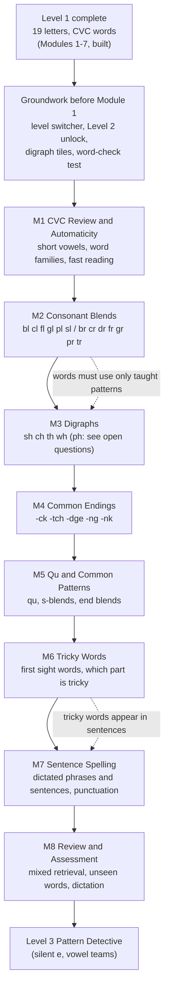

## 2. Level 2 plan — Word Builder (draft for owner review)

*Status: planning only. Nothing in Level 2 is built. Source: the Master Curriculum Blueprint v0.1 (Level 2: ages about 5–6, eight modules) plus the Curriculum Revision Proposal (sight-word strand and syllable chunking). Decisions the owner needs to make are collected in “Open questions” at the end.*

### Big goal
“I can combine sounds and common spelling patterns to read and build more words.” Level 1 taught single letters and plain three-letter words. Level 2 takes a child from plain CVC words to real, everyday words: blends (frog), digraphs (ship), common endings (duck, ring), the first tricky words, and short sentences.

### The learning path

### Rules that keep it decodable
1. **A word may appear in a module only if every pattern in it has already been taught.** For example, “duck” cannot appear before Module 4 teaches -ck, and “ship” cannot appear before Module 3 teaches sh. Wrong-answer picture options are exempt, as in Level 1.
2. **Still no silent e, vowel teams or r-controlled vowels** — those are Level 3. This means the Revision Proposal's idea of putting long vowels in Level 2 is not followed; the Blueprint puts them in Level 3.
3. **No choice between spellings.** Every item has one correct spelling that the module has just taught (the C/K/CK choice and its relatives belong to Level 4).
4. **A “taught patterns” list, checked by a test.** Before building, add a machine-readable list of what each module teaches, and a test that fails if any word in a module uses something not yet taught. This is the main safeguard for scaling from 7 modules to over 40.

### Module by module

| # | Module | What is taught | Sample words | Lessons |
|---|---|---|---|---|
| 1 | CVC Review and Automaticity | Short vowels a e i o u; word families (-at, -an, -ig, -op, -ug, -et); reading quickly and smoothly | cat, pig, mop, bug, net | 5 |
| 2 | Consonant Blends | L-blends bl cl fl gl pl sl; R-blends br cr dr fr gr pr tr | flag, clap, plan, slip, frog, drum, crab, trip | 6 |
| 3 | Digraphs | sh, ch, th (soft and voiced), wh; at the start and end of words | ship, fish, chip, chin, thin, this, bath, when | 6 |
| 4 | Common Endings | -ck, -tch, -dge, -ng, -nk | duck, sock, catch, badge, ring, song, pink, bank | 6 |
| 5 | Qu and Common Patterns | qu; s-blends (st sp sn sm sw sk); end blends (nd nt mp ft lt lk) | quit, quick, stop, snap, hand, jump, milk | 5 |
| 6 | Tricky Words | About 30 common words that cannot be fully sounded out, in small groups; which part is tricky; memory cues | the, said, was, you, they, are, have, one | 5 |
| 7 | Sentence Spelling | Dictated phrases and short sentences; capital letter, full stop, question mark | The frog can jump. | 5 |
| 8 | Review and Assessment | Mixed retrieval, unfamiliar decodable words, dictation; optional “clap the parts” syllable lesson | compound words such as sunset, catnap | 5 |

**Total: about 43 lessons and about 430 questions** (roughly 5 practice and 5 assessment items per lesson, the same density as Level 1).

### Lesson shape
Each module follows the Level 1 pattern so the app needs little new code: Meet the new pattern (hear it, see it) → Blend and Build → Read the Words → Spell the Words → Challenge. Module-specific variations:
- **M1:** adds a fast-reading round. It should feel like beating your own best, not a countdown clock.
- **M3:** adds a sorting lesson (sh or ch? th or wh?).
- **M6:** each lesson shows a word with the tricky letters highlighted and a memory cue, then read it and spell it.
- **M7:** builds sentences from word tiles, then dictation, then “fix the sentence” (add the capital letter and the full stop).

### Words and pictures
- Level 2 needs roughly **70 new picture words** (for example flag, plug, sled, crab, drum, frog, ship, fish, chip, chin, duck, sock, king, ring, bank). The current library has about 49.
- Picture sourcing follows the standing rule: take freely licensed pictures from the internet when short. First choice Google Noto Emoji (already used), then Twemoji (credit required); keep licenses and credits beside the files. Some words have no good emoji (for example “blob”, “glum”) and will be drawn as inline SVG or left as write/build-only words.
- Words used in Read the Words need a picture; Build and Spell words do not.

### Audio
- Words and sentences use the browser's speech voice, as in Level 1.
- New sounds to teach: bl, cl, fl and so on as blended sounds; sh, ch, th, wh and ng as single sounds. The browser voice pronounces these poorly in isolation. Approximations (for example “shh”, “ch”) will be added to the sound-out feature, but **recorded voice for every phoneme is the biggest quality upgrade available** and is worth considering before launching Level 2.

### What has to be built in the app
| Needed | Why | Size |
|---|---|---|
| Level switcher and Level 2 unlock | The app has a single level today; lessons and progress need a level dimension | Medium |
| Digraph and blend tiles (two or three letters on one tile) | Word building must treat “sh” as one tile | Medium |
| Sentence builder (tap word tiles in order) and “fix the sentence” | Module 7 | Medium |
| Tricky-letter highlighting | Module 6 | Small |
| Fast-reading round | Module 1 | Small |
| Taught-patterns list and decodability test | Guard rail for content quality | Small |
| Everything else (build, read, sort, letter-sound) | Already exists | None |

### Build order
1. **Groundwork:** level switcher, Level 2 unlock rule, tiles, taught-patterns list and test. Deploy.
2. **M1, M2, M3, M4, M5** in order, each: content → tests → walk it live → regenerate this document → commit → deploy.
3. **M6 and M7** (need the new components).
4. **M8** and a full Level 2 walkthrough.

Each module ends with your review before the next begins, as with Level 1.

### Overlap with Level 1 to resolve
The app currently lists Level 1 Modules 8–11 as future work: **My First Sentences**, **Tricky Words**, Spelling Detective Review and Level 1 Master Assessment. The Blueprint places tricky words and sentence spelling in **Level 2 (Modules 6 and 7)** and ends Level 1 with a single review. Recommendation: retire Level 1 Modules 8–10, keep only the Level 1 Master Assessment, and build sentences and tricky words once, in Level 2.

### Decisions (owner deferred to the developer's recommendation, 2026-09-28)
1. **Scope:** the Blueprint's eight modules, not the Revision Proposal's — no long vowels in Level 2.
2. **“ph”:** left to Level 4, not taught in Level 2.
3. **Doubled endings (off, bell, miss, buzz):** taught receptively (reading only, no spelling choice) inside Module 1, the same way Level 1 handled “c” for /k/ — a child reads these common words correctly without ever being asked to choose ff/ll/ss/zz vs a single letter. The choice itself stays a Level 4 topic.
4. **More blends:** s-blends and end blends are included in Module 5, as proposed.
5. **Tricky-word list:** Dolch pre-primer and primer lists, trimmed to words that fit our sentences.
6. **Level 1 Modules 8–10 are retired.** Only the Level 1 Master Assessment (renumbered Module 8) remains as future work; sentences and tricky words are taught once, here in Level 2.
7. **Syllable chunking:** included as Module 8's optional “clap the parts” lesson.
8. **Skipping ahead:** no new placement test for now — the existing “unlock all” toggle in the Parent Dashboard covers it. A real placement check can be designed later if needed.
9. **Access rule:** Level 2 unlocks only once every active Level 1 module is fully mastered. No score-based free shortcut is added here — that mechanic stays specific to the Level 1 Module 1 → 2 boundary, per the owner's original instruction not to generalise it.
10. **Voice:** stays with the browser's speech voice for now. A recorded voice for letters, blends and digraphs is flagged as a future upgrade, not a blocker.

### Risks
- **Word supply:** many blend and ending words have no clear picture. Mitigation: Build and Spell lessons do not need pictures; Read lessons use only pictureable words.
- **Speech quality** for blends and digraphs (see Audio).
- **Scale:** over 400 items by hand invites mistakes. Mitigation: the taught-patterns test and the generated master document.
- **Age fit:** Level 2 is designed for about 5–6-year-olds; older children may find it easy, which is what the placement question is about.
