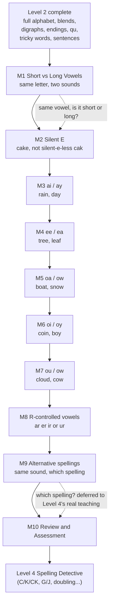

## 3. Level 3 plan — Pattern Detective (draft for owner review)

*Status (2026-09-30): planning only, nothing built. Source: the Master Curriculum Blueprint v0.1 (Level 3: ages about 6–7, ten modules).*

### Big goal
“I can recognise common vowel and spelling patterns and use them to read and spell.” Level 1 taught single letters and plain CVC words; Level 2 added blends, digraphs, common endings, qu, the rest of the alphabet, tricky words and sentences. Level 3 is where **long vowels** finally enter — silent e, vowel teams (ai/ay, ee/ea, oa/ow, oi/oy, ou/ow) and r-controlled vowels (ar, er, ir, or, ur) — the biggest single jump in complexity since Level 1's letter clusters.

### The learning path

### The one real design problem this level raises
Every earlier level could enforce "no choosing between two valid spellings" (the Level 1–2 boundary explicitly reserves C/K/CK, G/J and similar choices for Level 4). Level 3 **cannot** keep that promise for vowel teams — "rain" is spelled with ai and "day" is spelled with ay, both saying long A, and a child reading or spelling either one is, in effect, already choosing. Two ways to handle this:
- **Read receptively, build/spell only exact matches (recommended):** every read/build/spell item gives one already-correct spelling; the child never picks between ai and ay for the *same* word. A **separate short module (M9, Alternative Spellings)** is where the two patterns are explicitly placed side by side and the child is told which is more common — recognition of the pattern, not a graded spelling choice. The real skill of choosing the right one for an unfamiliar word stays Level 4's job (it already owns "spelling choices" as a named topic).
- **Full choice-based practice now:** teach “ai is usually mid-word, ay is usually at the end” as a hard rule and grade the child on applying it. More authentic, but duplicates Level 4's whole reason for existing and risks conflicting rules if Level 4 later teaches it differently. Not recommended without a reason to.

### Rules that keep it decodable
Same discipline as Level 2, extended:
1. A word may appear in a module only if every pattern in it — including which specific vowel-team spelling — has already been taught by that exact module. The existing `test/level2-decodability.test.mjs`-style safeguard extends the same way it did for Level 2's graphemes: a `GRAPHEMES_BY_MODULE`/`LETTERS_BY_MODULE` entry per module, nothing else about the test needs to change.
2. No r-controlled vowels or vowel teams appear before their own module teaches them — obviously, but worth stating since Level 3 is where the Level 1/2 boundary's biggest exclusions finally lift.
3. Still no C/K/CK, G/J or other consonant spelling *choices* — those stay Level 4's.
4. No silent letters beyond the silent e already being taught in M2 (no "knee", "write", "lamb" yet).

### Module by module

| # | Module | What is taught | Sample words | Lessons |
|---|---|---|---|---|
| 1 | Short vs Long Vowels | The same 5 vowel letters can say a short OR long sound; this module is purely the listening/discrimination skill, no new spelling yet | cap/cape (said aloud, not yet spelled with e) | 5 |
| 2 | Silent E (CVCe) | A final silent e makes the vowel before it say its long sound | cake, bike, rope, cute, name | 5 |
| 3 | ai / ay | Long A as a vowel team — ai mid-word, ay at the end | rain, wait, day, play, tray | 5 |
| 4 | ee / ea | Long E as a vowel team | tree, feet, leaf, seat, read | 5 |
| 5 | oa / ow | Long O as a vowel team | boat, road, snow, grow, slow | 5 |
| 6 | oi / oy | The /oi/ sound — oi mid-word, oy at the end | coin, soil, boy, toy, joy | 5 |
| 7 | ou / ow | The /ow/ (as in "cow") sound — both spellings appear anywhere, genuinely no simple position rule | cloud, mouth, cow, brown, down | 5 |
| 8 | R-controlled vowels | ar, er, ir, or, ur — the vowel's own sound is swallowed by the r | car, star, her, bird, corn, hurt | 6 |
| 9 | Alternative Spellings | Same sound, more than one spelling, placed side by side — recognition only (see design problem above) | rain/train vs day/play; boat vs snow | 5 |
| 10 | Review and Assessment | Cumulative mixed practice and a big final Level 3 Challenge | — | 5 |

**Estimated: about 51 lessons.** Level 3 is the first level where "one word family per lesson" genuinely runs out of room fast — ee/ea alone could support a much longer module — so lesson density stays at the same 5-per-module rhythm as Levels 1–2 rather than growing, keeping build time predictable.

### Lesson shape
Same five-lesson pattern already proven across 13 Level 1/2 modules: Meet the Pattern (recognition) → Build & Read → Read the Words (picture-matching) → Spell the Words (dictation, one decoy) → Module Challenge. Module 1 (Short vs Long Vowels) is the one exception — it's audio-discrimination only, closer in spirit to Level 1's `same_different`/`sound_memory` types than to a letter-teaching module, so it may reuse THOSE existing activity types instead of `letter_sound_match`.

### What has to be built in the app
Unlike Level 2, which needed real new mechanics (multi-letter tiles, sentence building, sight words), Level 3's content fits entirely inside what already exists:
- **Vowel-team tiles** are just another case of `answer_tiles` — "rain" tiles as `["r", "ai", "n"]`, exactly like "ship" tiles as `["sh", "i", "p"]` already do. No new component.
- **`graphemeKindFor()`** needs a new kind, `"vowel_team"` (or reuse `"digraph"` — a vowel team genuinely IS two letters making one sound, the same definition already used for sh/ch/th/wh). Recommend a distinct `"vowel team"` label so narration says the accurate word, not "digraph" for a vowel pattern — matches the standing rule (a blend is not a digraph is not an ending) established during Level 2.
- **R-controlled vowels** (ar/er/ir/or/ur) are the same "letter + r, one sound" shape as a vowel team, tiled the same way.
- **No new picture sourcing strategy needed** — same Noto Emoji approach as every earlier level, though Level 3's vocabulary (rain, snow, coin, bird, star...) should have an easier time finding clean pictures than Level 2's tricky/sentence content did.
- **The one real gap:** Module 1 (Short vs Long Vowels) is audio-only discrimination with no letters/pictures at all — closest existing precedent is Level 1 Module 1's `same_different`/`sound_memory` types. Worth confirming that's the right shape before building it, since it's the one lesson in this whole level that doesn't fit the established five-lesson template cleanly.

### Build order
Same rhythm as every level so far: one module at a time — content → validate → `npm test` → live browser check → regenerate `docs/THE-SPELLING-CODE.md` → commit → push → deploy. Recommend starting with **Module 2 (Silent E)** rather than Module 1, since M2 is the one with the clearest existing template to follow (matches every "Meet a new pattern" module already built) and would validate the `answer_tiles`-for-vowel-teams approach immediately; Module 1's audio-discrimination shape is worth a short design conversation first rather than guessing.

### Decisions (owner confirmed, 2026-09-30)
1. **Vowel-team choice:** receptive only — never ask the child to pick between ai/ay (or any vowel-team pair) for the same word. Module 9 (Alternative Spellings) is recognition-only; the graded "which spelling" skill stays Level 4's.
2. **Pacing:** keep building level after level without stopping, same rhythm as Level 2 — module by module, verify live, ship, keep moving.
3. **Module 1's shape and exact build order** — still open; will be resolved in practice as each module is built (Module 1's audio-discrimination shape gets a fresh look when its turn comes, following the same live-verification discipline as every module so far).
