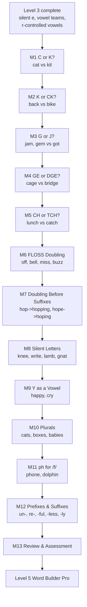

## 4. Level 4 plan — Spelling Detective (draft for owner review)

*Status (2026-09-30): planning only, nothing built. Source: the Master Curriculum Blueprint v0.1 (Level 4: ages about 7–9, thirteen modules), continuing the boundary rules already fixed in Levels 1–3.*

### Big goal
"I can choose the right spelling when more than one spelling looks plausible." Every earlier level enforced "no choosing between two valid spellings" — Level 1 excluded C/K/CK, Level 2 excluded doubled endings, Level 3 kept vowel teams receptive-only. Level 4 is where that boundary finally lifts: for the first time, the child is graded on picking the *correct* spelling for a word, not just recognising or reproducing one that's already given.

### The learning path

### The one real design problem this level raises
Every earlier level's activity types either show the child an already-correct spelling (word_build, read_word) or test pure recognition (letter_sound_match). None of them test "which of two plausible spellings is actually correct" — that mechanic doesn't exist yet, because it was never allowed to. Two ways to build it:
- **A new `spelling_choice` activity type (recommended):** given a spoken word, show two written options — the correct spelling and a wrong one built by applying the *wrong* rule (e.g. "back"/"bak" for the ck rule, "hoping"/"hopping" for the doubling rule) — the child picks the correct one. Structurally almost identical to Level 2's `fix_sentence` (two plain-text options, one correct), just for a single word's spelling instead of a sentence's punctuation. No new component needed — `MultipleChoice`'s existing plain-text-option path already handles this shape.
- **Reuse `word_build`'s decoy-tile mechanic for the same job:** a `word_build` item can already offer a wrong-but-plausible tile alongside the right one (e.g. tray = `[b, a, ck, k]` for "back", where "k" is the decoy) — the child must pick the *correct* tile for the ending, not just avoid an unrelated extra letter. This needs no new mechanic at all, just content where the decoy tile is deliberately the other member of the spelling-choice pair instead of a random letter.

Recommendation: use both, the same way earlier levels split "recognition" from "building/spelling" across different lessons in a module — `spelling_choice` for a dedicated "Meet the Choice" recognition lesson, decoy-tile `word_build` for "Blend & Build"/"Spell the Words".

### Rules that keep it decodable and fair
Same discipline as every earlier level, extended one more step:
1. A spelling-choice item's wrong option must be a genuine, plausible misapplication of a *real* rule (e.g. "bak" misapplies "no ck after a consonant blend" logic, not a random typo) — never an arbitrary or nonsensical wrong answer, since the point is testing rule application, not spot-the-typo.
2. No word in this level's content may require a pattern not yet taught by that point (same cumulative decodability discipline as Levels 2–3; `test/level2-decodability.test.mjs` — misnamed now but kept, per its own header comment about covering every level from 2 on — gets Level 4 entries the same way).
3. Where English is genuinely inconsistent (hard g in "get"/"give"/"girl" despite being followed by e/i; "much"/"such"/"which" using ch not tch after a short vowel) the rule is taught with its common exceptions named explicitly, not glossed over — a rule that silently fails on frequent words would erode trust in the pattern.

### Module by module

| # | Module | The choice being taught | Sample words | Lessons |
|---|---|---|---|---|
| 1 | C or K? | /k/ at the start of a word: c before a/o/u, k before e/i/y | cat, cot, cup vs kit, keg, kid | 5 |
| 2 | K or CK? | /k/ at the end of a word: ck after a short vowel, k after a long vowel, consonant or vowel team | back, sock, duck vs bike, milk, book | 5 |
| 3 | G or J? | /j/ at the start is almost always j (jam, jet, job); hard vs soft g recognition (get/give/girl are hard-g exceptions) | jam, jet vs gem, giant vs get, give | 5 |
| 4 | GE or DGE? | /j/ at the end/middle of a word: dge after a short vowel, ge after a long vowel or consonant | bridge, edge, badge vs cage, huge, large | 5 |
| 5 | CH or TCH? | /ch/ at the end of a word: tch after a short vowel (with common n-exceptions), ch after a long vowel, consonant or vowel team | catch, pitch vs reach, lunch, such | 5 |
| 6 | FLOSS Doubling | f, l, s (sometimes z) double after a short vowel at the end of a one-syllable word | off, well, miss, buzz vs leaf, wheel | 5 |
| 7 | Doubling Before Suffixes | -ing/-ed: double the final consonant after a short vowel (hop→hopping), drop silent e (hope→hoping), or just add the suffix otherwise (jump→jumping) | hopping, hoping, jumping | 6 |
| 8 | Silent Letters | kn, wr, mb, gn — a silent first or last letter, receptive only (no choice, a new pattern) | knee, write, lamb, gnat | 5 |
| 9 | Y as a Vowel | y says long e at the end of a longer word (happy), long i at the end of a short word (cry, fly) | happy, cry, fly, baby | 5 |
| 10 | Plurals | -s normally, -es after s/x/ch/sh/ss, y→ies after a consonant | cats, boxes, babies | 6 |
| 11 | ph for /f/ | ph spells /f/, receptive only (no real choice — ph vs f isn't a live ambiguity at this level) | phone, dolphin, graph | 4 |
| 12 | Prefixes & Suffixes | un-, re- at the start; -ful, -less, -ly at the end, added to a whole known word without changing its spelling | unhappy, reread, careful, hopeless, quickly | 6 |
| 13 | Review & Assessment | Cumulative mixed practice and challenge across every Level 4 spelling choice | — | 5 |

**Estimated: about 67 lessons** — the biggest level yet, matching the blueprint's own 13-module count exactly (every earlier level either matched or grew slightly past its blueprint count; this one is large by design, since "spelling choices" is inherently a bigger skill than any single earlier pattern).

### Lesson shape
Modules 1–7 (the true spelling-choice modules) use a five-lesson shape adapted from the established template: **Meet the Choice** (`spelling_choice` recognition — hear the word, pick the correct spelling from two options) → **Blend & Build** (`word_build`, decoy tile is the *other* choice) → **Read the Words** (`read_word`, picture-matching) → **Spell the Words** (`word_build`, dictation, same decoy-as-choice pattern) → **Module Challenge**. Module 7 (Doubling Before Suffixes) gets a sixth lesson since it's a compound skill (three sub-rules, not one binary choice). Modules 8–11 (receptive-only patterns, no real choice) reuse the plain Level 1/2 five-lesson shape instead, since `spelling_choice` doesn't apply where there's nothing to choose between. Module 12 (Prefixes & Suffixes) is build-focused, closer to Level 2's sentence-building shape than a phonics-choice module. Module 13 mirrors every earlier level's closing Review & Assessment.

### What has to be built in the app
- **One new activity type, `spelling_choice`** (see the design problem above) — a thin wrapper over `MultipleChoice` exactly like `fix_sentence`, with its own narration ("which spelling is correct?") so it's never confused with sentence-punctuation practice. No new visual component.
- **`word_build` decoy tiles get a new *purpose*, not a new mechanic** — every existing piece (`answer_tiles`, `letters`, the decoy-tile narration) already works; only the *content* changes, choosing the decoy deliberately rather than arbitrarily.
- **Suffix-building (Module 7, Module 12)** reuses `word_build` for the whole inflected word (e.g. "hopping" built as `[h, o, p, p, i, ng]` or similar tiling) — no new tile-composition logic needed beyond what Level 3's digraph+vowel-team composability already proved (Module 21's "wheel" = wh+ee+l).
- **No new picture-sourcing strategy** — same Noto Emoji approach as every earlier level. Words at this level (knee, phone, happy, dolphin...) should have a healthy supply of clean, common pictures.

### Build order
Same rhythm as every level so far: one module at a time — content → validate → `npm test` → live browser check → regenerate `docs/THE-SPELLING-CODE.md` → commit → push → deploy. Recommend starting with **Module 1 (C or K?)**, since it's the module the design problem section above was written for and will validate the new `spelling_choice` type immediately, the same way Module 20 (ai/ay) validated Level 3's vowel-team tiling.

### Decisions
Per the owner's confirmed Level 3 pacing ("keep building level after level without stopping"), this plan proceeds straight to building without a review pause, same as Level 3. The phonics rules above are standard, well-established English spelling patterns (not design judgment calls), so no owner sign-off is sought on the rules themselves — only genuine open questions would warrant a pause, and none were found while drafting this plan.
