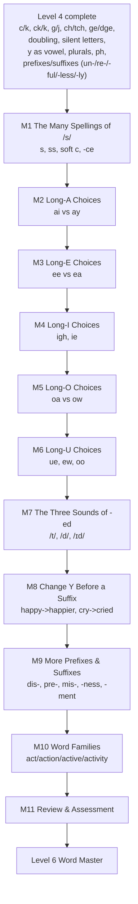

## 5. Level 5 plan — Word Builder Pro

*Status (2026-10-01): planning, nothing built yet. Source: the Master Curriculum Blueprint v0.1 (`The_Spelling_Code_Master_Curriculum_Blueprint_v0.1.docx`, found in Downloads — not in this repo, extracted for this plan), continuing the boundary rules fixed in Levels 1–4.*

### Why this level's module list doesn't match the blueprint's Level 5 list

While drafting this plan, re-reading the blueprint against what's actually built surfaced a real gap: **the app's Level 4 doesn't match the blueprint's Level 4.** The blueprint's Level 4 ("Spelling Detective") is built around five modules choosing between long-vowel spellings (ai vs ay, ee vs ea, oa vs ow, igh/ie, ue/ew/oo) plus soft-C and C/K/CK/G/J/CH/TCH/GE/DGE — that's the level's headline promise ("I can make informed spelling choices when more than one spelling can represent a sound"). What actually got built as app-Level-4 covered C/K/CK, G/J, CH/TCH, GE/DGE (matching the blueprint), but then substituted in content from the blueprint's own **Level 5** (Plurals, Doubling Consonants, Drop the E, Prefixes, Suffixes) and **Level 6** (Silent Letters) instead of building the long-vowel choice modules or soft-C. This was flagged to the owner directly rather than silently resolved either way — the owner had no preference, so the path taken (confirmed 2026-10-01) is:

- **App-Level-4 stays exactly as shipped** — it's real, tested, deployed content with its own badge; redoing it would be wasteful, and "Doubling Before Suffixes," "Silent Letters," "Plurals" and "Prefixes & Suffixes" are all genuinely useful spelling skills regardless of which blueprint level they were filed under.
- **App-Level-5 absorbs the blueprint's missing Level-4 content** (soft-C, S/SS/C/CE, and the five long-vowel-choice modules) **plus only the blueprint-Level-5 content that ISN'T already a duplicate** of app-Level-4's Modules 34/37/39. Concretely, skipped from the blueprint's own Level 5 list: Plurals (= app M37), Adding -ing (= app M34), Doubling Consonants (= app M34), Drop the E (= app M34) — all already built. Un-/re- and -ful/-less/-ly (= app M39) are also already built, so this level's prefix/suffix modules cover only the blueprint's remaining dis-/pre-/mis- and -ness/-ment.

### Big goal
"I can choose between several valid spellings for the same sound, and understand how a word's spelling changes when a word part is added." Continues Level 4's "more than one spelling can be correct — pick the one this word actually uses" skill into the long-vowel sounds Level 4 never covered, then moves into genuinely new morphology (the three sounds of -ed, changing y before a suffix, word families) that Level 4 didn't touch at all.

### The learning path

### Design notes carried over from Level 4 (no new mechanics needed)
- **`spelling_choice`** (audio + two plain-text options) handles every "which spelling is correct for this word" lesson — Modules 1–6 all reuse it exactly as Level 4 did, same narration, same component.
- **`word_build`** with the new grapheme as its own tile handles Blend & Build / Spell the Words / dictation, same as every earlier level.
- **`letter_sound_match`** handles the one genuinely new *mechanic-adjacent* idea this level needs: Module 7 (the three sounds of -ed) is an **auditory discrimination** task, not a spelling choice — the spelling is always "-ed," but the SOUND it makes varies (/t/ after an unvoiced consonant like "walked," /d/ after a voiced sound like "played," /ɪd/ after t/d like "wanted"). This reuses `letter_sound_match` with `correct_answer` set to one of three sound labels (t/d/id) and a new narration field (`edSound: true`), the same pattern Module 35's `silent` and Module 36's `yVowel` fields already established for "the grapheme is fixed, the thing being tested is something else about it."
- **New graphemes to register:** `igh`, `ie`, `ue`, `ew`, `oo` all get added to `questionTypes.js`'s `VOWEL_TEAMS` set (same category as ai/ay/ee/ea/oa/ow — two-or-more letters, one vowel sound, no reliable start/end position claim). `GRAPHEMES_BY_MODULE` in the decodability test gets entries for whichever module first introduces each.
- **Position-based rule where English actually has one, frequency/memorization where it doesn't** — same honesty standard as Level 4:
  - ai (middle of a word) vs ay (end of a word), oa (middle) vs ow (end) are **genuine, reliable positional rules** (rain/train vs day/play; boat/coat vs snow/grow) — taught as a rule, same confidence as Level 4's c/k.
  - ee vs ea has **no reliable rule** (both appear in every position) — taught as a *pattern* (ee is the more common default; ea is used in a specific, memorizable set of common words), matching the blueprint's own "Rules vs Patterns vs Tricky Words" distinction in its Core Learning Philosophy. Content items still have one definitively correct answer per word; the "rule" explained to the child is honestly framed as a tendency, not a guarantee.
  - igh/ie (long i) and ue/ew/oo (long u) are frequency/pattern-based the same way — each gets a short "most common words that use this spelling" anchor set rather than a false positional rule.
- **No new word pictures needed beyond what's natural** — same Noto Emoji sourcing process as every earlier level (find codepoint, verify visually in the Claude Browser pane before wiring in, reject anything ambiguous).

### Module by module

| # | Module | The choice/skill being taught | Sample words | Lessons |
|---|---|---|---|---|
| 1 | The Many Spellings of /s/ | s (sun) vs ss (miss, already familiar from FLOSS doubling) vs soft c before e/i/y (city, pencil) vs -ce at a word's end (ice, dance) | sun, miss, city, ice, dance | 5 |
| 2 | Long-A Choices | ai in the middle of a word, ay at the end — a_e (already known from Silent E) isn't re-taught, just distinguished from these two | rain, train, day, play, tray | 5 |
| 3 | Long-E Choices | ee vs ea — no reliable position rule; ee is the default, ea is a memorized set of common words | tree, green, eat, team, clean | 5 |
| 4 | Long-I Choices | igh (new grapheme, mostly before a silent gh) and ie (new grapheme, small common word-final set) — i_e and y (already known) aren't re-taught | night, light, pie, tie, high | 5 |
| 5 | Long-O Choices | oa in the middle of a word, ow at the end — mirrors Long-A's positional rule exactly | boat, coat, snow, grow, road | 5 |
| 6 | Long-U Choices | ue, ew, oo (three new graphemes) — the messiest Level 5 module since oo also makes a short sound (book/look), flagged honestly rather than glossed over | blue, true, new, grew, moon | 6 |
| 7 | The Three Sounds of -ed | Auditory discrimination only (spelling is always -ed) — /t/ after an unvoiced sound (walked), /d/ after a voiced sound (played), /ɪd/ after t/d (wanted) | walked, played, wanted, jumped, hugged | 5 |
| 8 | Change Y Before a Suffix | A word ending in consonant+y swaps y for i before most suffixes (happy→happier, cry→cried) but keeps y before -ing (crying, not criing) | happier, cried, happiness, crying, tried | 6 |
| 9 | More Prefixes & Suffixes | dis-, pre-, mis- at the start; -ness, -ment at the end — same build-focused shape as app Module 39, extending rather than repeating it | dislike, preview, mistake, happiness, payment | 6 |
| 10 | Word Families | A root word plus different affixes changes its job in a sentence but keeps its core spelling and meaning (act → action → active → activity) | act/action/active, play/player/playful, teach/teacher/teaching | 5 |
| 11 | Review & Assessment | Cumulative mixed practice and challenge across every Level 5 spelling choice and morphology skill | — | 5 |

**Estimated: about 58 lessons.**

### Lesson shape
Modules 1–6 (the long-vowel/consonant spelling-choice modules) use the exact five-lesson shape Level 4 established: **Meet the Choice** (`spelling_choice`) → **Blend & Build** (`word_build`, no decoy) → **Read the Words** (`read_word`, picture-matching, where clean pictures exist) → **Spell the Words** (`word_build` with a decoy tile) → **Module Challenge** (`assessment`). Module 6 (Long-U) gets a sixth lesson since it has three competing spellings instead of two. Module 7 (-ed sounds) is receptive/auditory-only, reusing the plain Level 1/2 five-lesson shape (no spelling choice — the spelling never changes). Module 8 (Change Y) and Module 9 (More Prefixes & Suffixes) are build-focused like app-Module 34/39 — `spelling_choice` for recognition, `word_build` with the suffix/prefix as its own tile for building, no Read the Words lesson (a still image can't distinguish "cried" from "crying"). Module 10 (Word Families) is also build/recognition-focused: given a root word and a sentence context, choose which family member fits. Module 11 mirrors every earlier level's closing Review & Assessment, plus a new "Level 5 Word Builder Pro" badge (`BADGE-11`, same data-driven pattern as `BADGE-10`).

### Build order
Same rhythm as every level so far: one module at a time — content → `npm test` → live browser check → regenerate `docs/THE-SPELLING-CODE.md` → commit → push → deploy. Start with **Module 1 (The Many Spellings of /s/)** since it's the most Level-4-like (pure spelling-choice, no new mechanic), then the long-vowel modules in the blueprint's own order, then the three morphology modules, then Review & Assessment.

### Decisions
Per the owner's confirmed pacing ("keep building level after level without pausing") and the explicit answer to the Level-4/Level-5 scope question above ("no preference," 2026-10-01, so the recommended path was taken), this plan proceeds straight to building without a further review pause. The phonics rules and the module-scope decisions above are either standard English spelling patterns or already-resolved product decisions, so no further owner sign-off is sought before building.
