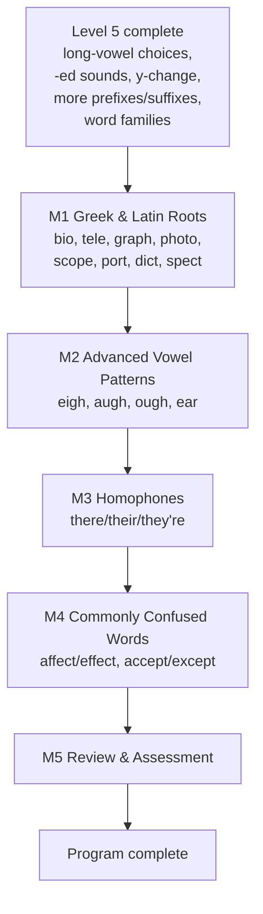

## 6. Level 6 plan — Word Master

*Status (2026-10-01): complete — all 5 modules built and deployed. This closes out The Spelling Code's full 6-level curriculum. Source: the Master Curriculum Blueprint v0.1 (`The_Spelling_Code_Master_Curriculum_Blueprint_v0.1.docx`, found in Downloads — not in this repo), continuing the boundary rules fixed in Levels 1–5. See `docs/project-notes.md`'s Level 6 curriculum design section for how each module was actually built.*

### Why this level's module list is condensed from the blueprint's 10 to 5

Re-reading the blueprint's Level 6 list against what's already built surfaced the same kind of overlap Level 4→5 had, on a smaller scale:
- **Blueprint Module 3, Silent Letters (kn, wr, gn, mb, gh)** is a near-exact duplicate of **app-Module 35** (Level 4), which already taught kn/wr/mb/gn with the identical mechanic (receptive `letter_sound_match`, `silent: true` field). Only "gh" (as in "ghost," "ghastly") is genuinely new, and it's a thin, low-frequency pattern on its own — not worth a whole module.
- **Blueprint Module 7, Word Families & Derivation (nation/national/nationality)** is mechanically identical to **app-Module 50** (Level 5) — same "choose the family member that fits a sentence" skill, just with longer/fancier words. Rebuilding the same mechanic a second time under a new name would be busywork, not new learning.
- **Blueprint Module 2 (French/Latin/Greek Influences)** and **Module 8 (Etymology as a Clue)** are both really the same underlying idea as **Module 1 (Greek & Latin Roots)** — word origin as a spelling/meaning clue — and the blueprint's own text treats them as closely related. Folded into one Roots module rather than three thin ones.
- **Blueprint Module 9 (Advanced Dictation)** is "apply everything learned in a dictation context" — exactly what every earlier level's closing Review & Assessment module already does. Folded into Module 5 (Review & Assessment) rather than a separate module.
- **Blueprint Module 10 (Final Mastery & Certification)** is the closing Review & Assessment module under a different name. This plan keeps the mastery/transfer assessment; the "digital certificate" idea from the blueprint's §9 Certification Framework is a real but separate product feature (PDF generation, a certificate record) that hasn't been built or asked for — flagged here, not built, same treatment as payments/accounts/CMS in the "Where the build stands" table.

Net result: **5 genuinely non-duplicate modules** instead of 10. This was judged directly rather than asked, since it's the same class of decision already resolved for Level 4→5 (the owner had no preference there, and the reasoning — don't rebuild an identical mechanic under a new name — applies just as cleanly here, with much less at stake than the Level 4/5 case).

### Big goal
"I can use where a word comes from, and what it's commonly confused with, to spell and use advanced vocabulary correctly." The first level where meaning and word history — not just sound-to-letter mapping — become the main spelling tool.

### The learning path

### Design notes — one new content shape, otherwise full reuse
- **Roots, Homophones, and Commonly Confused Words all reuse Module 50's exact `spelling_choice` + `wordFamily: true` sentence-context mechanic** — no new code. For roots, the "sentence" is a definition-style clue ("Which word means 'to write about your own life'? autobiography / photograph") rather than a fill-in-the-blank, but it's the same shape: a prompt, two real-word options, one correct answer, the `wordFamily` narration ("Yes! 'autobiography' fits best here!") reads naturally for all three uses.
- **Advanced Vowel Patterns reuses the plain `spelling_choice` word-pair mechanic** from Level 5's long-vowel modules (audio word, two spellings, pick the correct one) — these patterns (eigh, augh, ough) are genuinely new graphemes, added to `VOWEL_TEAMS`.
- **No new remediation tags needed** — `SPELLING_CHOICE_CONFUSION` covers Module 2; `PREFIX_SUFFIX_CONFUSION` (despite its name) already covers Module 50's family/meaning-choice confusion and extends naturally to roots/homophones/confusables, which are the same *kind* of error (picking a plausible-but-wrong word for the context). Reusing it rather than minting three near-identical new tags.
- **No new word pictures** — every module this level is built from abstract vocabulary (roots, grammar words, confusable pairs) that doesn't picture cleanly, same reasoning Modules 34/39/47/50 already established.

### Module by module

| # | Module | The skill being taught | Sample words | Lessons |
|---|---|---|---|---|
| 1 | Greek & Latin Roots | A root carries meaning across many words — bio (life), tele (far), graph (write), photo (light), scope (see), port (carry), dict (say), spect (look) | biology, telephone, autograph, photograph, telescope, transport, predict, spectator | 6 |
| 2 | Advanced Vowel Patterns | Rarer, often irregular long-vowel spellings not yet covered: eigh (eight, weigh), augh/ough (caught, through, enough, cough — genuinely inconsistent, taught as memorized exceptions), ear for /er/ (learn, earth) | eight, weigh, caught, through, enough, cough, learn, earth | 6 |
| 3 | Homophones | Same sound, different spelling, different meaning — choose the one that fits the sentence | there/their/they're, to/too/two, your/you're, write/right, know/no, meet/meat, hour/our | 6 |
| 4 | Commonly Confused Words | Not homophones (different sounds), but frequently mixed up — choose the one that fits the meaning | affect/effect, accept/except, principal/principle, than/then, where/were, lose/loose, advice/advise | 6 |
| 5 | Review & Assessment | Cumulative mixed practice and challenge across every Level 6 skill, plus dictation in sentence context (absorbing the blueprint's separate "Advanced Dictation" module) | — | 5 |

**Estimated: about 29 lessons** — the smallest level yet, by design: this level is deliberately condensed (5 non-duplicate modules instead of the blueprint's 10), and each module's skill (definition/context-based word choice) needs fewer mechanical variations than the earlier levels' many spelling-choice permutations.

### Lesson shape
Modules 1, 3, 4 (Roots, Homophones, Confused Words) use a `spelling_choice`/`wordFamily` five-or-six-lesson shape: 2-3 "Meet" recognition lessons (grouping related roots/pairs), a "More Practice" lesson mixing everything, and a Challenge. Same shape Module 50 proved out — no `word_build`/`read_word` lessons, since the skill is choosing the right real word for a meaning/context, not spelling or picture-matching. Module 2 (Advanced Vowel Patterns) returns to the full Level-4/5-style five-lesson shape with `word_build` (Blend & Build, Spell the Words with a decoy) alongside `spelling_choice`, since these words, unlike Modules 1/3/4's, genuinely need letter-tile spelling practice. Module 5 mirrors every earlier level's closing Review & Assessment, plus the final "Level 6 Word Master" badge — the last badge in the six-level roadmap.

### Build order
Same rhythm as every level so far: one module at a time — content → `npm test` → live browser check → regenerate `docs/THE-SPELLING-CODE.md` → commit → push → deploy. Start with **Module 1 (Greek & Latin Roots)** since it validates the roots-as-`wordFamily` reuse immediately.

### Decisions
Per the owner's confirmed pacing ("keep building level after level without pausing"), this plan proceeds straight to building without a review pause. The module-condensation decision above was judged directly (same reasoning already validated for Level 4→5, lower stakes here), and the phonics/vocabulary content is standard reference material, so no further owner sign-off is sought before building.
